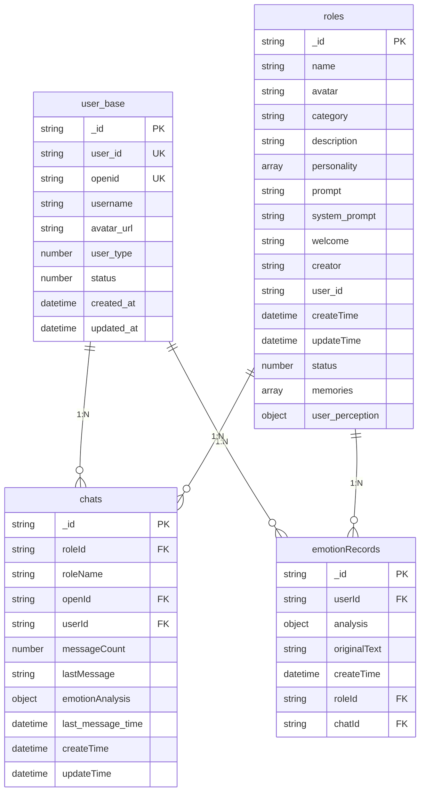

# 数据库设计

<cite>
**本文档引用文件**  
- [createIndexes.js](file://cloudfunctions/user/createIndexes.js)
- [init-roles.js](file://cloudfunctions/roles/init-roles.js)
- [user_base.md](file://doc/开发文档/database/user_base.md)
- [chats.md](file://doc/开发文档/database/chats.md)
- [emotionRecords.md](file://doc/开发文档/database/emotionRecords.md)
- [roles.md](file://doc/开发文档/database/roles.md)
</cite>

## 目录
1. [引言](#引言)
2. [核心集合结构](#核心集合结构)
3. [实体关系与数据模型](#实体关系与数据模型)
4. [字段定义与业务含义](#字段定义与业务含义)
5. [索引策略与查询优化](#索引策略与查询优化)
6. [静态数据预置机制](#静态数据预置机制)
7. [数据访问指南](#数据访问指南)
8. [结论](#结论)

## 引言
本数据库设计文档旨在全面阐述HeartChat应用所使用的云数据库结构，涵盖核心集合的字段定义、数据类型、约束条件及索引策略。文档重点分析`user_base`、`chats`、`emotionRecords`和`roles`等关键集合的实体关系与数据模型，解析`createIndexes.js`中定义的索引如何提升查询性能，并结合`init-roles.js`说明系统初始化时静态数据的预置逻辑。本文档为数据分析师和后端开发者提供清晰的数据访问与管理指南。

**文档来源**
- [user_base.md](file://doc/开发文档/database/user_base.md)
- [chats.md](file://doc/开发文档/database/chats.md)
- [emotionRecords.md](file://doc/开发文档/database/emotionRecords.md)
- [roles.md](file://doc/开发文档/database/roles.md)

## 核心集合结构
HeartChat的数据库设计围绕用户、聊天、情感分析和AI角色四大核心模块构建，包含以下主要集合：

- **user_base**: 存储用户基础账户信息。
- **chats**: 记录用户的聊天会话元数据。
- **emotionRecords**: 保存详细的情感分析结果。
- **roles**: 管理AI角色的配置与状态。

这些集合通过用户标识（`openid`/`userId`）和角色标识（`roleId`）紧密关联，形成一个支持个性化、情感化交互的完整数据体系。



**图表来源**
- [user_base.md](file://doc/开发文档/database/user_base.md)
- [chats.md](file://doc/开发文档/database/chats.md)
- [emotionRecords.md](file://doc/开发文档/database/emotionRecords.md)
- [roles.md](file://doc/开发文档/database/roles.md)

## 实体关系与数据模型
HeartChat的数据模型采用星型结构，以`user_base`为核心，向外辐射出多个关联集合。

### 主要关系
1. **用户与会话 (1:N)**: 一个用户可以拥有多个聊天会话 (`user_base.user_id` → `chats.userId`)。
2. **用户与情感记录 (1:N)**: 一个用户可以生成多条情感分析记录 (`user_base.user_id` → `emotionRecords.userId`)。
3. **角色与会话 (1:N)**: 一个AI角色可以被多个用户使用，产生多个会话 (`roles._id` → `chats.roleId`)。
4. **角色与情感记录 (1:N)**: 一次与特定角色的对话可生成一条情感记录 (`roles._id` → `emotionRecords.roleId`)。
5. **会话与情感记录 (1:N)**: 一个聊天会话可能包含多次情感分析 (`chats._id` → `emotionRecords.chatId`)。

该模型支持高效的按用户、按角色、按时序的数据查询与分析。

**章节来源**
- [user_base.md](file://doc/开发文档/database/user_base.md#关联关系)
- [chats.md](file://doc/开发文档/database/chats.md#关联关系)
- [emotionRecords.md](file://doc/开发文档/database/emotionRecords.md#关联关系)
- [roles.md](file://doc/开发文档/database/roles.md#关联关系)

## 字段定义与业务含义
本节详细描述各核心集合的关键字段，包括数据类型、业务含义和约束条件。

### user_base 集合
存储用户的基础账户信息。

| 字段名 | 数据类型 | 业务含义 | 约束条件 |
| :--- | :--- | :--- | :--- |
| `_id` | string | 数据库主键 | 自动生成，唯一 |
| `user_id` | string | 7位数字用户ID | 唯一，范围1000000-9999999 |
| `openid` | string | 微信用户唯一标识 | 唯一，用于认证 |
| `username` | string | 用户显示名称 | 可更新 |
| `avatar_url` | string | 用户头像图片地址 | 可更新 |
| `user_type` | number | 用户类型 | 1:普通, 2:VIP, 3:管理员 |
| `status` | number | 账户状态 | 1:启用, 0:禁用 |
| `created_at` | date | 账户创建时间 | 服务器时间 |
| `updated_at` | date | 最后更新时间 | 服务器时间 |

**章节来源**
- [user_base.md](file://doc/开发文档/database/user_base.md#字段结构)

### chats 集合
存储聊天会话的元数据。

| 字段名 | 数据类型 | 业务含义 | 约束条件 |
| :--- | :--- | :--- | :--- |
| `_id` | string | 会话ID | 自动生成，唯一 |
| `roleId` | string | 关联的AI角色ID | 外键，指向`roles._id` |
| `roleName` | string | 角色名称（冗余） | 用于快速展示 |
| `openId` | string | 用户微信标识 | 外键，用于会话关联 |
| `userId` | string | 用户ID | 可选，用于统计 |
| `messageCount` | number | 会话中的消息总数 | 需实时更新 |
| `lastMessage` | string | 最后一条消息内容 | 用于会话列表预览 |
| `emotionAnalysis` | object | 最新情感分析摘要 | 由analysis云函数更新 |
| `last_message_time` | date | 最后消息时间 | 用于排序 |
| `createTime` | date | 会话创建时间 | 服务器时间 |
| `updateTime` | date | 会话最后更新时间 | 服务器时间 |

**章节来源**
- [chats.md](file://doc/开发文档/database/chats.md#字段结构)

### emotionRecords 集合
存储详细的情感分析记录。

| 字段名 | 数据类型 | 业务含义 | 约束条件 |
| :--- | :--- | :--- | :--- |
| `_id` | string | 记录ID | 自动生成，唯一 |
| `userId` | string | 用户ID | 外键，指向`user_base.user_id` |
| `analysis` | object | 情感分析结果 | 包含多个子字段 |
| `analysis.type` | string | 主要情感类型 | 如：喜悦、悲伤 |
| `analysis.intensity` | number | 情感强度 | 0-1之间 |
| `analysis.primary_emotion` | string | 主要情感 | 与`type`类似 |
| `analysis.secondary_emotions` | array | 次要情感列表 | 数组，最多5个 |
| `analysis.radar_dimensions` | object | 情感维度雷达图 | 包含信任度、压力度等 |
| `analysis.topic_keywords` | array | 话题关键词 | 用于分析主题 |
| `analysis.emotion_triggers` | array | 情感触发词 | 识别情绪来源 |
| `analysis.suggestions` | array | 改善建议 | 由AI生成 |
| `originalText` | string | 原始分析文本 | 用户输入的原文 |
| `createTime` | date | 记录创建时间 | 服务器时间，用于排序 |
| `roleId` | string | 关联角色ID | 可选，用于按角色分析 |
| `chatId` | string | 关联聊天ID | 可选，用于追溯上下文 |

**章节来源**
- [emotionRecords.md](file://doc/开发文档/database/emotionRecords.md#字段结构)

### roles 集合
存储AI角色的完整配置。

| 字段名 | 数据类型 | 业务含义 | 约束条件 |
| :--- | :--- | :--- | :--- |
| `_id` | string | 角色ID | 自动生成，唯一 |
| `name` | string | 角色名称 | 显示用 |
| `avatar` | string | 角色头像URL | 图片地址 |
| `category` | string | 角色分类 | psychology/life/career/emotion |
| `description` | string | 角色功能描述 | 简要说明 |
| `personality` | array | 性格特点列表 | 用于角色设定 |
| `prompt` | string | AI对话提示词 | 核心行为指令 |
| `system_prompt` | string | 系统级提示词 | 与`prompt`同步 |
| `welcome` | string | 角色欢迎语 | 首次对话时发送 |
| `creator` | string | 创建者 | 'system'或用户openid |
| `user_id` | string | 创建者用户ID | 保留字段 |
| `createTime` | date | 创建时间 | 服务器时间 |
| `updateTime` | date | 更新时间 | 服务器时间 |
| `status` | number | 角色状态 | 1:启用, 0:禁用 |
| `memories` | array | 角色记忆数组 | 最多50条 |
| `user_perception` | object | 用户画像信息 | 包含兴趣、偏好等 |

**章节来源**
- [roles.md](file://doc/开发文档/database/roles.md#字段结构)

## 索引策略与查询优化
数据库索引是提升查询性能的关键。`createIndexes.js`脚本定义了针对各集合的优化索引。

### userInterests 集合索引
```javascript
// 在 createIndexes.js 中定义
await db.collection('userInterests').createIndex({
  userId: 1
}, { name: 'userId_idx', unique: true }); // 唯一索引，确保用户兴趣唯一性

await db.collection('userInterests').createIndex({
  'keywords.category': 1,
  userId: 1
}, { name: 'category_userId_idx' }); // 按类别和用户查询兴趣

await db.collection('userInterests').createIndex({
  'keywords.word': 1,
  userId: 1
}, { name: 'word_userId_idx' }); // 按关键词和用户查询

await db.collection('userInterests').createIndex({
  lastUpdated: -1,
  userId: 1
}, { name: 'lastUpdated_userId_idx' }); // 按更新时间排序，用于获取最新兴趣
```

### roles 集合索引
```javascript
// 在 createIndexes.js 中定义
await db.collection('roles').createIndex({
  creator: 1
}, { name: 'creator_idx' }); // 快速查询用户创建的角色

await db.collection('roles').createIndex({
  category: 1
}, { name: 'category_idx' }); // 按分类筛选角色

await db.collection('roles').createIndex({
  isSystem: 1
}, { name: 'isSystem_idx' }); // 区分系统角色和用户自定义角色

await db.collection('roles').createIndex({
  isSystem: 1,
  category: 1
}, { name: 'isSystem_category_idx' }); // 组合查询，如获取系统级心理咨询师

await db.collection('roles').createIndex({
  creator: 1,
  category: 1
}, { name: 'creator_category_idx' }); // 查询用户在特定分类下的角色
```

### emotionRecords 集合索引
```javascript
// 在 createIndexes.js 中定义
await db.collection('emotionRecords').createIndex({
  userId: 1,
  timestamp: -1
}, { name: 'userId_timestamp_idx' }); // 按用户和时间降序，用于情感历史查询

await db.collection('emotionRecords').createIndex({
  roleId: 1,
  userId: 1,
  timestamp: -1
}, { name: 'roleId_userId_timestamp_idx' }); // 按角色和用户查询情感趋势

await db.collection('emotionRecords').createIndex({
  chatId: 1,
  timestamp: -1
}, { name: 'chatId_timestamp_idx' }); // 按会话查询情感变化

await db.collection('emotionRecords').createIndex({
  primary_emotion: 1,
  userId: 1,
  timestamp: -1
}, { name: 'emotion_userId_timestamp_idx' }); // 按主要情感类型分析用户情绪
```

这些索引确保了在用户管理、角色筛选、情感分析等高频查询场景下的高效性能。

**章节来源**
- [createIndexes.js](file://cloudfunctions/user/createIndexes.js)

## 静态数据预置机制
系统通过`init-roles.js`脚本在首次部署时预置核心的静态数据——系统角色。

### 初始化流程
1. **脚本执行**: `init-roles.js`作为云函数或独立脚本运行。
2. **数据检查**: 首先查询`roles`集合的记录总数。
3. **条件判断**: 如果已有记录（`total > 0`），则跳过初始化，防止重复插入。
4. **批量插入**: 若集合为空，则将`initialRoles`数组中的角色数据批量添加到数据库。

### 预置角色数据
`initialRoles`数组定义了四个核心系统角色：
- **心理咨询师**: 提供专业心理支持。
- **生活伴侣**: 进行日常友好交流。
- **职场导师**: 给予职业发展建议。
- **情感支持者**: 专注情感陪伴。

每个角色包含完整的配置信息，如`prompt`（提示词）、`welcome`（欢迎语）、`personality`（性格）等。

### 优势
- **幂等性**: 通过检查记录总数，确保脚本可重复执行而不会产生重复数据。
- **一致性**: 所有环境（开发、测试、生产）都拥有相同的基础角色配置。
- **可维护性**: 静态数据集中管理，便于更新和版本控制。

此机制为应用提供了稳定、一致的初始状态。

**章节来源**
- [init-roles.js](file://cloudfunctions/roles/init-roles.js)

## 数据访问指南
为数据分析师和后端开发者提供以下数据访问建议：

### 查询最佳实践
- **按用户查询会话**: 使用 `openId` 和 `updateTime` 的复合索引，按更新时间降序排列。
  ```javascript
  db.collection('chats').where({ openId: 'xxx' }).orderBy('updateTime', 'desc').get()
  ```
- **获取情感历史**: 使用 `userId` 和 `createTime` 的复合索引。
  ```javascript
  db.collection('emotionRecords').where({ userId: '1234567' }).orderBy('createTime', 'desc').get()
  ```
- **筛选角色**: 利用 `category` 和 `creator` 索引进行高效过滤。
  ```javascript
  db.collection('roles').where({ category: 'psychology', creator: 'system' }).get()
  ```

### 数据安全与隐私
- **情感数据**: `emotionRecords`包含敏感信息，访问需授权。
- **用户画像**: `roles.user_perception`涉及用户隐私，应加密存储。
- **日志审计**: 对敏感数据的访问应记录日志。

### 性能优化
- **定期归档**: 将历史`emotionRecords`归档至冷存储，提升主表查询性能。
- **避免全表扫描**: 确保查询条件能命中现有索引。
- **合理使用冗余字段**: 如`chats.roleName`可减少关联查询。

## 结论
HeartChat的数据库设计围绕用户中心化和情感智能化的理念构建。通过`user_base`、`chats`、`emotionRecords`和`roles`等核心集合，实现了用户账户、聊天交互、情感分析和AI角色管理的有机整合。精心设计的索引策略确保了系统的高性能查询能力，而`init-roles.js`提供的静态数据预置机制则保证了系统部署的一致性和可靠性。本设计文档为后续的数据分析、功能扩展和系统维护提供了坚实的基础。