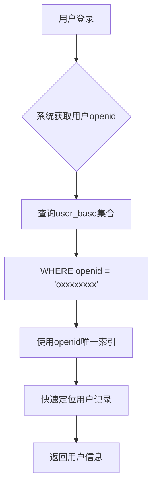
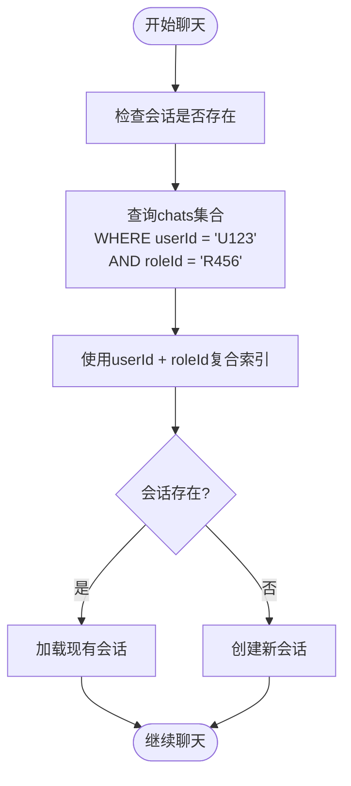
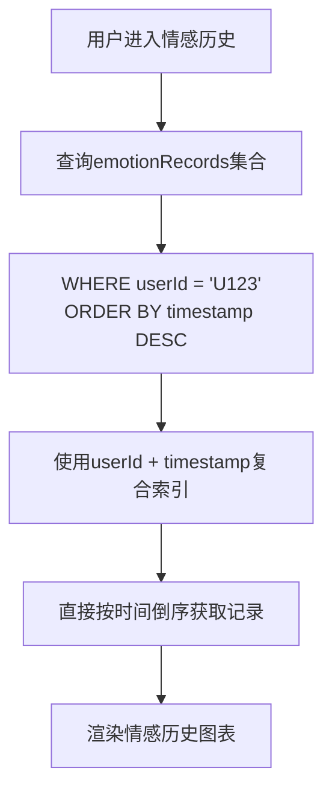

# 索引设计

<cite>
**本文档引用的文件**
- [createIndexes.js](file://cloudfunctions/user/createIndexes.js)
- [init-roles.js](file://cloudfunctions/roles/init-roles.js)
- [user_base.md](file://doc/开发文档/database/user_base.md)
- [chats.md](file://doc/开发文档/database/chats.md)
- [emotionRecords.md](file://doc/开发文档/database/emotionRecords.md)
- [HeartChat数据库结构图.html](file://doc/设计文档/流程图/html/HeartChat数据库结构图.html)
- [数据库设计方案.md](file://doc/开发文档/数据库设计方案.md)
</cite>

## 目录
1. [引言](#引言)
2. [核心集合索引策略](#核心集合索引策略)
3. [索引在数据初始化中的性能优化](#索引在数据初始化中的性能优化)
4. [索引使用最佳实践](#索引使用最佳实践)
5. [结论](#结论)

## 引言
HeartChat 是一个基于微信小程序的智能情感陪伴应用，其后端采用云数据库存储用户、聊天、角色和情感分析等核心数据。随着用户量和数据量的增长，数据库查询性能成为系统稳定性的关键因素。合理的索引策略不仅能显著提升查询效率，还能优化写入性能。本文档基于 `createIndexes.js` 和 `init-roles.js` 等核心文件的实现，详细阐述 HeartChat 的索引设计原则、具体实现及其在性能优化中的作用，并提供索引使用的最佳实践指南。

## 核心集合索引策略

HeartChat 的索引策略围绕核心业务场景构建，旨在优化高频查询路径。通过分析 `createIndexes.js` 文件和数据库设计文档，可以清晰地看到针对不同集合的索引设计逻辑。

### user_base 集合的唯一索引

在 `user_base` 集合上，为 `openid` 字段创建唯一索引是确保数据完整性和提升认证效率的关键措施。

**设计原因**：
1.  **数据唯一性保证**：`openid` 是微信平台为每个用户生成的唯一标识符。在 `user_base` 集合中，每个用户只能有一个账户。通过创建唯一索引，数据库会强制保证 `openid` 的唯一性，防止因程序逻辑错误或并发请求导致的重复用户注册，从根本上维护了数据的准确性。
2.  **高频查询优化**：用户登录和身份验证是应用最频繁的操作。每次用户登录时，系统都需要根据其 `openid` 快速查找对应的用户信息。唯一索引将此查询的时间复杂度从 O(n) 降低到接近 O(1)，极大地提升了登录响应速度和用户体验。

**Diagram sources**
- [createIndexes.js](file://cloudfunctions/user/createIndexes.js#L52-L55)
- [user_base.md](file://doc/开发文档/database/user_base.md#L20-L22)

**Section sources**
- [createIndexes.js](file://cloudfunctions/user/createIndexes.js#L52-L55)
- [user_base.md](file://doc/开发文档/database/user_base.md#L20-L22)

### chats 集合的复合索引

在 `chats` 集合上，为 `userId` 和 `roleId` 字段创建复合索引，是优化特定用户与特定角色会话查询的核心策略。

**查询场景分析**：
该复合索引主要服务于以下业务场景：
1.  **会话存在性检查**：当用户选择一个角色开始聊天时，系统需要首先检查该用户与该角色之间是否已存在一个会话。如果存在，则直接加载该会话；如果不存在，则创建新会话。这是一个典型的等值查询，查询条件为 `userId = ? AND roleId = ?`。
2.  **会话信息获取**：在加载会话历史记录时，需要根据 `userId` 和 `roleId` 快速定位到唯一的会话ID（`_id`），然后通过该ID从 `messages` 集合中拉取消息。

**性能优化作用**：
复合索引 `(userId, roleId)` 允许数据库引擎使用索引直接定位到满足两个条件的记录，避免了全表扫描。相比于为 `userId` 和 `roleId` 分别创建单字段索引，复合索引在处理这种联合查询时效率更高，因为它只需要一次索引查找即可完成。

**Diagram sources**
- [createIndexes.js](file://cloudfunctions/user/createIndexes.js#L108-L111)
- [chats.md](file://doc/开发文档/database/chats.md#L30-L32)
- [HeartChat数据库结构图.html](file://doc/设计文档/流程图/html/HeartChat数据库结构图.html#L608-L610)

**Section sources**
- [createIndexes.js](file://cloudfunctions/user/createIndexes.js#L108-L111)
- [chats.md](file://doc/开发文档/database/chats.md#L30-L32)

### emotionRecords 集合的时间范围查询索引

在 `emotionRecords` 集合上，为 `userId` 和 `timestamp`（或 `createTime`）字段创建复合索引，是支持时间范围查询和情感历史分析的基础。

**设计逻辑**：
1.  **支持时间范围查询**：用户和管理员经常需要查询特定时间段内的情感记录，例如“查看过去一周的情感变化”或“生成本月的心情报告”。这类查询的典型模式是 `WHERE userId = ? AND timestamp >= ? AND timestamp <= ?` 或 `WHERE userId = ? ORDER BY timestamp DESC LIMIT n`。
2.  **优化排序性能**：为了在情感历史页面按时间倒序展示记录，查询通常会包含 `ORDER BY timestamp DESC`。如果 `timestamp` 字段没有索引，数据库需要先获取所有匹配 `userId` 的记录，然后在内存中进行排序，这在数据量大时非常耗时。
3.  **复合索引的优势**：创建 `(userId, timestamp)` 的复合索引，可以同时满足等值过滤和范围查询/排序的需求。数据库首先通过 `userId` 快速定位到该用户的所有记录，然后利用索引中 `timestamp` 的有序性，直接按时间顺序（或倒序）返回结果，无需额外的排序操作。

**Diagram sources**
- [createIndexes.js](file://cloudfunctions/user/createIndexes.js#L151-L154)
- [emotionRecords.md](file://doc/开发文档/database/emotionRecords.md#L70-L72)
- [HeartChat数据库结构图.html](file://doc/设计文档/流程图/html/HeartChat数据库结构图.html#L625-L627)

**Section sources**
- [createIndexes.js](file://cloudfunctions/user/createIndexes.js#L151-L154)
- [emotionRecords.md](file://doc/开发文档/database/emotionRecords.md#L70-L72)

## 索引在数据初始化中的性能优化

`init-roles.js` 文件中的角色数据初始化过程，虽然没有显式地创建索引，但其设计巧妙地利用了索引的存在来提升写入效率。

**优化机制**：
1.  **存在性检查**：在 `initRoles` 函数中，代码首先执行 `db.collection('roles').count()` 来检查 `roles` 集合中是否已有数据。如果已有数据，则直接跳过初始化。
2.  **索引的间接作用**：`count()` 操作的性能高度依赖于索引。`roles` 集合上存在 `creator` 等索引（由 `createIndexes.js` 创建）。当执行 `count()` 时，数据库可以利用这些索引来快速统计记录总数，而无需扫描整个集合。这使得存在性检查变得非常高效。
3.  **避免冗余写入**：通过高效的 `count()` 检查，系统可以避免在每次云函数触发时都执行批量插入操作。这不仅节省了宝贵的云函数执行时间和数据库写入配额，更重要的是，避免了因重复插入而可能触发的唯一索引冲突（尽管 `init-roles.js` 中的数据没有唯一约束，但这是一个良好的实践）。

**总结**：虽然 `init-roles.js` 本身不创建索引，但它依赖于 `createIndexes.js` 所建立的索引基础设施。索引使得初始化脚本中的“检查-跳过”逻辑成为可能，从而将一次潜在的、耗时的批量写入操作，优化为一次快速的读取检查，显著提升了数据初始化流程的整体效率和健壮性。

**Section sources**
- [init-roles.js](file://cloudfunctions/roles/init-roles.js#L45-L50)
- [createIndexes.js](file://cloudfunctions/user/createIndexes.js#L75-L78)

## 索引使用最佳实践

为了确保 HeartChat 数据库的长期高性能和可维护性，开发者应遵循以下索引使用最佳实践：

### 避免索引滥用

1.  **权衡读写性能**：索引虽然加速了查询，但会降低写入（INSERT、UPDATE、DELETE）性能，因为每次写入都需要更新所有相关的索引。为一个很少被查询的字段创建索引是一种资源浪费。
2.  **控制索引数量**：每个集合上的索引并非越多越好。过多的索引会占用大量存储空间，并增加数据库的维护开销。应只为那些真正能提升关键查询性能的字段创建索引。
3.  **避免过度复合**：复合索引的字段顺序至关重要。应将最常用于等值查询的字段放在前面。避免创建包含过多字段的复合索引，除非有明确的查询需求。

### 监控索引性能

1.  **分析查询计划**：定期使用数据库的查询分析工具（如 `EXPLAIN` 命令）来检查关键查询是否有效地使用了预期的索引。这可以帮助发现“未使用索引”或“错误使用索引”的查询。
2.  **监控慢查询**：设置慢查询日志，定期审查执行时间过长的查询。这些查询往往是缺少必要索引或索引设计不当的信号。
3.  **评估索引利用率**：监控各个索引的命中率。对于长期未被任何查询使用的“僵尸索引”，应考虑删除以释放资源。

### 新增查询需求时的索引设计指导

当业务发展需要新增查询需求时，应遵循以下步骤设计新索引：

1.  **明确查询模式**：首先，清晰地定义新的查询语句，包括 `WHERE` 子句的过滤条件、`ORDER BY` 子句的排序要求以及 `LIMIT` 子句。
2.  **评估现有索引**：检查当前集合上已有的索引，判断是否可以通过调整查询或利用现有索引（如前缀匹配）来满足需求，避免创建新索引。
3.  **设计最优索引**：
    *   对于简单的等值查询，创建单字段索引。
    *   对于多条件查询，优先考虑创建复合索引。复合索引的字段顺序应遵循“等值字段在前，范围/排序字段在后”的原则。
    *   对于范围查询和排序，确保范围/排序字段在复合索引中处于正确位置。
4.  **测试与验证**：在测试环境中创建新索引，并使用真实或模拟数据运行查询，通过查询分析工具验证新索引确实被使用且性能得到提升。
5.  **文档化**：将新索引的设计理由、对应的查询场景和性能测试结果记录在数据库设计文档中，以便团队成员理解和维护。

## 结论
HeartChat 的索引策略是其高性能数据库架构的核心组成部分。通过对 `user_base`、`chats` 和 `emotionRecords` 等核心集合实施精准的唯一索引和复合索引，系统能够高效地处理用户认证、会话管理、情感历史查询等关键业务。`init-roles.js` 的实现也体现了对索引基础设施的依赖，通过高效的读取检查避免了不必要的写入开销。遵循避免滥用、持续监控和科学设计的最佳实践，将确保 HeartChat 的数据库能够随着业务增长而持续稳定地提供卓越的性能。