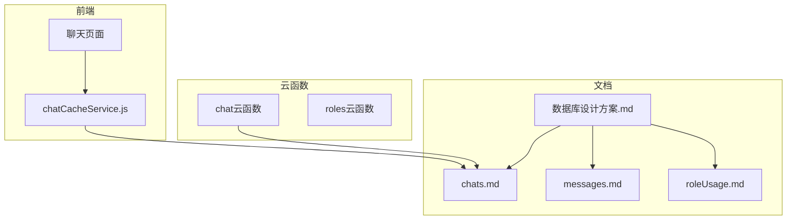
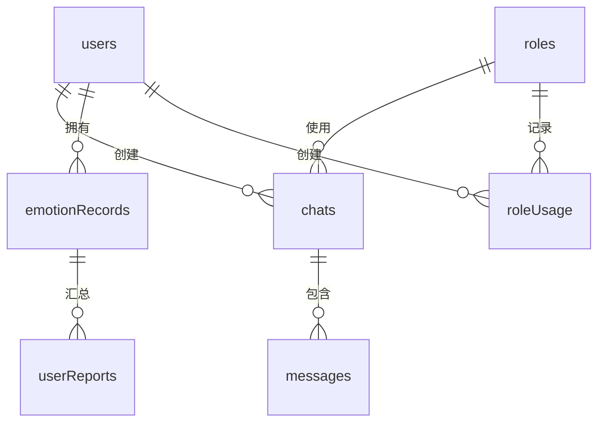
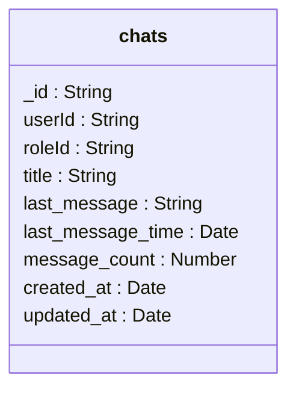
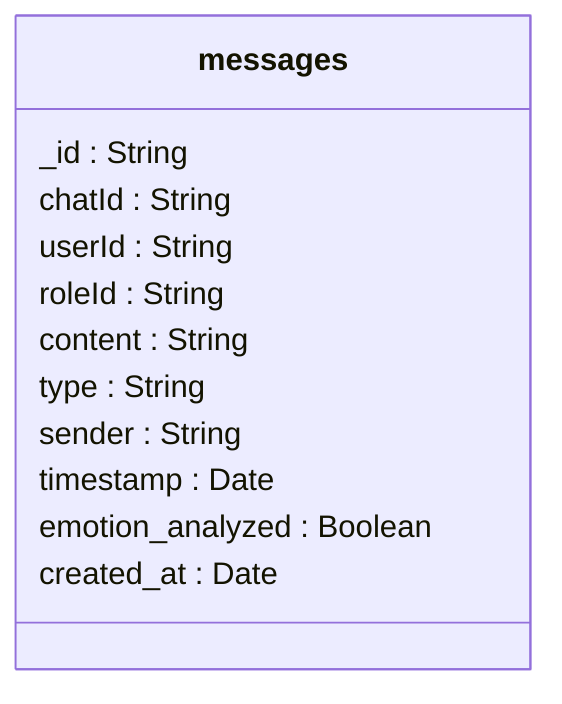
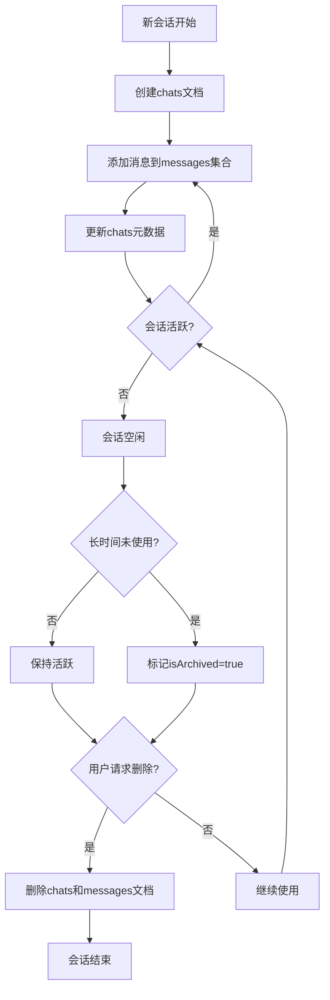
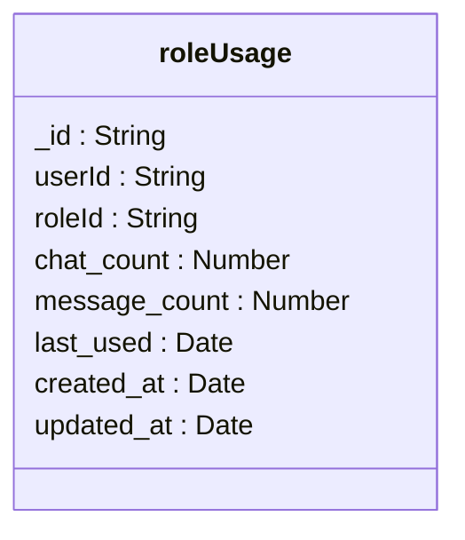

# chats 集合

<cite>
**本文档引用的文件**
- [chats.md](file://doc/开发文档/database/chats.md)
- [messages.md](file://doc/开发文档/database/messages.md)
- [roleUsage.md](file://doc/开发文档/database/roleUsage.md)
- [数据库设计方案.md](file://doc/开发文档/数据库设计方案.md)
- [HeartChat数据库结构图.md](file://doc/设计文档/流程图/HeartChat数据库结构图.md)
- [HeartChat数据库ER图.html](file://doc/设计文档/流程图/html/HeartChat数据库ER图.html)
- [聊天功能使用指南.md](file://doc/使用文档/聊天功能使用指南.md)
- [聊天消息分段输出计划.md](file://doc/使用文档/@聊天消息分段输出计划.md)
- [聊天记录本地缓存与下拉加载功能说明.md](file://doc/使用文档/聊天记录本地缓存与下拉加载功能说明.md)
</cite>

## 目录
1. [简介](#简介)
2. [项目结构](#项目结构)
3. [核心组件](#核心组件)
4. [架构概述](#架构概述)
5. [详细组件分析](#详细组件分析)
6. [依赖分析](#依赖分析)
7. [性能考虑](#性能考虑)
8. [故障排除指南](#故障排除指南)
9. [结论](#结论)

## 简介
`chats` 集合是 HeartChat 应用的核心数据模型之一，负责存储用户与AI角色之间的会话元数据。该集合作为 `messages` 集合的父容器，实现了会话级别的组织与管理，记录了会话ID、关联角色ID、会话标题、创建时间、最后活跃时间、消息计数等关键信息。通过与 `roleUsage` 集合的关联，系统能够分析角色的使用频率和用户偏好。本文档详细描述了 `chats` 集合的结构、作用、生命周期管理以及性能优化策略。

## 项目结构
HeartChat 项目采用模块化设计，主要分为云函数、前端小程序和文档三大部分。`chats` 集合相关的数据模型定义位于 `doc/开发文档/database/` 目录下，而实现逻辑分散在云函数和小程序前端代码中。数据库设计文档提供了集合的详细字段说明和索引建议。



**Diagram sources**
- [数据库设计方案.md](file://doc/开发文档/数据库设计方案.md)
- [chats.md](file://doc/开发文档/database/chats.md)

**Section sources**
- [数据库设计方案.md](file://doc/开发文档/数据库设计方案.md)
- [chats.md](file://doc/开发文档/database/chats.md)

## 核心组件
`chats` 集合是聊天功能的核心元数据存储，与 `messages` 集合形成一对多的父子关系。每个会话记录包含会话的基本信息，如标题、关联角色、消息计数和时间戳，为前端提供会话列表展示所需的所有数据。该集合的设计考虑了查询性能，通过索引优化确保会话列表的快速加载。

**Section sources**
- [chats.md](file://doc/开发文档/database/chats.md)
- [messages.md](file://doc/开发文档/database/messages.md)

## 架构概述
`chats` 集合在 HeartChat 的数据架构中扮演着中心角色，连接用户、角色和消息三大实体。它作为会话的容器，管理着会话的生命周期，并为上层应用提供高效的查询接口。



**Diagram sources**
- [HeartChat数据库结构图.md](file://doc/设计文档/流程图/HeartChat数据库结构图.md)

## 详细组件分析

### chats 集合分析
`chats` 集合存储用户与角色的聊天会话元数据，是实现会话管理的基础。每个文档代表一个独立的会话，包含会话的标识、关联信息和统计指标。

#### 数据结构


**Diagram sources**
- [HeartChat数据库结构图.md](file://doc/设计文档/流程图/HeartChat数据库结构图.md)

#### 字段说明
- `_id`: 会话唯一标识符，由数据库自动生成
- `userId`: 关联用户ID，用于确定会话归属
- `roleId`: 关联角色ID，标识会话使用的AI角色
- `title`: 会话标题，可由系统根据首条消息生成或用户自定义
- `last_message`: 最新消息摘要，冗余字段用于提高列表查询性能
- `last_message_time`: 最新消息时间，**索引字段**，用于会话列表按最后活跃时间倒序排序
- `message_count`: 会话内消息总数，用于统计和展示
- `created_at`: 会话创建时间，**索引字段**
- `updated_at`: 会话最后更新时间

**Section sources**
- [chats.md](file://doc/开发文档/database/chats.md)
- [数据库设计方案.md](file://doc/开发文档/数据库设计方案.md)

### messages 集合分析
`messages` 集合作为 `chats` 集合的子容器，存储具体的聊天消息记录。两者通过 `chatId` 字段建立关联，形成完整的会话数据结构。

#### 数据结构


**Diagram sources**
- [HeartChat数据库结构图.md](file://doc/设计文档/流程图/HeartChat数据库结构图.md)

#### 与chats集合的关系
`messages` 集合通过 `chatId` 外键与 `chats` 集合关联，实现一对多的关系。当用户发送或接收消息时，系统首先查找或创建对应的会话（`chats` 文档），然后将消息插入 `messages` 集合。`chats` 集合中的 `message_count` 和 `last_message_time` 字段会在消息创建后被更新，以保持元数据的实时性。

**Section sources**
- [messages.md](file://doc/开发文档/database/messages.md)
- [聊天功能使用指南.md](file://doc/使用文档/聊天功能使用指南.md)

### 会话生命周期管理
会话的生命周期包括创建、归档和删除三个主要阶段，每个阶段都涉及对 `chats` 集合和关联 `messages` 集合的操作。

#### 生命周期流程


**Diagram sources**
- [chats.md](file://doc/开发文档/database/chats.md)
- [聊天功能使用指南.md](file://doc/使用文档/聊天功能使用指南.md)

#### 对关联消息的影响
- **创建**: 新建会话时，`chats` 集合创建新文档，`messages` 集合为空
- **归档**: 设置 `isArchived` 标记，`messages` 集合不受影响，消息仍可访问
- **删除**: 删除 `chats` 文档的同时，级联删除所有关联的 `messages` 文档，彻底清除会话数据

**Section sources**
- [chats.md](file://doc/开发文档/database/chats.md)
- [messages.md](file://doc/开发文档/database/messages.md)

### roleUsage 集合关联分析
`chats` 集合与 `roleUsage` 集合通过 `roleId` 和 `userId` 建立关联，支持角色使用频率的分析和用户偏好统计。

#### 使用频率分析


**Diagram sources**
- [HeartChat数据库结构图.md](file://doc/设计文档/流程图/HeartChat数据库结构图.md)

#### 关联逻辑
每当用户与某个角色开始新会话或在现有会话中发送消息时，系统会更新 `roleUsage` 集合中的统计信息。`chat_count` 记录用户与该角色的会话数量，`message_count` 记录总消息数，`last_used` 记录最后使用时间。这些数据可用于推荐系统、角色优化和用户行为分析。

**Section sources**
- [roleUsage.md](file://doc/开发文档/database/roleUsage.md)
- [数据库设计方案.md](file://doc/开发文档/数据库设计方案.md)

## 依赖分析
`chats` 集合与多个其他集合和系统组件存在依赖关系，构成了复杂的数据网络。

```mermaid
graph TD
chats --> messages : "包含"
chats --> roles : "使用"
chats --> users : "归属"
messages --> emotionRecords : "触发分析"
roleUsage --> chats : "统计"
chatCacheService --> chats : "读写"
chatPage --> chatCacheService : "调用"
```

**Diagram sources**
- [HeartChat数据库结构图.md](file://doc/设计文档/流程图/HeartChat数据库结构图.md)
- [聊天记录本地缓存与下拉加载功能说明.md](file://doc/使用文档/聊天记录本地缓存与下拉加载功能说明.md)

## 性能考虑
为了确保会话列表的快速加载和良好的用户体验，`chats` 集合的设计和查询策略需要特别关注性能优化。

### 查询性能优化
- **索引策略**: 在 `last_message_time` 字段上创建索引，支持按最后活跃时间倒序排序的高效查询
- **冗余字段**: 使用 `last_message` 字段存储最新消息摘要，避免在查询会话列表时关联 `messages` 集合
- **分页查询**: 实现分页机制，避免一次性加载过多会话数据
- **本地缓存**: 前端使用 `chatCacheService` 实现本地缓存，减少网络请求，支持离线访问

**Section sources**
- [chats.md](file://doc/开发文档/database/chats.md)
- [聊天记录本地缓存与下拉加载功能说明.md](file://doc/使用文档/聊天记录本地缓存与下拉加载功能说明.md)

## 故障排除指南
### 常见问题
- **会话列表加载缓慢**: 检查 `last_message_time` 索引是否已创建
- **消息计数不准确**: 确认消息创建后是否正确更新了 `chats` 集合的 `message_count` 字段
- **归档会话仍显示**: 验证前端查询是否正确处理了 `isArchived` 标记

**Section sources**
- [chats.md](file://doc/开发文档/database/chats.md)
- [聊天功能使用指南.md](file://doc/使用文档/聊天功能使用指南.md)

## 结论
`chats` 集合作为 HeartChat 应用的会话管理核心，成功实现了会话元数据的高效存储和管理。通过合理的数据结构设计、索引优化和生命周期管理，该集合为上层应用提供了稳定可靠的数据支持。与 `messages` 和 `roleUsage` 集合的紧密关联，不仅实现了完整的聊天功能，还为用户行为分析和个性化推荐提供了数据基础。未来的优化方向可以包括更智能的会话归档策略和更丰富的会话元数据。