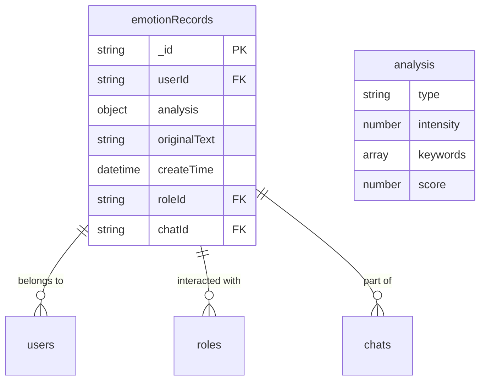
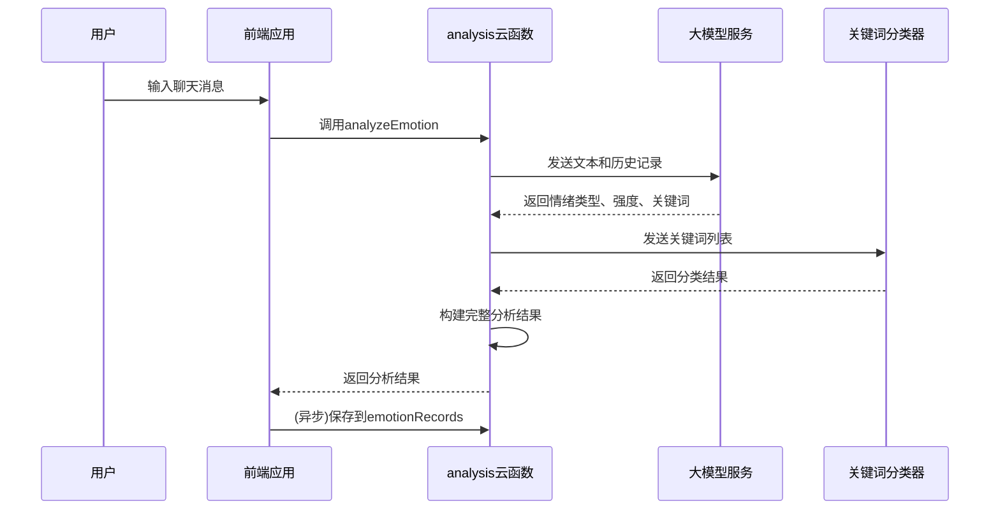
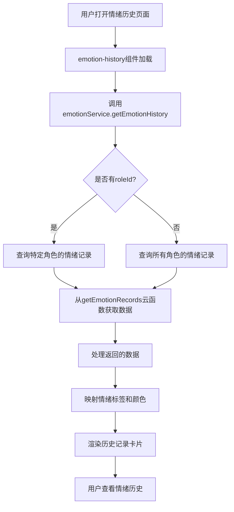
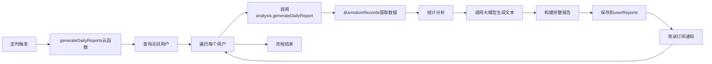

# emotionRecords 集合

<cite>
**本文档引用文件**  
- [index.js](file://cloudfunctions/analysis/index.js)
- [keywordClassifier.js](file://cloudfunctions/analysis/keywordClassifier.js)
- [keywordEmotionLinker.js](file://cloudfunctions/analysis/keywordEmotionLinker.js)
- [emotionService.js](file://miniprogram/services/emotionService.js)
- [emotion-history.js](file://miniprogram/components/emotion-history/emotion-history.js)
- [daily-report.js](file://miniprogram/packageEmotion/pages/daily-report/daily-report.js)
- [generateDailyReports/index.js](file://cloudfunctions/generateDailyReports/index.js)
</cite>

## 目录
1. [简介](#简介)
2. [数据模型架构](#数据模型架构)
3. [情绪分类算法](#情绪分类算法)
4. [关键词情感关联机制](#关键词情感关联机制)
5. [情绪历史可视化](#情绪历史可视化)
6. [情绪波动指数计算](#情绪波动指数计算)
7. [数据查询与聚合分析](#数据查询与聚合分析)
8. [每日报告生成](#每日报告生成)
9. [结论](#结论)

## 简介

`emotionRecords` 集合是 HeartChat 应用的核心数据存储之一，用于持久化由 `analysis` 云函数生成的用户情绪分析结果。该集合记录了用户在与AI角色互动过程中的情绪状态，为情绪历史追踪、心理状态分析和个性化服务提供数据支持。每条记录包含情绪主类别、强度、关键词、时间戳等关键信息，构成了用户情绪画像的基础。

该集合不仅服务于前端的情绪历史页面展示，还为每日心情报告生成、情绪波动分析和用户兴趣建模等高级功能提供数据源。通过分析这些数据，系统能够理解用户的情绪变化趋势，提供个性化的心理支持和互动建议。

**Section sources**
- [index.js](file://cloudfunctions/analysis/index.js#L1-L100)

## 数据模型架构

`emotionRecords` 集合的文档结构设计旨在全面捕捉一次情绪分析的完整上下文。每个文档包含以下核心字段：

| 字段名 | 类型 | 描述 |
| :--- | :--- | :--- |
| `_id` | String | 文档的唯一标识符，由数据库自动生成 |
| `userId` | String | 用户的唯一标识符，用于关联用户数据 |
| `analysis` | Object | 情绪分析的核心结果对象 |
| `analysis.type` | String | 情绪主类别，如“喜悦”、“伤感”、“愤怒”等 |
| `analysis.intensity` | Number | 情绪强度，范围在0.0到1.0之间 |
| `analysis.keywords` | Array | 与当前情绪相关的关键词数组 |
| `analysis.score` | Number | 情感分数，-1到1之间，负值表示负面情绪 |
| `originalText` | String | 被分析的原始文本内容 |
| `createTime` | Date | 记录创建的时间戳，由数据库服务器生成 |
| `roleId` | String (可选) | 关联的AI角色ID，用于区分不同角色的互动 |
| `chatId` | String (可选) | 关联的聊天会话ID，用于追溯上下文 |

该数据模型支持灵活的查询和聚合操作。`userId` 字段是主要的查询索引，确保了按用户检索记录的高效性。`createTime` 字段支持按时间范围查询，是实现时间序列分析的基础。`analysis` 对象的嵌套结构使得可以对情绪类型和强度进行复杂的过滤和聚合。



**Diagram sources**
- [index.js](file://cloudfunctions/analysis/index.js#L150-L200)

**Section sources**
- [index.js](file://cloudfunctions/analysis/index.js#L150-L200)

## 情绪分类算法

`emotionRecords` 集合中的数据由 `analysis` 云函数通过复杂的AI模型调用生成。其核心是基于 `keywordClassifier` 和 `keywordEmotionLinker` 模块构建的两阶段分析流程。

首先，系统调用大模型服务（如智谱AI或Google Gemini）对用户的输入文本进行深度语义分析。该服务不仅识别出主导情绪类型（如快乐、悲伤），还评估其强度，并提取出与情绪相关的关键词。这一过程利用了预训练的大型语言模型，能够理解上下文、识别隐含情感和处理复杂的语言表达。

其次，`keywordClassifier` 模块负责对提取出的关键词进行分类。它使用一个预定义的类别列表（如学习、工作、娱乐、社交等）和细分类别映射，通过两种方式对关键词进行分类：当AI服务可用时，它会将关键词列表发送给大模型进行精确分类；当服务不可用时，它会使用本地规则进行分类，例如通过检查关键词是否包含特定的子字符串（如“学”、“考”、“工作”等）来判断其所属类别。



**Diagram sources**
- [index.js](file://cloudfunctions/analysis/index.js#L201-L300)
- [keywordClassifier.js](file://cloudfunctions/analysis/keywordClassifier.js#L1-L100)

**Section sources**
- [index.js](file://cloudfunctions/analysis/index.js#L201-L300)
- [keywordClassifier.js](file://cloudfunctions/analysis/keywordClassifier.js#L1-L100)

## 关键词情感关联机制

`keywordEmotionLinker` 模块是连接情绪分析与用户长期兴趣画像的关键桥梁。它实现了将单次情绪分析结果与用户兴趣数据进行动态关联的机制。

当 `analysis` 云函数完成一次情绪分析后，如果启用了关键词关联功能，它会调用 `keywordEmotionLinker.linkKeywordsToEmotion` 函数。该函数接收用户ID、关键词列表和情绪分析结果作为参数。其核心逻辑是计算一个“情感分数”，并将此分数以加权平均的方式更新到用户兴趣数据库（`userInterests` 集合）中对应关键词的记录上。

情感分数的计算遵循以下规则：首先，根据情绪类型（如“joy”为+0.8，“sadness”为-0.7）获取一个基础分；然后，将基础分乘以情绪强度，得到最终的情感分数。例如，一次强度为0.9的“喜悦”情绪会产生0.72的分数。

更新过程采用加权平均，新分数占30%，旧分数占70%。这种设计使得用户的兴趣画像能够平滑地演变，避免因单次强烈情绪而发生剧烈波动。长期来看，频繁与正面情绪关联的关键词权重会逐渐上升，反之则会下降，从而形成一个动态的、反映用户情感偏好的兴趣图谱。

**Section sources**
- [keywordEmotionLinker.js](file://cloudfunctions/analysis/keywordEmotionLinker.js#L1-L100)
- [index.js](file://cloudfunctions/analysis/index.js#L250-L280)

## 情绪历史可视化

`emotionRecords` 集合是 `emotion-history` 页面的数据基础，该页面为用户提供了一个直观的情绪变化历史视图。

前端通过 `emotionService.getEmotionHistory` 服务方法查询 `emotionRecords` 集合。该方法接受用户ID、角色ID和查询数量作为参数，向 `getEmotionRecords` 云函数发起请求，获取指定条件下的情绪记录。为了保证用户体验，查询结果会按 `createTime` 降序排列，优先展示最新的记录。

在 `emotion-history` 组件中，每条记录被渲染为一个卡片，显示分析时间、情绪类型、强度和关键词。情绪类型使用 `EmotionTypeLabels` 和 `EmotionTypeColors` 进行中文标签和颜色映射，使用户能够一目了然地识别不同情绪。例如，“喜悦”会显示为绿色，“伤感”为蓝色。



**Diagram sources**
- [emotionService.js](file://miniprogram/services/emotionService.js#L150-L200)
- [emotion-history.js](file://miniprogram/components/emotion-history/emotion-history.js#L1-L50)

**Section sources**
- [emotionService.js](file://miniprogram/services/emotionService.js#L150-L200)
- [emotion-history.js](file://miniprogram/components/emotion-history/emotion-history.js#L1-L50)

## 情绪波动指数计算

情绪波动指数是衡量用户情绪稳定性的关键指标，它基于 `emotionRecords` 集合中的历史数据计算得出。该指数在每日心情报告中作为一个核心数据点呈现。

计算过程由 `emotionService.calculateEmotionalVolatility` 函数实现，它综合了多个维度的分析：

1.  **情绪强度标准差**：计算一段时间内情绪强度的标准差，并将其归一化到0-40的范围。标准差越大，表示情绪起伏越剧烈。
2.  **情绪类型变化频率**：统计情绪类型发生变化的次数，归一化到0-30的范围。频繁的情绪转换表明情绪不稳定。
3.  **情绪类型多样性**：计算出现的不同情绪类型的数量，归一化到0-20的范围。过于单一或过于分散的情绪模式都可能影响稳定性。
4.  **时间加权变化**：考虑情绪变化的时间间隔，短时间内发生的情绪变化权重更高，归一化到0-10的范围。

最终的波动指数是这四个维度得分的加权总和，范围在0-100之间。一个较低的指数（如20）表示用户情绪平稳，而一个较高的指数（如80）则提示用户近期情绪波动较大，可能需要关注和调节。

**Section sources**
- [emotionService.js](file://miniprogram/services/emotionService.js#L300-L400)

## 数据查询与聚合分析

`emotionRecords` 集合支持多种查询和聚合操作，以满足不同场景下的数据分析需求。

**按时间范围查询**：这是最常用的查询方式，用于获取特定日期或时间段内的情绪记录。例如，生成每日报告时，系统会查询当天00:00:00至23:59:59之间的所有记录。查询条件如下：
```javascript
db.collection('emotionRecords')
  .where({
    userId: 'user123',
    createTime: _.gte(startDate).and(_.lt(endDate))
  })
  .orderBy('createTime', 'asc')
  .get()
```

**聚合分析**：利用数据库的聚合管道（aggregate pipeline），可以进行复杂的统计分析。例如，计算某用户在一周内各类情绪的出现次数：
```javascript
db.collection('emotionRecords')
  .aggregate()
  .match({
    userId: 'user123',
    createTime: _.gte(oneWeekAgo)
  })
  .group({
    _id: '$analysis.type',
    count: _.aggregate.sum(1)
  })
  .end()
```
此聚合操作首先筛选出符合条件的记录，然后按 `analysis.type` 字段分组，并对每组的文档数量进行求和，最终返回一个包含各类情绪及其出现次数的统计结果。

这些查询和聚合能力是实现情绪分布饼图、情绪强度趋势图等可视化图表的基础。

**Section sources**
- [index.js](file://cloudfunctions/analysis/index.js#L500-L600)
- [daily-report.js](file://miniprogram/packageEmotion/pages/daily-report/daily-report.js#L200-L300)

## 每日报告生成

`emotionRecords` 集合是 `generateDailyReports` 云函数生成每日心情报告的核心数据源。该流程是系统自动化服务的重要组成部分。

每天凌晨，`generateDailyReports` 云函数被定时触发。它首先查询前一天有情绪记录的活跃用户列表。对于每个活跃用户，它会调用 `analysis` 云函数的 `generateDailyReport` 功能。

该功能的执行流程如下：
1.  **数据提取**：从 `emotionRecords` 集合中提取用户当天的所有情绪记录。
2.  **统计分析**：计算主要情绪类型、情绪波动指数、关键词权重等统计数据。
3.  **内容生成**：将统计数据和原始文本摘要发送给大模型，生成情感总结、洞察、建议和“今日运势”等文本内容。
4.  **报告构建**：将所有数据和AI生成的内容整合成一个完整的JSON报告。
5.  **数据存储**：将报告保存到 `userReports` 集合中，并更新用户的兴趣画像。

最终，用户可以在小程序的“每日报告”页面查看这份个性化的报告，其中包含了基于 `emotionRecords` 数据的深度分析和积极的心理引导。



**Diagram sources**
- [generateDailyReports/index.js](file://cloudfunctions/generateDailyReports/index.js#L1-L50)
- [index.js](file://cloudfunctions/analysis/index.js#L601-L700)

**Section sources**
- [generateDailyReports/index.js](file://cloudfunctions/generateDailyReports/index.js#L1-L50)
- [index.js](file://cloudfunctions/analysis/index.js#L601-L700)

## 结论

`emotionRecords` 集合是 HeartChat 应用情感智能体系的基石。它通过结构化的数据模型，系统地记录了用户每一次互动的情绪状态。其背后由 `analysis` 云函数驱动的复杂AI分析流程，结合 `keywordClassifier` 和 `keywordEmotionLinker` 的精细化处理，确保了数据的丰富性和准确性。

该集合不仅支持情绪历史的可视化展示，更是情绪波动指数计算和每日心情报告生成等高级功能的数据源泉。通过对这些数据的持续查询和聚合分析，系统能够为用户提供有价值的自我认知和心理支持，实现了从简单聊天到深度情感陪伴的跨越。其设计体现了数据驱动、用户中心和智能化服务的核心理念。