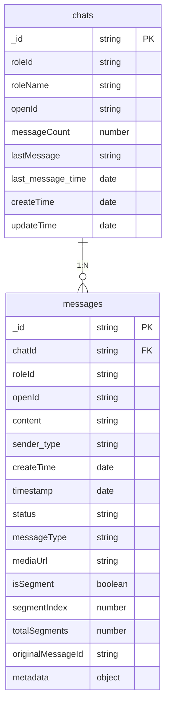
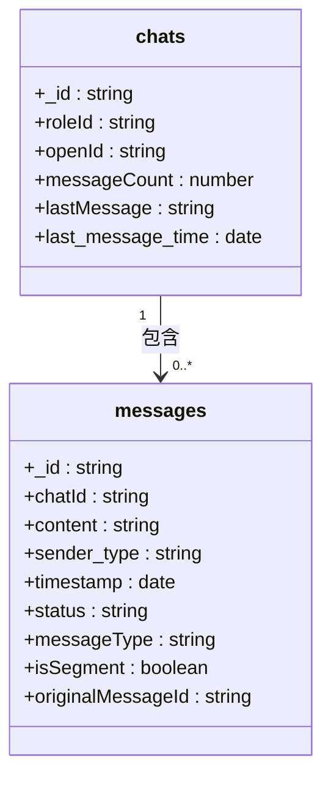
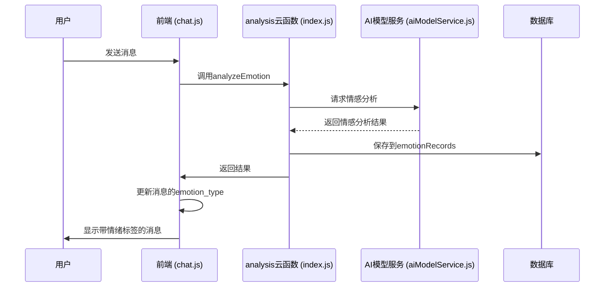

# messages 集合

<cite>
**本文档引用的文件**
- [messages.md](file://doc/开发文档/database/messages.md)
- [chats.md](file://doc/开发文档/database/chats.md)
- [chatCacheService.js](file://miniprogram/services/chatCacheService.js)
- [index.js](file://cloudfunctions/analysis/index.js)
- [aiModelService.js](file://cloudfunctions/analysis/aiModelService.js)
- [chat.js](file://miniprogram/packageChat/pages/chat/chat.js)
- [数据库设计方案.md](file://doc/开发文档/数据库设计方案.md)
- [聊天记录本地缓存与下拉加载功能说明.md](file://doc/使用文档/聊天记录本地缓存与下拉加载功能说明.md)
- [@聊天消息分段输出计划.md](file://doc/使用文档/@聊天消息分段输出计划.md)
</cite>

## 目录
1. [简介](#简介)
2. [数据模型设计](#数据模型设计)
3. [核心字段详解](#核心字段详解)
4. [与 chats 集合的关联关系](#与-chats-集合的关联关系)
5. [消息内容与序列化格式](#消息内容与序列化格式)
6. [情感标签的来源与应用](#情感标签的来源与应用)
7. [消息分页加载与本地缓存机制](#消息分页加载与本地缓存机制)
8. [结论](#结论)

## 简介

`messages` 集合是 HeartChat 应用的核心数据表之一，负责存储所有聊天会话中的单条消息记录。该集合不仅承载了用户与AI角色之间的完整对话历史，还集成了消息状态跟踪、分段处理、情感分析等高级功能。每条消息都包含了丰富的元数据，如发送者类型、消息类型、时间戳和状态，为构建一个功能完备、响应迅速的聊天系统提供了坚实的数据基础。

**Section sources**
- [messages.md](file://doc/开发文档/database/messages.md#L0-L42)

## 数据模型设计

`messages` 集合的设计旨在支持复杂的聊天场景，包括文本、图片、音频等多种消息类型，以及用户与AI之间的双向通信。其数据结构经过精心设计，以确保高效查询和良好的扩展性。



**Diagram sources**
- [messages.md](file://doc/开发文档/database/messages.md#L0-L42)
- [chats.md](file://doc/开发文档/database/chats.md#L0-L67)

## 核心字段详解

`messages` 集合包含一系列关键字段，共同定义了一条消息的完整信息。

- **`_id`**: 消息的唯一标识符，由云数据库自动生成，作为主键。
- **`chatId`**: 关联的聊天会话ID，是连接 `messages` 和 `chats` 集合的关键外键。
- **`roleId`**: 发送此消息的AI角色ID，用于标识消息来源。
- **`openId`**: 微信用户的唯一标识符，用于区分不同用户的消息。
- **`content`**: 消息的文本内容。对于非文本消息，此字段可能为空或包含描述性文字。
- **`sender_type`**: 发送者类型，枚举值为 `'user'` 或 `'ai'`，明确区分消息是来自用户还是AI。
- **`createTime`**: 消息在数据库中创建的时间戳。
- **`timestamp`**: 消息发送的时间戳，用于在聊天界面中按时间顺序排列消息。
- **`status`**: 消息的发送状态，枚举值包括 `'sending'`、`'sent'`、`'failed'`，用于UI反馈。
- **`messageType`**: 消息类型，枚举值为 `'text'`、`'image'`、`'audio'`、`'system'`，决定了消息的渲染方式。
- **`mediaUrl`**: 当 `messageType` 为 `'image'` 或 `'audio'` 时，此字段存储媒体文件的URL。
- **`isSegment`**: 布尔值，标识该消息是否为长消息的分段。
- **`segmentIndex`**: 分段消息的索引，从0开始。
- **`totalSegments`**: 该完整消息被分割的总段数。
- **`originalMessageId`**: 指向原始完整消息ID的引用，用于将分段消息重新组合。
- **`metadata`**: 一个对象，用于存储额外的元数据，例如情绪分析结果、引用的消息ID等。

**Section sources**
- [messages.md](file://doc/开发文档/database/messages.md#L0-L42)
- [数据库设计方案.md](file://doc/开发文档/数据库设计方案.md#L104-L118)

## 与 chats 集合的关联关系

`messages` 集合与 `chats` 集合之间存在明确的一对多（1:N）外键关联关系。

- **关联字段**: `messages.chatId` 字段作为外键，指向 `chats._id` 主键。
- **关系类型**: 一个 `chats` 记录可以关联多条 `messages` 记录，而每条 `messages` 记录只能属于一个 `chats` 会话。
- **业务意义**: 这种设计模式将聊天会话（`chats`）作为逻辑容器，而将具体的消息（`messages`）作为其内容。`chats` 集合中的 `messageCount`、`lastMessage` 和 `last_message_time` 等字段是冗余数据，由系统在消息创建或更新时自动维护，以提高会话列表的查询性能。



**Diagram sources**
- [chats.md](file://doc/开发文档/database/chats.md#L0-L67)
- [messages.md](file://doc/开发文档/database/messages.md#L0-L42)

## 消息内容与序列化格式

`messages` 集合中的 `content` 字段主要存储纯文本内容。对于富文本或结构化数据，系统目前的设计倾向于将其序列化为字符串或通过 `metadata` 字段进行扩展。

- **文本消息**: `content` 字段直接存储用户输入或AI生成的文本。
- **多媒体消息**: 当 `messageType` 为 `'image'` 或 `'audio'` 时，`content` 字段可能为空或包含简短描述，而实际的媒体文件URL则存储在 `mediaUrl` 字段中。
- **分段消息**: 对于过长的AI回复，系统会将其分割成多个 `messages` 记录。这些记录通过 `isSegment`、`segmentIndex`、`totalSegments` 和 `originalMessageId` 字段进行关联，确保在前端能够按正确的顺序和逻辑重新组合成一条完整的消息。

**Section sources**
- [messages.md](file://doc/开发文档/database/messages.md#L0-L42)
- [@聊天消息分段输出计划.md](file://doc/使用文档/@聊天消息分段输出计划.md#L292-L329)

## 情感标签的来源与应用

`messages` 集合中的情感标签并非直接存储在消息主记录中，而是通过 `metadata` 字段或关联的 `emotionRecords` 集合来实现。

- **来源**: 情感标签由 `analysis` 云函数生成。当用户发送消息后，前端会调用 `analysis` 云函数，该函数利用 `aiModelService` 模块（支持 Gemini 和 Zhipu AI 模型）对消息文本进行分析。分析结果包含 `primary_emotion`（主要情感）、`secondary_emotions`（次要情感）、`intensity`（强度）等信息。
- **存储与关联**: 分析结果通常被保存到独立的 `emotionRecords` 集合中，其中 `originalText` 字段与 `messages` 的 `content` 关联。同时，为了快速展示，分析结果中的 `primary_emotion` 也可能被提取并更新到 `messages` 记录的 `metadata` 字段，或直接更新到其所属的 `chats` 记录的 `emotionAnalysis` 字段。
- **应用**: 情感标签在多个场景中被应用：
    1.  **UI反馈**: 在聊天界面中，为用户的消息显示对应的情绪标签（如“喜悦”、“焦虑”）。
    2.  **AI回复**: AI角色可以根据用户当前的情绪状态调整回复的语气和内容。
    3.  **数据分析**: 用于生成每日心情报告，分析用户的情绪波动趋势和关注点。



**Diagram sources**
- [index.js](file://cloudfunctions/analysis/index.js#L573-L604)
- [aiModelService.js](file://cloudfunctions/analysis/aiModelService.js#L300-L314)
- [chat.js](file://miniprogram/packageChat/pages/chat/chat.js#L1241-L1274)

## 消息分页加载与本地缓存机制

为了优化用户体验，特别是处理大量历史消息时的性能，系统实现了消息分页加载和本地缓存（`chatCacheService.js`）的协同工作机制。

- **本地缓存 (`chatCacheService.js`)**: 该服务模块负责管理聊天记录的本地存储。它定义了清晰的缓存结构，将消息分为 `latest`（最新消息）和 `pages`（历史分页）两部分。
- **分页加载**: 当用户下拉加载更多历史消息时，前端会向云数据库发起分页查询请求。查询结果通过 `saveMessagesToCache` 方法保存到缓存的 `pages` 对象中，例如 `pages.page_1`、`pages.page_2`。
- **协同工作流程**:
    1.  **初始化**: 进入聊天页面时，首先调用 `loadMessagesFromCache` 尝试从本地获取 `latest` 消息，实现快速加载。
    2.  **网络同步**: 同时发起网络请求，获取最新的消息流。新消息通过 `saveMessagesToCache(chatId, messages, true)` 保存，并标记为 `isLatest`。
    3.  **历史加载**: 当用户下拉时，请求特定页码的历史消息，并通过 `saveMessagesToCache(chatId, messages, false, pageNum)` 保存到对应的 `pages` 中。
    4.  **数据合并**: 在UI层面，将 `latest` 消息与从 `pages` 中加载的历史消息合并，按时间戳排序后展示给用户。
    5.  **分段消息处理**: 缓存服务在保存消息时，会特别处理分段消息，确保同一原始消息的各个分段能按 `segmentIndex` 正确排序。

```mermaid
flowchart TD
Start[开始] --> LoadFromCache[从缓存加载最新消息]
LoadFromCache --> FetchLatest[获取最新消息]
FetchLatest --> SaveToCache[保存到缓存 latest]
SaveToCache --> Display[显示消息]
UserScroll[用户下拉] --> FetchHistory[获取历史消息 (分页)]
FetchHistory --> SaveToPages[保存到缓存 pages]
SaveToPages --> MergeData[合并最新与历史消息]
MergeData --> Display
subgraph 缓存服务
SaveToCache
SaveToPages
LoadFromCache
end
subgraph 数据库
FetchLatest
FetchHistory
end
```

**Diagram sources**
- [chatCacheService.js](file://miniprogram/services/chatCacheService.js#L48-L81)
- [聊天记录本地缓存与下拉加载功能说明.md](file://doc/使用文档/聊天记录本地缓存与下拉加载功能说明.md#L0-L50)

## 结论

`messages` 集合是 HeartChat 应用数据架构的基石，它不仅是一个简单的消息存储库，更是一个集成了状态管理、分段处理、情感分析和性能优化的复杂数据实体。通过与 `chats` 集合的外键关联，它构建了清晰的会话-消息层级结构。其设计充分考虑了实际应用场景，如通过 `metadata` 字段为未来扩展留出空间，通过分段消息机制解决长文本传输问题，并通过与 `chatCacheService.js` 的深度集成，为用户提供流畅、快速的聊天体验。情感标签的引入，则将简单的文本交流提升到了情感智能交互的层面，为后续的个性化服务和深度分析奠定了坚实的基础。