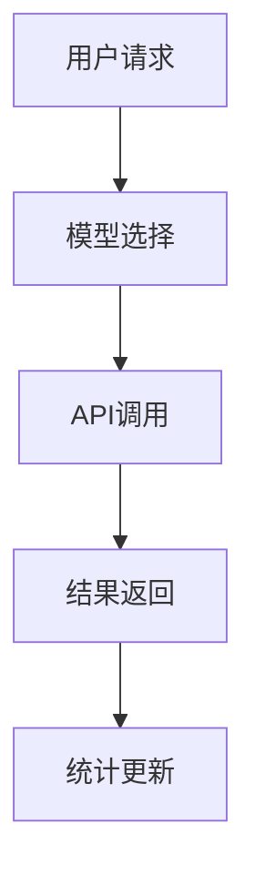
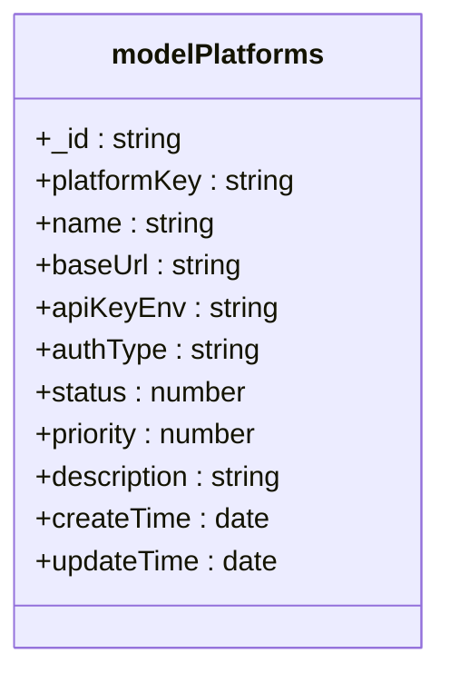
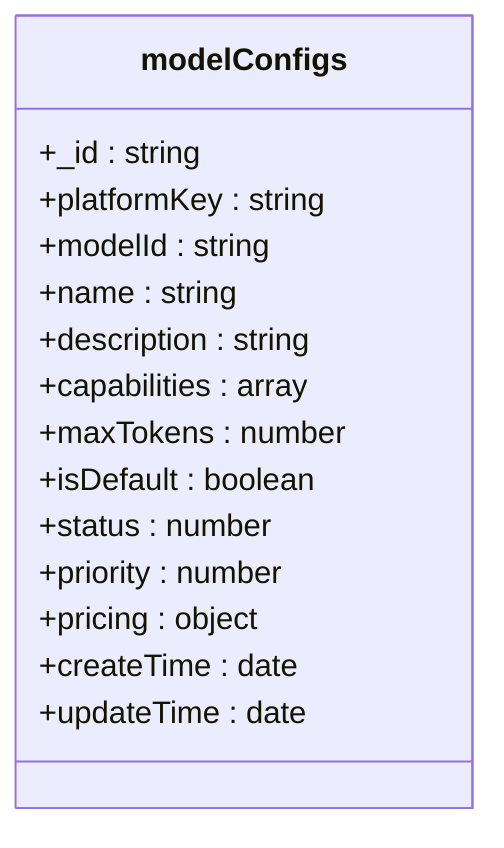
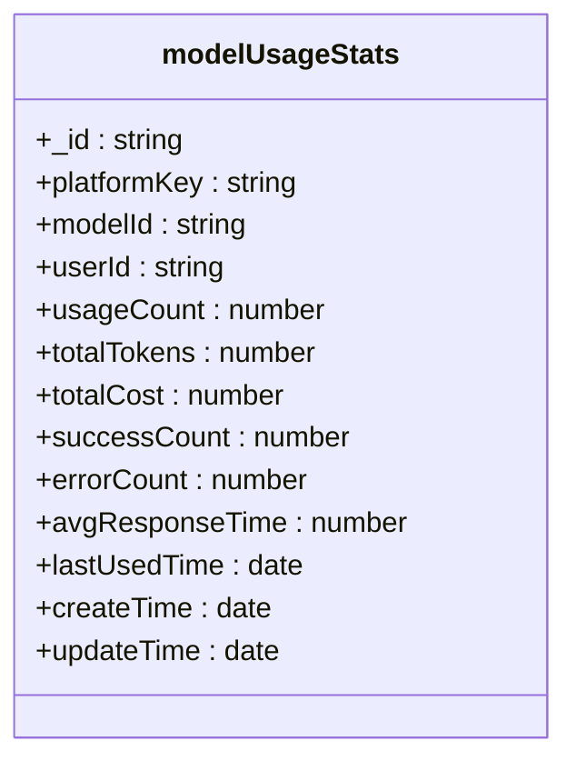
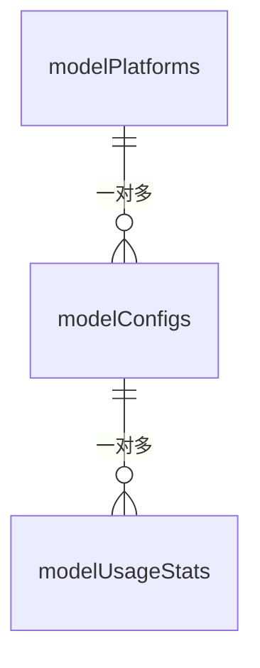

# model-config 集合

<cite>
**本文档引用文件**  
- [model-config.md](file://doc/开发文档/database/model-config.md)
- [统一AI模型服务设计文档.md](file://doc/开发文档/统一AI模型服务设计文档.md)
- [Gemini_API集成开发文档.md](file://doc/开发文档/Gemini_API集成开发文档.md)
- [index.js](file://cloudfunctions/chat/index.js)
- [modelService.js](file://miniprogram/services/modelService.js)
</cite>

## 目录
1. [简介](#简介)
2. [项目结构](#项目结构)
3. [核心组件](#核心组件)
4. [架构概述](#架构概述)
5. [详细组件分析](#详细组件分析)
6. [依赖分析](#依赖分析)
7. [性能考虑](#性能考虑)
8. [故障排除指南](#故障排除指南)
9. [结论](#结论)

## 简介
`model-config` 集合是 HeartChat 项目中用于管理多模型集成配置的核心数据库设计。该集合系统化地存储了 AI 模型提供商的基础信息、具体模型的详细配置以及使用统计信息，支持 `analysis` 和 `chat` 云函数中的 `aiModelService` 进行动态路由决策。通过该配置体系，系统能够实现模型的动态更新、密钥的安全管理、故障转移和负载均衡，确保服务的高可用性和灵活性。

## 项目结构
`model-config` 集合由三个核心数据库集合构成：`modelPlatforms`（模型平台表）、`modelConfigs`（模型配置表）和 `modelUsageStats`（模型使用统计表）。这些集合共同构成了一个完整的 AI 模型配置管理系统，支持动态配置、智能选择、使用监控和运维管理。

```mermaid
graph TB
subgraph "数据库集合"
A[modelPlatforms<br/>模型平台表]
B[modelConfigs<br/>模型配置表]
C[modelUsageStats<br/>模型使用统计表]
end
A --> B : "一对多关联"
B --> C : "一对多关联"
```

**Diagram sources**
- [model-config.md](file://doc/开发文档/database/model-config.md#L1-L195)

**Section sources**
- [model-config.md](file://doc/开发文档/database/model-config.md#L1-L195)

## 核心组件
`model-config` 集合的核心组件包括 `modelPlatforms`、`modelConfigs` 和 `modelUsageStats` 三个集合。`modelPlatforms` 存储 AI 模型提供商的基础信息，如 API 地址、认证方式等；`modelConfigs` 存储具体的 AI 模型配置信息，包括模型能力、定价、限制等；`modelUsageStats` 记录模型的使用情况和性能统计数据，用于监控和优化。

**Section sources**
- [model-config.md](file://doc/开发文档/database/model-config.md#L1-L195)

## 架构概述
`model-config` 集合的架构设计旨在实现 AI 模型配置的动态管理和智能选择。通过 `modelPlatforms` 和 `modelConfigs` 的一对多关联，系统可以灵活地管理多个模型平台及其具体模型。`modelUsageStats` 集合则记录了模型的使用情况，为智能选择和性能优化提供了数据支持。



**Diagram sources**
- [model-config.md](file://doc/开发文档/database/model-config.md#L1-L195)

**Section sources**
- [model-config.md](file://doc/开发文档/database/model-config.md#L1-L195)

## 详细组件分析
### modelPlatforms 分析
`modelPlatforms` 集合存储 AI 模型提供商的基础信息，包括 API 地址、认证方式等平台级配置。该集合通过 `platformKey` 作为唯一标识符，确保平台键名的唯一性。



**Diagram sources**
- [model-config.md](file://doc/开发文档/database/model-config.md#L1-L195)

### modelConfigs 分析
`modelConfigs` 集合存储具体的 AI 模型配置信息，包括模型能力、定价、限制等详细信息。该集合通过 `platformKey` 关联到 `modelPlatforms`，实现平台与模型的关联。



**Diagram sources**
- [model-config.md](file://doc/开发文档/database/model-config.md#L1-L195)

### modelUsageStats 分析
`modelUsageStats` 集合记录模型的使用情况和性能统计数据，用于监控和优化。该集合通过 `platformKey` 和 `modelId` 关联到 `modelConfigs`，实现使用统计与模型配置的关联。



**Diagram sources**
- [model-config.md](file://doc/开发文档/database/model-config.md#L1-L195)

**Section sources**
- [model-config.md](file://doc/开发文档/database/model-config.md#L1-L195)

## 依赖分析
`model-config` 集合的依赖关系主要体现在 `modelPlatforms`、`modelConfigs` 和 `modelUsageStats` 三个集合之间的关联。`modelPlatforms` 与 `modelConfigs` 之间是一对多关系，`modelConfigs` 与 `modelUsageStats` 之间也是一对多关系。这种设计使得系统能够灵活地管理多个模型平台及其具体模型，并记录其使用情况。



**Diagram sources**
- [model-config.md](file://doc/开发文档/database/model-config.md#L1-L195)

**Section sources**
- [model-config.md](file://doc/开发文档/database/model-config.md#L1-L195)

## 性能考虑
`model-config` 集合在性能优化方面采用了缓存策略、查询优化和并发处理等措施。模型配置缓存5分钟，使用内存缓存减少数据库查询；合理使用索引，避免全表扫描；支持并发请求，防止缓存击穿，确保系统的高性能和高可用性。

## 故障排除指南
在使用 `model-config` 集合时，可能会遇到 API 密钥无效、模型连接失败等问题。系统提供了详细的错误处理机制，包括 API 密钥验证、请求错误处理、响应验证、重试机制和详细日志记录，便于问题诊断和解决。

**Section sources**
- [统一AI模型服务设计文档.md](file://doc/开发文档/统一AI模型服务设计文档.md#L1-L247)

## 结论
`model-config` 集合通过系统化的数据库设计，实现了 AI 模型配置的动态管理、智能选择和使用监控。该集合支持运行时添加/修改模型配置，无需重启云函数即可生效，支持 A/B 测试不同模型，为 HeartChat 项目提供了灵活、高效、可靠的 AI 模型管理解决方案。