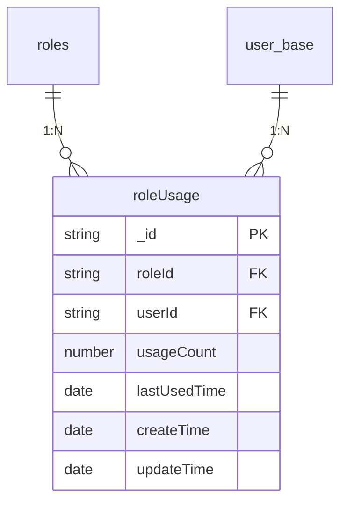
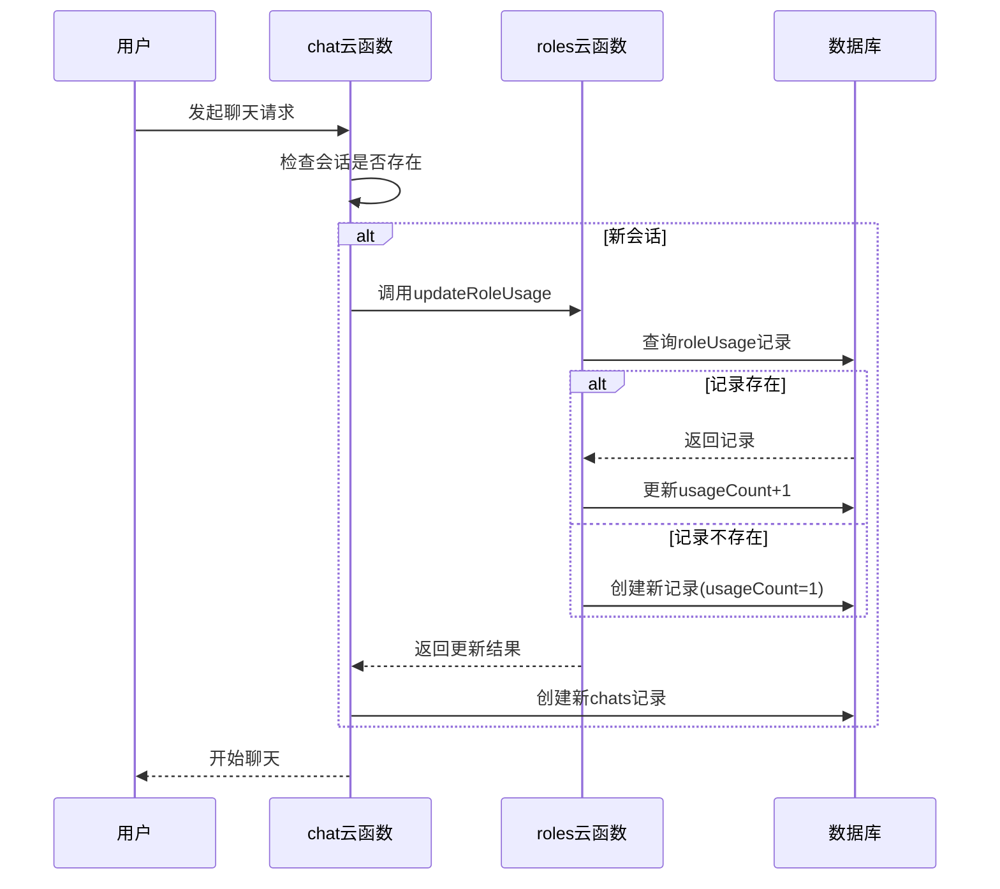
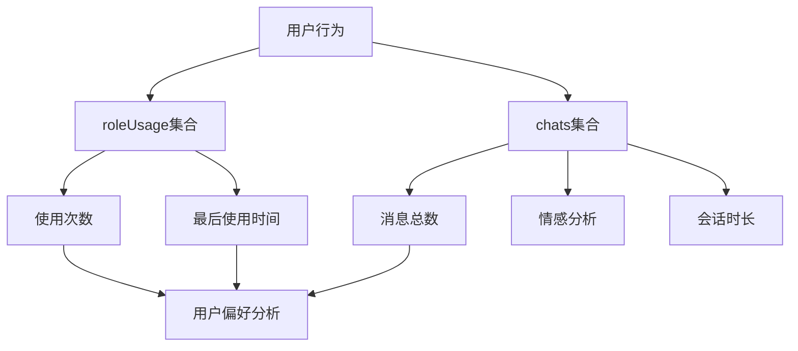

# roleUsage 集合

<cite>
**本文档引用文件**  
- [roleUsage.md](file://doc/开发文档/database/roleUsage.md)
- [index.js](file://cloudfunctions/roles/index.js)
- [chats.md](file://doc/开发文档/database/chats.md)
- [index.js](file://cloudfunctions/chat/index.js)
</cite>

## 目录
1. [简介](#简介)
2. [数据模型结构](#数据模型结构)
3. [核心字段说明](#核心字段说明)
4. [使用统计更新机制](#使用统计更新机制)
5. [与 chats 集合的关联性](#与-chats-集合的关联性)
6. [在角色推荐系统中的应用](#在角色推荐系统中的应用)
7. [数据分析与角色优化](#数据分析与角色优化)
8. [索引设计与性能建议](#索引设计与性能建议)
9. [总结](#总结)

## 简介
`roleUsage` 集合是 HeartChat 系统中用于记录用户与 AI 角色互动频率的核心数据模型。该集合通过统计每个用户对各个角色的使用次数、最后使用时间等关键指标，构建用户偏好画像，为个性化角色推荐系统提供数据支撑。本文档详细说明该集合的实现机制、更新逻辑及其在整个系统中的作用。

**Section sources**
- [roleUsage.md](file://doc/开发文档/database/roleUsage.md#L1-L60)

## 数据模型结构
`roleUsage` 集合采用轻量级文档结构，记录用户与角色之间的使用关系。每个文档代表一个用户对某一角色的使用统计，确保数据的唯一性和可追溯性。

**Diagram sources**
- [roleUsage.md](file://doc/开发文档/database/roleUsage.md#L7-L24)

## 核心字段说明
该集合包含以下核心字段，用于全面反映用户与角色的交互行为：

- **_id**: 统计记录的唯一标识符，由系统自动生成
- **roleId**: 关联的 AI 角色 ID，指向 `roles` 集合中的 `_id` 字段
- **userId**: 用户标识，通常为微信 `openid`，关联 `user_base` 表
- **usageCount**: 使用次数，记录用户与该角色的互动频次
- **lastUsedTime**: 最后使用时间，反映用户最近一次与角色交互的时间戳
- **createTime**: 统计记录的创建时间
- **updateTime**: 统计记录的最后更新时间

这些字段共同构成了用户行为分析的基础数据。

**Section sources**
- [roleUsage.md](file://doc/开发文档/database/roleUsage.md#L7-L24)

## 使用统计更新机制
`roleUsage` 集合的更新由 `roles` 云函数中的 `updateRoleUsage` 子功能触发，更新时机为**每次用户开始与某个角色进行聊天会话时**。

当用户发起新对话或继续已有对话时，系统会调用 `updateRoleUsage` 函数：
1. 查询是否存在该用户-角色组合的统计记录
2. 若存在，则将 `usageCount` 增加 1，并更新 `lastUsedTime` 和 `updateTime`
3. 若不存在，则创建新记录，`usageCount` 初始化为 1

该机制通过原子性操作确保计数准确性，避免重复更新。

**Diagram sources**
- [index.js](file://cloudfunctions/roles/index.js#L600-L680)
- [index.js](file://cloudfunctions/chat/index.js#L900-L950)

## 与 chats 集合的关联性
`roleUsage` 集合与 `chats` 集合存在紧密的关联关系，二者共同构成完整的用户行为分析体系。

- **roleUsage**：记录宏观使用频次，如“用户A使用角色B共15次”
- **chats**：记录微观会话详情，如“用户A与角色B的某次会话包含25条消息”

`chats` 集合中的 `roleId` 和 `openId` 字段与 `roleUsage` 的对应字段形成关联，可通过聚合查询获取更精细的分析数据，例如累计对话轮次（通过 `messageCount` 字段总和计算）。

**Diagram sources**
- [roleUsage.md](file://doc/开发文档/database/roleUsage.md#L30-L35)
- [chats.md](file://doc/开发文档/database/chats.md#L7-L25)

## 在角色推荐系统中的应用
`roleUsage` 集合是角色推荐算法的核心数据源之一。系统通过分析以下维度实现个性化推荐：

- **使用频率排序**：按 `usageCount` 降序排列，推荐用户最常使用的角色
- **最近使用偏好**：结合 `lastUsedTime`，优先推荐近期活跃使用的角色
- **用户群体分析**：统计特定角色的总使用次数，识别热门角色
- **冷启动策略**：对于新用户，推荐系统角色或高使用频次的公共角色

在 `getRoles` 云函数中，系统会自动合并角色信息与 `roleUsage` 统计数据，为前端提供包含使用次数的完整角色列表。

**Section sources**
- [index.js](file://cloudfunctions/roles/index.js#L50-L100)

## 数据分析与角色优化
通过对 `roleUsage` 集合的分析，可以为产品迭代提供有力支持：

- **角色受欢迎程度分析**：统计各角色的总使用次数，识别高价值角色
- **用户留存分析**：跟踪用户是否持续使用特定角色，评估角色粘性
- **功能优化依据**：低使用率角色可能需要优化提示词或功能设计
- **内容运营策略**：针对高使用率角色推出专题活动或内容更新

此外，结合 `chats` 集合中的情感分析数据，可进一步探究“高使用率是否伴随高情感满意度”，实现更深层次的产品优化。

**Section sources**
- [roleUsage.md](file://doc/开发文档/database/roleUsage.md#L40-L45)
- [chats.md](file://doc/开发文档/database/chats.md#L50-L55)

## 索引设计与性能建议
为确保查询效率，`roleUsage` 集合已建立以下索引：

- **复合唯一索引**：`roleId + userId`，确保每个用户-角色组合仅有一条记录
- **复合索引**：`userId + usageCount`（降序），支持按用户查询最常用角色
- **复合索引**：`roleId + usageCount`（降序），支持热门角色排行
- **单字段索引**：`lastUsedTime`，支持按时间范围查询活跃用户

建议定期清理长期未使用的记录（如超过一年无更新），以优化数据库性能。

**Section sources**
- [roleUsage.md](file://doc/开发文档/database/roleUsage.md#L26-L35)

## 总结
`roleUsage` 集合作为 HeartChat 系统的用户行为中枢，通过精准记录用户与 AI 角色的互动频率，为个性化推荐、产品优化和数据分析提供了坚实的数据基础。其与 `chats` 集合的协同工作，实现了从宏观使用趋势到微观会话细节的全方位洞察，是构建智能对话系统不可或缺的一环。