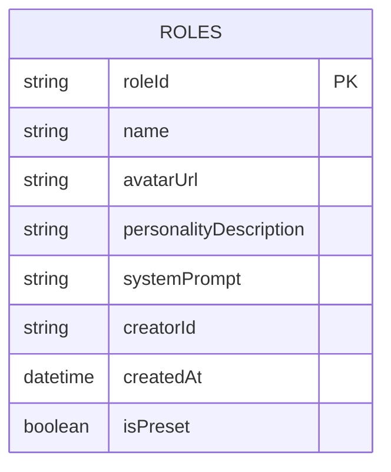
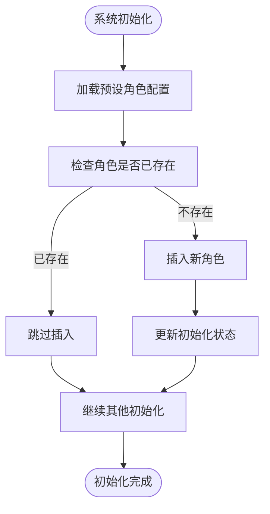
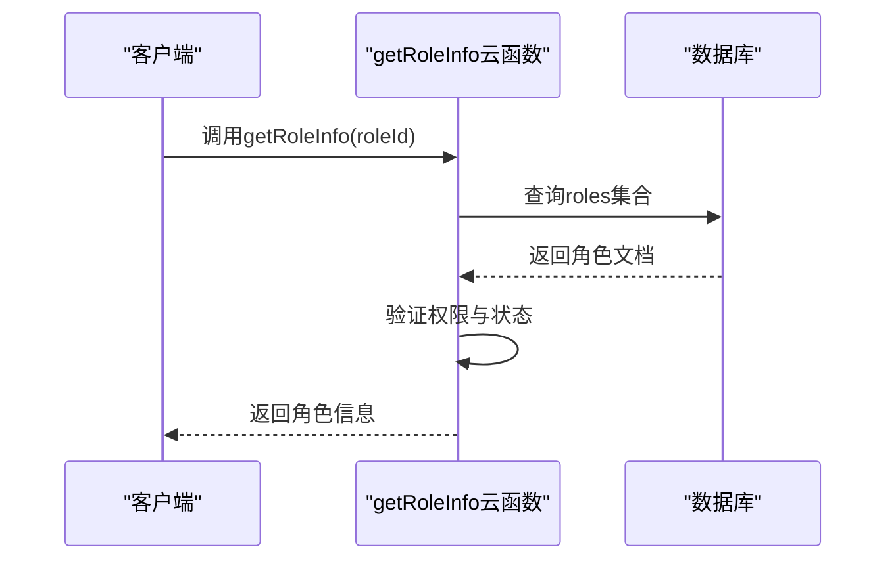
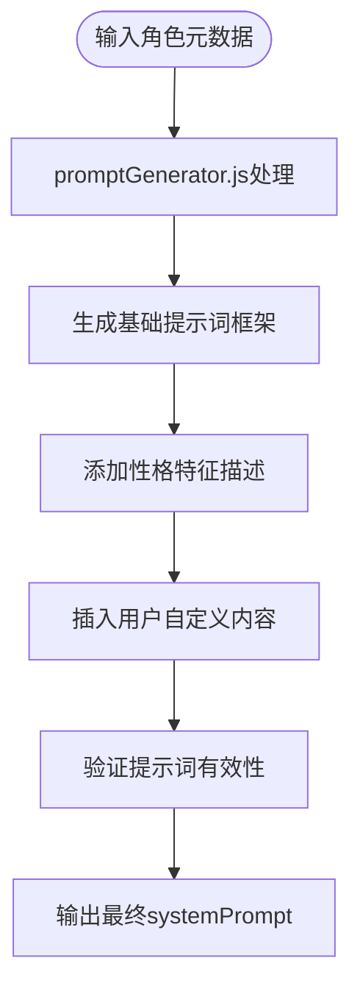
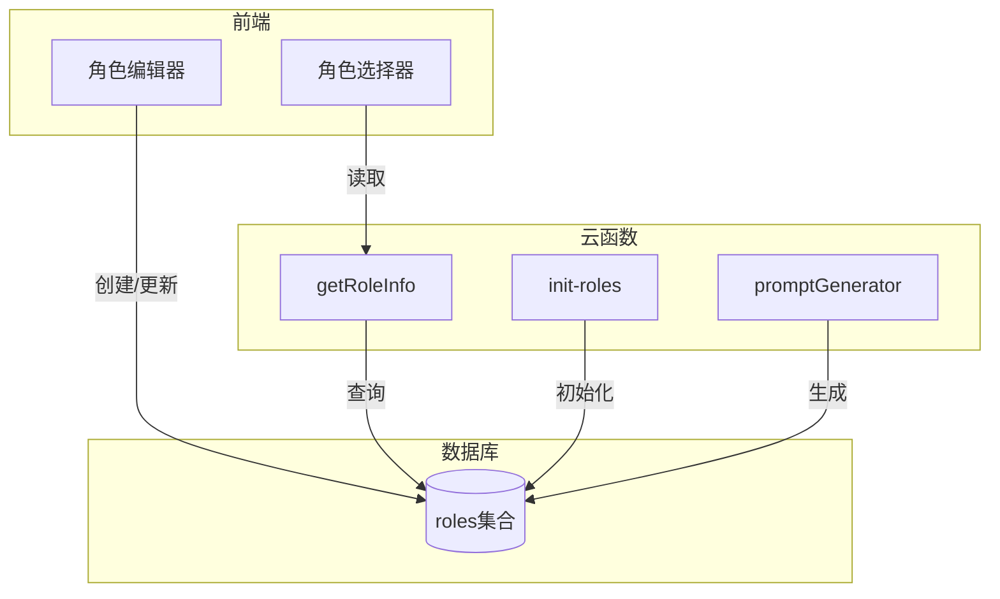

# roles 集合

<cite>
**本文档引用文件**  
- [roles.md](file://doc/开发文档/database/roles.md)
- [init-roles.js](file://cloudfunctions/roles/init-roles.js)
- [promptGenerator.js](file://cloudfunctions/roles/promptGenerator.js)
- [getRoleInfo/index.js](file://cloudfunctions/getRoleInfo/index.js)
- [role-editor/index.js](file://miniprogram/pages/role-editor/index.js)
- [role-select/role-select.js](file://miniprogram/pages/role-select/role-select.js)
- [personalityService.js](file://miniprogram/services/personalityService.js)
</cite>

## 目录
1. [简介](#简介)
2. [数据结构定义](#数据结构定义)
3. [核心字段说明](#核心字段说明)
4. [预设角色与自定义角色](#预设角色与自定义角色)
5. [角色初始化机制](#角色初始化机制)
6. [角色信息获取流程](#角色信息获取流程)
7. [角色编辑功能实现](#角色编辑功能实现)
8. [角色选择界面逻辑](#角色选择界面逻辑)
9. [系统提示词生成逻辑](#系统提示词生成逻辑)
10. [架构关系图](#架构关系图)
11. [依赖分析](#依赖分析)
12. [结论](#结论)

## 简介
`roles` 集合是 HeartChat 应用中用于存储 AI 角色元数据的核心数据结构。该集合支持用户自定义角色和预设角色的统一管理，为聊天界面提供角色选择和行为定制能力。每个角色通过唯一的角色 ID 标识，并包含名称、头像、性格描述、系统提示词等关键属性，其中系统提示词（prompt）在塑造 AI 行为方面起着决定性作用。

**Section sources**
- [roles.md](file://doc/开发文档/database/roles.md#L1-L20)

## 数据结构定义
`roles` 集合采用结构化文档形式存储角色信息，主要字段包括角色 ID、名称、头像 URL、性格描述、系统提示词、创建者、创建时间以及是否为预设角色标志位。该结构设计兼顾灵活性与一致性，既支持用户自由创建个性化角色，也确保预设角色的稳定性和可维护性。

**Diagram sources**
- [roles.md](file://doc/开发文档/database/roles.md#L5-L15)

**Section sources**
- [roles.md](file://doc/开发文档/database/roles.md#L1-L30)

## 核心字段说明
- **roleId**: 角色唯一标识符，用于在系统中精确引用特定角色
- **name**: 角色显示名称，面向用户可见
- **avatarUrl**: 头像资源链接，增强角色识别度
- **personalityDescription**: 角色性格简述，辅助用户理解角色特性
- **systemPrompt**: 系统提示词，定义 AI 的行为模式、语气风格和交互逻辑
- **creatorId**: 创建者用户 ID，区分系统预设与用户自定义
- **createdAt**: 创建时间戳，用于排序和版本控制
- **isPreset**: 布尔标志，指示该角色是否为系统预设

**Section sources**
- [roles.md](file://doc/开发文档/database/roles.md#L10-L25)

## 预设角色与自定义角色
系统通过 `isPreset` 字段区分预设角色和用户自定义角色。预设角色由系统初始化脚本批量创建，具有固定的 ID 和标准化的提示词模板，通常代表典型人格类型或功能角色。用户自定义角色则允许个性化配置，其 `creatorId` 指向具体用户，`systemPrompt` 可由用户通过角色编辑器自由修改。

**Section sources**
- [init-roles.js](file://cloudfunctions/roles/init-roles.js#L1-L10)
- [roles.md](file://doc/开发文档/database/roles.md#L20-L25)

## 角色初始化机制
系统启动时通过 `init-roles.js` 脚本初始化预设角色集合。该脚本读取预定义的角色配置，批量插入到数据库中，确保每次部署后基础角色集的一致性。初始化过程包含角色 ID 的固定映射、提示词模板的加载以及预设标志位的设置。

**Diagram sources**
- [init-roles.js](file://cloudfunctions/roles/init-roles.js#L15-L40)

**Section sources**
- [init-roles.js](file://cloudfunctions/roles/init-roles.js#L1-L50)

## 角色信息获取流程
客户端通过调用 `getRoleInfo` 云函数获取角色详情。该函数接收角色 ID 作为参数，查询 `roles` 集合并返回完整角色信息。对于预设角色，返回标准化数据；对于自定义角色，则返回用户保存的个性化设置。此机制实现了角色数据的统一访问接口。

**Diagram sources**
- [getRoleInfo/index.js](file://cloudfunctions/getRoleInfo/index.js#L10-L30)

**Section sources**
- [getRoleInfo/index.js](file://cloudfunctions/getRoleInfo/index.js#L1-L40)

## 角色编辑功能实现
`role-editor` 页面提供图形化界面供用户创建和修改自定义角色。用户输入的信息通过 `personalityService.js` 服务层提交至后端，最终持久化到 `roles` 集合。编辑器支持实时预览提示词效果，并集成验证逻辑确保数据完整性。

**Section sources**
- [role-editor/index.js](file://miniprogram/pages/role-editor/index.js#L1-L20)
- [personalityService.js](file://miniprogram/services/personalityService.js#L1-L15)

## 角色选择界面逻辑
`role-select` 页面展示所有可用角色（包括预设和自定义），允许用户选择当前会话使用的角色。界面根据 `isPreset` 字段对角色进行分类展示，并通过角色卡片组件呈现关键信息。选择操作触发全局状态更新，影响后续聊天会话的行为模式。

**Section sources**
- [role-select/role-select.js](file://miniprogram/pages/role-select/role-select.js#L5-L25)

## 系统提示词生成逻辑
`promptGenerator.js` 模块负责动态生成或增强角色的系统提示词。它基于角色的性格描述和其他元数据，构造出更丰富、更具表现力的 prompt 内容。该模块与 `roles` 集合紧密集成，在角色创建或编辑时被调用，确保提示词的质量和一致性。

**Diagram sources**
- [promptGenerator.js](file://cloudfunctions/roles/promptGenerator.js#L20-L50)

**Section sources**
- [promptGenerator.js](file://cloudfunctions/roles/promptGenerator.js#L1-L60)

## 架构关系图

**Diagram sources**
- [roles.md](file://doc/开发文档/database/roles.md#L1-L15)
- [getRoleInfo/index.js](file://cloudfunctions/getRoleInfo/index.js#L1-L10)
- [init-roles.js](file://cloudfunctions/roles/init-roles.js#L1-L10)
- [promptGenerator.js](file://cloudfunctions/roles/promptGenerator.js#L1-L10)

## 依赖分析
`roles` 集合作为核心数据源，被多个模块依赖：
- `getRoleInfo` 云函数直接查询该集合
- `role-editor` 和 `role-select` 页面通过服务层间接访问
- `promptGenerator.js` 在角色创建时修改提示词字段
- 系统初始化流程依赖其完成预设角色加载

这种中心化设计确保了角色数据的一致性和可维护性。

**Section sources**
- [getRoleInfo/index.js](file://cloudfunctions/getRoleInfo/index.js#L1-L40)
- [role-editor/index.js](file://miniprogram/pages/role-editor/index.js#L1-L20)
- [role-select/role-select.js](file://miniprogram/pages/role-select/role-select.js#L1-L25)
- [promptGenerator.js](file://cloudfunctions/roles/promptGenerator.js#L1-L60)

## 结论
`roles` 集合通过结构化的数据模型和清晰的业务逻辑，有效支撑了 HeartChat 的角色自定义和选择功能。系统通过预设与自定义的区分机制，在保证基础体验的同时提供了高度的个性化空间。`systemPrompt` 字段作为行为定义的核心，结合 `promptGenerator.js` 的智能生成能力，使得每个角色都能展现出独特而一致的交互风格。