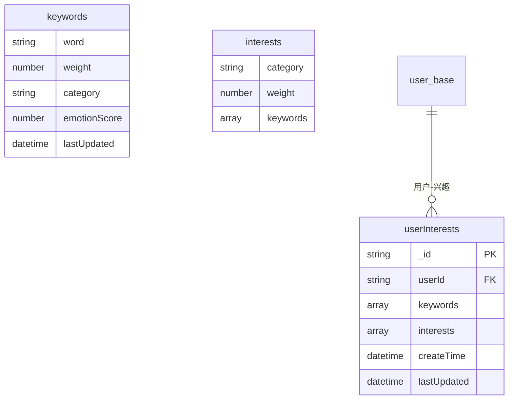
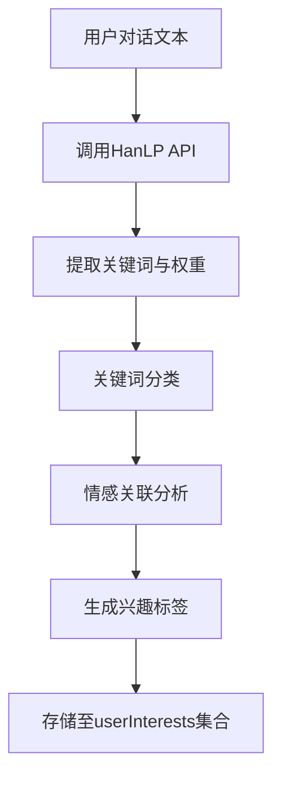
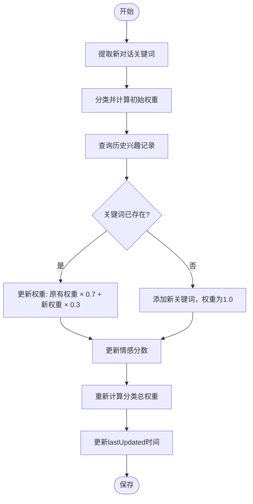
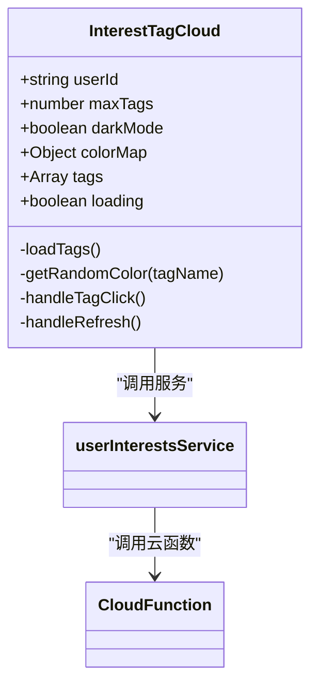
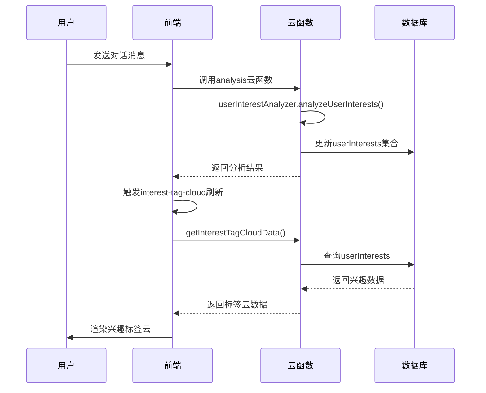

# userInterests 集合

<cite>
**本文档引用的文件**
- [userInterests.md](file://doc/开发文档/database/userInterests.md)
- [userInterestAnalyzer.js](file://cloudfunctions/analysis/userInterestAnalyzer.js)
- [keywords.js](file://cloudfunctions/analysis/keywords.js)
- [interest-tag-cloud.js](file://miniprogram/components/interest-tag-cloud/interest-tag-cloud.js)
- [userInterestsService.js](file://miniprogram/services/userInterestsService.js)
</cite>

## 目录
1. [简介](#简介)
2. [数据模型设计](#数据模型设计)
3. [兴趣标签生成机制](#兴趣标签生成机制)
4. [兴趣权重动态更新算法](#兴趣权重动态更新算法)
5. [前端可视化实现](#前端可视化实现)
6. [系统集成与调用流程](#系统集成与调用流程)
7. [应用场景与优化建议](#应用场景与优化建议)

## 简介
`userInterests` 集合是 HeartChat 系统中的核心用户画像组件，用于存储通过对话内容分析提取的用户兴趣标签及其权重信息。该集合通过自然语言处理技术从用户对话中提取关键词，并结合情感分析与分类算法，构建动态更新的用户兴趣图谱。这些数据不仅用于个性化内容推荐，还优化了角色互动逻辑，使虚拟角色能够基于用户兴趣进行更自然、贴切的对话响应。

**Section sources**
- [userInterests.md](file://doc/开发文档/database/userInterests.md#L1-L10)

## 数据模型设计
`userInterests` 集合采用嵌套文档结构，包含用户 ID、关键词列表、兴趣分类、权重、情感分数及更新时间等字段，支持高效的查询与聚合操作。



**Diagram sources**
- [userInterests.md](file://doc/开发文档/database/userInterests.md#L15-L45)

**Section sources**
- [userInterests.md](file://doc/开发文档/database/userInterests.md#L15-L50)

## 兴趣标签生成机制
兴趣标签由 `analysis` 云函数中的 `userInterestAnalyzer` 模块生成，其流程如下：

1. **关键词提取**：调用 `keywords.js` 中的 `extractKeywords` 函数，通过 HanLP API 从用户对话文本中提取关键词及初始权重。
2. **关键词分类**：使用 `keywordClassifier` 模块将关键词映射到预定义的兴趣类别（如音乐、运动、阅读等）。
3. **情感关联分析**：结合 `emotionRecords` 情绪记录，分析关键词与情绪的关联强度，生成情感分数。
4. **分类聚合**：将同类别关键词的权重累加，形成兴趣分类的总体权重。



**Diagram sources**
- [userInterestAnalyzer.js](file://cloudfunctions/analysis/userInterestAnalyzer.js#L1-L100)
- [keywords.js](file://cloudfunctions/analysis/keywords.js#L1-L50)

**Section sources**
- [userInterestAnalyzer.js](file://cloudfunctions/analysis/userInterestAnalyzer.js#L1-L150)
- [keywords.js](file://cloudfunctions/analysis/keywords.js#L1-L100)

## 兴趣权重动态更新算法
兴趣权重采用多维度动态计算模型，综合考虑关键词频率、情感倾向与时间衰减因素。

### 权重计算公式
```
综合权重 = (基础权重 × 情感系数) × 时间衰减因子
```

- **基础权重**：基于关键词在对话中出现的频率。
- **情感系数**：根据关键词与积极/消极情绪的关联比例计算，范围为 0.5–1.5。
- **时间衰减因子**：近期出现的关键词权重更高，采用指数衰减模型。

### 更新逻辑


**Diagram sources**
- [userInterestAnalyzer.js](file://cloudfunctions/analysis/userInterestAnalyzer.js#L100-L200)
- [userInterestsService.js](file://miniprogram/services/userInterestsService.js#L100-L200)

**Section sources**
- [userInterestAnalyzer.js](file://cloudfunctions/analysis/userInterestAnalyzer.js#L100-L250)
- [userInterests.md](file://doc/开发文档/database/userInterests.md#L80-L100)

## 前端可视化实现
前端通过 `interest-tag-cloud` 组件将用户兴趣数据以标签云形式可视化，支持暗夜模式与交互响应。

### 组件属性
| 属性名 | 类型 | 默认值 | 说明 |
|-------|------|--------|------|
| `userId` | string | '' | 用户ID，用于加载对应兴趣数据 |
| `maxTags` | number | 20 | 显示最大标签数量 |
| `darkMode` | boolean | false | 是否启用暗夜模式配色 |
| `useCategories` | boolean | true | 是否显示分类而非关键词 |

### 字体大小计算
根据关键词权重进行线性映射：
```
fontSize = minFontSize + (value - minValue) / (maxValue - minValue) × (maxFontSize - minFontSize)
```

### 颜色映射策略
- 若关键词有分类且分类在 `colorMap` 中，使用分类对应颜色。
- 否则，基于关键词名称生成一致性随机颜色（通过字符码哈希）。



**Diagram sources**
- [interest-tag-cloud.js](file://miniprogram/components/interest-tag-cloud/interest-tag-cloud.js#L1-L100)
- [userInterestsService.js](file://miniprogram/services/userInterestsService.js#L300-L400)

**Section sources**
- [interest-tag-cloud.js](file://miniprogram/components/interest-tag-cloud/interest-tag-cloud.js#L1-L200)
- [userInterestsService.js](file://miniprogram/services/userInterestsService.js#L300-L500)

## 系统集成与调用流程
用户兴趣数据的生成与使用贯穿前后端，形成闭环更新机制。



**Diagram sources**
- [userInterestAnalyzer.js](file://cloudfunctions/analysis/userInterestAnalyzer.js#L1-L288)
- [userInterestsService.js](file://miniprogram/services/userInterestsService.js#L300-L600)
- [interest-tag-cloud.js](file://miniprogram/components/interest-tag-cloud/interest-tag-cloud.js#L1-L255)

**Section sources**
- [userInterestAnalyzer.js](file://cloudfunctions/analysis/userInterestAnalyzer.js#L1-L288)
- [userInterestsService.js](file://miniprogram/services/userInterestsService.js#L300-L600)

## 应用场景与优化建议
### 应用场景
1. **个性化推荐**：根据用户兴趣匹配推荐内容、角色或活动。
2. **角色互动优化**：虚拟角色在对话中优先提及用户高权重兴趣，提升亲和力。
3. **情绪洞察**：结合情感分数识别用户对特定话题的情绪倾向。
4. **用户画像分析**：长期追踪兴趣变化趋势，支持心理状态评估。

### 优化建议
- **关键词库维护**：定期更新 `keywords.js` 中的 HanLP 配置，提升关键词提取准确率。
- **分类标准化**：统一兴趣类别命名，避免“音乐”与“听歌”等语义重复。
- **缓存策略**：前端 `userInterestsService` 使用本地缓存（30分钟），减少云函数调用频率。
- **性能监控**：对 `userInterestAnalyzer` 设置超时与降级机制，避免影响主对话流程。

**Section sources**
- [userInterests.md](file://doc/开发文档/database/userInterests.md#L100-L120)
- [userInterestsService.js](file://miniprogram/services/userInterestsService.js#L1-L50)