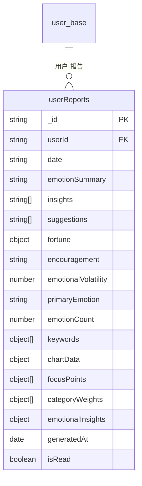
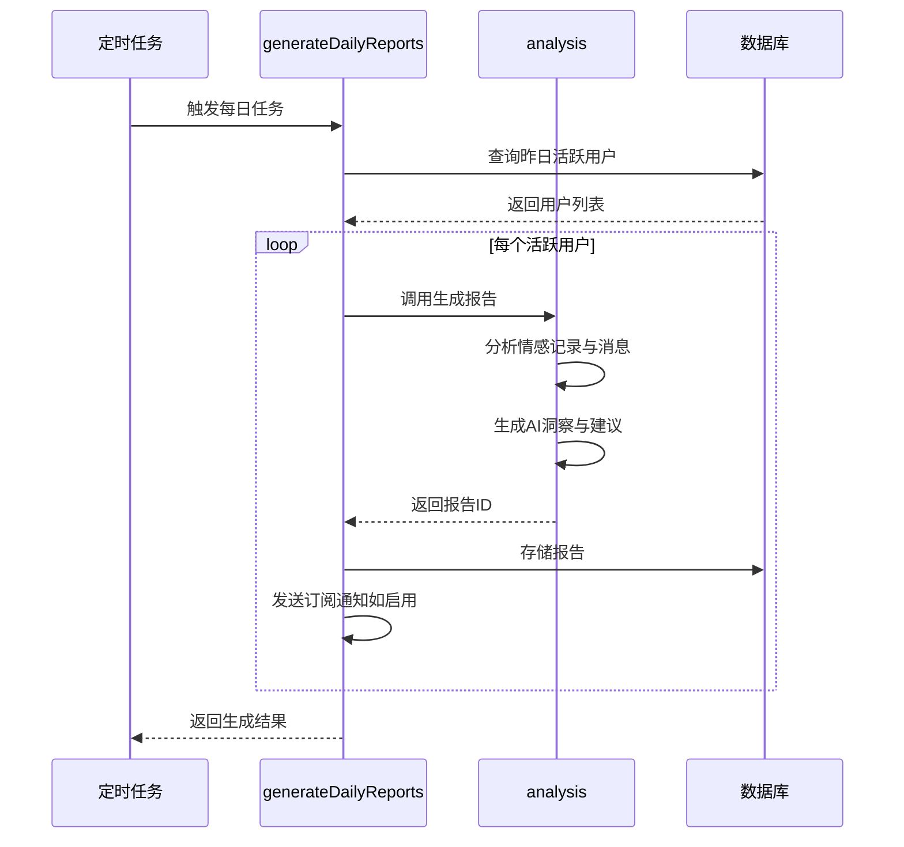
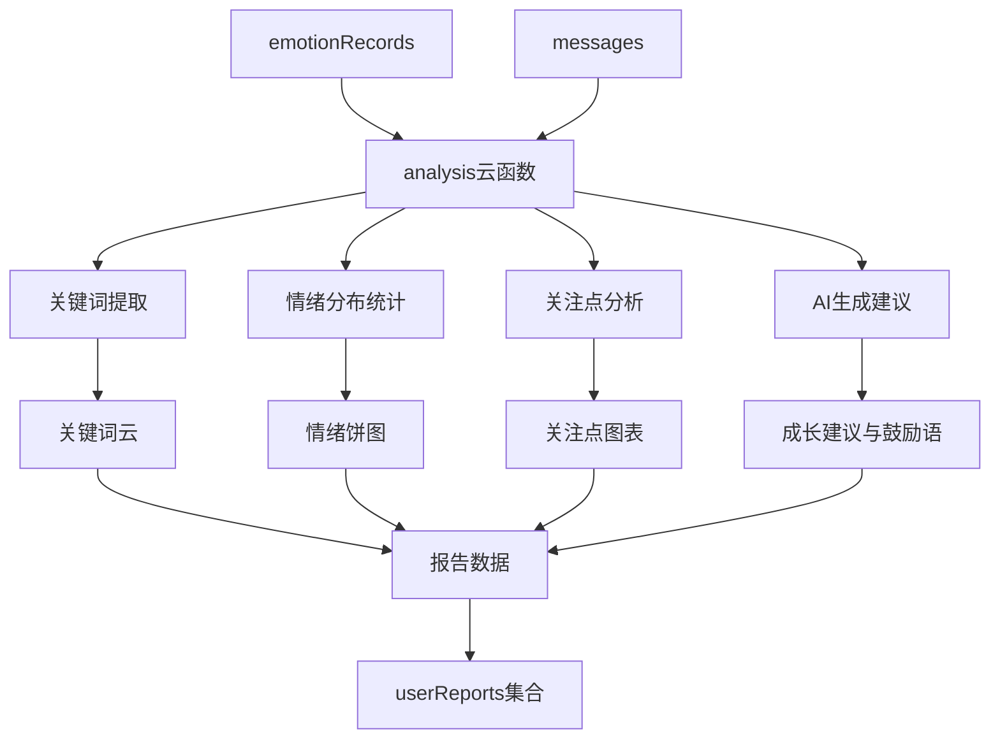
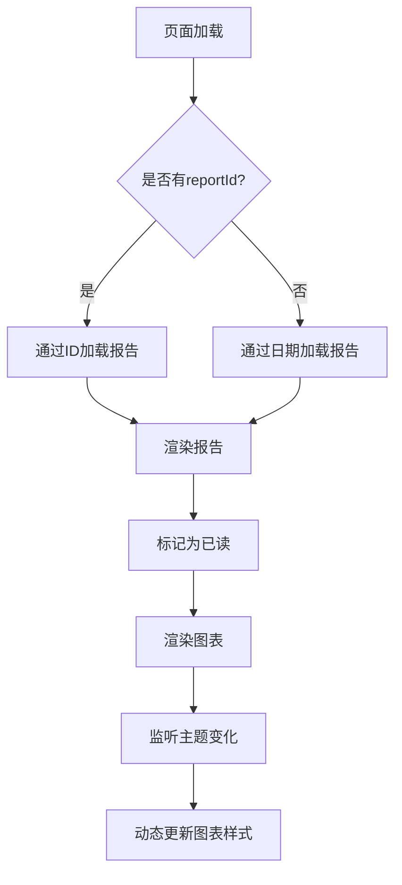

# userReports 集合

<cite>
**本文档引用文件**  
- [userReports.md](file://doc/开发文档/database/userReports.md)
- [index.js](file://cloudfunctions/generateDailyReports/index.js)
- [daily-report.js](file://miniprogram/packageEmotion/pages/daily-report/daily-report.js)
- [analysis/index.js](file://cloudfunctions/analysis/index.js)
</cite>

## 目录
1. [简介](#简介)
2. [数据结构](#数据结构)
3. [报告生成机制](#报告生成机制)
4. [数据来源与整合](#数据来源与整合)
5. [前端展示逻辑](#前端展示逻辑)
6. [存储与性能优化](#存储与性能优化)
7. [索引与查询建议](#索引与查询建议)
8. [注意事项与最佳实践](#注意事项与最佳实践)

## 简介

`userReports` 集合用于存储由 `generateDailyReports` 云函数自动生成的用户每日心情总结报告。该报告基于用户前一天的情感记录（emotionRecords）和聊天消息（messages）数据，通过AI分析生成综合情绪评分、主要情绪回顾、关键词云、成长建议和AI鼓励语等内容。报告每日定时生成，并可通过小程序的 `daily-report` 页面进行查看和回顾。

**Section sources**
- [userReports.md](file://doc/开发文档/database/userReports.md#L1-L10)

## 数据结构

`userReports` 集合包含以下核心字段：

| 字段名 | 类型 | 说明 |
|--------|------|------|
| `_id` | string | 报告ID，主键，自动生成 |
| `userId` | string | 用户ID，关联 user_base 表 |
| `date` | string | 报告日期，格式为 YYYY-MM-DD |
| `emotionSummary` | string | 整体情感状态总结 |
| `insights` | array | 情感洞察分析列表 |
| `suggestions` | array | 改善建议列表 |
| `fortune` | object | 今日运势，包含“宜”与“忌”事项 |
| `encouragement` | string | AI生成的鼓励性话语 |
| `emotionalVolatility` | number | 情绪波动指数（0-100） |
| `primaryEmotion` | string | 当日主要情感类型 |
| `emotionCount` | number | 情感记录数量 |
| `keywords` | array | 重要关键词列表，含权重 |
| `chartData` | object | 可视化图表数据，包括情绪分布、强度趋势等 |
| `focusPoints` | array | 主要关注点分析 |
| `categoryWeights` | array | 分类权重统计 |
| `emotionalInsights` | object | 情感关联分析（积极/消极词汇） |
| `generatedAt` | date | 报告生成时间 |
| `isRead` | boolean | 是否已读，默认为 false |

**Diagram sources**
- [userReports.md](file://doc/开发文档/database/userReports.md#L7-L100)

**Section sources**
- [userReports.md](file://doc/开发文档/database/userReports.md#L7-L100)

## 报告生成机制

每日报告由 `generateDailyReports` 云函数定时触发生成，执行时间为每日凌晨。该函数通过聚合 `emotionRecords` 集合中前一天的数据，识别出活跃用户，并为每位用户调用 `analysis` 云函数生成个性化报告。

**Diagram sources**
- [index.js](file://cloudfunctions/generateDailyReports/index.js#L1-L200)

**Section sources**
- [index.js](file://cloudfunctions/generateDailyReports/index.js#L1-L200)

## 数据来源与整合

报告数据主要来源于两个集合：

1. **emotionRecords**：提供用户每日的情感分析记录，包括情绪类型、强度、时间戳等。
2. **messages**：聊天消息内容用于关键词提取、关注点分析和情感上下文理解。

`analysis` 云函数负责整合这两类数据，通过关键词分类器（keywordClassifier）和情感关联分析（keywordEmotionLinker）生成关键词云、关注点分布和情感洞察。

**Diagram sources**
- [analysis/index.js](file://cloudfunctions/analysis/index.js#L657-L695)

**Section sources**
- [analysis/index.js](file://cloudfunctions/analysis/index.js#L657-L695)

## 前端展示逻辑

报告在小程序的 `daily-report` 页面中展示，页面路径为 `/packageEmotion/pages/daily-report/daily-report`。页面通过 `reportService` 服务加载报告数据，并支持按日期切换查看历史报告。

关键功能包括：
- 自动加载当日或指定日期报告
- 支持手动刷新或重新生成报告
- 图表渲染（情绪分布饼图、强度趋势图、关键词云）
- 暗黑模式适配
- 标记报告为已读状态

**Diagram sources**
- [daily-report.js](file://miniprogram/packageEmotion/pages/daily-report/daily-report.js#L0-L799)

**Section sources**
- [daily-report.js](file://miniprogram/packageEmotion/pages/daily-report/daily-report.js#L0-L799)

## 存储与性能优化

为优化存储与访问性能，建议采用以下策略：

- **数据压缩**：对 `chartData` 和 `emotionalInsights` 等嵌套对象字段进行轻量化处理，避免冗余数据。
- **冷热分离**：将30天前的历史报告归档至低成本存储，保留近期报告在主集合中。
- **缓存机制**：前端对已加载的报告进行本地缓存，减少重复请求。
- **分页查询**：历史报告列表采用分页加载，避免一次性拉取过多数据。

## 索引与查询建议

为提升查询效率，建议在 `userReports` 集合上创建以下索引：

| 索引类型 | 字段组合 | 用途 |
|----------|----------|------|
| 复合唯一索引 | `userId + date` | 确保每个用户每天仅有一份报告 |
| 复合索引 | `userId + generatedAt`（降序） | 快速获取用户最新报告列表 |
| 单字段索引 | `date` | 按日期批量查询报告 |
| 单字段索引 | `isRead` | 统计未读报告数量 |
| 复合索引 | `primaryEmotion + date` | 按主要情绪类型分析趋势 |

## 注意事项与最佳实践

- **唯一性约束**：通过 `userId + date` 唯一索引防止重复生成报告。
- **数据完整性**：确保报告生成时有足够的 `emotionRecords` 数据，否则可能生成空报告。
- **图表标准化**：所有图表数据需统一格式，便于前端统一渲染。
- **定期归档**：建议每月对超过30天的报告进行归档，提升主集合查询性能。
- **通知机制**：用户可选择是否接收报告推送通知，尊重用户隐私偏好。

**Section sources**
- [userReports.md](file://doc/开发文档/database/userReports.md#L173-L177)