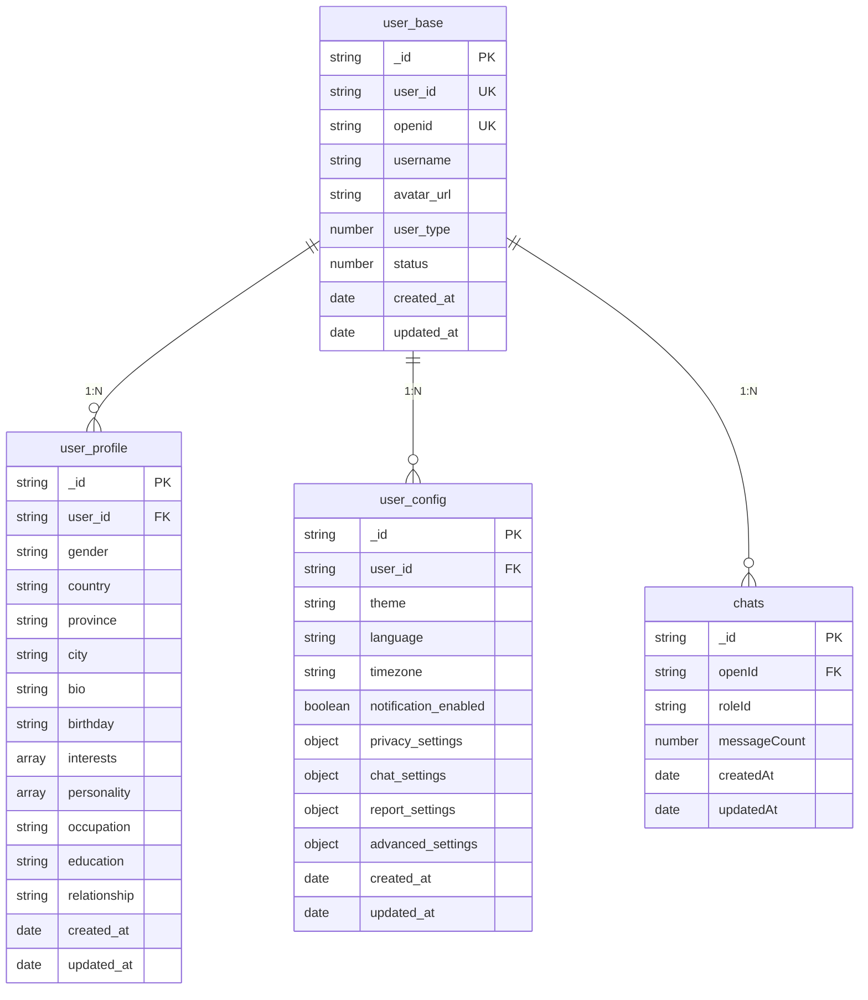
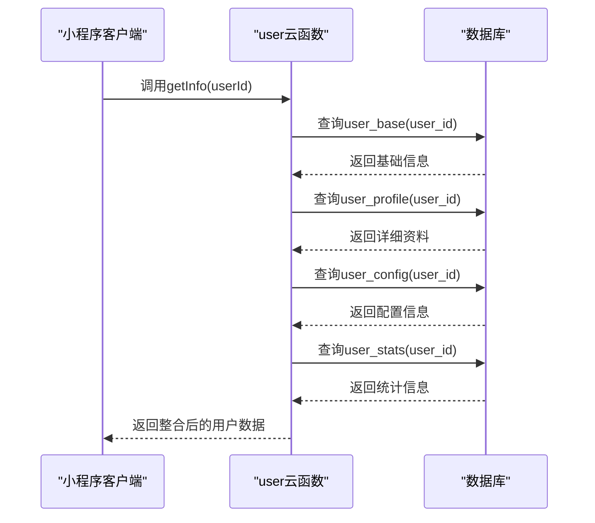

# user_base 集合

<cite>
**本文档中引用的文件**  
- [user_base.md](file://doc/开发文档/database/user_base.md)
- [user_profile.md](file://doc/开发文档/database/user_profile.md)
- [user_config.md](file://doc/开发文档/database/user_config.md)
- [index.js](file://cloudfunctions/user/index.js)
- [createIndexes.js](file://cloudfunctions/user/createIndexes.js)
</cite>

## 目录
1. [简介](#简介)
2. [集合结构](#集合结构)
3. [字段说明](#字段说明)
4. [关联关系](#关联关系)
5. [数据示例](#数据示例)
6. [常见查询场景](#常见查询场景)
7. [索引优化建议](#索引优化建议)
8. [数据安全策略](#数据安全策略)
9. [使用场景分析](#使用场景分析)
10. [云函数调用流程](#云函数调用流程)

## 简介
`user_base` 集合是 HeartChat 系统中的核心用户基础信息存储表，负责管理用户的身份标识、账户状态和基本属性。该集合作为用户数据的主表，与其他多个集合（如 `user_profile`、`user_config`）通过外键建立关联，支撑系统的认证、授权、个性化服务等关键功能。

**Section sources**
- [user_base.md](file://doc/开发文档/database/user_base.md#L1-L10)

## 集合结构
`user_base` 集合采用扁平化 JSON 结构设计，包含用户核心身份字段和状态控制字段，确保高效查询与一致性管理。

```javascript
{
  _id: "记录ID",                    // string, 主键，自动生成
  user_id: "用户ID",                // string, 7位数字用户ID，唯一标识
  openid: "微信openid",             // string, 微信用户唯一标识
  username: "用户名",                // string, 用户显示名称
  avatar_url: "头像URL",             // string, 用户头像图片地址
  user_type: 1,                     // number, 用户类型：1-普通用户，2-VIP用户，3-管理员
  status: 1,                        // number, 账户状态：1-启用，0-禁用
  created_at: "创建时间",            // date, 账户创建时间
  updated_at: "更新时间"             // date, 最后更新时间
}
```

**Section sources**
- [user_base.md](file://doc/开发文档/database/user_base.md#L15-L35)

## 字段说明
以下为 `user_base` 集合各字段的详细说明：

| 字段名 | 数据类型 | 业务含义 | 在认证授权中的作用 |
|--------|--------|--------|------------------|
| `_id` | string | 系统自动生成的主键 | 唯一标识记录，用于数据库操作 |
| `user_id` | string | 7位数字用户ID，系统内唯一 | 用户身份识别，用于跨服务调用 |
| `openid` | string | 微信平台用户唯一标识 | 第三方登录认证的核心凭证 |
| `username` | string | 用户显示名称 | 用户界面展示 |
| `avatar_url` | string | 用户头像地址 | 个性化展示 |
| `user_type` | number | 用户类型（1:普通, 2:VIP, 3:管理员） | 权限控制依据 |
| `status` | number | 账户状态（1:启用, 0:禁用） | 认证前置校验，决定是否允许登录 |
| `created_at` | date | 账户创建时间 | 用户生命周期分析 |
| `updated_at` | date | 最后更新时间 | 数据变更追踪 |

**Section sources**
- [user_base.md](file://doc/开发文档/database/user_base.md#L15-L35)

## 关联关系
`user_base` 集合通过 `user_id` 和 `openid` 字段与其他集合建立外键引用关系，形成以用户为中心的数据模型。



**Diagram sources**
- [user_base.md](file://doc/开发文档/database/user_base.md#L45-L55)
- [user_profile.md](file://doc/开发文档/database/user_profile.md#L15-L25)
- [user_config.md](file://doc/开发文档/database/user_config.md#L15-L25)

## 数据示例
```javascript
{
  "_id": "user_base_001",
  "user_id": "1234567",
  "openid": "oxxxxxxxxxxxxxxxx",
  "username": "张三",
  "avatar_url": "https://example.com/avatar.jpg",
  "user_type": 1,
  "status": 1,
  "created_at": "2025-01-01T10:00:00Z",
  "updated_at": "2025-01-01T12:00:00Z"
}
```

**Section sources**
- [user_base.md](file://doc/开发文档/database/user_base.md#L60-L75)

## 常见查询场景
### 通过 openid 查询用户是否存在
```javascript
db.collection('user_base')
  .where({ openid: 'oxxxxxxxxxxxxxxxx' })
  .get()
```
此查询用于用户首次登录时判断是否已注册，是认证流程的关键步骤。

### 获取用户完整信息（联合查询）
```javascript
// 1. 查询 user_base
const userBase = await db.collection('user_base').where({ user_id }).get();

// 2. 查询 user_profile
const userProfile = await db.collection('user_profile').where({ user_id }).get();

// 3. 查询 user_config
const userConfig = await db.collection('user_config').where({ user_id }).get();
```
该模式在用户进入主界面时使用，构建完整用户上下文。

**Section sources**
- [index.js](file://cloudfunctions/user/index.js#L15-L75)

## 索引优化建议
为提升查询性能，建议在以下字段上创建索引：

| 索引类型 | 字段 | 说明 |
|--------|------|------|
| 唯一索引 | `user_id` | 确保用户ID全局唯一 |
| 唯一索引 | `openid` | 防止重复注册，加速登录查询 |
| 单字段索引 | `user_type` | 加速用户类型筛选 |
| 单字段索引 | `status` | 快速过滤禁用账户 |
| 复合索引 | `user_type + status` | 支持按类型和状态组合查询 |

索引创建逻辑已在 `createIndexes.js` 中实现，部署时自动执行。

**Section sources**
- [user_base.md](file://doc/开发文档/database/user_base.md#L40-L45)
- [createIndexes.js](file://cloudfunctions/user/createIndexes.js#L1-L50)

## 数据安全策略
- **敏感字段加密**：当前 `user_base` 不存储密码等敏感信息，`openid` 为微信平台提供，无需额外加密。
- **访问控制**：所有对 `user_base` 的读写操作均通过云函数进行，前端无直接访问权限。
- **状态校验**：在认证流程中，强制检查 `status` 字段，禁用账户无法登录。
- **更新审计**：`updated_at` 字段记录每次变更时间，便于追踪数据修改。

**Section sources**
- [user_base.md](file://doc/开发文档/database/user_base.md#L80-L85)
- [index.js](file://cloudfunctions/user/index.js#L100-L150)

## 使用场景分析
`user_base` 集合主要应用于以下核心场景：
1. **用户认证**：通过 `openid` 快速定位用户，结合 `status` 判断账户可用性。
2. **权限管理**：根据 `user_type` 返回不同功能权限。
3. **用户标识**：`user_id` 作为系统内唯一标识，用于跨模块数据关联。
4. **账户管理**：支持管理员对用户状态进行启用/禁用操作。

**Section sources**
- [user_base.md](file://doc/开发文档/database/user_base.md#L57-L60)

## 云函数调用流程
用户信息获取流程通过 `user` 云函数统一处理，确保数据安全与一致性。



**Diagram sources**
- [index.js](file://cloudfunctions/user/index.js#L15-L75)