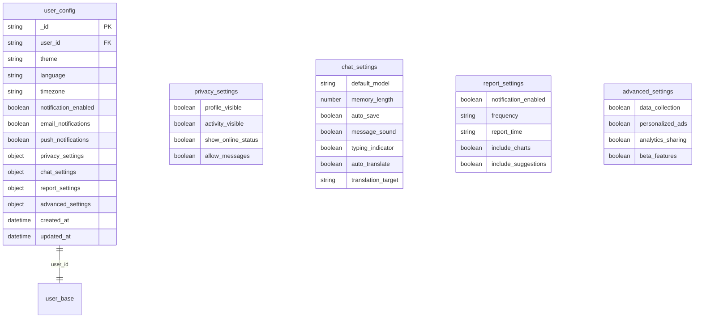
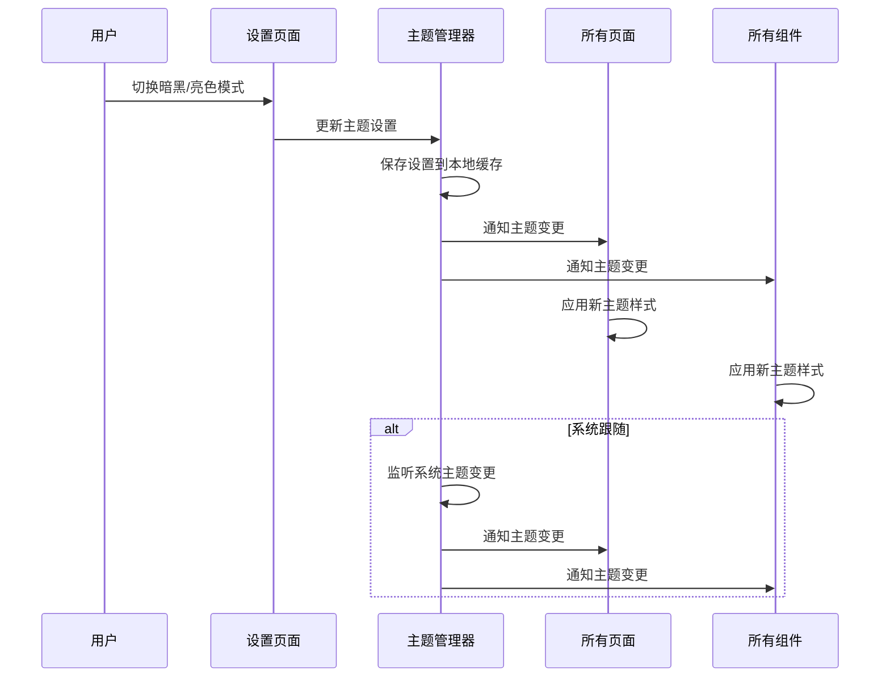

# user_config 集合

<cite>
**本文档引用文件**  
- [user_config.md](file://doc/开发文档/database/user_config.md)
- [index.js](file://cloudfunctions/user/index.js)
- [作品报告.md](file://doc/设计文档/作品报告v1.0/作品报告.md)
- [HeartChat用户界面流程图.md](file://doc/设计文档/流程图/HeartChat用户界面流程图.md)
- [theme.json](file://miniprogram/theme.json)
- [auth.js](file://miniprogram/utils/auth.js)
</cite>

## 目录
1. [简介](#简介)
2. [数据模型设计](#数据模型设计)
3. [配置项说明](#配置项说明)
4. [初始化与同步机制](#初始化与同步机制)
5. [前端渲染逻辑](#前端渲染逻辑)
6. [配置变更响应模式](#配置变更响应模式)
7. [注意事项](#注意事项)

## 简介
`user_config` 集合是 HeartChat 应用中用于存储用户个性化设置的核心数据表。该集合记录了用户在界面主题、通知偏好、默认角色选择、语音输入开关等方面的配置，为用户提供高度个性化的交互体验。通过灵活的键值对设计，系统能够轻松扩展新的配置项，并确保配置变更实时生效。本文档详细说明了该集合的数据结构、初始化逻辑、同步机制以及其在前端渲染中的应用。

**Section sources**
- [user_config.md](file://doc/开发文档/database/user_config.md)

## 数据模型设计
`user_config` 集合采用灵活的文档型数据结构，支持多维度的用户配置项。其核心字段包括用户ID、主题设置、语言偏好、通知开关、隐私控制等。集合通过 `user_id` 字段与 `user_base` 表建立一对一关联，确保每个用户拥有唯一的配置记录。



**Diagram sources**
- [user_config.md](file://doc/开发文档/database/user_config.md)

## 配置项说明
`user_config` 集合中的配置项按功能划分为多个类别，每个类别包含具体的配置字段。

### 主题设置
- **theme**：主题模式，可选值包括 `light`（浅色）、`dark`（深色）、`auto`（跟随系统）。
- **dark_mode**：暗黑模式开关，布尔值，用于控制界面颜色方案。

### 语言与区域
- **language**：语言设置，支持 `zh-CN`（简体中文）、`zh-TW`（繁体中文）、`en`（英语）、`ja`（日语）。
- **timezone**：时区设置，如 `Asia/Shanghai`。

### 通知管理
- **notification_enabled**：通知总开关。
- **email_notifications**：邮件通知开关。
- **push_notifications**：推送通知开关。

### 聊天设置
- **default_model**：默认AI模型，可选 `gemini`、`zhipu`、`openai`。
- **memory_length**：记忆长度，数值型，表示AI记忆的对话轮数。
- **auto_save**：自动保存聊天记录开关。

### 报告设置
- **frequency**：报告频率，可选 `daily`、`weekly`、`monthly`。
- **report_time**：报告推送时间，如 `20:00`。

**Section sources**
- [user_config.md](file://doc/开发文档/database/user_config.md)

## 初始化与同步机制
新用户注册时，系统会自动为其创建默认配置。当用户在不同设备上登录时，系统会从云端拉取其配置，确保跨设备体验的一致性。

### 配置初始化
在用户注册或首次登录时，`user` 云函数会检查 `user_config` 集合中是否存在该用户的配置记录。若不存在，则创建一条包含默认值的新记录。

```javascript
// 云函数中处理用户设置的逻辑
const configCheck = await db.collection('user_config').where({
  user_id: userId
}).count();

const configData = {
  user_id: userId,
  dark_mode: settings.darkMode,
  notification_enabled: settings.notificationEnabled,
  language: settings.language,
  updated_at: db.serverDate()
};

if (configCheck.total === 0) {
  // 创建新的用户设置
  await db.collection('user_config').add({
    data: {
      ...configData,
      created_at: db.serverDate()
    }
  });
} else {
  // 更新现有用户设置
  await db.collection('user_config').where({
    user_id: userId
  }).update({
    data: configData
  });
}
```

### 跨设备同步
用户在任意设备上修改配置后，变更会立即同步到云端。当用户在其他设备登录时，前端会调用 `getInfo` 云函数获取最新的配置信息，并应用到当前会话中。

**Section sources**
- [index.js](file://cloudfunctions/user/index.js)

## 前端渲染逻辑
前端通过 `theme.json` 和 `auth.js` 中的逻辑，将 `user_config` 中的配置应用于界面渲染，实现主题切换和个性化展示。

### 主题管理
`theme.json` 文件定义了亮色和暗色两套CSS变量。前端根据 `user_config` 中的 `theme` 字段，动态设置页面的 `data-theme` 属性，从而应用相应的样式。

```json
{
  "light": {
    "--bg-color": "#ffffff",
    "--text-color": "#000000"
  },
  "dark": {
    "--bg-color": "#121212",
    "--text-color": "#ffffff"
  }
}
```

### 状态管理
`auth.js` 中的 `ThemeManager` 负责管理主题状态。当用户在设置页面切换主题时，`ThemeManager` 会更新本地缓存，并通知所有页面和组件应用新主题。



**Diagram sources**
- [theme.json](file://miniprogram/theme.json)
- [auth.js](file://miniprogram/utils/auth.js)
- [HeartChat用户界面流程图.md](file://doc/设计文档/流程图/HeartChat用户界面流程图.md)

## 配置变更响应模式
系统采用事件驱动的模式响应配置变更，确保用户体验的一致性。

### 实时生效
配置变更后，系统通过事件总线通知所有订阅的页面和组件。前端组件监听主题变更事件，并重新渲染界面。

### 缓存与持久化
用户的配置不仅存储在云端，也在本地缓存（如 `wx.setStorageSync`），以提高加载速度和离线可用性。

### 错误处理
在配置同步过程中，系统会处理网络异常和数据不一致的情况，确保用户始终能获得可用的配置。

**Section sources**
- [auth.js](file://miniprogram/utils/auth.js)
- [作品报告.md](file://doc/设计文档/作品报告v1.0/作品报告.md)

## 注意事项
- 配置变更需要实时生效，确保用户操作的即时反馈。
- 敏感配置（如隐私设置）需要权限验证，防止未授权访问。
- 建议提供配置导入导出功能，方便用户迁移数据。
- 隐私设置需要特别保护，确保用户数据安全。

**Section sources**
- [user_config.md](file://doc/开发文档/database/user_config.md)