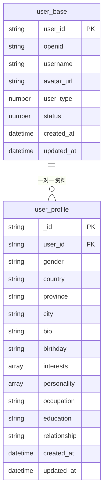
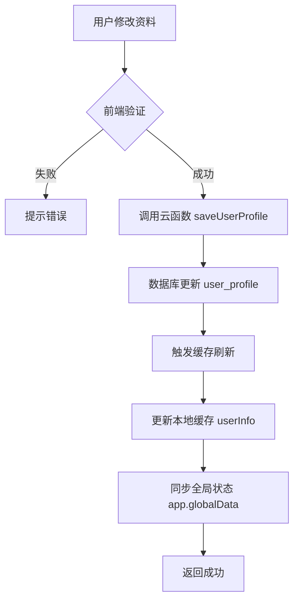
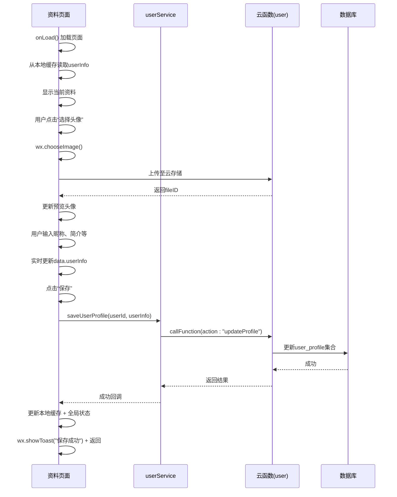
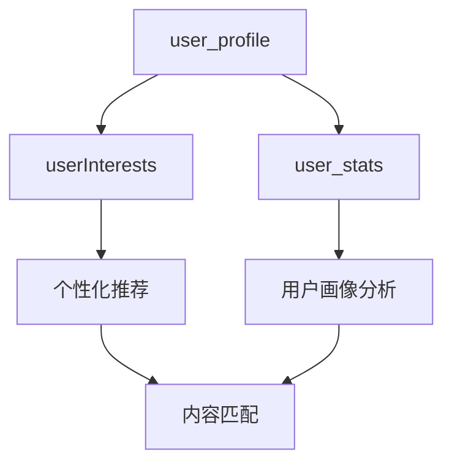

# user_profile 集合

<cite>
**本文档引用文件**  
- [user_profile.md](file://doc/开发文档/database/user_profile.md)
- [user_base.md](file://doc/开发文档/database/user_base.md)
- [userInterests.md](file://doc/开发文档/database/userInterests.md)
- [user_stats.md](file://doc/开发文档/database/user_stats.md)
- [profile.js](file://miniprogram/pages/user/profile/profile.js)
</cite>

## 目录
1. [简介](#简介)
2. [数据结构与字段说明](#数据结构与字段说明)
3. [与 user_base 的关系及解耦设计](#与-user_base-的关系及解耦设计)
4. [字段验证规则](#字段验证规则)
5. [更新策略与缓存机制](#更新策略与缓存机制)
6. [访问权限控制](#访问权限控制)
7. [前端交互流程示例](#前端交互流程示例)
8. [与其他集合的数据联动](#与其他集合的数据联动)
9. [索引与性能优化建议](#索引与性能优化建议)
10. [注意事项与最佳实践](#注意事项与最佳实践)

## 简介

`user_profile` 集合用于存储用户的可变个人资料信息，包括昵称、头像 URL、性别、年龄、个性签名等非认证类属性。该集合的设计目标是实现用户资料的灵活管理与个性化服务支持，同时通过与 `user_base` 集合的解耦设计，确保资料更新不影响核心账户系统稳定性。

该集合广泛应用于用户资料展示、个性化推荐、用户画像构建等场景，是 HeartChat 系统中实现情感分析、兴趣匹配和角色互动的重要数据基础。

**Section sources**
- [user_profile.md](file://doc/开发文档/database/user_profile.md#L1-L10)

## 数据结构与字段说明

```javascript
{
  _id: "记录ID",                    // string, 主键，自动生成
  user_id: "用户ID",                 // string, 关联user_base表
  gender: "性别",                    // string, 性别：男/女/保密
  country: "国家",                  // string, 国家
  province: "省份",                  // string, 省份
  city: "城市",                      // string, 城市
  bio: "个人简介",                   // string, 个人简介/签名
  birthday: "生日",                  // string, 生日 YYYY-MM-DD
  interests: ["兴趣1", "兴趣2"],    // array, 兴趣爱好列表
  personality: ["性格特点1", "性格特点2"], // array, 性格特点列表
  occupation: "职业",                // string, 职业信息
  education: "教育程度",             // string, 教育背景
  relationship: "情感状态",          // string, 情感状态
  created_at: "创建时间",            // date, 资料创建时间
  updated_at: "更新时间"             // date, 资料更新时间
}
```

### 核心字段说明
- **user_id**: 外键，关联 `user_base` 表，确保一对一关系
- **gender**: 支持“男”、“女”、“保密”三个选项
- **birthday**: 日期格式为 YYYY-MM-DD，用于动态计算年龄
- **bio**: 个人简介字段，支持 emoji 和特殊字符，最大长度建议 200 字符
- **interests**: 用户自述的兴趣标签数组，用于后续推荐系统
- **personality**: 性格特征数组，由系统分析生成或用户自定义
- **updated_at**: 每次更新自动刷新，用于缓存失效判断

**Section sources**
- [user_profile.md](file://doc/开发文档/database/user_profile.md#L12-L81)

## 与 user_base 的关系及解耦设计

`user_profile` 与 `user_base` 呈现严格的一对一关系，通过 `user_id` 字段进行关联：



**Diagram sources**
- [user_base.md](file://doc/开发文档/database/user_base.md#L12-L75)
- [user_profile.md](file://doc/开发文档/database/user_profile.md#L12-L81)

### 解耦设计目的
1. **独立更新**：用户可频繁修改资料而不影响核心认证信息
2. **性能优化**：登录时仅需加载 `user_base`，减少 I/O 开销
3. **权限分离**：敏感信息（如 openid）与公开资料分离
4. **扩展性**：便于未来增加更多个性化字段而无需改动主表结构

**Section sources**
- [user_base.md](file://doc/开发文档/database/user_base.md#L50-L75)
- [user_profile.md](file://doc/开发文档/database/user_profile.md#L60-L81)

## 字段验证规则

| 字段 | 类型 | 验证规则 | 错误提示 |
|------|------|---------|--------|
| **nickName** | string | 长度 1-20，不能为空，仅允许中文、英文、数字及常见符号 | “昵称不能为空” 或 “昵称长度超出限制” |
| **gender** | string | 必须为“男”、“女”、“保密”之一 | “性别选项无效” |
| **age** | number | 范围 1-120 | “年龄必须在1-120之间” |
| **bio** | string | 最大长度 200 字符 | “个性签名过长，请控制在200字以内” |
| **avatar_url** | string | 必须为有效 URL 或云存储 fileID | “头像地址格式错误” |

前端在提交前进行初步校验，后端云函数再次验证以确保数据一致性。

**Section sources**
- [profile.js](file://miniprogram/pages/user/profile/profile.js#L29-L38)
- [user_profile.md](file://doc/开发文档/database/user_profile.md#L70-L81)

## 更新策略与缓存机制

### 更新流程


**Diagram sources**
- [profile.js](file://miniprogram/pages/user/profile/profile.js#L580-L636)

### 头像变更缓存刷新机制
当用户更新头像时：
1. 上传新图片至云存储，获取 `fileID`
2. 将 `fileID` 存入 `user_profile.avatar_url`（而非临时 URL）
3. 调用 `wx.cloud.getTempFileURL` 获取可访问链接
4. 更新本地缓存 `userInfo` 和全局状态
5. 触发所有引用头像的页面重新渲染

此机制确保头像变更即时生效且避免临时链接过期问题。

**Section sources**
- [profile.js](file://miniprogram/pages/user/profile/profile.js#L300-L400)

## 访问权限控制

| 操作 | 允许主体 | 验证方式 | 说明 |
|------|----------|----------|------|
| 读取自身资料 | 当前用户 | 登录态验证 | 可读全部字段 |
| 更新自身资料 | 当前用户 | 登录态 + user_id 匹配 | 仅允许修改非敏感字段 |
| 读取他人资料 | 所有用户 | 匿名访问 | 仅返回公开字段（昵称、头像、个性签名） |
| 管理员访问 | 管理员账号 | user_type === 3 | 可查看完整资料用于审核 |

所有操作均通过云函数代理访问数据库，禁止前端直接操作集合。

**Section sources**
- [profile.js](file://miniprogram/pages/user/profile/profile.js#L580-L636)
- [user_base.md](file://doc/开发文档/database/user_base.md#L60-L75)

## 前端交互流程示例

### 资料编辑页面典型流程


**Diagram sources**
- [profile.js](file://miniprogram/pages/user/profile/profile.js#L580-L636)

**Section sources**
- [profile.js](file://miniprogram/pages/user/profile/profile.js#L1-L636)

## 与其他集合的数据联动

### 与 userInterests 的联动
- **数据来源**：用户在聊天中提及的关键词由 `analysis` 云函数提取并写入 `userInterests`
- **同步机制**：定期将 `userInterests.keywords` 中高频词同步至 `user_profile.interests`
- **用途**：在个人资料页展示“您的兴趣标签”，增强个性化体验

### 与 user_stats 的联动
- **活跃度反馈**：每次资料更新计入 `user_stats.active_days`
- **行为分析**：统计资料完整度与用户留存率的相关性
- **激励机制**：资料完整度达 80% 以上解锁成就徽章



**Diagram sources**
- [userInterests.md](file://doc/开发文档/database/userInterests.md#L1-L121)
- [user_stats.md](file://doc/开发文档/database/user_stats.md#L1-L117)

**Section sources**
- [userInterests.md](file://doc/开发文档/database/userInterests.md#L1-L121)
- [user_stats.md](file://doc/开发文档/database/user_stats.md#L1-L117)

## 索引与性能优化建议

### 推荐索引
- **唯一索引**：`user_id`（确保一对一关系）
- **单字段索引**：`gender`、`country`（用于筛选）
- **复合索引**：`province + city`（地域分析）
- **文本索引**：`bio`、`interests`（支持全文搜索）

### 查询优化建议
1. 分页查询时使用 `updated_at` 排序以提高缓存命中率
2. 高频读取场景使用本地缓存 + 时间戳比对机制
3. 批量操作避免全表扫描，优先通过 `user_id` 查询

**Section sources**
- [user_profile.md](file://doc/开发文档/database/user_profile.md#L40-L50)

## 注意事项与最佳实践

1. **隐私保护**：`user_profile` 包含敏感信息，需遵守 GDPR 等隐私法规
2. **资料完整度评分**：建议实现资料完整度计算功能（如字段填写率），激励用户完善信息
3. **默认值处理**：新建用户时应初始化默认资料（如“保密”性别、“未设置”简介）
4. **历史版本管理**：重要字段变更建议记录审计日志
5. **前端一致性**：确保 `nickName` 与 `username` 在所有模块中保持一致

通过合理使用该集合，可显著提升 HeartChat 的个性化服务能力与用户体验。

**Section sources**
- [user_profile.md](file://doc/开发文档/database/user_profile.md#L75-L81)
- [profile.js](file://miniprogram/pages/user/profile/profile.js#L150-L180)