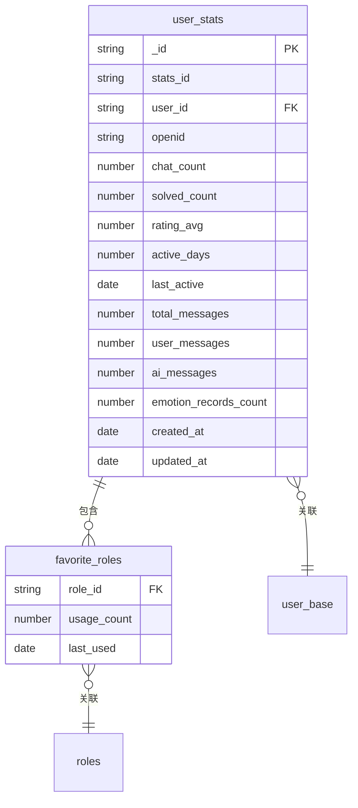
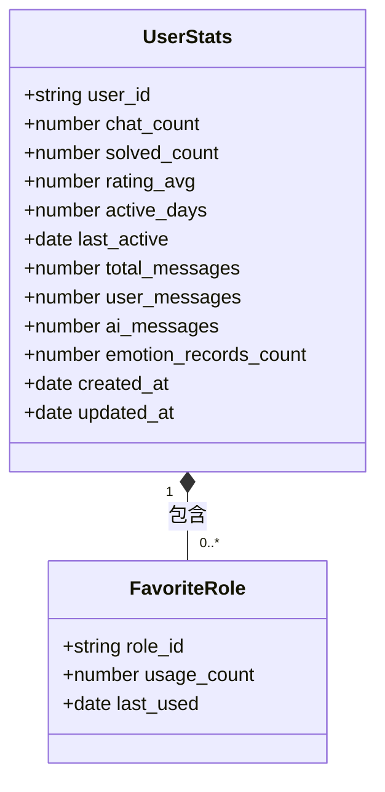
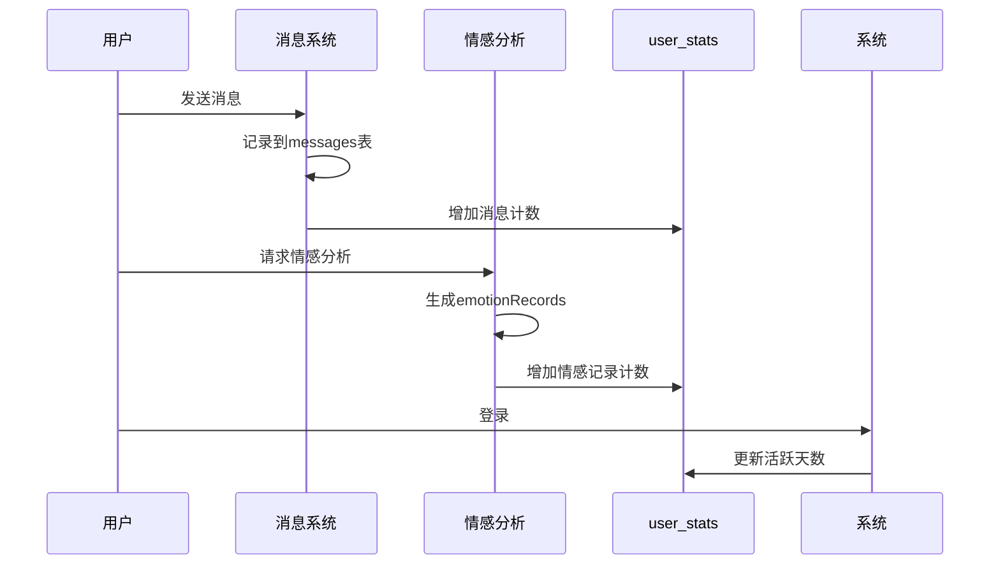
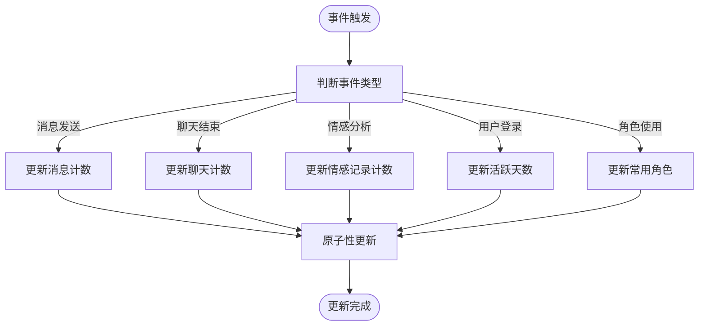
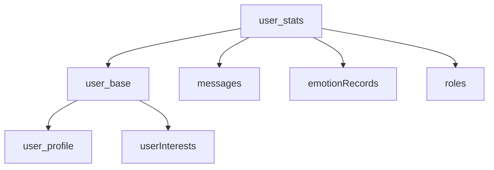

# user_stats 集合

<cite>
**本文档引用文件**  
- [user_stats.md](file://doc/开发文档/database/user_stats.md)
- [emotionRecords.md](file://doc/开发文档/database/emotionRecords.md)
- [messages.md](file://doc/开发文档/database/messages.md)
- [analysis.md](file://doc/开发文档/cloudfunctions/analysis.md)
- [generateDailyReports.md](file://doc/开发文档/cloudfunctions/generateDailyReports.md)
- [userInterests.md](file://doc/开发文档/database/userInterests.md)
- [user_base.md](file://doc/开发文档/database/user_base.md)
- [user_profile.md](file://doc/开发文档/database/user_profile.md)
</cite>

## 目录
1. [简介](#简介)
2. [集合结构](#集合结构)
3. [核心统计指标](#核心统计指标)
4. [数据计算与更新机制](#数据计算与更新机制)
5. [增量更新策略](#增量更新策略)
6. [关联数据源](#关联数据源)
7. [应用场景](#应用场景)
8. [前端对接](#前端对接)
9. [性能优化建议](#性能优化建议)
10. [结论](#结论)

## 简介
`user_stats` 集合是 HeartChat 系统中的核心用户行为统计模块，用于存储和管理用户的量化行为数据。该集合通过聚合来自聊天消息、情感分析记录等原始数据，生成用户活跃度、互动频率、情绪趋势等关键指标。这些统计数据不仅为用户成就系统提供支持，还为产品优化决策和用户行为分析提供数据基础。本文档详细描述了 `user_stats` 集合的设计、计算逻辑、更新策略及其在系统中的作用。

## 集合结构
`user_stats` 集合的字段结构设计旨在全面反映用户的交互行为和偏好。集合包含基础指标、消息统计、情感记录和角色使用偏好等多维度数据。

**Diagram sources**
- [user_stats.md](file://doc/开发文档/database/user_stats.md)

**Section sources**
- [user_stats.md](file://doc/开发文档/database/user_stats.md)

## 核心统计指标
`user_stats` 集合包含多种核心统计指标，分为基础指标、消息指标和偏好指标三大类。

### 基础指标
- **chat_count**：用户发起的聊天会话总数
- **solved_count**：成功解决的问题数量
- **rating_avg**：用户对服务的平均评分（0-5分）
- **active_days**：用户活跃的天数（去重计算）

### 消息指标
- **total_messages**：用户发送和接收的消息总数
- **user_messages**：用户发送的消息数量
- **ai_messages**：AI回复的消息数量
- **emotion_records_count**：情感分析记录数量

### 偏好指标
- **favorite_roles**：用户常用的角色列表，包含角色ID、使用次数和最后使用时间

**Diagram sources**
- [user_stats.md](file://doc/开发文档/database/user_stats.md)

**Section sources**
- [user_stats.md](file://doc/开发文档/database/user_stats.md)

## 数据计算与更新机制
`user_stats` 集合的数据来源于原始数据表 `messages` 和 `emotionRecords`，通过实时事件驱动的方式进行增量更新，避免全量重计算带来的性能开销。

### 数据来源
- **messages 表**：提供消息数量、聊天会话等数据
- **emotionRecords 表**：提供情感分析记录数量和情绪波动指数

### 更新触发条件
1. **用户登录**：更新 `active_days` 和 `last_active`
2. **发送消息**：更新 `total_messages`、`user_messages` 或 `ai_messages`
3. **聊天结束**：更新 `chat_count`
4. **评分事件**：更新 `rating_avg`
5. **角色使用**：更新 `favorite_roles` 列表

**Diagram sources**
- [messages.md](file://doc/开发文档/database/messages.md)
- [emotionRecords.md](file://doc/开发文档/database/emotionRecords.md)
- [analysis.md](file://doc/开发文档/cloudfunctions/analysis.md)

**Section sources**
- [messages.md](file://doc/开发文档/database/messages.md)
- [emotionRecords.md](file://doc/开发文档/database/emotionRecords.md)
- [analysis.md](file://doc/开发文档/cloudfunctions/analysis.md)

## 增量更新策略
为避免全量重计算带来的性能瓶颈，`user_stats` 集合采用增量更新策略，通过事件监听和原子操作确保数据一致性。

### 增量更新流程

### 原子操作实现
使用数据库的原子操作（如 MongoDB 的 `$inc`、`$addToSet`）确保并发环境下的数据一致性：
- 消息计数使用 `$inc` 进行原子递增
- 活跃天数使用 `$addToSet` 确保日期去重
- 常用角色使用 `$addToSet` 和 `$inc` 组合更新

**Section sources**
- [user_stats.md](file://doc/开发文档/database/user_stats.md)
- [analysis.md](file://doc/开发文档/cloudfunctions/analysis.md)

## 关联数据源
`user_stats` 集合与多个数据源存在关联关系，形成完整的用户行为分析体系。

### 主要关联表
- **user_base**：通过 `user_id` 关联，获取用户基础信息
- **messages**：通过 `user_id` 关联，获取消息交互数据
- **emotionRecords**：通过 `userId` 关联，获取情感分析数据
- **roles**：通过 `role_id` 关联，获取角色使用偏好

**Diagram sources**
- [user_base.md](file://doc/开发文档/database/user_base.md)
- [user_profile.md](file://doc/开发文档/database/user_profile.md)
- [userInterests.md](file://doc/开发文档/database/userInterests.md)

**Section sources**
- [user_base.md](file://doc/开发文档/database/user_base.md)
- [user_profile.md](file://doc/开发文档/database/user_profile.md)
- [userInterests.md](file://doc/开发文档/database/userInterests.md)

## 应用场景
`user_stats` 集合在系统中扮演着重要角色，支持多种核心功能。

### 用户成就系统
基于 `chat_count`、`active_days` 等指标，实现用户等级、成就徽章等功能。

### 活跃度分析
通过 `active_days`、`last_active` 等字段，分析用户留存率和活跃趋势。

### 产品优化决策
利用 `rating_avg`、`solved_count` 等数据，评估功能使用效果和用户满意度。

### 个性化推荐
结合 `favorite_roles` 和 `userInterests`，提供个性化角色推荐。

**Section sources**
- [user_stats.md](file://doc/开发文档/database/user_stats.md)
- [userInterests.md](file://doc/开发文档/database/userInterests.md)

## 前端对接
`user_stats` 集合与前端 stats 可视化组件直接对接，提供实时数据展示。

### 数据接口
- **GET /api/user/stats**：获取当前用户统计信息
- **GET /api/user/stats/rank**：获取用户排名数据

### 可视化组件
- 活跃度日历：基于 `active_days` 数据
- 消息统计图表：基于 `total_messages`、`user_messages` 等
- 情绪趋势图：结合 `emotion_records_count` 和情感分析数据

**Section sources**
- [user_stats.md](file://doc/开发文档/database/user_stats.md)

## 性能优化建议
为确保 `user_stats` 集合的高性能运行，建议采取以下优化措施。

### 索引策略
- 为 `user_id` 创建唯一索引
- 为 `openid` 创建单字段索引
- 为 `chat_count` 和 `updated_at` 创建复合索引
- 为 `active_days` 和 `updated_at` 创建复合索引

### 归档策略
- 定期归档历史统计数据
- 对超过一定时间的记录进行压缩存储
- 保留最近90天的详细数据，历史数据聚合为月度统计

**Section sources**
- [user_stats.md](file://doc/开发文档/database/user_stats.md)

## 结论
`user_stats` 集合作为 HeartChat 系统的核心统计模块，通过高效的增量更新策略和合理的数据结构设计，实现了用户行为数据的实时聚合与分析。该集合不仅支持用户成就系统和活跃度分析，还为产品优化和个性化推荐提供了数据基础。通过与前端可视化组件的无缝对接，为用户提供了直观的数据反馈，增强了用户体验。