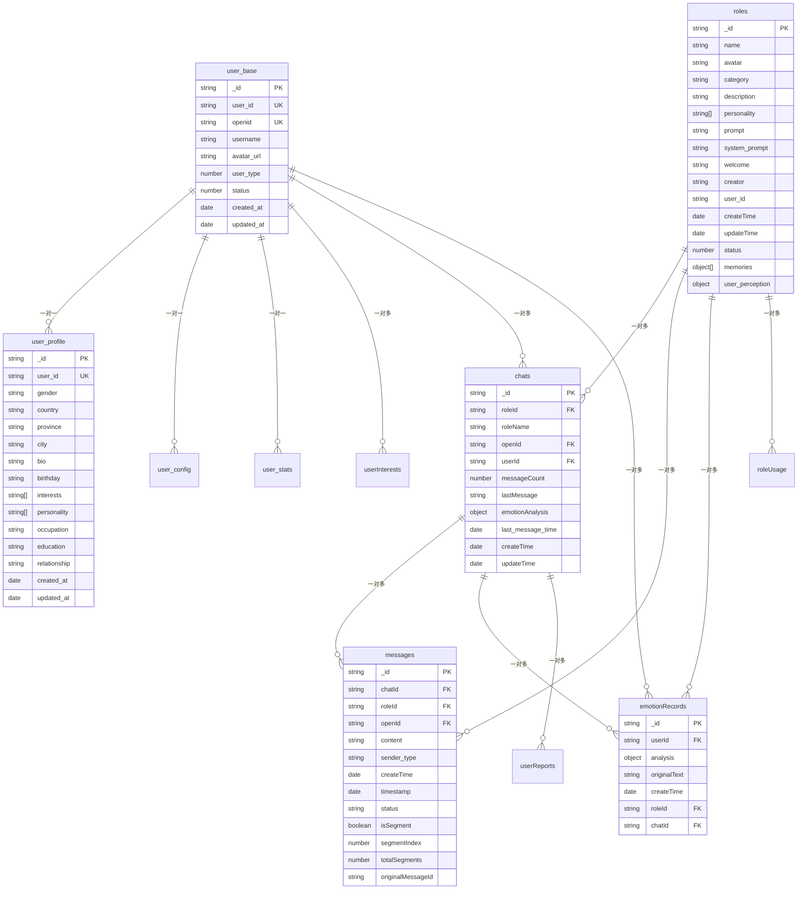

# 集合结构

<cite>
**本文档引用的文件**  
- [user_base.md](file://doc/开发文档/database/user_base.md)
- [user_profile.md](file://doc/开发文档/database/user_profile.md)
- [user_config.md](file://doc/开发文档/database/user_config.md)
- [chats.md](file://doc/开发文档/database/chats.md)
- [messages.md](file://doc/开发文档/database/messages.md)
- [emotionRecords.md](file://doc/开发文档/database/emotionRecords.md)
- [roles.md](file://doc/开发文档/database/roles.md)
- [userInterests.md](file://doc/开发文档/database/userInterests.md)
- [userReports.md](file://doc/开发文档/database/userReports.md)
- [user_stats.md](file://doc/开发文档/database/user_stats.md)
- [roleUsage.md](file://doc/开发文档/database/roleUsage.md)
- [model-config.md](file://doc/开发文档/database/model-config.md)
</cite>

## 目录
1. [简介](#简介)
2. [核心集合结构](#核心集合结构)
3. [实体关系与数据流](#实体关系与数据流)
4. [集合使用指南](#集合使用指南)
5. [索引与性能建议](#索引与性能建议)
6. [数据隐私与安全](#数据隐私与安全)

## 简介
HeartChat项目采用云数据库存储用户交互、心理状态分析与个性化配置等关键数据。本文档旨在为后端开发者与数据分析师提供清晰的集合结构说明，涵盖`user_base`、`user_profile`、`user_config`、`chats`、`messages`、`emotionRecords`、`roles`、`userInterests`、`userReports`、`user_stats`、`roleUsage`和`model-config`等核心集合。通过字段设计、关联关系与业务场景的详细解析，帮助团队高效使用数据资源，支持系统功能开发与用户行为分析。

## 核心集合结构

### user_base（用户基本信息）
存储用户的基础账户信息，包括唯一标识、用户名、头像及账户状态。

**字段说明**：
- `_id`：主键，自动生成
- `user_id`：7位数字用户ID，系统内唯一
- `openid`：微信用户唯一标识
- `username`：用户显示名称
- `avatar_url`：头像图片地址
- `user_type`：用户类型（1-普通，2-VIP，3-管理员）
- `status`：账户状态（1-启用，0-禁用）

**使用场景**：用户认证、身份识别、权限控制。

**Section sources**
- [user_base.md](file://doc/开发文档/database/user_base.md#L1-L75)

### user_profile（用户档案）
存储用户的详细个人信息，用于个性化服务与用户画像构建。

**字段说明**：
- `gender`：性别（男/女/保密）
- `country`、`province`、`city`：地理位置信息
- `bio`：个人简介
- `birthday`：生日（YYYY-MM-DD）
- `interests`、`personality`：兴趣与性格特点列表

**使用场景**：资料管理、地域化服务、推荐系统。

**Section sources**
- [user_profile.md](file://doc/开发文档/database/user_profile.md#L1-L81)

### user_config（用户配置）
存储用户的个性化设置，涵盖界面、通知、隐私与聊天偏好。

**字段说明**：
- `theme`：主题（light/dark/auto）
- `language`：语言设置
- `privacy_settings`：隐私控制对象
- `chat_settings`：聊天相关配置（如默认模型、记忆长度）
- `report_settings`：报告推送频率与时间

**使用场景**：个性化体验、功能偏好管理、通知策略。

**Section sources**
- [user_config.md](file://doc/开发文档/database/user_config.md#L1-L156)

### chats（聊天会话）
记录用户与AI角色的会话元数据，支持会话列表展示与上下文恢复。

**字段说明**：
- `roleId`、`roleName`：关联角色信息
- `openId`、`userId`：用户标识
- `messageCount`：消息总数
- `lastMessage`：最后消息内容
- `emotionAnalysis`：情感分析摘要
- `last_message_time`：最后消息时间戳

**使用场景**：会话管理、历史记录预览、情感趋势追踪。

**Section sources**
- [chats.md](file://doc/开发文档/database/chats.md#L1-L67)

### messages（消息记录）
存储聊天中的每一条消息，支持分段发送与状态跟踪。

**字段说明**：
- `content`：消息文本
- `sender_type`：发送者类型（user/ai）
- `status`：发送状态（sent/sending/failed）
- `isSegment`、`segmentIndex`、`totalSegments`：分段消息控制
- `originalMessageId`：完整消息ID，用于分段关联

**使用场景**：消息历史、上下文构建、分段输出管理。

**Section sources**
- [messages.md](file://doc/开发文档/database/messages.md#L1-L89)

### emotionRecords（情绪记录）
存储详细的情感分析结果，用于心理健康监控与报告生成。

**字段说明**：
- `analysis.type`：主要情感类型（喜悦、焦虑等）
- `intensity`、`valence`、`arousal`：情感强度与维度
- `radar_dimensions`：信任度、开放度、压力度等雷达图维度
- `topic_keywords`、`emotion_triggers`：关键词与触发因素
- `suggestions`：改善建议

**使用场景**：情绪历史分析、心理状态监控、个性化建议。

**Section sources**
- [emotionRecords.md](file://doc/开发文档/database/emotionRecords.md#L1-L111)

### roles（角色定义）
存储AI角色的完整信息，包括提示词、性格、记忆与用户画像。

**字段说明**：
- `name`、`avatar`、`category`：角色基础信息
- `prompt`、`system_prompt`：对话提示词
- `memories`：角色记忆数组（最多50条）
- `user_perception`：用户画像（兴趣、偏好、沟通风格）

**使用场景**：角色管理、AI行为配置、长期记忆支持。

**Section sources**
- [roles.md](file://doc/开发文档/database/roles.md#L1-L123)

### userInterests（用户兴趣）
存储用户兴趣标签，支持兴趣图谱构建与内容推荐。

**使用场景**：兴趣分析、个性化推荐、用户分群。

**Section sources**
- [userInterests.md](file://doc/开发文档/database/userInterests.md#L1-L30)

### userReports（每日报告）
存储系统生成的每日心情报告，包含情绪总结与建议。

**使用场景**：报告查看、情绪趋势分析、用户反馈收集。

**Section sources**
- [userReports.md](file://doc/开发文档/database/userReports.md#L1-L25)

### user_stats（用户统计）
存储用户行为统计数据，如活跃度、使用时长、消息数量等。

**使用场景**：用户行为分析、产品优化、运营决策。

**Section sources**
- [user_stats.md](file://doc/开发文档/database/user_stats.md#L1-L20)

### roleUsage（角色使用记录）
记录用户与各AI角色的互动频率与使用时长。

**使用场景**：角色受欢迎度分析、功能优化、用户偏好研究。

**Section sources**
- [roleUsage.md](file://doc/开发文档/database/roleUsage.md#L1-L22)

### model-config（模型配置）
存储AI模型的参数配置，如温度、top_p、最大输出长度等。

**使用场景**：模型调优、多模型切换、性能监控。

**Section sources**
- [model-config.md](file://doc/开发文档/database/model-config.md#L1-L18)

## 实体关系与数据流

**Diagram sources**
- [user_base.md](file://doc/开发文档/database/user_base.md#L1-L75)
- [user_profile.md](file://doc/开发文档/database/user_profile.md#L1-L81)
- [chats.md](file://doc/开发文档/database/chats.md#L1-L67)
- [messages.md](file://doc/开发文档/database/messages.md#L1-L89)
- [emotionRecords.md](file://doc/开发文档/database/emotionRecords.md#L1-L111)
- [roles.md](file://doc/开发文档/database/roles.md#L1-L123)

## 集合使用指南

### 数据写入流程
1. **用户注册**：创建`user_base`记录，同步生成`user_profile`、`user_config`、`user_stats`
2. **开始聊天**：创建`chats`记录，关联`roles`与`user_base`
3. **发送消息**：写入`messages`，更新`chats.messageCount`与`lastMessage`
4. **情感分析**：`analysis`云函数处理消息，生成`emotionRecords`
5. **生成报告**：定时任务汇总`emotionRecords`，生成`userReports`

### 查询优化建议
- 使用`openId`或`user_id`作为主要查询键
- 时间范围查询优先使用`createTime`索引
- 情感类型筛选使用`emotionRecords.analysis.type`索引
- 角色使用分析结合`roleUsage`与`chats`进行聚合

## 索引与性能建议

### 推荐索引
| 集合 | 索引字段 | 类型 | 用途 |
|------|--------|------|------|
| user_base | user_id | 唯一索引 | 用户查找 |
| user_base | openid | 唯一索引 | 登录认证 |
| chats | openId + roleId + updateTime | 复合索引 | 会话列表查询 |
| messages | chatId + createTime | 复合索引 | 消息历史加载 |
| emotionRecords | userId + createTime | 复合索引 | 情绪历史分析 |
| roles | category | 单字段索引 | 角色分类筛选 |

### 性能优化
- 定期归档超过6个月的`messages`与`emotionRecords`
- 对高频查询字段建立覆盖索引
- 避免在`messages.content`上进行全文搜索，建议使用专用搜索服务
- `user_perception`等大对象字段可考虑分离存储

## 数据隐私与安全
- 所有用户敏感信息（如`user_profile`、`emotionRecords`）需加密存储
- 访问控制基于`user_id`与`openid`进行权限验证
- 日志记录所有敏感数据访问行为
- 提供数据导出与删除接口，符合GDPR要求