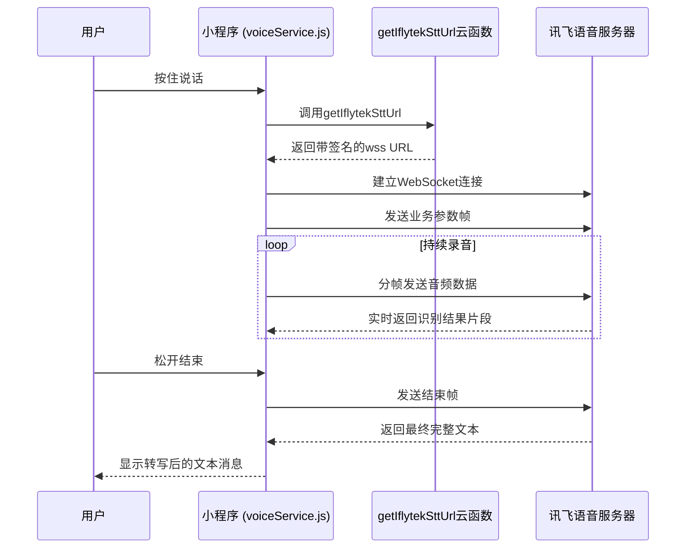
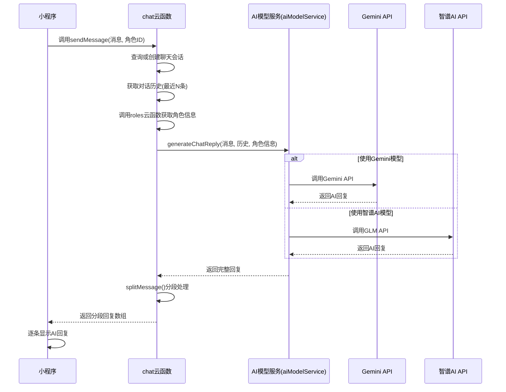
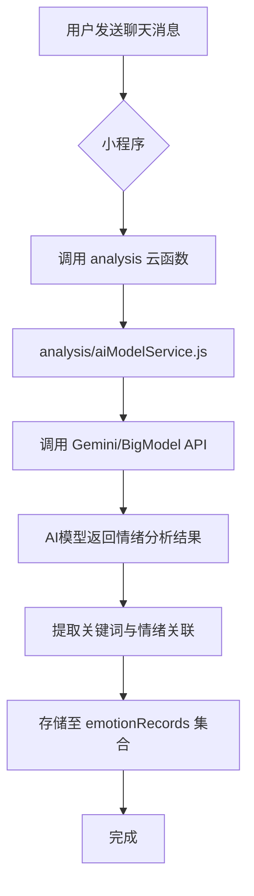
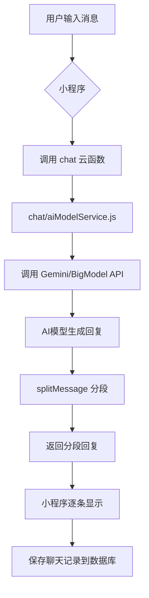

# 数据流

<cite>
**本文档中引用的文件**  
- [voiceService.js](file://miniprogram/services/voiceService.js)
- [getIflytekSttUrl/index.js](file://cloudfunctions/getIflytekSttUrl/index.js)
- [chat/index.js](file://cloudfunctions/chat/index.js)
- [chat/aiModelService.js](file://cloudfunctions/chat/aiModelService.js)
- [analysis/index.js](file://cloudfunctions/analysis/index.js)
- [analysis/aiModelService.js](file://cloudfunctions/analysis/aiModelService.js)
- [getEmotionRecords/index.js](file://cloudfunctions/getEmotionRecords/index.js)
- [generateDailyReports/index.js](file://cloudfunctions/generateDailyReports/index.js)
</cite>

## 目录
1. [引言](#引言)
2. [核心数据流动路径](#核心数据流动路径)
3. [语音识别数据流](#语音识别数据流)
4. [AI对话生成流程](#ai对话生成流程)
5. [情绪分析与存储流程](#情绪分析与存储流程)
6. [每日报告生成流程](#每日报告生成流程)
7. [第三方API调用流程](#第三方api调用流程)
8. [关键场景数据流转图示](#关键场景数据流转图示)

## 引言
HeartChat系统是一个集成了语音识别、AI对话、情绪分析与个性化报告生成的智能心理健康助手。本系统通过小程序前端与云函数后端协同工作，实现从用户输入到智能反馈的完整闭环。数据在用户端、前端服务层、云函数及第三方AI服务之间高效流转，支撑起角色对话、情感分析、语音转写和每日心情报告等核心功能。本文将详细解析HeartChat系统中关键数据流的完整路径，涵盖从用户输入到AI响应、情绪分析、数据存储及报告生成的全过程。

## 核心数据流动路径
HeartChat系统的核心数据流始于用户在小程序端的输入行为，无论是文本聊天还是语音消息，数据均通过前端服务层封装后，经由微信云开发平台调用相应的云函数API。聊天消息被`chat`云函数接收后，调用集成的AI模型服务（如Gemini或智谱AI）生成回复，并将完整的对话记录持久化至云数据库。与此同时，用户的聊天内容会被`analysis`云函数捕获，用于执行深度情绪分析，分析结果连同关键词被存储为情绪记录。用户后续可通过`getEmotionRecords`云函数查询历史情绪数据，这些数据最终由`generateDailyReports`云函数聚合，生成个性化的`daily-report`。整个流程形成了“输入-处理-分析-存储-反馈”的完整数据闭环。

**Section sources**
- [chat/index.js](file://cloudfunctions/chat/index.js#L0-L1413)
- [analysis/index.js](file://cloudfunctions/analysis/index.js#L0-L100)
- [getEmotionRecords/index.js](file://cloudfunctions/getEmotionRecords/index.js#L0-L50)
- [generateDailyReports/index.js](file://cloudfunctions/generateDailyReports/index.js#L0-L80)

## 语音识别数据流
当用户在小程序中使用语音输入功能时，`voiceService.js`服务模块被激活。该模块首先通过`getIflytekSttUrl`云函数获取一个安全的WebSocket URL。此云函数利用环境变量中的讯飞API密钥、密钥和APPID，按照讯飞开放平台的WebAPI 2.0协议，通过HMAC-SHA256算法生成签名，拼接出可授权访问的`wss://iat-api.xfyun.cn`连接地址。前端获取该URL后，建立WebSocket连接，并通过小程序的录音管理器实时捕获音频流。音频数据被分帧（`onFrameRecorded`事件）并立即通过WebSocket发送至讯飞服务器。讯飞服务器返回的识别结果（JSON格式）包含在`onMessage`事件中，前端解析后提取文本内容，并通过回调函数将最终的文本消息传递给聊天界面，完成从语音到文字的转换。

**Diagram sources**
- [voiceService.js](file://miniprogram/services/voiceService.js#L0-L485)
- [getIflytekSttUrl/index.js](file://cloudfunctions/getIflytekSttUrl/index.js#L0-L69)

## AI对话生成流程
用户发送的聊天消息（无论是文本还是转写后的语音）通过`cloud.callFunction`被发送至`chat`云函数。该云函数的`generateAIReply`子功能负责核心的AI响应生成。它首先从`roles`云函数获取当前对话角色的详细信息（`roleInfo`），包括角色的提示词（prompt）。然后，`chat`云函数调用其内部的`aiModelService.js`模块，该模块作为统一的AI模型服务接口，根据请求中指定的`modelType`（如`gemini`）选择相应的模型服务（`geminiModel.js`或`bigmodel.js`）。`aiModelService`会将用户消息、对话历史、角色提示词以及可选的系统提示词（包含用户画像）打包，调用对应的第三方AI API。AI模型返回生成的回复后，`chat`云函数的`splitMessage`函数会将长回复智能地分段，模拟真人聊天的节奏，最后将分段后的回复内容、情绪分析结果等数据返回给小程序前端。

**Diagram sources**
- [chat/index.js](file://cloudfunctions/chat/index.js#L0-L1413)
- [chat/aiModelService.js](file://cloudfunctions/chat/aiModelService.js#L0-L200)

## 情绪分析与存储流程
每当用户发送一条新消息，`analysis`云函数即被触发，执行情绪分析。该云函数同样依赖其内部的`aiModelService.js`模块，但使用的是专为情绪分析设计的提示词（可能位于`prompt`目录下）。`aiModelService`会调用配置的AI模型（如Gemini或BigModel），将用户消息作为输入，要求模型分析其情绪类型（如快乐、悲伤、愤怒）、强度以及可能的建议。分析结果以结构化数据（如JSON）返回。`analysis`云函数接收到结果后，会将其与用户ID、时间戳等信息一起，存储到云数据库的`emotionRecords`集合中。此外，该云函数还可能调用`keywordClassifier.js`和`keywordEmotionLinker.js`来提取关键词并建立关键词与情绪的关联，丰富分析维度。此流程确保了用户每一次交流的情绪都能被系统感知并记录。

**Section sources**
- [analysis/index.js](file://cloudfunctions/analysis/index.js#L0-L100)
- [analysis/aiModelService.js](file://cloudfunctions/analysis/aiModelService.js#L0-L150)
- [analysis/keywordClassifier.js](file://cloudfunctions/analysis/keywordClassifier.js#L0-L80)
- [analysis/keywords.js](file://cloudfunctions/analysis/keywords.js#L0-L50)

## 每日报告生成流程
用户在“每日心情报告”页面请求报告时，小程序会调用`getEmotionRecords`云函数。该云函数根据用户ID和指定的时间范围（如过去24小时），从`emotionRecords`集合中查询所有相关的情绪记录。查询到的数据被返回给前端。随后，小程序或前端逻辑会触发`generateDailyReports`云函数。该云函数接收用户的情绪记录数据，对其进行聚合分析，例如计算主要情绪分布、识别情绪波动趋势、提取高频关键词等。基于这些分析，云函数生成一份结构化的`daily-report`，可能包含图表数据（如ECharts所需格式）和文字总结。最终，这份报告数据被返回给小程序，渲染成用户可见的报告页面。

**Section sources**
- [getEmotionRecords/index.js](file://cloudfunctions/getEmotionRecords/index.js#L0-L50)
- [generateDailyReports/index.js](file://cloudfunctions/generateDailyReports/index.js#L0-L80)

## 第三方API调用流程
HeartChat系统深度集成了多个第三方API。对于语音识别，系统通过`getIflytekSttUrl`云函数生成签名URL，前端与讯飞的`wss://iat-api.xfyun.cn`服务器建立WebSocket长连接，实现低延迟的实时语音转写。对于AI能力，`chat`和`analysis`云函数中的`aiModelService`模块分别调用Google的Gemini API和智谱AI的GLM API。这些调用通常通过HTTPS请求完成，云函数作为中间代理，将用户数据安全地转发给第三方服务，并将生成的回复或分析结果带回。整个过程在云函数内完成，确保了API密钥等敏感信息不会暴露在前端。

## 关键场景数据流转图示

### 情感分析全过程

**Diagram sources**
- [analysis/index.js](file://cloudfunctions/analysis/index.js#L0-L100)
- [analysis/aiModelService.js](file://cloudfunctions/analysis/aiModelService.js#L0-L150)

### 角色对话交互

**Diagram sources**
- [chat/index.js](file://cloudfunctions/chat/index.js#L0-L1413)
- [chat/aiModelService.js](file://cloudfunctions/chat/aiModelService.js#L0-L200)