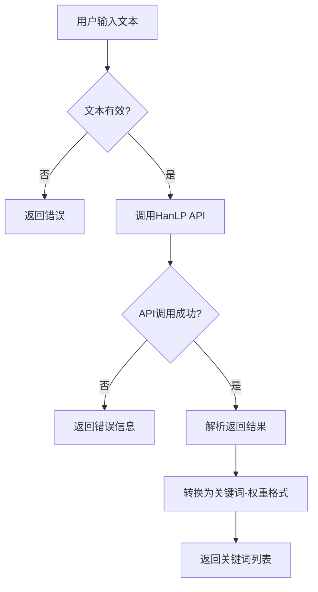
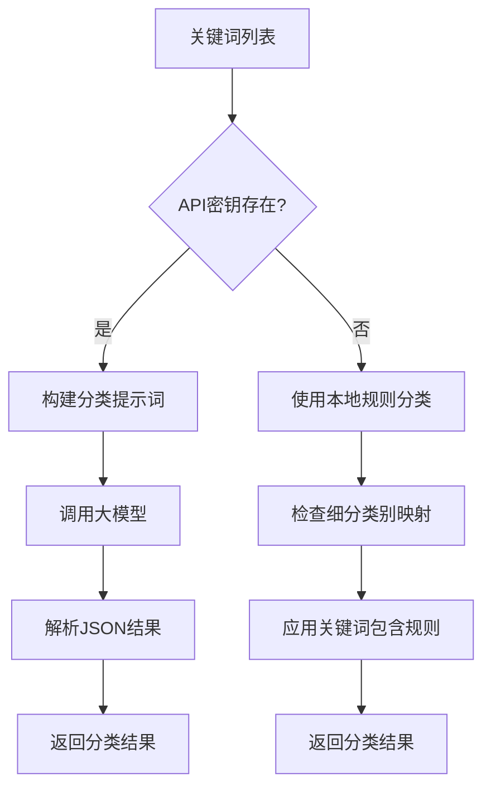
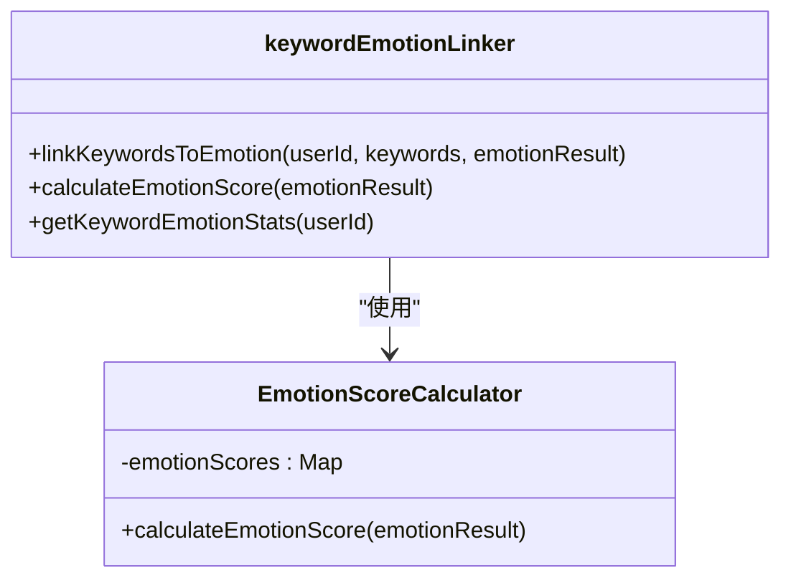
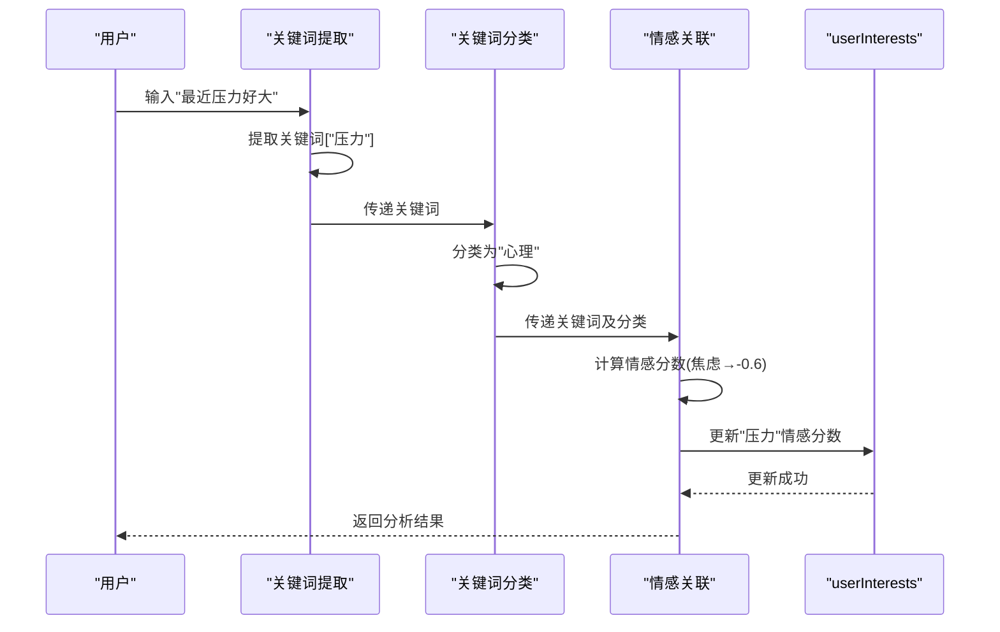
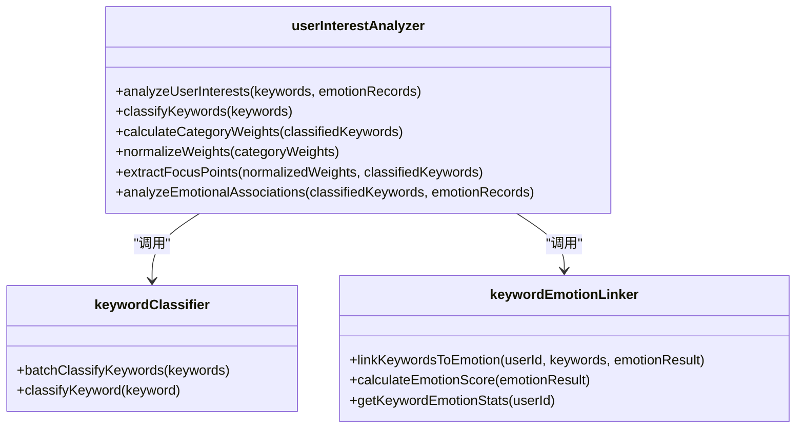

# 关键词情感分类

<cite>
**本文档引用文件**   
- [keywordClassifier.js](file://cloudfunctions/analysis/keywordClassifier.js)
- [keywordEmotionLinker.js](file://cloudfunctions/analysis/keywordEmotionLinker.js)
- [keywords.js](file://cloudfunctions/analysis/keywords.js)
- [userInterests.md](file://doc/开发文档/database/userInterests.md)
- [关键词情感关联功能使用示例.md](file://doc/使用文档/关键词情感关联功能使用示例.md)
- [userInterestAnalyzer.js](file://cloudfunctions/analysis/userInterestAnalyzer.js)
</cite>

## 目录
1. [引言](#引言)
2. [核心组件](#核心组件)
3. [关键词提取机制](#关键词提取机制)
4. [关键词分类逻辑](#关键词分类逻辑)
5. [情感关联与权重计算](#情感关联与权重计算)
6. [多关键词冲突消解策略](#多关键词冲突消解策略)
7. [实际输入输出示例](#实际输入输出示例)
8. [用户兴趣分析与角色感知支持](#用户兴趣分析与角色感知支持)
9. [结论](#结论)

## 引言
本系统通过关键词提取与情感关联机制，深入理解用户语义表达，实现对用户心理状态和兴趣偏好的精准分析。该机制由三个核心模块构成：关键词提取、关键词分类和情感关联映射，共同构建了用户情绪与兴趣的动态画像。

## 核心组件

该系统由三个主要模块协同工作：`keywords.js`负责从用户输入中提取关键语义词汇；`keywordClassifier.js`基于规则或大模型对关键词进行分类；`keywordEmotionLinker.js`建立关键词与情感标签的映射关系，并支持动态权重调整。

**组件来源**
- [keywordClassifier.js](file://cloudfunctions/analysis/keywordClassifier.js)
- [keywordEmotionLinker.js](file://cloudfunctions/analysis/keywordEmotionLinker.js)
- [keywords.js](file://cloudfunctions/analysis/keywords.js)

## 关键词提取机制

### 提取算法逻辑
关键词提取模块使用HanLP API实现，通过`extractKeywords`函数从用户输入文本中提取最具代表性的关键词。该函数接受文本内容和返回数量参数，调用外部API进行语义分析，返回包含关键词及其权重的列表。



**图表来源**
- [keywords.js](file://cloudfunctions/analysis/keywords.js#L15-L50)

### 聚类分析
系统还提供`clusterKeywords`功能，结合`getWordVectors`获取词向量，使用余弦相似度实现层次聚类算法，将语义相近的关键词进行分组，阈值默认为0.7，最小簇大小为2。

**组件来源**
- [keywords.js](file://cloudfunctions/analysis/keywords.js#L100-L200)

## 关键词分类逻辑

### 分类机制
关键词分类器支持两种模式：当`ZHIPU_API_KEY`存在时，调用大模型进行智能分类；否则使用本地规则进行分类。预定义了25个主要类别，如学习、工作、娱乐、心理等。



**图表来源**
- [keywordClassifier.js](file://cloudfunctions/analysis/keywordClassifier.js#L100-L250)

### 本地分类规则
本地分类采用多层规则匹配：
1. 首先检查关键词是否包含在`SUBCATEGORIES`细分类别映射中
2. 若未匹配，则使用关键词包含规则，如包含"学"、"考"、"课"等字的归为"学习"类
3. 包含"压力"、"焦虑"、"抑郁"等字的归为"心理"类

**组件来源**
- [keywordClassifier.js](file://cloudfunctions/analysis/keywordClassifier.js#L150-L200)

## 情感关联与权重计算

### 情感强度计算公式
情感分数计算采用加权强度模型，公式如下：

```
情感分数 = 基础情感分 × 情感强度
```

其中基础情感分根据情感类型映射，如"joy"为0.8，"happiness"为0.9，"sadness"为-0.7，"anger"为-0.8等。若输入结果包含直接分数，则限制在[-1,1]范围内。



**图表来源**
- [keywordEmotionLinker.js](file://cloudfunctions/analysis/keywordEmotionLinker.js#L50-L100)

### 动态权重调整
关键词情感分数采用加权平均算法更新，新分数 = (旧分数 × 0.7) + (新情感分数 × 0.3)，确保历史情感倾向与最新情感状态的平衡。

**组件来源**
- [keywordEmotionLinker.js](file://cloudfunctions/analysis/keywordEmotionLinker.js#L30-L50)

## 多关键词冲突消解策略

### 冲突消解机制
系统通过多层次排序策略解决多关键词冲突：

1. **情感倾向分类**：以±0.2为阈值，将关键词分为正面、负面和中性三类
2. **排序优先级**：
   - 正面关键词：按(情感分数 × 权重)降序排列
   - 负面关键词：按(|情感分数| × 权重)降序排列
   - 中性关键词：按权重降序排列
3. **结果截取**：每类取前10个关键词作为最终结果

```mermaid
flowchart TD
A[关键词列表] --> B[计算情感分数]
B --> C{情感分数 > 0.2?}
C --> |是| D[加入正面列表]
C --> |否| E{情感分数 < -0.2?}
E --> |是| F[加入负面列表]
E --> |否| G[加入中性列表]
D --> H[按分数*权重排序]
F --> I[按|分数|*权重排序]
G --> J[按权重排序]
H --> K[取前10个]
I --> L[取前10个]
L --> M[返回结果]
J --> M
```

**图表来源**
- [keywordEmotionLinker.js](file://cloudfunctions/analysis/keywordEmotionLinker.js#L150-L200)

## 实际输入输出示例

### 示例分析
以用户输入"最近压力好大"为例，系统处理流程如下：



**图表来源**
- [keywords.js](file://cloudfunctions/analysis/keywords.js#L15-L50)
- [keywordClassifier.js](file://cloudfunctions/analysis/keywordClassifier.js#L150-L200)
- [keywordEmotionLinker.js](file://cloudfunctions/analysis/keywordEmotionLinker.js#L50-L100)

### 数据结构
关键词在数据库中的存储结构包含：关键词内容、权重、分类、情感分数和最后更新时间。情感统计结果按正面、负面、中性分类返回，每类包含关键词、分数、权重和分类信息。

**组件来源**
- [userInterests.md](file://doc/开发文档/database/userInterests.md#L10-L50)

## 用户兴趣分析与角色感知支持

### 兴趣分析集成
关键词情感分类模块为`userInterestAnalyzer.js`提供核心数据支持，通过`analyzeUserInterests`函数整合关键词分类和情感记录，生成用户兴趣画像。



**图表来源**
- [userInterestAnalyzer.js](file://cloudfunctions/analysis/userInterestAnalyzer.js#L10-L50)

### 角色感知支持
系统通过`roles`模块中的`userPerception.js`整合用户兴趣数据，构建角色对用户的认知模型，支持个性化交互。关键词情感数据作为用户画像的重要组成部分，影响角色的回应策略和情感共鸣。

**组件来源**
- [userInterestAnalyzer.js](file://cloudfunctions/analysis/userInterestAnalyzer.js#L200-L250)

## 结论
关键词情感分类系统通过提取、分类、关联三步流程，实现了对用户语义的深度理解。系统采用混合模式（规则+模型）进行关键词分类，通过加权平均算法动态更新情感分数，并利用多层次排序策略解决多关键词冲突。该机制为用户兴趣分析和角色感知提供了坚实的数据基础，支持个性化服务和情感共鸣。