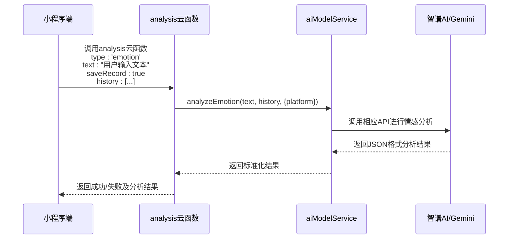
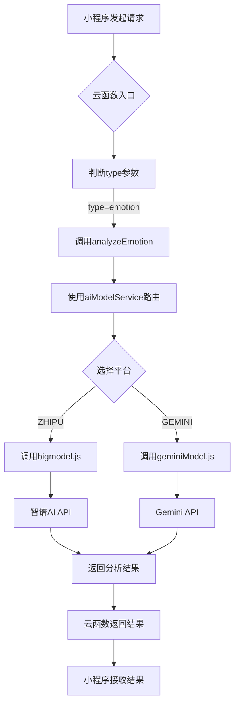
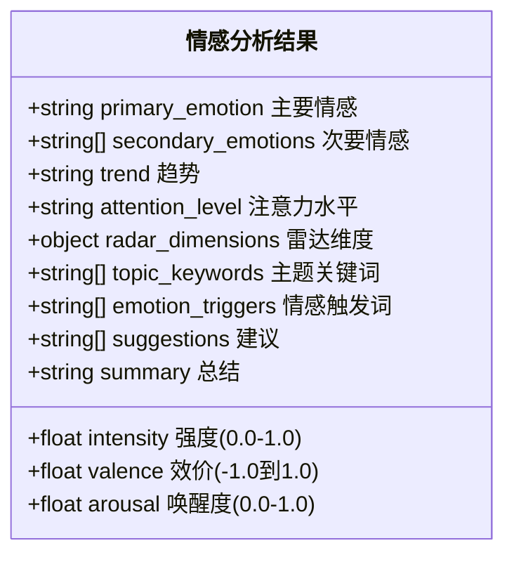

# 实时情感分析

<cite>
**本文档引用文件**   
- [emotionService.js](file://miniprogram/services/emotionService.js)
- [index.js](file://cloudfunctions/analysis/index.js)
- [aiModelService.js](file://cloudfunctions/analysis/aiModelService.js)
- [bigmodel.js](file://cloudfunctions/analysis/bigmodel.js)
- [geminiModel.js](file://cloudfunctions/analysis/geminiModel.js)
- [01-情感分析提示词.md](file://doc/开发文档/prompt/01-情感分析提示词.md)
</cite>

## 目录
1. [实现流程概述](#实现流程概述)
2. [请求发起与参数格式](#请求发起与参数格式)
3. [云函数处理与多模型路由](#云函数处理与多模型路由)
4. [AI提示词设计](#ai提示词设计)
5. [情绪分类与置信度返回](#情绪分类与置信度返回)
6. [错误处理机制](#错误处理机制)
7. [性能优化策略](#性能优化策略)

## 实现流程概述

实时情感分析的实现流程始于小程序端的 `miniprogram/services/emotionService.js` 文件，该文件负责发起情感分析请求。请求通过微信云开发的 `wx.cloud.callFunction` 方法发送至云函数 `analysis`。云函数 `analysis/index.js` 接收请求后，根据配置调用 `aiModelService.js` 中的多模型路由机制，选择智谱AI或Gemini等模型进行处理。实际的AI推理由 `bigmodel.js` 或 `geminiModel.js` 执行，这些模块负责与相应的AI平台API进行交互，完成情感分析任务。

**Section sources**
- [emotionService.js](file://miniprogram/services/emotionService.js#L0-L1214)
- [index.js](file://cloudfunctions/analysis/index.js#L0-L1117)

## 请求发起与参数格式

情感分析请求由 `miniprogram/services/emotionService.js` 中的 `analyzeEmotion` 函数发起。该函数构建请求参数并调用云函数。请求参数包括待分析的文本、是否保存记录、角色ID、对话ID、历史消息记录、是否提取关键词和是否关联关键词与情感等选项。

**Diagram sources **
- [emotionService.js](file://miniprogram/services/emotionService.js#L0-L1214)
- [index.js](file://cloudfunctions/analysis/index.js#L0-L1117)
- [aiModelService.js](file://cloudfunctions/analysis/aiModelService.js#L0-L663)

## 云函数处理与多模型路由

`cloudfunctions/analysis/index.js` 是情感分析的入口云函数。它根据 `event.type` 参数判断请求类型，当类型为 `emotion` 时，调用 `analyzeEmotion` 函数。该函数使用 `aiModelService.js` 提供的统一接口，通过 `platform` 参数指定模型平台（如 `ZHIPU` 或 `GEMINI`），实现多模型路由。`aiModelService.js` 内部根据平台配置调用相应的AI模型API，如智谱AI的 `bigmodel.js` 或Gemini的 `geminiModel.js`。

**Diagram sources **
- [index.js](file://cloudfunctions/analysis/index.js#L0-L1117)
- [aiModelService.js](file://cloudfunctions/analysis/aiModelService.js#L0-L663)
- [bigmodel.js](file://cloudfunctions/analysis/bigmodel.js#L0-L705)
- [geminiModel.js](file://cloudfunctions/analysis/geminiModel.js#L0-L656)

## AI提示词设计

情感分析的AI提示词设计在 `doc/开发文档/prompt/01-情感分析提示词.md` 中有详细说明。该提示词体系专为HeartChat应用优化，旨在提供精准且有建设性的情感反馈。提示词要求AI模型以严格的JSON格式返回分析结果，包含主要情感、次要情感、强度、效价、唤醒度、趋势、注意力水平、雷达维度、主题关键词、情感触发词、建议和总结等字段。提示词针对不同模型（Gemini、OpenAI、智谱AI、DeepSeek）进行了优化，以发挥各模型的特性。

**Section sources**
- [01-情感分析提示词.md](file://doc/开发文档/prompt/01-情感分析提示词.md#L0-L479)

## 情绪分类与置信度返回

系统采用8大类32子类的情感体系，包括积极情感（喜悦、满足等）、消极情感（悲伤、焦虑等）、认知情感（困惑、惊讶等）、社交情感（孤独、思念等）、压力情感（压力、疲惫等）、自我情感（自信、自卑等）、平静情感（平静、释然等）和复杂情感（矛盾、复杂等）。分析结果以JSON格式返回，包含 `primary_emotion`（主要情感）、`secondary_emotions`（次要情感）、`intensity`（强度，0.0-1.0）、`valence`（效价，-1.0到1.0）、`arousal`（唤醒度，0.0-1.0）等字段。置信度在 `analyzeUserInterests` 等接口中体现，为0-1之间的浮点数。

**Diagram sources **
- [01-情感分析提示词.md](file://doc/开发文档/prompt/01-情感分析提示词.md#L0-L479)
- [bigmodel.js](file://cloudfunctions/analysis/bigmodel.js#L0-L705)
- [geminiModel.js](file://cloudfunctions/analysis/geminiModel.js#L0-L656)

## 错误处理机制

系统实现了多层次的错误处理机制。在云函数层面，`index.js` 对参数进行验证，检查文本是否为空，并捕获和记录异常。`aiModelService.js` 在调用API时，对429错误（请求过多）实现自动重试机制，重试次数递减，延迟时间递增。在小程序端，`emotionService.js` 捕获云函数调用失败的情况，记录错误日志，并返回默认的情感分析结果，确保用户体验不中断。此外，系统还提供了本地情感分析作为备选方案，在云函数不可用时使用。

**Section sources**
- [index.js](file://cloudfunctions/analysis/index.js#L0-L1117)
- [aiModelService.js](file://cloudfunctions/analysis/aiModelService.js#L0-L663)
- [emotionService.js](file://miniprogram/services/emotionService.js#L0-L1214)

## 性能优化策略

为提升性能，系统采用了多种优化策略。在云函数层面，使用 `Promise.all` 并行处理情感分析和关键词提取，减少总处理时间。`aiModelService.js` 实现了重试机制，避免因短暂网络问题导致的失败。在数据处理上，限制历史消息的长度（通常为最近5条），避免过长的上下文影响性能。同时，系统通过环境变量管理API密钥，确保安全性和配置的灵活性。对于词向量获取，系统在API密钥未设置时，会使用本地模拟的词向量作为备选方案，保证功能的可用性。

**Section sources**
- [index.js](file://cloudfunctions/analysis/index.js#L0-L1117)
- [aiModelService.js](file://cloudfunctions/analysis/aiModelService.js#L0-L663)
- [bigmodel.js](file://cloudfunctions/analysis/bigmodel.js#L0-L705)