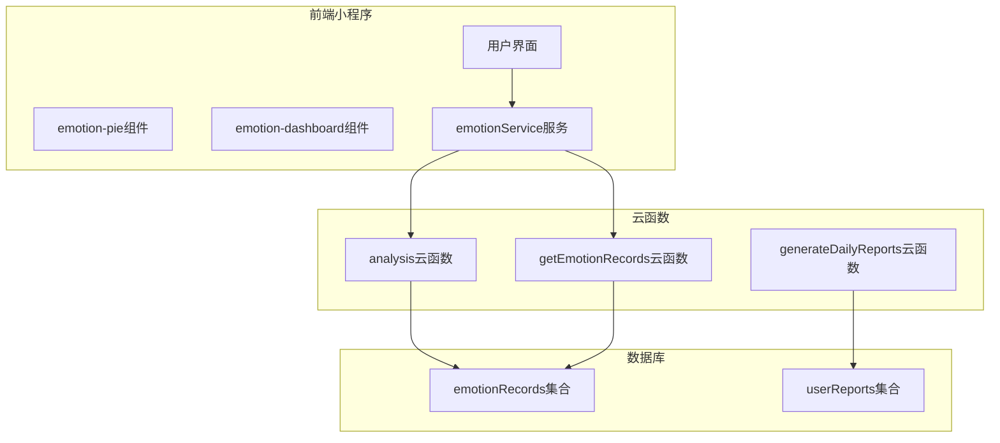
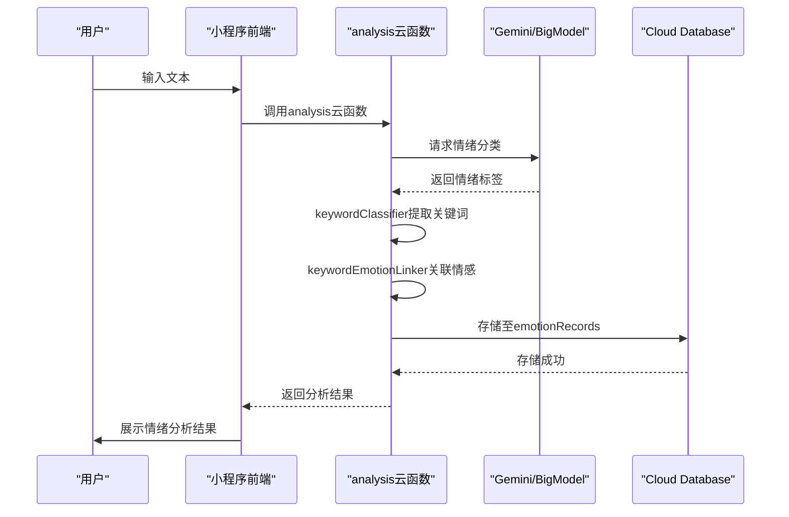
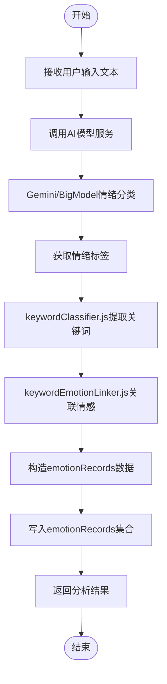
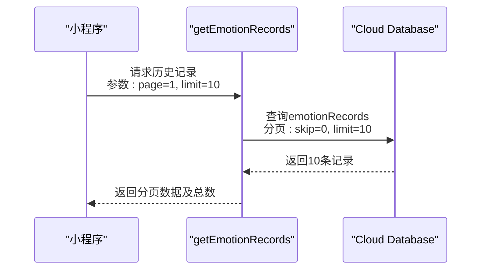
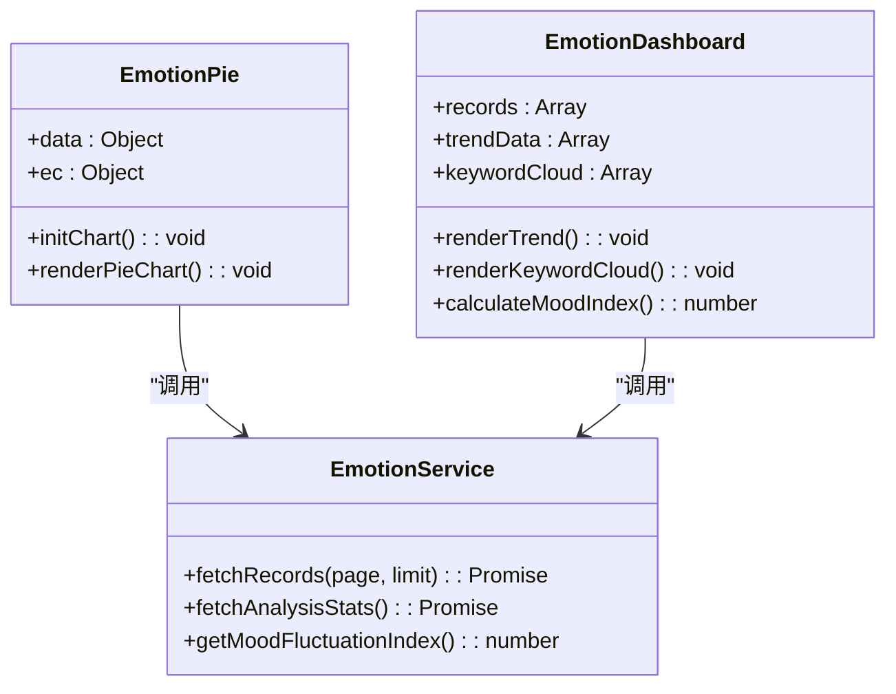
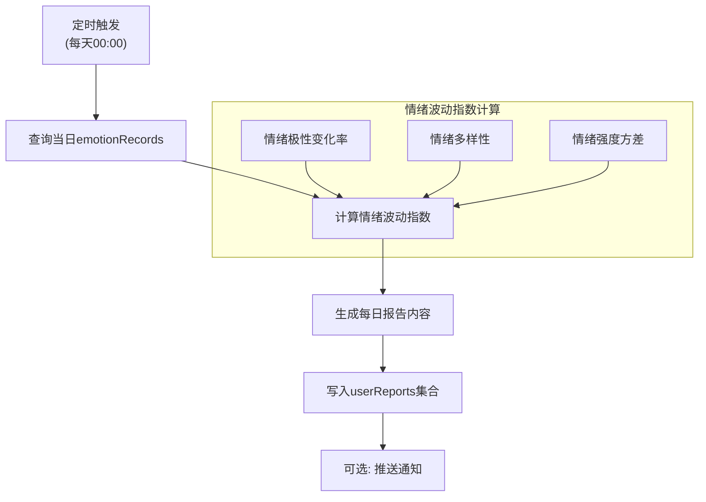
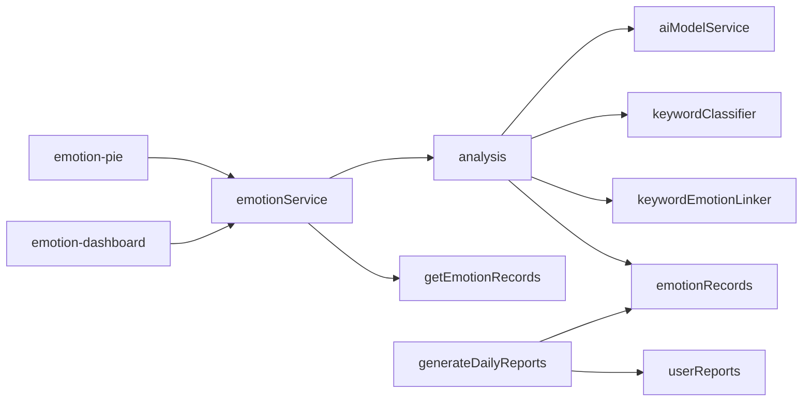

# 情感分析系统

<cite>
**本文档引用文件**  
- [index.js](file://cloudfunctions/analysis/index.js)
- [keywordClassifier.js](file://cloudfunctions/analysis/keywordClassifier.js)
- [keywordEmotionLinker.js](file://cloudfunctions/analysis/keywordEmotionLinker.js)
- [keywords.js](file://cloudfunctions/analysis/keywords.js)
- [aiModelService.js](file://cloudfunctions/analysis/aiModelService.js)
- [geminiModel.js](file://cloudfunctions/analysis/geminiModel.js)
- [bigmodel.js](file://cloudfunctions/analysis/bigmodel.js)
- [getEmotionRecords/index.js](file://cloudfunctions/getEmotionRecords/index.js)
- [generateDailyReports/index.js](file://cloudfunctions/generateDailyReports/index.js)
- [emotion-pie.js](file://miniprogram/components/emotion-pie/emotion-pie.js)
- [emotion-dashboard.js](file://miniprogram/components/emotion-dashboard/emotion-dashboard.js)
- [emotionService.js](file://miniprogram/services/emotionService.js)
- [emotionRecords.md](file://doc/开发文档/database/emotionRecords.md)
- [daily_reports.md](file://doc/开发文档/database/daily_reports.md)
</cite>

## 目录
1. [简介](#简介)
2. [项目结构](#项目结构)
3. [核心组件](#核心组件)
4. [架构概览](#架构概览)
5. [详细组件分析](#详细组件分析)
6. [依赖分析](#依赖分析)
7. [性能考虑](#性能考虑)
8. [故障排除指南](#故障排除指南)
9. [结论](#结论)

## 简介
本系统实现了一个完整的用户情感分析生命周期管理，涵盖从文本输入到情绪分类、关键词提取、数据存储、历史查询、可视化展示及每日报告生成的全流程。系统通过云函数调用AI模型进行情绪识别，结合关键词分类器提取关键语义并关联情感标签，最终将分析结果持久化存储，并提供多维度的数据可视化与统计功能。

## 项目结构
情感分析系统主要由云函数、前端组件和数据库三大部分构成，采用前后端分离架构，通过云函数作为中间层进行逻辑处理与数据交互。

**Diagram sources**
- [emotion-pie.js](file://miniprogram/components/emotion-pie/emotion-pie.js)
- [emotion-dashboard.js](file://miniprogram/components/emotion-dashboard/emotion-dashboard.js)
- [emotionService.js](file://miniprogram/services/emotionService.js)

**Section sources**
- [analysis](file://cloudfunctions/analysis)
- [getEmotionRecords](file://cloudfunctions/getEmotionRecords)
- [generateDailyReports](file://cloudfunctions/generateDailyReports)

## 核心组件
系统核心功能由`analysis`云函数驱动，负责接收用户输入文本，调用AI模型进行情绪分类，并通过`keywordClassifier.js`提取关键词，再由`keywordEmotionLinker.js`建立关键词与情感标签的关联。分析结果统一写入`emotionRecords`集合，供后续查询与可视化使用。

**Section sources**
- [index.js](file://cloudfunctions/analysis/index.js)
- [keywordClassifier.js](file://cloudfunctions/analysis/keywordClassifier.js)
- [keywordEmotionLinker.js](file://cloudfunctions/analysis/keywordEmotionLinker.js)
- [emotionRecords.md](file://doc/开发文档/database/emotionRecords.md)

## 架构概览
系统采用分层架构设计，前端组件负责用户交互与数据展示，云函数层处理核心业务逻辑，数据库层负责数据持久化。

**Diagram sources**
- [index.js](file://cloudfunctions/analysis/index.js)
- [keywordClassifier.js](file://cloudfunctions/analysis/keywordClassifier.js)
- [keywordEmotionLinker.js](file://cloudfunctions/analysis/keywordEmotionLinker.js)

## 详细组件分析

### 情绪分析云函数分析
`analysis`云函数是系统的核心处理单元，接收用户输入文本后，通过统一AI模型服务（aiModelService）调用Gemini或BigModel进行情绪分类，获得基础情绪标签后，进一步通过关键词分类器提取语义关键词，并建立关键词与情绪的映射关系。

**Diagram sources**
- [index.js](file://cloudfunctions/analysis/index.js)
- [aiModelService.js](file://cloudfunctions/analysis/aiModelService.js)
- [keywordClassifier.js](file://cloudfunctions/analysis/keywordClassifier.js)
- [keywordEmotionLinker.js](file://cloudfunctions/analysis/keywordEmotionLinker.js)

**Section sources**
- [index.js](file://cloudfunctions/analysis/index.js)
- [aiModelService.js](file://cloudfunctions/analysis/aiModelService.js)

### 历史记录查询接口分析
`getEmotionRecords`云函数提供情绪记录的历史查询接口，支持分页参数（page、limit）和时间范围过滤，用于前端情绪历史页面的数据加载。

**Diagram sources**
- [getEmotionRecords/index.js](file://cloudfunctions/getEmotionRecords/index.js)
- [emotionRecords.md](file://doc/开发文档/database/emotionRecords.md)

**Section sources**
- [getEmotionRecords/index.js](file://cloudfunctions/getEmotionRecords/index.js)

### 情绪数据可视化分析
`emotion-pie`和`emotion-dashboard`组件负责情绪数据的可视化渲染。`emotion-pie`组件使用ECharts绘制情绪分布饼图，`emotion-dashboard`组件展示情绪趋势、关键词云等综合信息。

**Diagram sources**
- [emotion-pie.js](file://miniprogram/components/emotion-pie/emotion-pie.js)
- [emotion-dashboard.js](file://miniprogram/components/emotion-dashboard/emotion-dashboard.js)
- [emotionService.js](file://miniprogram/services/emotionService.js)

**Section sources**
- [emotion-pie.js](file://miniprogram/components/emotion-pie/emotion-pie.js)
- [emotion-dashboard.js](file://miniprogram/components/emotion-dashboard/emotion-dashboard.js)

### 每日报告生成机制分析
`generateDailyReports`云函数定时触发，计算用户情绪波动指数并生成每日心情报告。情绪波动指数基于当日情绪极性变化率和情绪多样性计算。

**Diagram sources**
- [generateDailyReports/index.js](file://cloudfunctions/generateDailyReports/index.js)
- [daily_reports.md](file://doc/开发文档/database/daily_reports.md)

**Section sources**
- [generateDailyReports/index.js](file://cloudfunctions/generateDailyReports/index.js)

## 依赖分析
系统各组件间存在明确的依赖关系，前端组件依赖云函数接口获取数据，云函数依赖AI模型服务和数据库服务。

**Diagram sources**
- [cloudfunctions](file://cloudfunctions)
- [miniprogram/services](file://miniprogram/services)

**Section sources**
- [cloudfunctions](file://cloudfunctions)
- [miniprogram/services](file://miniprogram/services)

## 性能考虑
系统在设计时考虑了性能优化，包括：
- 云函数冷启动优化：通过合理拆分服务降低单个函数体积
- 数据库查询优化：在emotionRecords集合上建立时间索引
- 前端渲染优化：采用ECharts按需加载和数据分片
- 缓存策略：对高频查询结果进行缓存

## 故障排除指南
常见问题及解决方案：
- **情绪分析无响应**：检查AI模型API密钥配置、云函数调用权限
- **历史记录加载慢**：确认emotionRecords集合已建立时间索引
- **图表不显示**：检查ec-canvas组件初始化、数据格式是否正确
- **每日报告未生成**：检查云函数定时触发器配置、用户数据是否充足

**Section sources**
- [analysis/index.js](file://cloudfunctions/analysis/index.js)
- [getEmotionRecords/index.js](file://cloudfunctions/getEmotionRecords/index.js)
- [generateDailyReports/index.js](file://cloudfunctions/generateDailyReports/index.js)

## 结论
本情感分析系统实现了从用户输入到数据可视化完整的闭环，通过模块化设计确保了系统的可维护性和扩展性。开发者可基于此架构进一步扩展情绪分析维度、优化算法模型或增加个性化推荐功能。