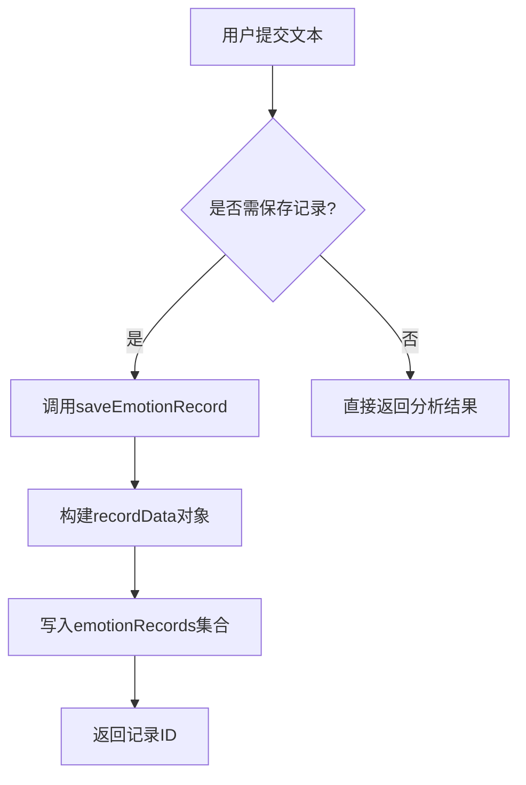
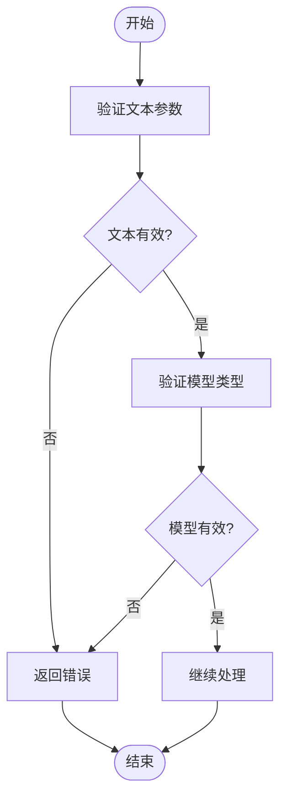
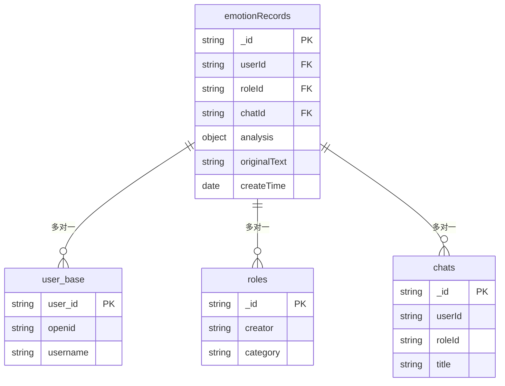

# 情感数据存储

<cite>
**本文档引用文件**  
- [index.js](file://cloudfunctions/analysis/index.js)
- [emotionRecords.md](file://doc/开发文档/database/emotionRecords.md)
- [createIndexes.js](file://cloudfunctions/user/createIndexes.js)
</cite>

## 目录
1. [引言](#引言)
2. [情感分析结果的持久化流程](#情感分析结果的持久化流程)
3. [emotionRecords集合结构详解](#emotionrecords集合结构详解)
4. [数据写入安全校验机制](#数据写入安全校验机制)
5. [索引设计与数据一致性](#索引设计与数据一致性)
6. [数据库操作代码示例](#数据库操作代码示例)
7. [性能监控与优化建议](#性能监控与优化建议)
8. [结论](#结论)

## 引言

本系统通过AI技术对用户对话内容进行情感分析，识别出情绪分类、关键词、置信度等信息，并将这些数据结构化地存储于云数据库中。该过程由`cloudfunctions/analysis/index.js`云函数驱动，分析完成后自动将结果写入`emotionRecords`集合。此文档旨在系统化说明整个持久化方案，涵盖数据结构定义、安全校验、索引设计及性能优化等方面。

## 情感分析结果的持久化流程

当用户提交一段对话文本后，系统调用`analyzeEmotion`函数启动情感分析流程。该函数首先获取微信上下文以确定用户身份（openid），然后并行执行情感分析和关键词提取任务。一旦AI模型返回分析结果，若请求参数中包含`saveRecord=true`，则立即调用`saveEmotionRecord`函数将结果持久化至`emotionRecords`集合。



**Diagram sources**
- [index.js](file://cloudfunctions/analysis/index.js#L150-L155)

**Section sources**
- [index.js](file://cloudfunctions/analysis/index.js#L150-L155)

## emotionRecords集合结构详解

`emotionRecords`集合用于存储用户的情感分析记录，包含详细的情绪类型、强度、维度分析以及相关的关键词和触发因素。其字段结构如下：

```javascript
{
  _id: "记录ID",                    // string, 主键，自动生成
  userId: "用户ID",                  // string, 关联user_base表
  analysis: {                       // object, 情感分析结果
    // 基础情感信息
    type: "主要情感类型",            // string, 如：喜悦、悲伤、愤怒等
    intensity: 0.8,                  // number, 情感强度 0-1
    valence: 0.5,                    // number, 情感效价 -1到1
    arousal: 0.6,                    // number, 情感唤醒度 0-1
    trend: "上升",                   // string, 情感趋势：上升/下降/稳定
    
    // 详细情感分析
    primary_emotion: "主要情感",      // string, 主要情感类型
    secondary_emotions: ["次要情感1", "次要情感2"], // array, 次要情感列表
    attention_level: "高",           // string, 注意力水平：高/中/低
    
    // 雷达图维度
    radar_dimensions: {              // object, 情感维度雷达图
      trust: 0.7,                   // number, 信任度 0-1
      openness: 0.6,                // number, 开放度 0-1
      resistance: 0.3,              // number, 抵抗度 0-1
      stress: 0.4,                  // number, 压力度 0-1
      control: 0.8                  // number, 控制度 0-1
    },
    
    // 关键词和触发因素
    topic_keywords: ["关键词1", "关键词2"],       // array, 话题关键词
    emotion_triggers: ["触发词1", "触发词2"],   // array, 情感触发词
    suggestions: ["建议1", "建议2"],              // array, 改善建议
    summary: "情感总结"                            // string, 情感状态总结
  },
  originalText: "原始文本",          // string, 原始分析文本
  createTime: "创建时间",            // date, 记录创建时间
  roleId: "角色ID",                  // string, 关联角色（可选）
  chatId: "聊天ID"                   // string, 关联聊天会话（可选）
}
```

### 字段说明

| 字段名 | 类型 | 说明 |
| :--- | :--- | :--- |
| `_id` | string | 主键，由数据库自动生成 |
| `userId` | string | 用户唯一标识，关联`user_base`表 |
| `analysis.type` | string | 主要情感标签，如“喜悦”、“焦虑”等 |
| `analysis.intensity` | number | 情感强度，范围0-1 |
| `analysis.valence` | number | 情感效价，-1（负面）到1（正面） |
| `analysis.arousal` | number | 唤醒度，0（平静）到1（激动） |
| `analysis.trend` | string | 情绪变化趋势：“上升”、“下降”或“稳定” |
| `analysis.primary_emotion` | string | 主要情感类型，中文表达 |
| `analysis.secondary_emotions` | array | 次要情感列表，最多两个 |
| `analysis.attention_level` | string | 注意力水平：“高”、“中”、“低” |
| `analysis.radar_dimensions` | object | 多维度情感评分 |
| `analysis.topic_keywords` | array | 话题相关关键词 |
| `analysis.emotion_triggers` | array | 情感触发词 |
| `analysis.suggestions` | array | 改善建议 |
| `analysis.summary` | string | 情感状态总结 |
| `originalText` | string | 原始输入文本 |
| `createTime` | date | 记录创建时间，使用数据库服务器时间 |
| `roleId` | string | 可选，关联的角色ID |
| `chatId` | string | 可选，关联的聊天会话ID |

**Section sources**
- [emotionRecords.md](file://doc/开发文档/database/emotionRecords.md#L1-L112)

## 数据写入安全校验机制

在将情感分析结果写入数据库前，系统实施了多层次的安全校验机制，确保数据的合法性与用户权限的合规性。

### 用户权限验证

系统通过`cloud.getWXContext()`获取当前用户的`openid`，作为`userId`字段值。此机制确保每个用户只能访问自己的情感记录，防止跨用户数据泄露。此外，在写入操作时，云数据库的权限规则进一步限制了非授权访问。

### 输入参数校验

在`analyzeEmotion`函数中，系统对输入参数进行严格校验：
- 检查`text`参数是否存在且为非空字符串。
- 验证`modelType`是否为支持的模型类型（如`gemini`、`zhipu`）。
- 确保`history`为有效数组。

若校验失败，则立即返回错误信息，避免无效数据进入数据库。



**Diagram sources**
- [index.js](file://cloudfunctions/analysis/index.js#L160-L165)

**Section sources**
- [index.js](file://cloudfunctions/analysis/index.js#L160-L165)

## 索引设计与数据一致性

为提升查询性能并保障数据一致性，系统为`emotionRecords`集合设计了多个索引，并通过事务机制确保写入的原子性。

### 索引设计

根据查询模式，系统创建了以下索引：

| 索引名称 | 字段组合 | 用途 |
| :--- | :--- | :--- |
| `userId_timestamp_idx` | `userId` + `createTime` (降序) | 按用户和时间范围查询历史记录 |
| `roleId_userId_timestamp_idx` | `roleId` + `userId` + `createTime` (降序) | 按角色、用户和时间查询 |
| `chatId_timestamp_idx` | `chatId` + `createTime` (降序) | 按聊天会话和时间查询 |
| `emotion_userId_timestamp_idx` | `primary_emotion` + `userId` + `createTime` (降序) | 按情感类型、用户和时间查询 |

这些索引均在`cloudfunctions/user/createIndexes.js`中定义，并通过云函数定期维护。



**Diagram sources**
- [createIndexes.js](file://cloudfunctions/user/createIndexes.js#L151-L205)
- [emotionRecords.md](file://doc/开发文档/database/emotionRecords.md#L1-L112)

**Section sources**
- [createIndexes.js](file://cloudfunctions/user/createIndexes.js#L151-L205)

### 数据一致性保障

系统通过以下措施保障数据一致性：
- 使用`db.serverDate()`确保时间戳为数据库服务器时间，避免客户端时间偏差。
- 在写入失败时捕获异常并记录日志，但不影响主流程的执行。
- 通过`Promise.all`并行处理多个数据库操作，减少事务延迟。

## 数据库操作代码示例

以下是`saveEmotionRecord`函数的核心实现，展示了如何将情感分析结果写入数据库：

```javascript
async function saveEmotionRecord(result, openid, options = {}) {
  try {
    const recordData = {
      userId: openid,
      analysis: result,
      originalText: result.originalText || '',
      createTime: db.serverDate(),
      ...options
    };

    const res = await db.collection('emotionRecords').add({
      data: recordData
    });

    return res._id;
  } catch (error) {
    console.error('保存情感分析记录失败:', error.message || error);
    return null;
  }
}
```

该函数接收分析结果、用户ID和附加选项，构建完整的记录数据后调用`db.collection('emotionRecords').add()`方法插入数据库。若成功，返回新记录的`_id`；若失败，则记录错误日志并返回`null`。

**Section sources**
- [index.js](file://cloudfunctions/analysis/index.js#L100-L115)

## 性能监控与优化建议

为确保系统长期稳定运行，建议实施以下性能监控与优化措施：

### 监控指标
- **写入延迟**：监控`saveEmotionRecord`函数的执行时间，确保在毫秒级完成。
- **数据库连接数**：跟踪并发连接数，防止资源耗尽。
- **索引命中率**：定期检查查询计划，确保索引被有效利用。

### 优化建议
1. **定期归档旧数据**：对超过一定期限（如一年）的情感记录进行归档，减少主集合大小。
2. **分页查询**：在前端获取历史记录时使用`limit`和`skip`实现分页，避免一次性加载过多数据。
3. **缓存热点数据**：对频繁访问的用户情感统计结果进行缓存，减少数据库查询压力。
4. **异步写入**：对于非关键路径的数据写入（如关键词关联），采用异步方式执行，提升响应速度。

## 结论

本系统通过精心设计的持久化方案，实现了情感分析结果的高效、安全存储。`emotionRecords`集合的结构化设计支持多维度数据分析，而合理的索引策略保障了查询性能。结合严格的安全校验与数据一致性机制，系统能够稳定服务于用户心理健康监控、个性化报告生成等核心功能。未来可通过数据归档与缓存优化进一步提升系统可扩展性。