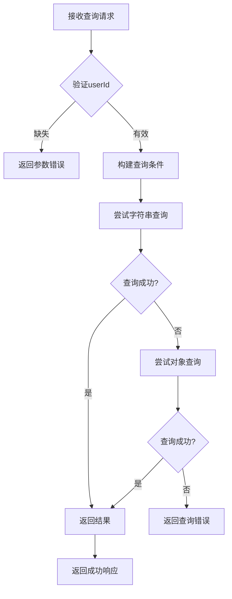
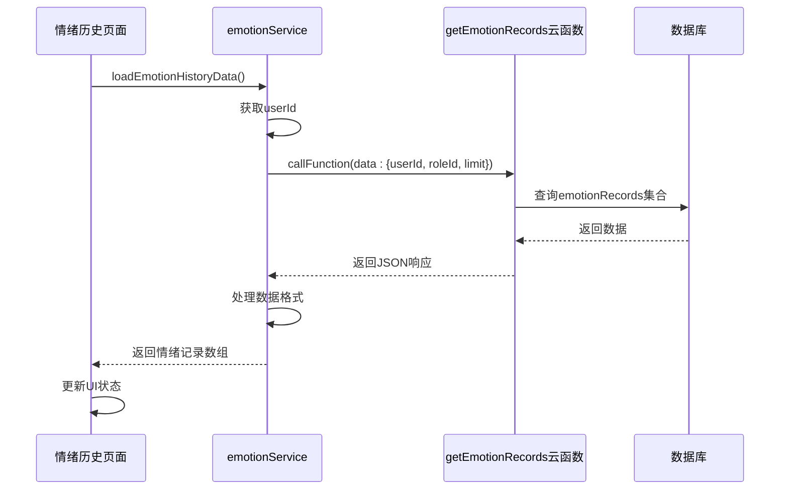
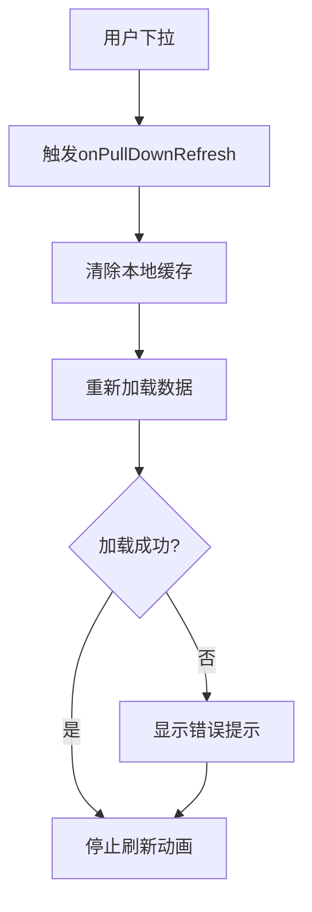

# 情绪历史管理

<cite>
**本文档引用文件**  
- [getEmotionRecords/index.js](file://cloudfunctions/getEmotionRecords/index.js)
- [emotion-history.js](file://miniprogram/packageEmotion/pages/emotion-history/emotion-history.js)
- [emotionService.js](file://miniprogram/services/emotionService.js)
- [情绪历史页面使用指南.md](file://doc/使用文档/情绪历史页面使用指南.md)
- [emotionRecords.md](file://doc/开发文档/database/emotionRecords.md)
</cite>

## 目录
1. [功能概述](#功能概述)
2. [云函数接口说明](#云函数接口说明)
3. [前端页面实现](#前端页面实现)
4. [用户交互与状态处理](#用户交互与状态处理)
5. [错误处理与边界情况](#错误处理与边界情况)
6. [性能优化策略](#性能优化策略)

## 功能概述

情绪历史管理功能为用户提供全面的情绪数据追踪与可视化分析。通过后端云函数与前端页面的协同工作，系统支持用户查看其历史情绪记录，分析情绪趋势，并支持多种时间维度的视图切换。该功能主要由 `getEmotionRecords` 云函数提供数据支持，并由 `emotion-history` 小程序页面负责数据展示与用户交互。

核心功能包括：
- 按用户和角色筛选情绪记录
- 支持分页查询与数据限制
- 提供日、周、月等多维度时间范围视图
- 图表化展示情绪趋势、分布与波动指数
- 支持下拉刷新与本地缓存机制

**Section sources**
- [情绪历史页面使用指南.md](file://doc/使用文档/情绪历史页面使用指南.md#L1-L157)

## 云函数接口说明

`getEmotionRecords` 云函数为情绪历史数据提供分页查询接口，是前端数据获取的核心服务。

### 查询参数

该接口支持以下查询参数：

| 参数名 | 类型 | 必填 | 说明 |
| :--- | :--- | :--- | :--- |
| `userId` | string | 是 | 用户唯一标识，用于定位用户数据 |
| `roleId` | string | 否 | 角色ID，用于筛选特定AI角色对话产生的情绪记录 |
| `limit` | number | 否 | 单次返回记录条数限制，默认为20条 |

**Section sources**
- [getEmotionRecords/index.js](file://cloudfunctions/getEmotionRecords/index.js#L1-L112)

### 响应数据结构

接口返回标准的JSON响应，结构如下：

```json
{
  "success": true,
  "data": [
    {
      "_id": "记录ID",
      "userId": "用户ID",
      "analysis": {
        "type": "喜悦",
        "intensity": 0.8,
        "valence": 0.9,
        "arousal": 0.7,
        "trend": "上升",
        "primary_emotion": "喜悦",
        "secondary_emotions": ["兴奋", "满足"],
        "attention_level": "高",
        "radar_dimensions": {
          "trust": 0.8,
          "openness": 0.7,
          "resistance": 0.2,
          "stress": 0.3,
          "control": 0.9
        },
        "topic_keywords": ["成功", "庆祝"],
        "emotion_triggers": ["好消息"],
        "suggestions": ["继续保持积极心态"],
        "summary": "用户当前情绪非常积极"
      },
      "originalText": "今天我收到了工作上的好消息...",
      "createTime": "2025-01-01T12:00:00Z",
      "roleId": "role_001",
      "chatId": "chat_001"
    }
  ],
  "openid": "用户OpenID",
  "appid": "应用ID",
  "unionid": "用户UnionID"
}
```

**Section sources**
- [emotionRecords.md](file://doc/开发文档/database/emotionRecords.md#L7-L61)

### 性能优化

为确保查询性能，该接口实现了以下优化策略：

1. **复合索引**：数据库 `emotionRecords` 集合上建立了 `userId + createTime` 的复合索引，确保按用户和时间排序的查询高效。
2. **查询降级**：当字符串查询失败时，自动降级为对象查询，提高接口健壮性。
3. **结果限制**：通过 `limit` 参数严格控制单次返回条数，防止数据量过大影响性能。
4. **排序优化**：始终按 `createTime` 降序排列，确保最新记录优先返回。



**Diagram sources**
- [getEmotionRecords/index.js](file://cloudfunctions/getEmotionRecords/index.js#L1-L112)

## 前端页面实现

`emotion-history` 页面负责调用云函数并渲染情绪历史列表，支持多视图切换。

### 接口调用流程

前端通过 `emotionService.getEmotionHistory` 方法调用云函数，其调用流程如下：

1. 获取用户ID（从本地缓存或全局状态）
2. 根据当前时间范围确定 `limit` 值
3. 调用 `getEmotionRecords` 云函数
4. 处理返回数据并更新页面状态



**Diagram sources**
- [emotion-history.js](file://miniprogram/packageEmotion/pages/emotion-history/emotion-history.js#L1-L799)
- [emotionService.js](file://miniprogram/services/emotionService.js#L1-L1214)

### 视图切换逻辑

页面支持按日、周、月等视图切换，其核心逻辑在 `switchTimeRange` 方法中实现：

1. 用户点击时间范围按钮
2. 更新 `timeRange` 数据绑定
3. 根据新范围计算 `limit` 值
4. 尝试从本地缓存加载数据
5. 若缓存不存在或过期，则调用云函数获取最新数据
6. 更新图表和列表展示

**Section sources**
- [emotion-history.js](file://miniprogram/packageEmotion/pages/emotion-history/emotion-history.js#L1-L799)

## 用户交互与状态处理

### 下拉刷新

页面支持下拉刷新功能，其处理逻辑如下：

1. 用户下拉触发 `onPullDownRefresh`
2. 清除当前时间范围的本地缓存
3. 重新调用 `loadEmotionHistoryData` 获取最新数据
4. 刷新完成后调用 `wx.stopPullDownRefresh()` 停止动画



**Diagram sources**
- [emotion-history.js](file://miniprogram/packageEmotion/pages/emotion-history/emotion-history.js#L1-L799)

### 加载状态处理

页面通过 `loading` 状态变量管理加载过程：

- `loading: true`：显示加载中提示
- `hasData: true`：渲染情绪记录和图表
- `hasData: false`：显示“暂无数据”空状态

**Section sources**
- [情绪历史页面使用指南.md](file://doc/使用文档/情绪历史页面使用指南.md#L1-L157)

## 错误处理与边界情况

### 错误码说明

| 错误码/情况 | 说明 | 处理建议 |
| :--- | :--- | :--- |
| `缺少必要参数: userId` | 未提供用户ID | 检查登录状态，确保用户已登录 |
| `数据不存在` | 查询结果为空数组 | 提示用户暂无情绪数据，建议进行更多对话 |
| `云函数执行失败` | 服务器内部错误 | 记录错误日志，提示用户稍后重试 |
| `获取openId失败` | 本地存储异常 | 提示用户检查设置或重新登录 |

**Section sources**
- [getEmotionRecords/index.js](file://cloudfunctions/getEmotionRecords/index.js#L1-L112)
- [emotion-history.js](file://miniprogram/packageEmotion/pages/emotion-history/emotion-history.js#L1-L799)

### 空状态展示

当用户无情绪数据时，页面会显示友好的空状态提示：“暂无情绪历史数据”，并建议用户与AI角色进行更多对话以生成情绪记录。

## 性能优化策略

1. **本地缓存**：将情绪历史数据缓存至本地，减少云函数调用频率。
2. **缓存过期机制**：设置30分钟缓存有效期，平衡数据新鲜度与性能。
3. **分页限制**：默认限制返回20条记录，避免一次性加载过多数据。
4. **异步加载**：图表初始化与数据加载异步进行，提升页面响应速度。
5. **懒加载**：ECharts图表组件采用懒加载模式，减少初始渲染负担。