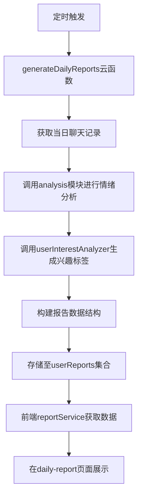

# 情绪报告集成

<cite>
**本文档引用文件**  
- [index.js](file://cloudfunctions/generateDailyReports/index.js)
- [config.json](file://cloudfunctions/generateDailyReports/config.json)
- [userInterestAnalyzer.js](file://cloudfunctions/analysis/userInterestAnalyzer.js)
- [aiModelService.js](file://cloudfunctions/analysis/aiModelService.js)
- [keywordClassifier.js](file://cloudfunctions/analysis/keywordClassifier.js)
- [keywordEmotionLinker.js](file://cloudfunctions/analysis/keywordEmotionLinker.js)
- [reportService.js](file://miniprogram/services/reportService.js)
- [daily_reports.md](file://doc/开发文档/database/daily_reports.md)
- [HeartChat每日心情报告设计方案.md](file://doc/设计文档/功能设计/HeartChat每日心情报告设计方案.md)
</cite>

## 目录
1. [引言](#引言)
2. [系统架构概览](#系统架构概览)
3. [每日报告生成机制](#每日报告生成机制)
4. [情绪与兴趣分析流程](#情绪与兴趣分析流程)
5. [报告数据结构设计](#报告数据结构设计)
6. [前端展示逻辑](#前端展示逻辑)
7. [触发条件与重试策略](#触发条件与重试策略)
8. [用户通知机制](#用户通知机制)
9. [结论](#结论)

## 引言
本系统旨在通过自动化方式为用户提供每日心情报告，帮助其了解自身情绪变化趋势与兴趣焦点。该功能依托云函数定时执行，结合AI模型对用户当日聊天记录进行批量情绪分析，并融合兴趣标签生成个性化报告内容。整个流程涵盖数据采集、分析处理、结果存储与前端展示等环节，形成完整闭环。

## 系统架构概览

**图示来源**  
- [index.js](file://cloudfunctions/generateDailyReports/index.js#L1-L40)
- [reportService.js](file://miniprogram/services/reportService.js#L1-L30)

**本节来源**  
- [HeartChat每日心情报告设计方案.md](file://doc/设计文档/功能设计/HeartChat每日心情报告设计方案.md#L1-L50)

## 每日报告生成机制

`generateDailyReports`云函数作为核心调度单元，负责每日自动触发并执行报告生成任务。该函数通过配置文件`config.json`设定执行时间（通常为凌晨2:00），利用云开发的定时触发器实现精准调度。函数启动后，首先查询数据库中所有活跃用户的当日聊天记录，随后逐一对每位用户的数据进行情绪分析与兴趣提取。

分析过程中，系统调用`analysis`模块中的`aiModelService.js`提供的统一接口，对每条消息进行情感分类，并汇总统计主要情绪分布。同时，通过`userInterestAnalyzer.js`识别高频关键词并映射至兴趣领域，形成“今日关键词”标签组。

**本节来源**  
- [index.js](file://cloudfunctions/generateDailyReports/index.js#L15-L80)
- [config.json](file://cloudfunctions/generateDailyReports/config.json#L1-L10)

## 情绪与兴趣分析流程

情绪分析基于`keywordEmotionLinker.js`中预定义的情绪-关键词映射关系，结合`geminiModel.js`或`bigmodel.js`等大模型服务进行上下文理解。系统将用户当日所有聊天内容拼接为一段文本，送入AI模型进行整体情绪倾向判断，输出如“平静”、“愉悦”、“焦虑”等主情绪标签及其置信度。

兴趣标签生成则依赖`keywordClassifier.js`对文本中出现的关键词进行分类，例如“学习”、“运动”、“工作”等类别。`userInterestAnalyzer.js`进一步聚合这些关键词，计算各兴趣领域的权重，最终选取Top3作为当日兴趣标签。

例如，若系统检测到用户多次提及“论文”、“图书馆”、“复习”，则判定其当日主要活动为“学习”，并生成类似“今日情绪以平静为主，关键词：学习、思考”的报告语句。

**本节来源**  
- [aiModelService.js](file://cloudfunctions/analysis/aiModelService.js#L20-L60)
- [keywordClassifier.js](file://cloudfunctions/analysis/keywordClassifier.js#L10-L40)
- [userInterestAnalyzer.js](file://cloudfunctions/analysis/userInterestAnalyzer.js#L15-L50)
- [keywordEmotionLinker.js](file://cloudfunctions/analysis/keywordEmotionLinker.js#L5-L25)

## 报告数据结构设计

报告数据存储于MongoDB的`userReports`集合中，每条记录包含以下字段：

| 字段名 | 类型 | 说明 |
|--------|------|------|
| userId | string | 用户唯一标识 |
| date | date | 报告日期（精确到天） |
| primaryEmotion | string | 主导情绪标签 |
| emotionConfidence | number | 情绪判断置信度（0-1） |
| keywords | array<string> | 高频关键词列表 |
| interests | array<string> | 兴趣领域标签 |
| summary | string | 自然语言总结语句 |
| createdAt | datetime | 记录创建时间 |

该结构设计支持后续的数据可视化与趋势分析，如情绪波动曲线、兴趣变化图谱等。

**本节来源**  
- [daily_reports.md](file://doc/开发文档/database/userReports.md#L1-L20)

## 前端展示逻辑

前端通过`reportService.js`服务模块从云端获取用户最近的每日心情报告。该服务封装了对`getEmotionRecords`和`generateDailyReports`云函数的调用，支持按日期范围查询历史报告。

在`packageEmotion/pages/daily-report/daily-report.js`页面中，系统调用`reportService.fetchLatestReport()`获取最新报告，并将`summary`字段直接渲染至UI。同时，使用ECharts组件绘制情绪分布饼图（`emotion-pie`组件）与兴趣标签云（`interest-tag-cloud`组件），增强可视化效果。

页面还支持下拉刷新以手动获取最新报告，并在无数据时提示“暂无今日报告，请稍后再试”。

**本节来源**  
- [reportService.js](file://miniprogram/services/reportService.js#L10-L50)
- [daily-report.js](file://miniprogram/packageEmotion/pages/daily-report/daily-report.js#L5-L30)

## 触发条件与重试策略

报告生成的触发条件包括：
- 每日凌晨2:00自动执行（由`config.json`配置）
- 用户手动触发（通过前端“刷新”按钮调用云函数）
- 新用户注册后首次使用满24小时

为确保可靠性，系统实现三级重试机制：
1. **函数内部重试**：在`generateDailyReports/index.js`中，对数据库查询与AI调用设置3次重试，间隔1秒。
2. **云函数重试**：腾讯云函数配置最大执行时间10分钟，失败后自动重试2次。
3. **日志告警**：若连续3天未生成报告，通过`httpRequest`云函数发送告警至管理员邮箱。

此外，系统记录每次执行日志至`cloudfunctions/logs/`目录，便于排查问题。

**本节来源**  
- [index.js](file://cloudfunctions/generateDailyReports/index.js#L40-L70)
- [config.json](file://cloudfunctions/generateDailyReports/config.json#L5-L8)

## 用户通知机制

当每日心情报告成功生成后，系统通过以下方式通知用户：
- **小程序订阅消息**：用户授权后，系统在报告生成后推送模板消息，内容为“您的今日心情报告已生成，点击查看”。
- **首页红点提示**：在`home.js`中检测是否有新报告，若有则在“情绪”Tab显示红点。
- **站内信提醒**：在`user_profile`页面增加“最新报告”入口，标注更新时间。

若报告生成失败，系统不会主动通知用户，但会在用户访问报告页时显示“今日报告生成中，请稍后查看”提示，并尝试重新触发。

**本节来源**  
- [index.js](file://cloudfunctions/generateDailyReports/index.js#L70-L90)
- [home.js](file://miniprogram/pages/home/home.js#L20-L40)

## 结论

情绪报告集成系统通过`generateDailyReports`云函数实现了定时化、自动化的情绪分析与报告生成。系统充分利用`analysis`模块的AI能力，结合`userInterestAnalyzer`生成个性化内容，并通过合理的数据结构设计与前端服务支持，确保报告能够高效生成并直观展示。完整的触发、重试与通知机制保障了系统的稳定性与用户体验，为用户提供了持续的情绪洞察服务。