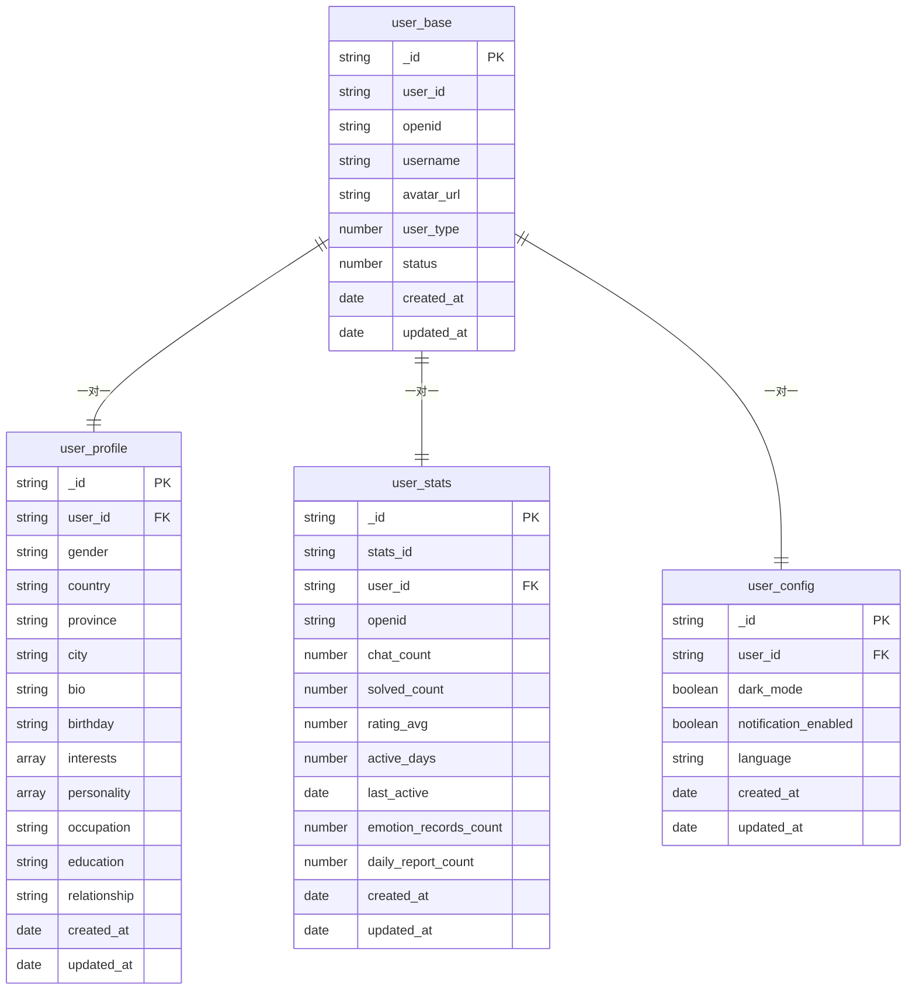
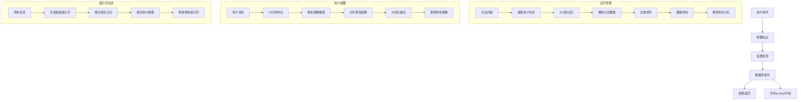
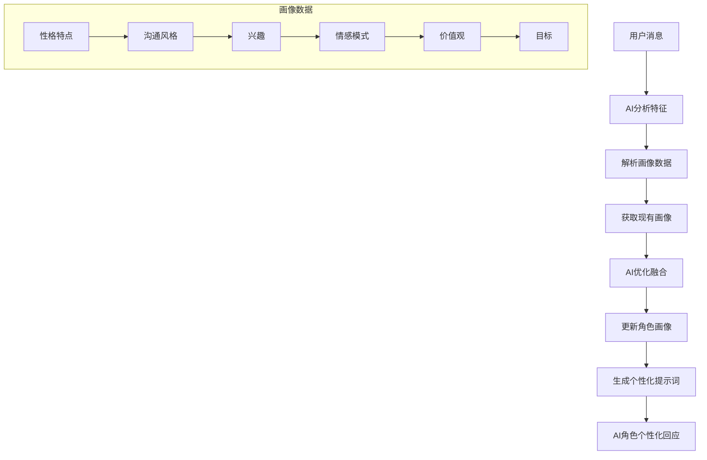

# 核心功能模块

<cite>
**本文档引用文件**  
- [index.js](file://cloudfunctions/roles/index.js)
- [aiModelService.js](file://cloudfunctions/analysis/aiModelService.js)
- [chat.js](file://miniprogram/packageChat/pages/chat/chat.js)
- [userPerception.js](file://cloudfunctions/roles/userPerception.js)
- [emotionService.js](file://miniprogram/services/emotionService.js)
- [user.js](file://cloudfunctions/user/index.js)
- [roles.md](file://doc/开发文档/cloudfunctions/roles.md)
- [user.md](file://doc/开发文档/cloudfunctions/user.md)
- [emotion.yml](file://dify/情感分析.yml)
- [user_profile.md](file://doc/开发文档/database/user_profile.md)
- [userInterests.md](file://doc/开发文档/database/userInterests.md)
- [roles.md](file://doc/开发文档/database/roles.md)
- [user_config.md](file://doc/开发文档/database/user_config.md)
- [userInterestAnalyzer.js](file://cloudfunctions/analysis/userInterestAnalyzer.js)
</cite>

## 目录
1. [用户系统](#用户系统)
2. [角色系统](#角色系统)
3. [聊天系统](#聊天系统)
4. [情感分析系统](#情感分析系统)
5. [用户画像系统](#用户画像系统)

## 用户系统

用户系统是HeartChat的基础模块，负责管理用户的身份认证、基本信息、个性化配置和行为统计。系统通过微信OpenID进行身份识别，并维护用户在平台上的完整生命周期数据。

该系统包含四个核心数据表：`user_base`（基础信息）、`user_profile`（详细资料）、`user_stats`（统计信息）和`user_config`（配置信息）。`user_base`表存储用户ID、昵称、头像等核心身份信息；`user_profile`表扩展了性别、地区、生日、兴趣等个性化数据；`user_stats`表记录用户的聊天次数、活跃天数、评分等行为指标；`user_config`表则保存用户的界面偏好，如暗黑模式、通知设置和语言选择。

用户系统通过`user`云函数提供统一的API接口，支持用户信息的创建、读取、更新和删除操作。系统在用户首次登录时自动创建基础信息，并允许用户后续完善个人资料。配置变更实时生效，且敏感操作需进行权限验证。系统还实现了智能的统计更新机制，在用户进行关键操作（如开始新对话）时自动递增相应的统计指标。



**图表来源**  
- [user_profile.md](file://doc/开发文档/database/user_profile.md)
- [user.md](file://doc/开发文档/cloudfunctions/user.md)

**本节来源**  
- [user.js](file://cloudfunctions/user/index.js#L143-L192)
- [user_profile.md](file://doc/开发文档/database/user_profile.md)
- [user_config.md](file://doc/开发文档/database/user_config.md)

## 角色系统

角色系统是HeartChat的核心交互模块，支持用户创建、编辑、管理和使用AI角色。每个角色都拥有独立的个性、记忆和用户画像，能够提供个性化的对话体验。系统通过`roles`云函数提供完整的CRUD（创建、读取、更新、删除）功能，并支持对角色的使用情况进行统计。

角色的核心数据存储在`roles`集合中，包含角色ID、名称、头像、分类、描述、个性特征、提示词（prompt）和欢迎语等字段。系统特别设计了`memories`数组来存储角色的长期记忆，每条记忆包含内容、重要性评分、分类和时间戳。`user_perception`字段则用于存储角色对特定用户的画像，包括兴趣、偏好、沟通风格和情感模式。

角色系统的实现逻辑分为四个主要流程：角色管理、记忆管理、用户画像和提示词生成。角色管理流程处理基础的增删改查操作；记忆管理流程在每次对话后分析内容，提取重要信息并更新角色的记忆；用户画像流程分析用户消息，识别其性格特征和兴趣偏好；提示词生成流程则将角色信息、相关记忆和用户画像融合，生成动态的系统提示词，使AI的回应更加个性化和连贯。



**图表来源**  
- [index.js](file://cloudfunctions/roles/index.js)
- [roles.md](file://doc/开发文档/cloudfunctions/roles.md)

**本节来源**  
- [index.js](file://cloudfunctions/roles/index.js)
- [roles.md](file://doc/开发文档/cloudfunctions/roles.md)
- [roles.md](file://doc/开发文档/database/roles.md)

## 聊天系统

聊天系统是HeartChat的核心交互界面，负责处理用户与AI角色之间的消息传递、显示和管理。系统通过`chat`云函数提供消息发送、历史记录获取和AI回复生成等核心功能，并实现了消息分段输出、本地缓存和下拉刷新等优化体验。

当用户发送消息时，系统首先在前端显示用户消息气泡，然后调用`chat`云函数。云函数会查询角色信息，构建包含角色个性和上下文的提示词，调用AI模型生成回复。AI的完整回复会被`splitMessage`函数按自然段落、句子或字符数进行智能分段，然后通过`showNextAiMessage`方法逐个显示，模拟真实打字的节奏感。每条分段消息之间有动态计算的延迟，使交互更加自然。

聊天记录被持久化存储在`chats`和`messages`两个集合中。`chats`集合记录会话级别的信息，如角色ID、消息数量和最后更新时间；`messages`集合则存储每一条具体的消息，包括发送者、内容、时间戳和AI模型等元数据。系统支持本地缓存，确保在网络不稳定时仍能访问历史记录，并在恢复后自动同步。聊天界面还集成了情绪分析功能，能在消息下方自动显示情绪标签。

```mermaid
flowchart TD
A[用户发送消息] --> B[前端显示用户消息]
B --> C[调用 chat 云函数]
C --> D[保存用户消息到数据库]
D --> E[调用智谱AI API]
E --> F[生成AI回复]
F --> G[保存AI回复到数据库]
G --> H[返回AI回复和情绪分析结果]
H --> I[前端显示AI回复]
I --> J[更新情绪分析面板]
subgraph 云函数 chat
C1[接收消息和角色ID] --> C2[查询角色信息]
C2 --> C3[构建提示词]
C3 --> C4[调用智谱AI GLM-4-Flash API]
C4 --> C5[处理AI回复]
C5 --> C6[保存消息到数据库]
C6 --> C7[返回结果]
end
subgraph 数据库
DB1[(roles 集合)]
DB2[(chats 集合)]
DB3[(messages 集合)]
C2 < --> DB1
C6 < --> DB2
C6 < --> DB3
end
subgraph 外部API
API1[智谱AI GLM-4-Flash API]
C4 < --> API1
end
```

**图表来源**  
- [chat.js](file://miniprogram/packageChat/pages/chat/chat.js)
- [index.js](file://cloudfunctions/chat/index.js)
- [HeartChat功能实现流程图.md](file://doc/设计文档/流程图/HeartChat功能实现流程图.md)

**本节来源**  
- [chat.js](file://miniprogram/packageChat/pages/chat/chat.js)
- [index.js](file://cloudfunctions/chat/index.js)
- [@聊天消息分段输出计划.md](file://doc/使用文档/@聊天消息分段输出计划.md)

## 情感分析系统

情感分析系统基于AI模型对用户的输入进行深度情绪识别，并将结果可视化展示。系统通过`analysis`云函数调用Gemini、智谱AI等大模型，对文本进行多维度的情感分析，包括主要情绪、情绪强度、愉悦度、唤醒度和情绪趋势。

系统采用Dify平台的`情感分析.yml`配置文件定义分析要求，运用8大类32子类的情感体系进行精准分类，识别表面情感下的深层需求。分析结果以JSON格式返回，包含`primary_emotion`（主要情绪）、`secondary_emotions`（次要情绪）、`intensity`（强度）、`valence`（愉悦度）、`arousal`（唤醒度）、`trend`（趋势）以及`topic_keywords`（主题关键词）和`suggestions`（建议）等丰富字段。所有文本字段均使用中文表达，便于前端直接展示。

前端通过`emotionService.js`服务处理分析结果。系统会将英文情绪类型映射为中文（如'joy'映射为'喜悦'），并将0-1范围的数值转换为0-100的百分比值用于可视化。情绪仪表盘组件会显示主要情绪、强度、愉悦度和唤醒度的雷达图，并展示关键词和建议。系统还支持情绪历史记录，可以统计用户在一段时间内的情绪变化轨迹。

```mermaid
flowchart TD
A[用户输入文本] --> B[调用 analysis 云函数]
B --> C[构建情感分析提示词]
C --> D[调用 Gemini/智谱AI API]
D --> E[返回JSON格式分析结果]
E --> F[前端解析结果]
F --> G[情绪类型映射 (英文->中文)]
G --> H[数值标准化 (0-1 -> 0-100%)]
H --> I[更新情绪仪表盘]
I --> J[显示情绪标签和建议]
J --> K[存储情绪记录到数据库]
subgraph 分析要求
C1[情感识别] --> C2[强度分析]
C2 --> C3[趋势判断]
C3 --> C4[模式识别]
C4 --> C5[情商建议]
C5 --> C6[风险评估]
end
```

**图表来源**  
- [aiModelService.js](file://cloudfunctions/analysis/aiModelService.js)
- [emotionService.js](file://miniprogram/services/emotionService.js)
- [情感分析.yml](file://dify/情感分析.yml)

**本节来源**  
- [aiModelService.js](file://cloudfunctions/analysis/aiModelService.js#L300-L314)
- [emotionService.js](file://miniprogram/services/emotionService.js#L862-L911)
- [情感分析.yml](file://dify/情感分析.yml)

## 用户画像系统

用户画像系统使AI角色能够了解用户的兴趣、偏好和情感模式，从而提供更个性化的互动。系统通过持续分析用户的对话内容，动态更新角色对用户的认知，并在对话中自然地反馈这些观察。

该系统的核心是`userPerception.js`模块。当用户与角色进行对话后，系统会调用智谱AI分析用户消息，提取其性格特征、沟通风格、兴趣和情感模式。新生成的用户画像会与角色中存储的旧画像进行融合。融合过程通过`mergeUserPerception`函数实现，该函数将新旧画像转换为文本，再交由AI进行智能优化和合并，确保画像的连贯性和准确性。

用户画像数据存储在`roles`集合的`user_perception`字段中，包含`interests`（兴趣）、`preferences`（偏好）、`communication_style`（沟通风格）和`emotional_patterns`（情感模式）等子字段。角色在对话时会参考这些信息，调整回应方式。例如，在用户情绪低落时提供安慰，在用户需要建议时提供批评性意见。用户也可以在个人信息页面查看系统生成的用户画像摘要。



**图表来源**  
- [userPerception.js](file://cloudfunctions/roles/userPerception.js)
- [user.md](file://doc/开发文档/cloudfunctions/user.md)

**本节来源**  
- [userPerception.js](file://cloudfunctions/roles/userPerception.js#L154-L189)
- [user.md](file://doc/开发文档/cloudfunctions/user.md#L274-L353)
- [角色选择页面详细文档.md](file://doc/使用文档/角色选择页面详细文档.md#L300-L333)