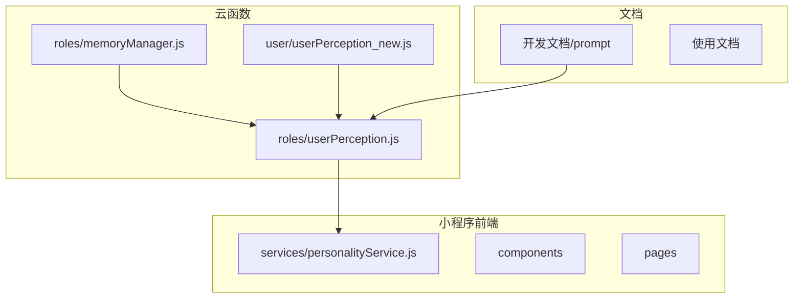
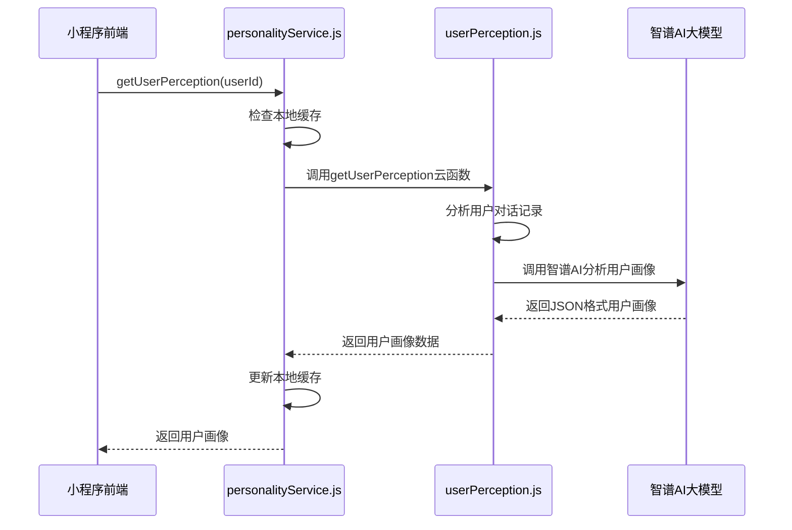
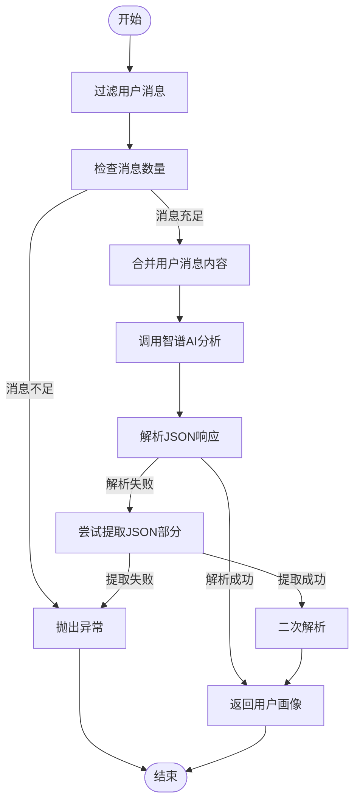
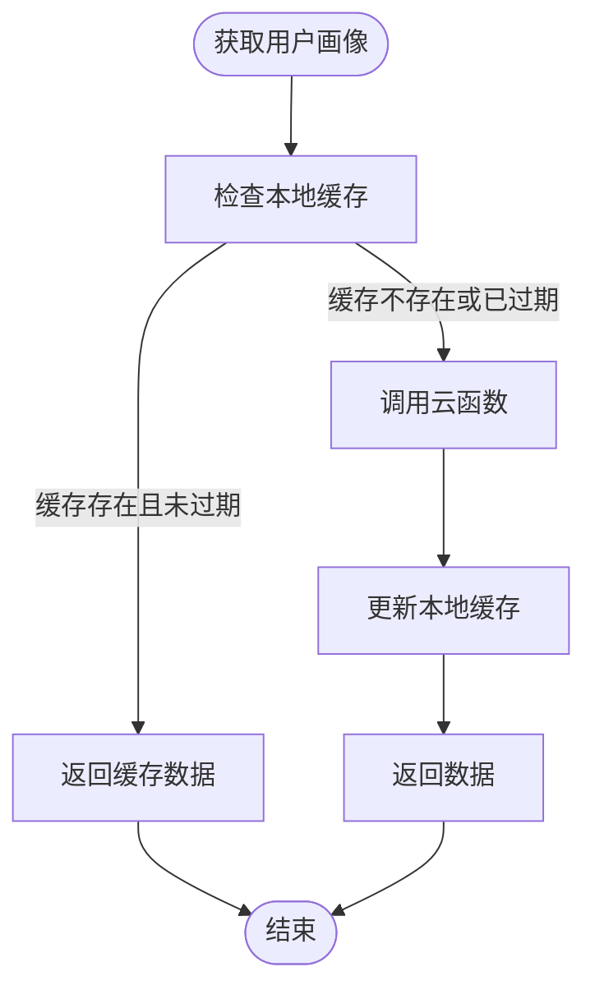
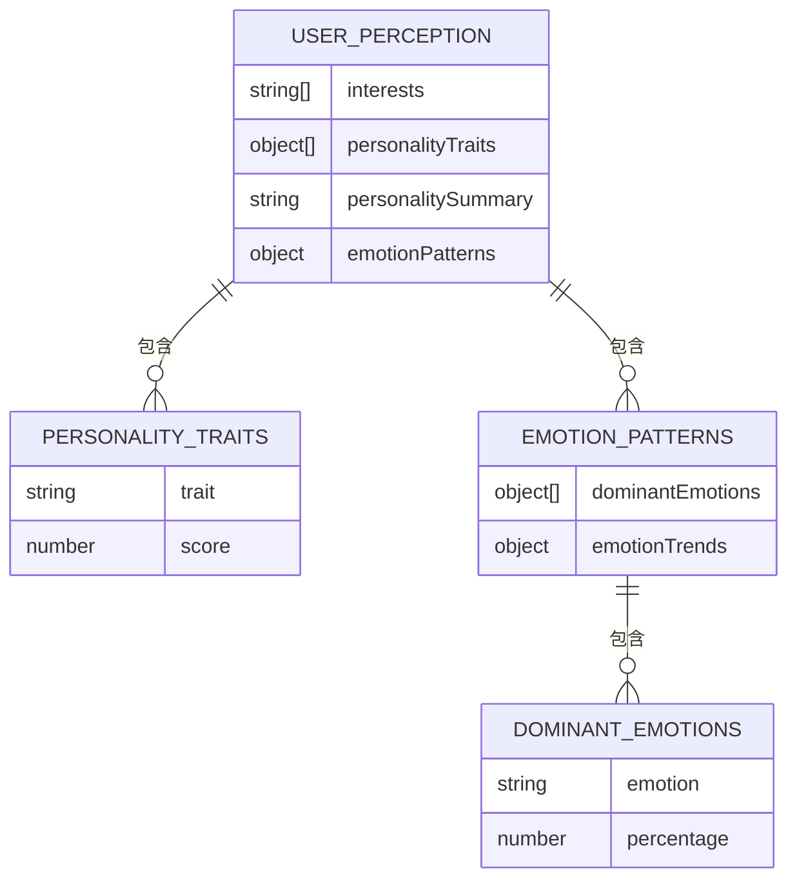
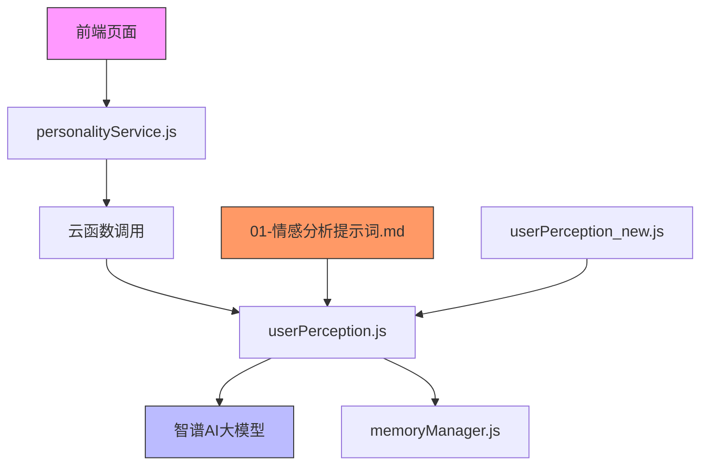

# 个性特征提取

<cite>
**本文档引用文件**   
- [userPerception.js](file://cloudfunctions/roles/userPerception.js)
- [personalityService.js](file://miniprogram/services/personalityService.js)
- [memoryManager.js](file://cloudfunctions/roles/memoryManager.js)
- [01-情感分析提示词.md](file://doc/开发文档/prompt/01-情感分析提示词.md)
- [userPerception_new.js](file://cloudfunctions/user/userPerception_new.js)
</cite>

## 目录
1. [简介](#简介)
2. [项目结构](#项目结构)
3. [核心组件](#核心组件)
4. [架构概述](#架构概述)
5. [详细组件分析](#详细组件分析)
6. [依赖分析](#依赖分析)
7. [性能考量](#性能考量)
8. [故障排除指南](#故障排除指南)
9. [结论](#结论)

## 简介
本文档深入解析HeartChat应用中个性特征提取机制的实现原理。系统通过`userPerception.js`结合对话内容、情感分析结果与交互行为模式，运用预设提示词驱动大模型生成用户性格画像（如外向性、情绪稳定性等维度）。角色记忆系统基于用户画像动态调整对话策略与回应风格。`personalityService.js`在前端实现角色感知数据获取与缓存机制，包括数据更新频率控制与本地存储策略。文档结合角色互动场景，说明性格特征如何影响AI角色的语气、话题引导与共情表达，并提供调试与验证方法。

## 项目结构
HeartChat项目采用分层架构，主要包含云函数、小程序前端、文档与配置文件三大模块。云函数目录`cloudfunctions`包含多个功能模块，其中`roles`和`user`模块负责用户感知与角色管理。小程序前端`miniprogram`包含组件、页面与服务模块，`services`目录下的`personalityService.js`负责前端用户画像服务。文档目录`doc`包含详细的使用、开发与设计文档，为系统实现提供理论支持。



**图源**
- [userPerception.js](file://cloudfunctions/roles/userPerception.js)
- [personalityService.js](file://miniprogram/services/personalityService.js)
- [memoryManager.js](file://cloudfunctions/roles/memoryManager.js)

**节源**
- [userPerception.js](file://cloudfunctions/roles/userPerception.js)
- [personalityService.js](file://miniprogram/services/personalityService.js)

## 核心组件
系统核心组件包括用户感知模块`userPerception.js`、角色记忆管理模块`memoryManager.js`和前端个性服务模块`personalityService.js`。`userPerception.js`负责从对话中提取用户画像，`memoryManager.js`管理角色记忆，`personalityService.js`在前端提供用户画像服务。这些组件协同工作，实现完整的个性特征提取与应用流程。

**节源**
- [userPerception.js](file://cloudfunctions/roles/userPerception.js#L1-L314)
- [memoryManager.js](file://cloudfunctions/roles/memoryManager.js#L1-L799)
- [personalityService.js](file://miniprogram/services/personalityService.js#L1-L309)

## 架构概述
系统采用前后端分离架构，前端通过云函数调用实现用户画像生成与获取。`personalityService.js`作为前端服务层，负责缓存管理与数据获取。`userPerception.js`作为后端核心，调用大模型进行用户画像分析。`memoryManager.js`负责角色记忆的提取与更新。整个系统通过预设提示词引导大模型生成结构化用户画像。



**图源**
- [personalityService.js](file://miniprogram/services/personalityService.js#L14-L48)
- [userPerception.js](file://cloudfunctions/roles/userPerception.js#L70-L140)

## 详细组件分析
### userPerception.js分析
`userPerception.js`是用户画像生成的核心模块，通过调用智谱AI大模型从用户对话中提取兴趣、偏好、沟通风格和情感模式等特征。

#### 用户画像分析流程


**图源**
- [userPerception.js](file://cloudfunctions/roles/userPerception.js#L70-L140)

#### 用户画像合并机制
当系统需要更新用户画像时，会将新旧画像进行合并，确保用户特征的连续性和完整性。

```mermaid
classDiagram
class userPerception {
+analyzeUserPerception(messages, userId, roleId)
+updateRoleUserPerception(roleId, userId, newPerception)
+generateUserPerceptionSummary(userPerception)
+mergeUserPerception(existingPerception, newPerception)
}
class memoryManager {
+extractMemoriesFromChat(messages, roleInfo)
+updateRoleMemories(roleId, newMemories)
+mergeMemories(memories)
}
userPerception --> memoryManager : "使用记忆管理功能"
userPerception --> "智谱AI" : "调用大模型API"
```

**图源**
- [userPerception.js](file://cloudfunctions/roles/userPerception.js)
- [memoryManager.js](file://cloudfunctions/roles/memoryManager.js)

**节源**
- [userPerception.js](file://cloudfunctions/roles/userPerception.js#L1-L314)

### personalityService.js分析
`personalityService.js`是前端用户画像服务模块，负责管理用户画像的获取、缓存和使用。

#### 前端缓存机制


**图源**
- [personalityService.js](file://miniprogram/services/personalityService.js#L14-L48)

#### 用户画像数据结构


**图源**
- [personalityService.js](file://miniprogram/services/personalityService.js)

**节源**
- [personalityService.js](file://miniprogram/services/personalityService.js#L1-L309)

## 依赖分析
系统各组件之间存在明确的依赖关系，形成完整的用户画像处理链条。



**图源**
- [userPerception.js](file://cloudfunctions/roles/userPerception.js)
- [personalityService.js](file://miniprogram/services/personalityService.js)
- [memoryManager.js](file://cloudfunctions/roles/memoryManager.js)

**节源**
- [userPerception.js](file://cloudfunctions/roles/userPerception.js#L1-L314)
- [personalityService.js](file://miniprogram/services/personalityService.js#L1-L309)

## 性能考量
系统在性能方面进行了多项优化，确保用户画像生成的效率和可靠性。`personalityService.js`实现了本地缓存机制，缓存有效期为1小时，减少重复的云函数调用。`userPerception.js`使用`glm-4-flash`快速模型进行分析，降低响应延迟。系统还实现了错误处理和降级机制，当AI分析失败时可返回默认数据，确保前端功能正常。

**节源**
- [personalityService.js](file://miniprogram/services/personalityService.js#L20-L25)
- [userPerception.js](file://cloudfunctions/roles/userPerception.js#L85-L86)

## 故障排除指南
当用户画像功能出现问题时，可按照以下步骤进行排查：

1. **检查环境变量**：确保`ZHIPU_API_KEY`已正确配置
2. **检查网络连接**：确认小程序能正常调用云函数
3. **检查缓存状态**：清除本地缓存后重新获取
4. **查看日志信息**：检查云函数日志中的错误信息
5. **验证提示词**：确认提示词格式和内容正确

**节源**
- [userPerception.js](file://cloudfunctions/roles/userPerception.js#L10-L15)
- [personalityService.js](file://miniprogram/services/personalityService.js#L3-L5)

## 结论
HeartChat的个性特征提取机制通过前后端协同工作，实现了从用户对话中提取、分析和应用用户画像的完整流程。系统利用大模型的强大分析能力，结合预设提示词，生成结构化的用户性格画像。前端通过缓存机制优化性能，后端通过错误处理确保稳定性。该机制为AI角色提供了丰富的用户认知，使其能够提供更加个性化和人性化的交互体验。