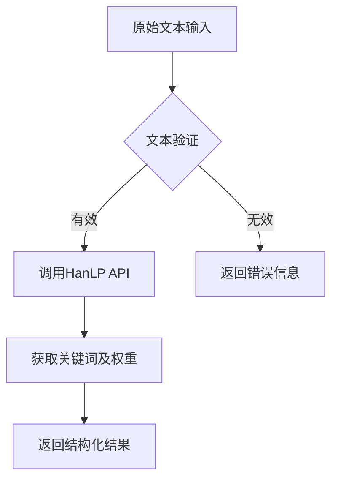
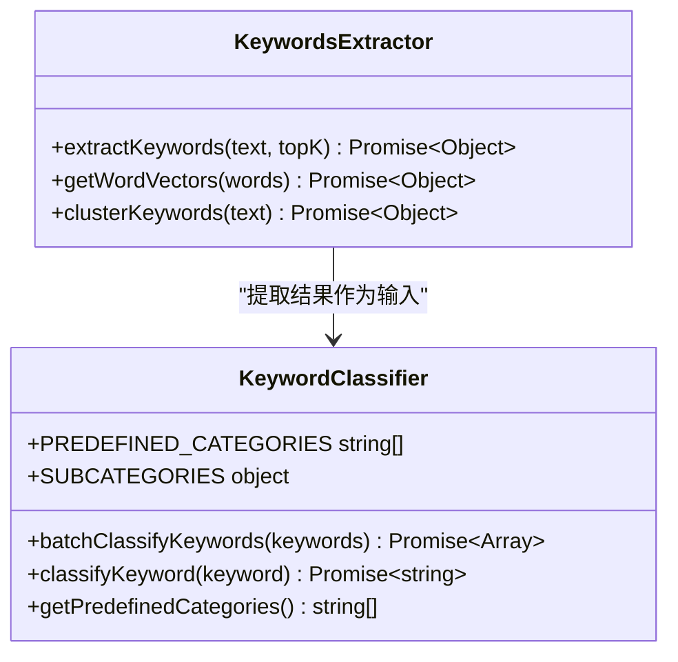
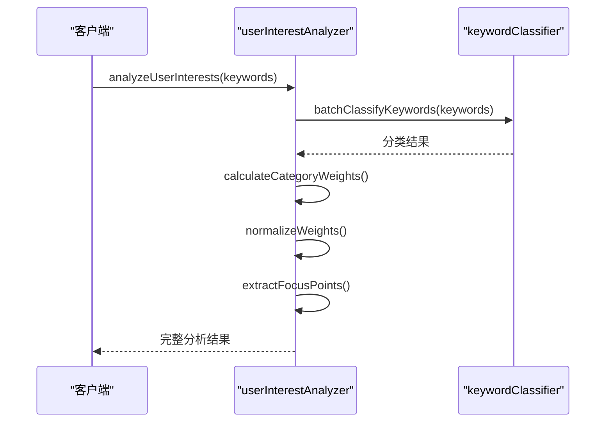
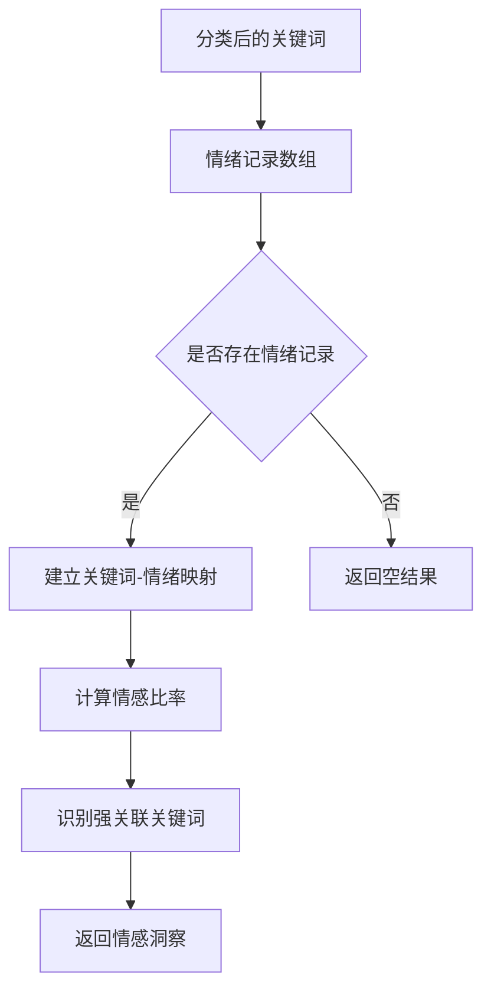
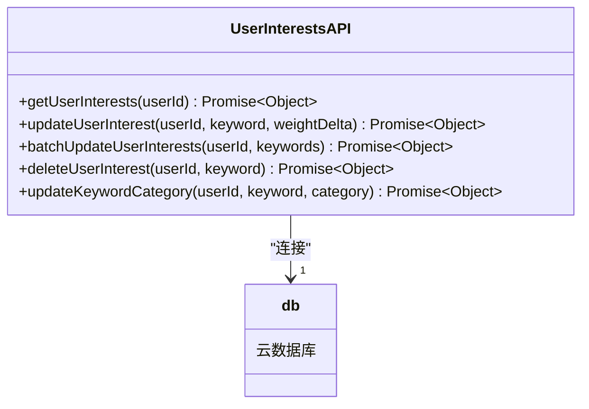
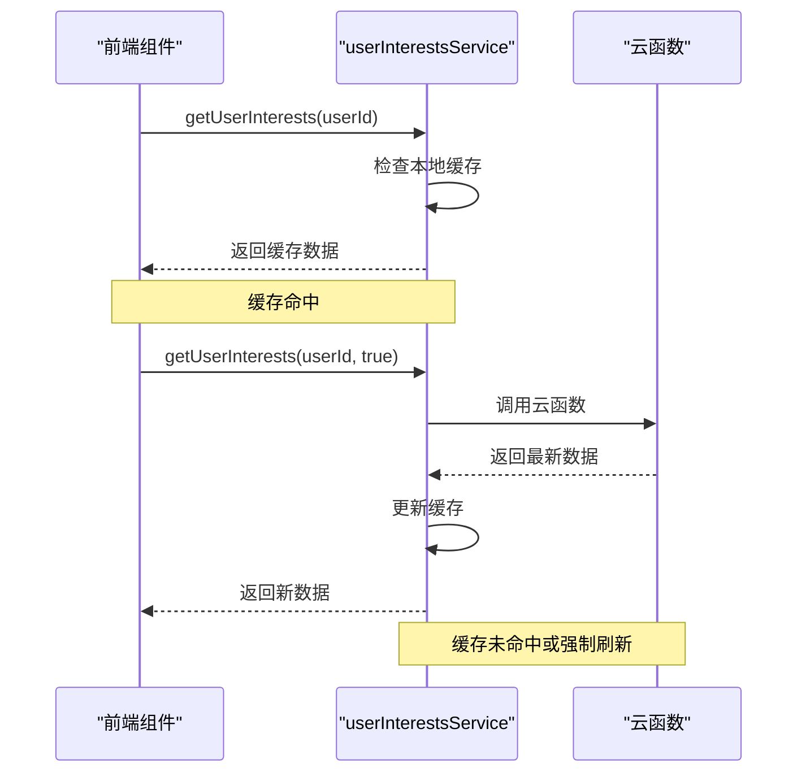
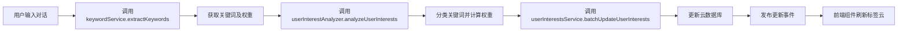

# 兴趣分析

<cite>
**本文档引用的文件**
- [keywordClassifier.js](file://cloudfunctions/analysis/keywordClassifier.js)
- [keywords.js](file://cloudfunctions/analysis/keywords.js)
- [userInterestAnalyzer.js](file://cloudfunctions/analysis/userInterestAnalyzer.js)
- [userInterests.js](file://cloudfunctions/user/userInterests.js)
- [userInterestsService.js](file://miniprogram/services/userInterestsService.js)
</cite>

## 目录
1. [简介](#简介)
2. [关键词提取与分类](#关键词提取与分类)
3. [用户兴趣分析流程](#用户兴趣分析流程)
4. [用户兴趣数据管理](#用户兴趣数据管理)
5. [前端服务封装](#前端服务封装)
6. [完整数据流示例](#完整数据流示例)
7. [错误处理与性能优化](#错误处理与性能优化)

## 简介
本系统通过多层分析机制实现用户兴趣的动态识别与可视化。系统基于用户对话内容，利用自然语言处理技术提取关键词，结合语义分类与情感权重，生成个性化的兴趣标签云。整个流程涵盖从文本输入到数据存储再到前端展示的完整闭环，支持实时更新与历史数据分析。

## 关键词提取与分类

### 关键词提取机制
系统采用HanLP API实现关键词提取功能。`keywords.js`模块提供`extractKeywords`函数，接收用户输入文本并返回带权重的关键词列表。该函数通过HTTP请求调用外部HanLP服务，使用余弦相似度算法进行词向量计算，并支持聚类分析以识别语义相近的关键词组。

**图表来源**
- [keywords.js](file://cloudfunctions/analysis/keywords.js#L20-L50)

**本节来源**
- [keywords.js](file://cloudfunctions/analysis/keywords.js#L1-L100)

### 关键词分类策略
`keywordClassifier.js`模块实现关键词的自动分类功能。系统预定义了25个兴趣类别（如学习、工作、娱乐等），每个类别包含详细的子类别映射。分类过程采用双模式策略：

1. **本地规则匹配**：当未配置AI API密钥时，使用字符串包含规则进行快速分类
2. **大模型智能分类**：当配置了ZHIPU_API_KEY时，调用大模型进行语义理解与精准分类

**图表来源**
- [keywordClassifier.js](file://cloudfunctions/analysis/keywordClassifier.js#L15-L30)
- [keywords.js](file://cloudfunctions/analysis/keywords.js#L1-L15)

**本节来源**
- [keywordClassifier.js](file://cloudfunctions/analysis/keywordClassifier.js#L1-L150)

## 用户兴趣分析流程

### 多维度兴趣分析
`userInterestAnalyzer.js`模块负责整合关键词与情绪数据，生成综合性的用户兴趣画像。该模块通过`analyzeUserInterests`函数实现核心分析逻辑，包含以下四个步骤：

1. **关键词分类**：调用`keywordClassifier.batchClassifyKeywords`对提取的关键词进行类别标注
2. **权重计算**：统计每个类别下关键词的权重总和
3. **标准化处理**：将原始权重转换为百分比形式，便于比较与展示
4. **关注点提取**：识别权重最高的前五个类别作为用户主要关注领域

**图表来源**
- [userInterestAnalyzer.js](file://cloudfunctions/analysis/userInterestAnalyzer.js#L20-L40)
- [keywordClassifier.js](file://cloudfunctions/analysis/keywordClassifier.js#L150-L200)

**本节来源**
- [userInterestAnalyzer.js](file://cloudfunctions/analysis/userInterestAnalyzer.js#L1-L100)

### 情感关联分析
系统还实现了关键词与情绪记录的关联分析功能。通过分析历史情绪数据中关键词的出现频率与对应情绪极性（积极/消极/中性），系统能够识别出与特定情绪强相关的关键词。这种分析有助于理解用户在讨论不同话题时的情感倾向。

**图表来源**
- [userInterestAnalyzer.js](file://cloudfunctions/analysis/userInterestAnalyzer.js#L180-L250)

**本节来源**
- [userInterestAnalyzer.js](file://cloudfunctions/analysis/userInterestAnalyzer.js#L150-L280)

## 用户兴趣数据管理

### RESTful接口设计
`userInterests.js`云函数提供了完整的用户兴趣数据管理接口，遵循RESTful设计原则。主要接口包括：

- **获取用户兴趣**：`getUserInterests(userId)` - 查询指定用户的兴趣数据
- **更新单个关键词**：`updateUserInterest()` - 增量调整关键词权重
- **批量更新关键词**：`batchUpdateUserInterests()` - 批量处理多个关键词
- **删除关键词**：`deleteUserInterest()` - 移除指定关键词
- **更新分类信息**：`updateKeywordCategory()` - 修改关键词所属类别

**图表来源**
- [userInterests.js](file://cloudfunctions/user/userInterests.js#L20-L50)

**本节来源**
- [userInterests.js](file://cloudfunctions/user/userInterests.js#L1-L150)

### 数据存储结构
用户兴趣数据存储在名为`userInterests`的数据库集合中，每条记录包含以下核心字段：
- `userId`: 用户唯一标识
- `keywords`: 关键词数组，每个元素包含词、权重、分类、情感分数等属性
- `categories`: 分类统计数组，记录各分类的出现次数
- `createTime`: 记录创建时间
- `lastUpdated`: 最后更新时间

## 前端服务封装

### 服务层封装
`userInterestsService.js`在前端实现了对云函数的封装，提供了更易用的API接口。该服务包含缓存机制，使用微信小程序的本地存储实现30分钟的数据缓存，减少不必要的网络请求。

**图表来源**
- [userInterestsService.js](file://miniprogram/services/userInterestsService.js#L20-L50)

**本节来源**
- [userInterestsService.js](file://miniprogram/services/userInterestsService.js#L1-L100)

### 事件驱动更新
服务层采用事件总线模式实现数据变更通知。当用户兴趣数据发生更新时，服务会发布`INTEREST_UPDATED`或`INTEREST_BATCH_UPDATED`事件，相关组件可以订阅这些事件以实现界面的实时刷新。

## 完整数据流示例

### 从文本到标签的完整流程
以下是一个典型的用户对话到兴趣标签更新的完整数据流：

**图表来源**
- [userInterestsService.js](file://miniprogram/services/userInterestsService.js#L400-L450)
- [userInterestAnalyzer.js](file://cloudfunctions/analysis/userInterestAnalyzer.js#L1-L20)

**本节来源**
- [userInterestsService.js](file://miniprogram/services/userInterestsService.js#L400-L500)

## 错误处理与性能优化

### 错误处理策略
系统在各个层面都实现了完善的错误处理机制：
- **参数验证**：所有函数首先验证输入参数的有效性
- **异常捕获**：使用try-catch块捕获异步操作中的异常
- **降级策略**：当AI分类服务不可用时，自动切换到本地规则匹配
- **日志记录**：关键操作均输出详细日志，便于问题排查

### 性能优化建议
1. **缓存优化**：合理利用前端缓存，避免频繁调用云函数
2. **批量操作**：优先使用批量更新接口，减少网络请求次数
3. **权重调整**：采用加权平均算法平滑情感分数变化，避免剧烈波动
4. **分类预加载**：预加载常用分类映射表，提高本地分类效率
5. **连接复用**：保持与HanLP API的长连接，减少握手开销

**本节来源**
- [userInterestsService.js](file://miniprogram/services/userInterestsService.js#L500-L600)
- [userInterests.js](file://cloudfunctions/user/userInterests.js#L700-L800)