# 用户画像系统

<cite>
**本文档引用文件**  
- [keywordClassifier.js](file://cloudfunctions/analysis/keywordClassifier.js)
- [userInterestAnalyzer.js](file://cloudfunctions/analysis/userInterestAnalyzer.js)
- [userPerception_new.js](file://cloudfunctions/user/userPerception_new.js)
- [userInterests.js](file://cloudfunctions/user/userInterests.js)
- [userInterestsService.js](file://miniprogram/services/userInterestsService.js)
- [user_interests 集合结构](file://doc/设计文档/流程图/HeartChat数据库结构图.md)
</cite>

## 目录
1. [系统概述](#系统概述)
2. [关键词提取与分类](#关键词提取与分类)
3. [用户兴趣标签云生成](#用户兴趣标签云生成)
4. [用户性格特征分析](#用户性格特征分析)
5. [兴趣数据CRUD接口与前端交互](#兴趣数据crud接口与前端交互)
6. [用户画像应用实践](#用户画像应用实践)
7. [数据更新与隐私保护](#数据更新与隐私保护)

## 系统概述

用户画像系统是HeartChat应用的核心智能模块，通过分析用户对话内容，构建多维度的用户认知模型。系统采用分层架构，包含关键词提取、兴趣聚合、性格分析、数据存储与服务调用等组件，为个性化互动和内容推荐提供数据支持。

系统主要由以下模块构成：
- **keywordClassifier.js**：关键词分类器，负责将提取的关键词归入预定义类别
- **userInterestAnalyzer.js**：用户兴趣分析器，聚合关键词生成兴趣标签云
- **userPerception_new.js**：用户感知模块，分析用户性格特征
- **userInterests.js**：云函数，提供兴趣数据的CRUD接口
- **userInterestsService.js**：前端服务，与云函数交互获取用户兴趣数据

系统通过分析用户对话中的关键词，结合情绪记录，动态更新用户画像，实现个性化的角色互动和内容推荐。

## 关键词提取与分类

关键词提取与分类是用户画像构建的第一步，系统通过`keywordClassifier.js`模块实现关键词的智能分类。

### 分类策略

系统采用混合分类策略，优先使用大模型进行精准分类，当大模型不可用时，采用本地规则分类：

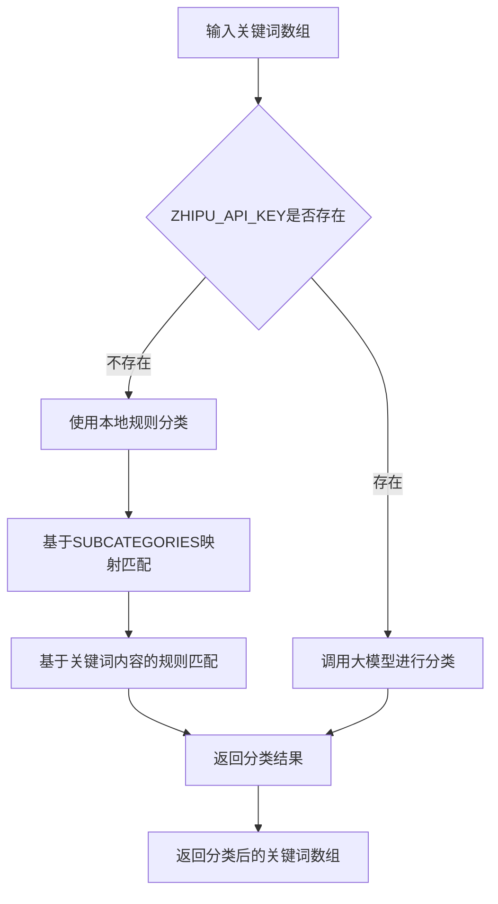

**Diagram sources**  
- [keywordClassifier.js](file://cloudfunctions/analysis/keywordClassifier.js#L118-L143)

### 预定义分类体系

系统预定义了25个兴趣类别，涵盖学习、工作、娱乐等多个维度：

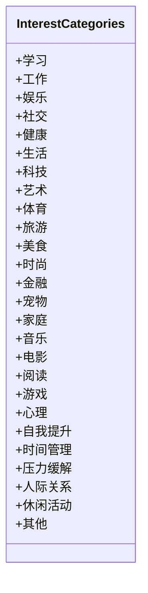

**Diagram sources**  
- [keywordClassifier.js](file://cloudfunctions/analysis/keywordClassifier.js#L10-L35)

### 分类实现逻辑

当使用本地规则分类时，系统首先尝试通过细分类别映射进行匹配，若未成功，则根据关键词内容应用特定规则：

```javascript
// 学习相关
if (keyword.includes('学') || keyword.includes('考') || keyword.includes('课') ||
    keyword.includes('教') || keyword.includes('研') || keyword.includes('论文') ||
    keyword.includes('毕业') || keyword.includes('学位') || keyword.includes('博士') ||
    keyword.includes('知识') || keyword.includes('教育') || keyword.includes('学校')) {
  category = '学习';
}
// 工作相关
else if (keyword.includes('工作') || keyword.includes('公司') || keyword.includes('职业') ||
       keyword.includes('项目') || keyword.includes('业务') || keyword.includes('客户') ||
       keyword.includes('设计') || keyword.includes('开发') || keyword.includes('测试') ||
       keyword.includes('产品') || keyword.includes('市场') || keyword.includes('销售')) {
  category = '工作';
}
```

**Section sources**  
- [keywordClassifier.js](file://cloudfunctions/analysis/keywordClassifier.js#L118-L143)

## 用户兴趣标签云生成

用户兴趣标签云的生成由`userInterestAnalyzer.js`模块完成，该模块将分类后的关键词聚合为可视化的兴趣标签云。

### 兴趣分析流程

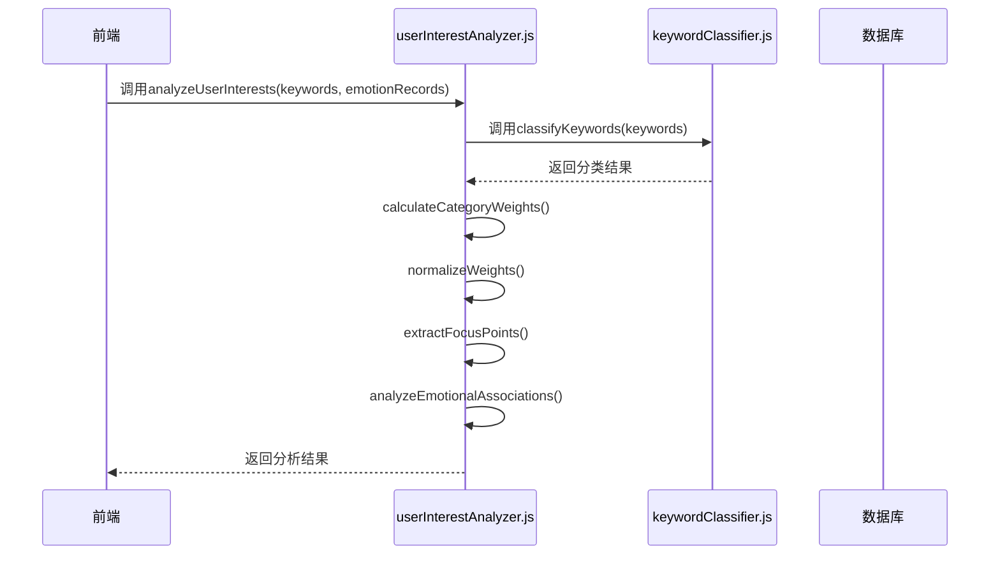

**Diagram sources**  
- [userInterestAnalyzer.js](file://cloudfunctions/analysis/userInterestAnalyzer.js#L36-L73)

### 权重计算与标准化

系统通过以下步骤计算和标准化兴趣权重：

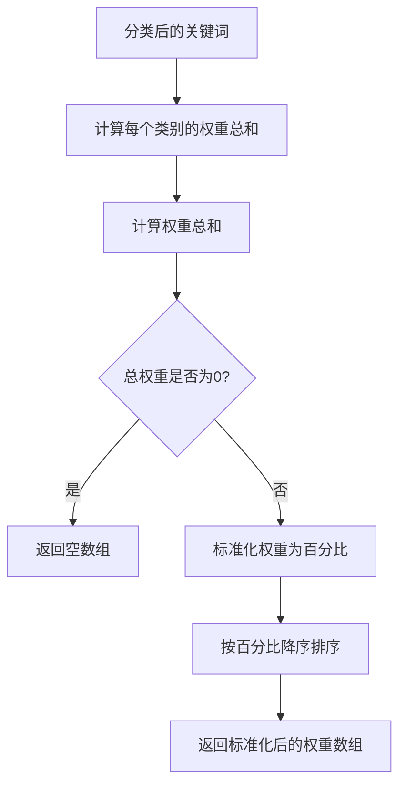

**Diagram sources**  
- [userInterestAnalyzer.js](file://cloudfunctions/analysis/userInterestAnalyzer.js#L103-L153)

### 聚合算法

系统采用加权聚合算法，将同类别关键词的权重相加，形成类别级别的兴趣强度：

```javascript
function calculateCategoryWeights(classifiedKeywords) {
  const categoryWeights = {};
  
  // 初始化所有预定义类别的权重为0
  INTEREST_CATEGORIES.forEach(category => {
    categoryWeights[category] = 0;
  });
  
  // 累加每个类别的权重
  classifiedKeywords.forEach(keyword => {
    const category = keyword.category;
    if (!categoryWeights[category]) {
      categoryWeights[category] = 0;
    }
    categoryWeights[category] += keyword.weight || 1;
  });
  
  return categoryWeights;
}
```

**Section sources**  
- [userInterestAnalyzer.js](file://cloudfunctions/analysis/userInterestAnalyzer.js#L103-L131)

## 用户性格特征分析

用户性格特征分析由`userPerception_new.js`模块实现，该模块通过分析用户对话内容和情绪记录，动态更新角色认知。

### 分析流程

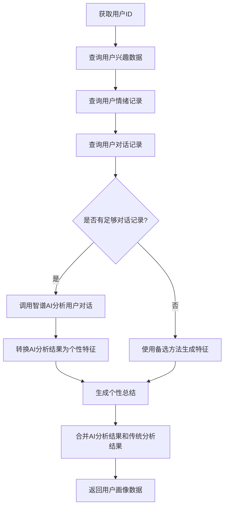

**Diagram sources**  
- [userPerception_new.js](file://cloudfunctions/user/userPerception_new.js#L61-L120)

### 特征映射机制

系统通过特征映射表将AI分析结果转换为结构化的个性特征数据：

```javascript
const traitMappings = {
  // 沟通风格相关特征
  '直接': { trait: '直接表达', score: 0.8 },
  '委婉': { trait: '委婉表达', score: 0.8 },
  '详细': { trait: '细节关注', score: 0.7 },
  '简洁': { trait: '简洁表达', score: 0.7 },
  '正式': { trait: '正式表达', score: 0.6 },
  '非正式': { trait: '随意表达', score: 0.7 },
  '礼貌': { trait: '礼貌性', score: 0.8 },
  '幽默': { trait: '幽默感', score: 0.8 },
  
  // 情感模式相关特征
  '情绪稳定': { trait: '情绪稳定性', score: 0.8 },
  '情绪波动': { trait: '情绪敏感性', score: 0.7 },
  '积极': { trait: '乐观性', score: 0.8 },
  '消极': { trait: '悲观性', score: 0.7 },
  '理性': { trait: '理性思考', score: 0.8 },
  '感性': { trait: '感性思考', score: 0.8 },
  '共情': { trait: '同理心', score: 0.9 },
  '自我': { trait: '自我关注', score: 0.7 },
  
  // 兴趣和偏好相关特征
  '艺术': { trait: '创造力', score: 0.8 },
  '音乐': { trait: '艺术鉴赏', score: 0.7 },
  '阅读': { trait: '求知欲', score: 0.8 },
  '学习': { trait: '学习能力', score: 0.8 },
  '科技': { trait: '技术思维', score: 0.7 },
  '旅行': { trait: '冒险精神', score: 0.7 },
  '社交': { trait: '社交性', score: 0.8 },
  '独处': { trait: '独立性', score: 0.7 },
  '运动': { trait: '活力', score: 0.7 },
  '美食': { trait: '感官享受', score: 0.6 },
  '工作': { trait: '责任感', score: 0.8 },
  '家庭': { trait: '亲和力', score: 0.8 }
};
```

**Section sources**  
- [userPerception_new.js](file://cloudfunctions/user/userPerception_new.js#L299-L331)

### 动态更新机制

系统定期分析用户最新的对话记录，动态更新用户性格特征，确保角色认知的时效性。当AI分析失败时，系统会自动切换到备选方法，保证服务的稳定性。

## 兴趣数据CRUD接口与前端交互

兴趣数据的CRUD操作通过`userInterests.js`云函数提供接口，前端通过`userInterestsService.js`服务与之交互。

### 数据库结构

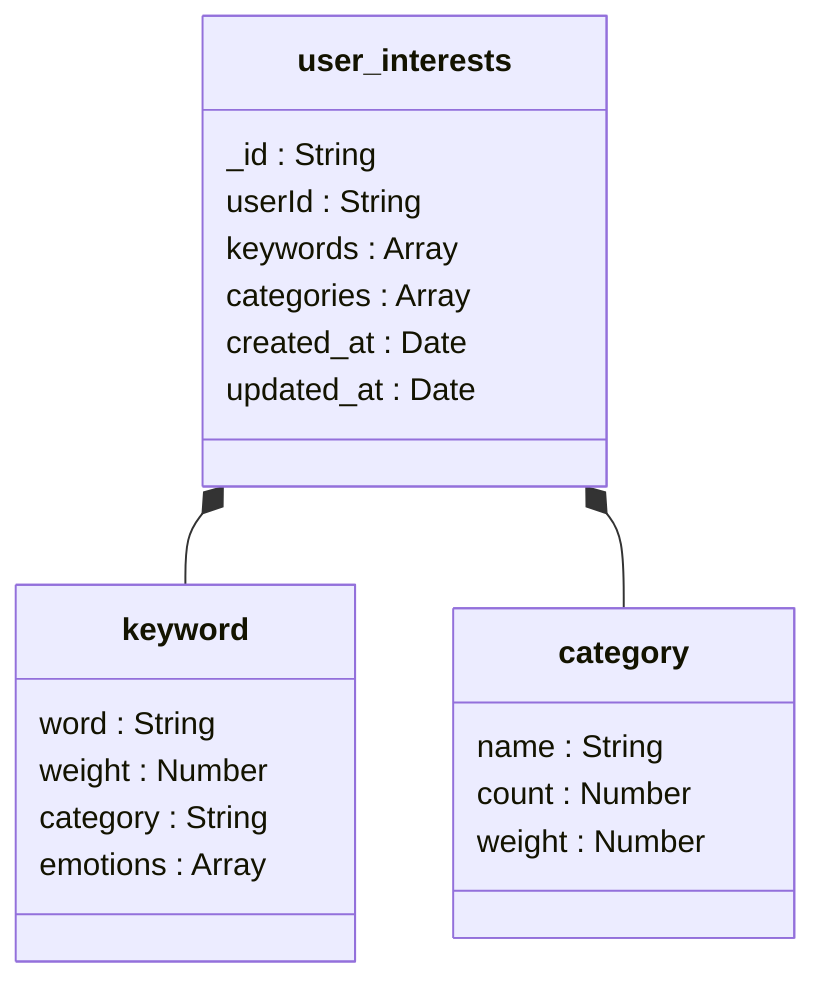

**Diagram sources**  
- [HeartChat数据库结构图.md](file://doc/设计文档/流程图/HeartChat数据库结构图.md#L149-L181)

### 云函数接口

`userInterests.js`云函数提供了完整的CRUD接口：

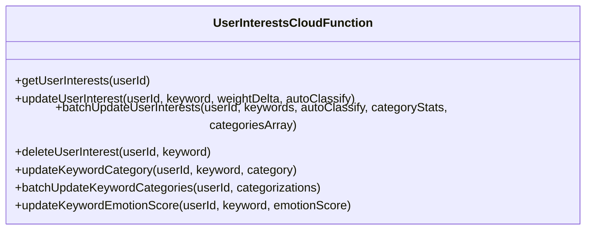

**Section sources**  
- [userInterests.js](file://cloudfunctions/user/userInterests.js#L0-L55)

### 前端服务交互

前端通过`userInterestsService.js`服务与云函数交互，实现了缓存机制和事件发布：

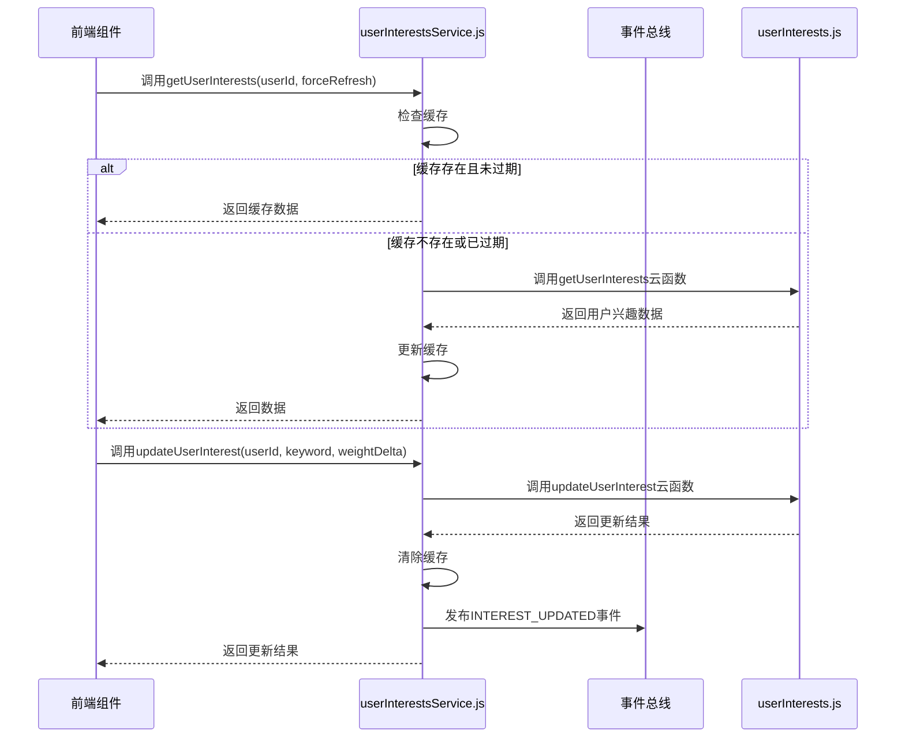

**Diagram sources**  
- [userInterestsService.js](file://miniprogram/services/userInterestsService.js#L0-L50)

### 缓存机制

系统实现了30分钟的本地缓存机制，减少云函数调用频率，提高响应速度：

```javascript
// 缓存相关常量
const CACHE_KEY_PREFIX = 'user_interests_cache_';
const CACHE_EXPIRY = 30 * 60 * 1000; // 30分钟
```

**Section sources**  
- [userInterestsService.js](file://miniprogram/services/userInterestsService.js#L3-L6)

## 用户画像应用实践

用户画像系统在角色个性化互动和内容推荐中发挥着重要作用。

### 角色个性化互动

系统根据用户画像中的性格特征和兴趣标签，调整角色的互动方式：

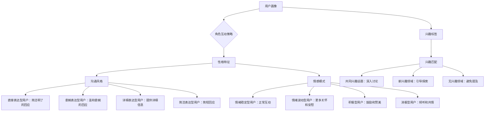

### 内容推荐机制

系统基于用户兴趣标签云，实现个性化内容推荐：

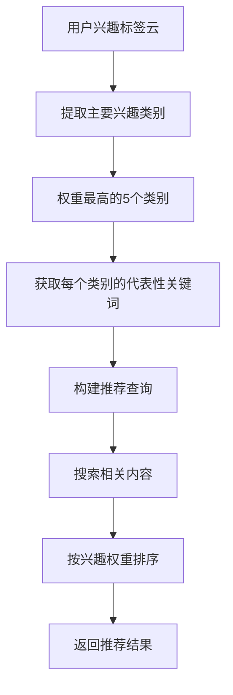

### 实际业务场景

在实际应用中，用户画像系统支持以下场景：

1. **智能欢迎语**：根据用户最近的兴趣和情绪状态，生成个性化的欢迎语
2. **话题引导**：在对话中自然引入用户感兴趣的话题，提高互动质量
3. **情绪支持**：当检测到用户情绪低落时，提供相应的心理支持和建议
4. **学习建议**：根据用户的学习兴趣，推荐相关学习资源和方法
5. **生活建议**：结合用户的健康和生活兴趣，提供个性化的生活建议

## 数据更新与隐私保护

### 数据更新频率

系统采用实时与定期相结合的数据更新策略：

- **实时更新**：用户每次对话后，立即提取关键词并更新兴趣权重
- **定期聚合**：每天凌晨对用户兴趣数据进行聚合分析，生成新的标签云
- **动态调整**：根据用户活跃度动态调整更新频率，活跃用户更新更频繁

### 隐私保护策略

系统严格遵守隐私保护原则，确保用户数据安全：

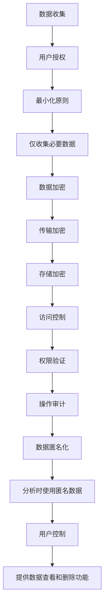

系统在`user_config`集合中存储用户的隐私设置，尊重用户对数据共享的意愿：

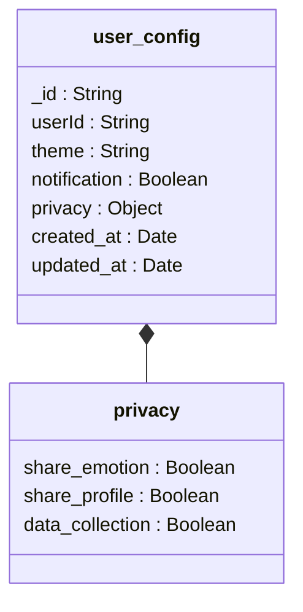

**Diagram sources**  
- [HeartChat数据库结构图.md](file://doc/设计文档/流程图/HeartChat数据库结构图.md#L381-L427)