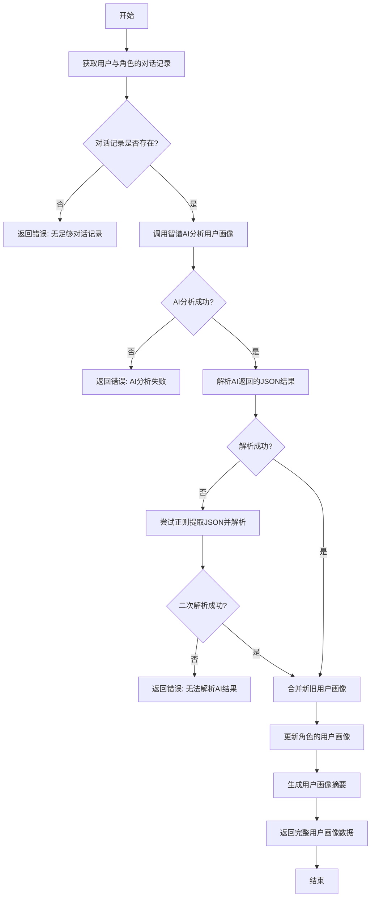
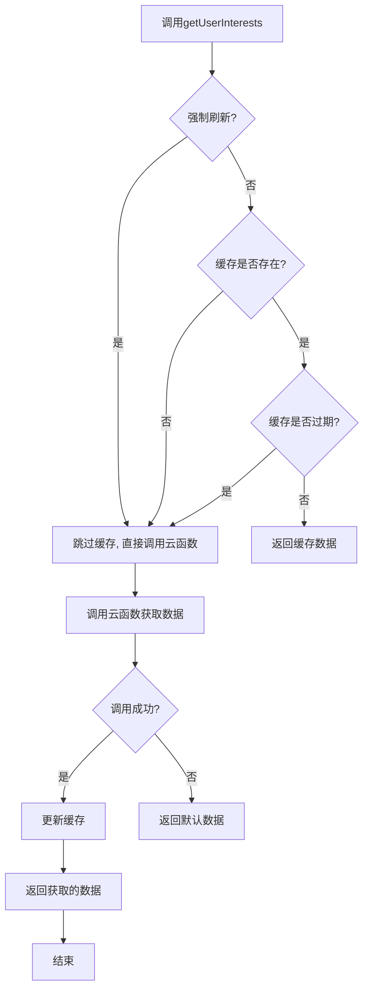
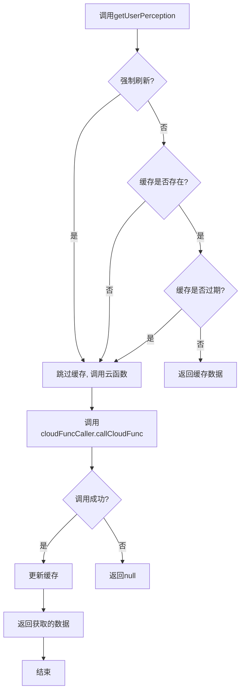

# 画像数据服务接口

<cite>
**本文档引用文件**  
- [userInterests.js](file://cloudfunctions/user/userInterests.js)
- [userPerception.js](file://cloudfunctions/roles/userPerception.js)
- [userInterestsService.js](file://miniprogram/services/userInterestsService.js)
- [personalityService.js](file://miniprogram/services/personalityService.js)
</cite>

## 目录
1. [用户兴趣数据服务API](#用户兴趣数据服务api)
2. [性格数据获取接口设计](#性格数据获取接口设计)
3. [前端服务层封装逻辑](#前端服务层封装逻辑)
4. [接口调用示例代码](#接口调用示例代码)
5. [常见错误码及解决方案](#常见错误码及解决方案)

## 用户兴趣数据服务API

`userInterests.js` 云函数提供了完整的用户兴趣数据管理接口，通过统一的HTTP入口支持多种操作。

### HTTP接口规范
- **请求方法**：POST（通过云函数调用）
- **认证方式**：微信云开发凭证（自动处理）
- **入口路径**：`cloudfunctions/user/index.js`
- **调用方式**：通过 `action` 参数区分不同操作

### 请求参数结构
所有请求均需包含以下基础参数：
```json
{
  "action": "操作类型",
  "userId": "用户唯一标识"
}
```

具体操作对应的额外参数：

| 操作类型 | 额外参数 | 说明 |
|---------|--------|------|
| `getUserInterests` | 无 | 获取用户兴趣数据 |
| `updateUserInterest` | `keyword`, `weightDelta` | 更新单个兴趣关键词 |
| `batchUpdateUserInterests` | `keywords[]`, `autoClassify`, `categoryStats`, `categoriesArray` | 批量更新兴趣关键词 |
| `deleteUserInterest` | `keyword` | 删除兴趣关键词 |
| `updateKeywordCategory` | `keyword`, `category` | 更新关键词分类 |
| `batchUpdateKeywordCategories` | `categorizations[]` | 批量更新关键词分类 |
| `updateKeywordEmotionScore` | `keyword`, `emotionScore` | 更新关键词情感分数 |

### 响应格式
所有响应均遵循统一格式：

```json
{
  "success": true,
  "data": { /* 操作返回的数据 */ },
  "error": "错误信息（仅在失败时存在）"
}
```

#### 成功响应示例
```json
{
  "success": true,
  "data": {
    "_id": "记录ID",
    "userId": "用户ID",
    "keywords": [
      {
        "word": "关键词",
        "weight": 1.5,
        "category": "分类",
        "source": "来源",
        "emotionScore": 0.8,
        "firstSeen": "首次出现时间",
        "lastUpdated": "最后更新时间",
        "occurrences": 3
      }
    ],
    "categories": [
      {
        "name": "分类名",
        "count": 5,
        "firstSeen": "首次出现时间",
        "lastUpdated": "最后更新时间"
      }
    ],
    "createTime": "创建时间",
    "lastUpdated": "最后更新时间"
  }
}
```

#### 失败响应示例
```json
{
  "success": false,
  "error": "用户ID不能为空"
}
```

### 状态码说明
- `200`：操作成功（通过 `success: true` 表示）
- `400`：请求参数错误（通过 `success: false` 和错误信息表示）
- `500`：服务器内部错误（通过 `success: false` 和系统错误信息表示）

**Section sources**
- [userInterests.js](file://cloudfunctions/user/userInterests.js#L0-L847)

## 性格数据获取接口设计

`userPerception.js` 云函数实现了基于AI分析的用户性格数据获取功能，与角色系统深度耦合。

### 接口设计原理
该接口通过分析用户与角色的对话历史，提取用户的性格特征、兴趣偏好、沟通风格和情感模式，并将结果存储在对应角色的用户画像中。

### 核心处理流程


**Diagram sources**
- [userPerception.js](file://cloudfunctions/roles/userPerception.js#L0-L315)

### 与角色系统的耦合关系
1. **数据存储耦合**：用户画像数据直接存储在 `roles` 集合的角色文档中
2. **分析上下文耦合**：分析基于特定角色与用户的对话历史
3. **更新机制耦合**：每次对话结束后触发用户画像更新
4. **个性化服务耦合**：角色可根据用户画像调整对话策略

### 主要函数说明
- `analyzeUserPerception(messages, userId, roleId)`：从对话中分析用户画像
- `updateRoleUserPerception(roleId, userId, newPerception)`：更新角色的用户画像
- `generateUserPerceptionSummary(userPerception)`：生成用户画像摘要

**Section sources**
- [userPerception.js](file://cloudfunctions/roles/userPerception.js#L0-L315)

## 前端服务层封装逻辑

前端服务层通过 `userInterestsService.js` 和 `personalityService.js` 提供了统一的接口封装，实现了加载状态管理、错误重试和数据缓存等高级功能。

### 用户兴趣服务封装

#### 核心功能
- 统一的云函数调用接口
- 本地缓存机制（30分钟有效期）
- 事件发布机制（使用事件总线）
- 错误处理和日志记录

#### 缓存策略


**Diagram sources**
- [userInterestsService.js](file://miniprogram/services/userInterestsService.js#L0-L613)

#### 服务层函数映射
| 服务层函数 | 云函数操作 | 缓存处理 | 事件发布 |
|---------|-----------|---------|---------|
| getUserInterests | getUserInterests | 读取和更新缓存 | 无 |
| updateUserInterest | updateUserInterest | 清除缓存 | INTEREST_UPDATED |
| batchUpdateUserInterests | batchUpdateUserInterests | 清除缓存 | INTEREST_BATCH_UPDATED |
| deleteUserInterest | deleteUserInterest | 清除缓存 | INTEREST_UPDATED |
| updateKeywordCategory | updateKeywordCategory | 清除缓存 | INTEREST_UPDATED |
| batchUpdateKeywordCategories | batchUpdateKeywordCategories | 清除缓存 | INTEREST_BATCH_UPDATED |
| updateKeywordEmotionScore | updateKeywordEmotionScore | 清除缓存 | INTEREST_UPDATED |

**Section sources**
- [userInterestsService.js](file://miniprogram/services/userInterestsService.js#L0-L613)

### 性格数据服务封装

#### 核心特点
- 使用 `cloudFuncCaller` 工具进行云函数调用
- 更长的缓存有效期（1小时）
- 集成加载状态显示
- 统一的错误处理机制

#### 服务层函数
- `getUserPerception(userId, forceRefresh)`：获取用户画像
- `generateUserPerception(userId, useAI)`：生成用户画像
- `getPersonalityTraits(userId, forceRefresh)`：获取个性特征
- `getUserInterests(userId, forceRefresh)`：获取兴趣标签
- `getEmotionPatterns(userId, forceRefresh)`：获取情感模式
- `getPersonalitySummary(userId, forceRefresh)`：获取个性总结
- `generateUserSystemPrompt(userId, forceRefresh)`：生成系统提示词



**Diagram sources**
- [personalityService.js](file://miniprogram/services/personalityService.js#L0-L310)

**Section sources**
- [personalityService.js](file://miniprogram/services/personalityService.js#L0-L310)

## 接口调用示例代码

### 获取用户兴趣数据
```javascript
const userInterestsService = require('./services/userInterestsService');

// 获取用户兴趣数据（优先使用缓存）
const interestsData = await userInterestsService.getUserInterests('user123');

// 强制刷新，不使用缓存
const freshData = await userInterestsService.getUserInterests('user123', true);
```

### 更新用户兴趣关键词
```javascript
// 更新单个兴趣关键词
const success = await userInterestsService.updateUserInterest(
  'user123', 
  '人工智能', 
  0.2 // 权重增加0.2
);

if (success) {
  console.log('兴趣更新成功');
} else {
  console.log('兴趣更新失败');
}
```

### 批量更新用户兴趣
```javascript
// 批量更新多个兴趣关键词
const result = await userInterestsService.batchUpdateUserInterests(
  'user123',
  [
    { word: '机器学习', weight: 1.5 },
    { word: '深度学习', weight: 1.8 },
    { word: '自然语言处理', weight: 1.2 }
  ],
  true, // 自动分类
  { 技术: 3, 人工智能: 2 } // 分类统计
);

if (result.success) {
  console.log('批量更新成功:', result.data);
} else {
  console.log('批量更新失败:', result.error);
}
```

### 获取用户性格画像
```javascript
const personalityService = require('./services/personalityService');

// 获取用户画像
const perception = await personalityService.getUserPerception('user123');

if (perception) {
  console.log('用户个性特征:', perception.personalityTraits);
  console.log('用户兴趣:', perception.interests);
  console.log('个性总结:', perception.personalitySummary);
} else {
  console.log('获取用户画像失败');
}

// 生成用户系统提示词（用于AI对话）
const prompt = await personalityService.generateUserSystemPrompt('user123');
console.log('系统提示词:', prompt);
```

### 生成用户画像
```javascript
// 生成用户画像（使用AI增强）
const result = await personalityService.generateUserPerception('user123', true);

if (result.success) {
  console.log('用户画像生成成功:', result.data);
} else {
  console.log('用户画像生成失败:', result.error);
}
```

### 处理对话并更新兴趣
```javascript
// 自动从对话文本中提取关键词并更新用户兴趣
const text = "我最近在学习人工智能和机器学习，感觉非常有趣。";
const success = await userInterestsService.processDialogueAndUpdateInterests('user123', text);

if (success) {
  console.log('对话兴趣更新成功');
}
```

## 常见错误码及解决方案

### 权限相关错误
| 错误码/信息 | 原因 | 解决方案 |
|-----------|------|---------|
| `用户ID不能为空` | 未提供用户ID参数 | 确保在调用时传入有效的用户ID |
| `用户兴趣记录不存在` | 用户首次使用，无兴趣记录 | 系统会自动创建新记录，无需特殊处理 |
| `智谱AI API密钥未配置` | 云函数环境变量未设置 | 在云开发控制台设置 `ZHIPU_API_KEY` 环境变量 |

### 数据格式错误
| 错误码/信息 | 原因 | 解决方案 |
|-----------|------|---------|
| `用户ID和关键词不能为空` | 缺少必要参数 | 确保 `userId` 和 `keyword` 参数都已提供 |
| `用户ID和关键词数组不能为空` | 批量操作参数不完整 | 确保 `userId` 和 `keywords` 数组都已提供 |
| `无法解析AI返回的用户画像数据` | AI返回格式异常 | 检查智谱AI服务状态，或联系技术支持 |

### 系统错误
| 错误码/信息 | 原因 | 解决方案 |
|-----------|------|---------|
| `获取用户兴趣数据失败` | 数据库查询异常 | 检查数据库连接状态，查看云函数日志 |
| `调用智谱AI接口失败` | 网络或API调用问题 | 检查网络连接，确认API配额未耗尽 |
| `更新用户兴趣关键词失败` | 数据库更新异常 | 检查数据格式是否符合要求，查看字段长度限制 |

### 缓存相关问题
| 问题现象 | 原因 | 解决方案 |
|--------|------|---------|
| 数据更新后仍显示旧数据 | 缓存未及时清除 | 调用更新接口后，服务层会自动清除缓存；如需立即刷新，可设置 `forceRefresh=true` |
| 缓存数据过期 | 超过30分钟未访问 | 系统会自动重新获取并更新缓存，无需特殊处理 |
| 缓存解析失败 | 缓存数据损坏 | 系统会自动忽略损坏缓存并重新获取数据 |

**Section sources**
- [userInterests.js](file://cloudfunctions/user/userInterests.js#L0-L847)
- [userPerception.js](file://cloudfunctions/roles/userPerception.js#L0-L315)
- [userInterestsService.js](file://miniprogram/services/userInterestsService.js#L0-L613)
- [personalityService.js](file://miniprogram/services/personalityService.js#L0-L310)