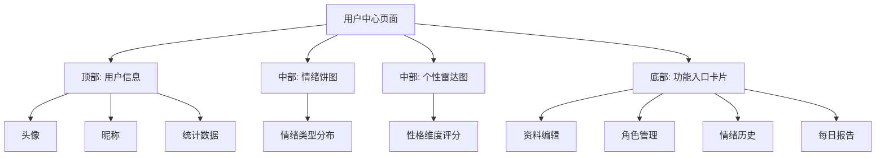
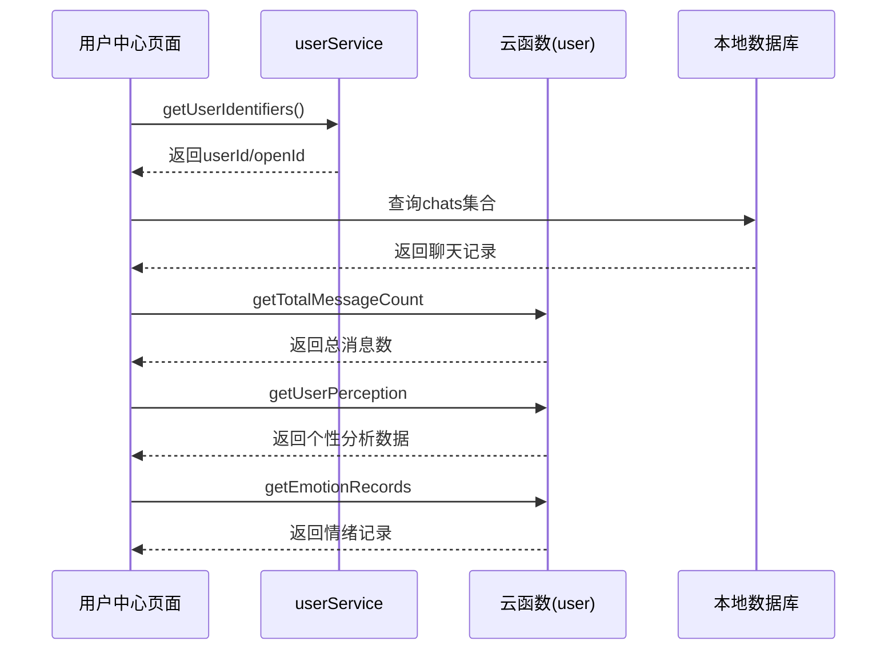
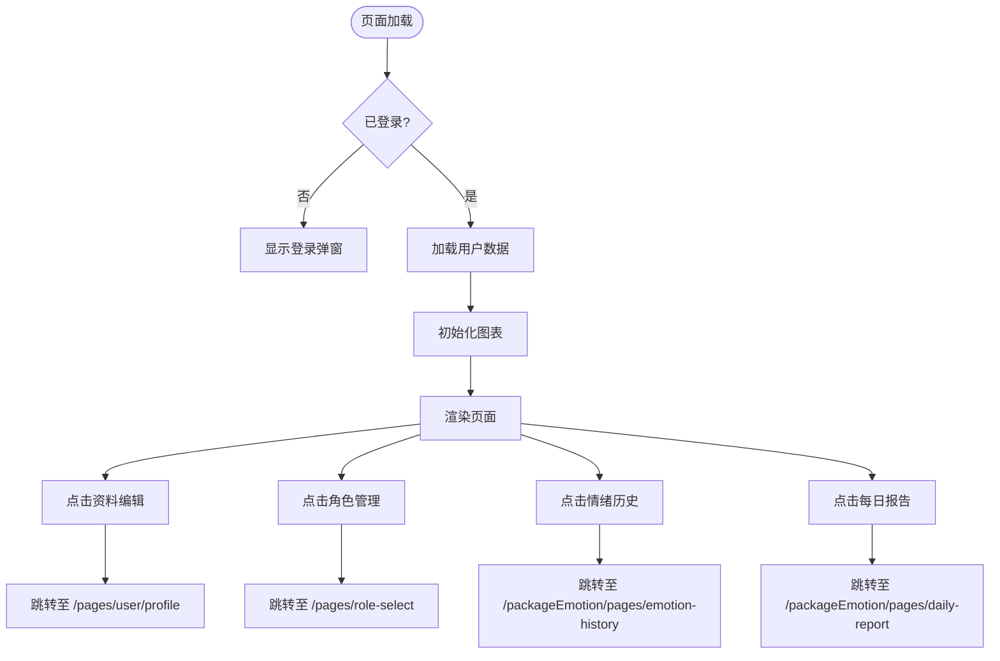
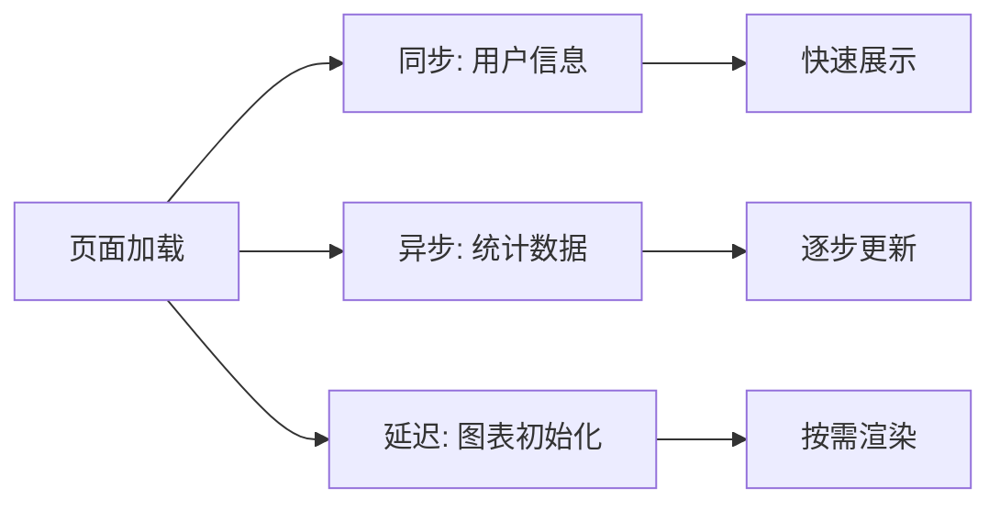

# 用户中心

<cite>
**本文档引用的文件**
- [user.js](file://miniprogram/pages/user/user.js#L1-L1349)
- [userService.js](file://miniprogram/services/userService.js)
- [emotionService.js](file://miniprogram/services/emotionService.js)
- [index.js](file://cloudfunctions/user/index.js)
- [userPerception_new.js](file://cloudfunctions/user/userPerception_new.js)
- [getEmotionRecords.js](file://cloudfunctions/getEmotionRecords/index.js)
- [config/index.js](file://miniprogram/config/index.js)
</cite>

## 目录
1. [简介](#简介)
2. [页面结构与导航设计](#页面结构与导航设计)
3. [核心功能模块](#核心功能模块)
4. [数据聚合与初始化逻辑](#数据聚合与初始化逻辑)
5. [功能跳转路径与权限控制](#功能跳转路径与权限控制)
6. [服务接口协调机制](#服务接口协调机制)
7. [性能优化策略](#性能优化策略)
8. [结论](#结论)

## 简介
用户中心页面是用户个人空间的核心入口，集成资料编辑、角色管理、情绪历史、每日报告等多个功能模块。该页面通过统一的服务接口协调后端云函数，实现用户信息的聚合展示与交互跳转，为用户提供连贯的使用体验。

## 页面结构与导航设计

用户中心采用分层布局结构，顶部为用户基本信息展示区，中部集成情绪概览与个性分析图表，底部通过功能卡片组织多个入口。页面支持暗黑模式自适应，根据系统主题或用户设置动态调整界面样式。

**Diagram sources**
- [user.js](file://miniprogram/pages/user/user.js#L20-L50)
- [config/index.js](file://miniprogram/config/index.js)

**Section sources**
- [user.js](file://miniprogram/pages/user/user.js#L1-L100)

## 核心功能模块

用户中心集成了四大核心功能模块：
- **资料编辑**：跳转至 profile 页面，允许用户修改头像、昵称等基本信息
- **角色管理**：进入角色选择与编辑界面，管理对话角色
- **情绪历史**：查看历史情绪记录与分析趋势
- **每日报告**：浏览系统生成的个性化心情报告

各模块通过统一的导航机制实现平滑跳转，确保用户体验的一致性。

**Section sources**
- [user.js](file://miniprogram/pages/user/user.js#L800-L1000)

## 数据聚合与初始化逻辑

页面在初始化时执行多维度数据聚合，确保用户信息的完整性与实时性。

### 用户基础信息获取
通过 `getLoginInfo` 和 `checkLogin` 工具函数验证登录状态，优先从全局状态 `app.globalData.userInfo` 获取用户信息，其次读取本地缓存。

### 统计指标加载
- **聊天次数**：调用 `getTotalMessageCount` 方法，优先从本地数据库统计 `chats` 集合的消息数量，再通过 `user` 云函数校准
- **活跃天数**：通过 `updateActiveDay` 更新并获取用户活跃记录
- **报告数量**：调用 `getReportCount` 云函数查询 `user_stats` 表中的 `daily_report_count` 字段

### 情绪与个性数据
- **情绪数据**：通过 `loadEmotionData` 方法调用 `emotionService.getEmotionHistory` 获取最近20条情绪记录，统计各情绪类型分布
- **个性分析**：通过 `loadPersonalityData` 调用 `user` 云函数的 `getUserPerception` 接口，获取基于历史对话的个性特征评分

**Diagram sources**
- [user.js](file://miniprogram/pages/user/user.js#L400-L700)
- [userService.js](file://miniprogram/services/userService.js)
- [index.js](file://cloudfunctions/user/index.js)

**Section sources**
- [user.js](file://miniprogram/pages/user/user.js#L400-L799)

## 功能跳转路径与权限控制

页面通过条件渲染与权限校验确保功能访问的安全性。所有功能跳转均在用户登录状态下进行，未登录用户将被引导至登录流程。

**Diagram sources**
- [user.js](file://miniprogram/pages/user/user.js#L800-L1000)

**Section sources**
- [user.js](file://miniprogram/pages/user/user.js#L800-L1000)

## 服务接口协调机制

用户中心通过 `userService` 统一协调多个后端服务：
- **用户服务**：`user` 云函数提供 `getInfo`、`getTotalMessageCount`、`getReportCount`、`getUserPerception` 等接口
- **情绪服务**：`getEmotionRecords` 云函数提供历史情绪数据查询
- **本地服务**：直接访问 `wx.cloud.database()` 获取聊天记录等本地数据

`userService.getUserIdentifiers` 方法统一处理用户标识符（openId/userId）的获取逻辑，为各服务调用提供一致的参数接口。

**Section sources**
- [userService.js](file://miniprogram/services/userService.js)
- [user.js](file://miniprogram/pages/user/user.js#L400-L799)

## 性能优化策略

### 懒加载机制
情绪饼图与个性雷达图采用 `lazyLoad: true` 配置，仅在 `onReady` 生命周期中初始化，避免首屏渲染阻塞。

### 数据缓存策略
- 用户基础信息缓存在 `app.globalData` 与本地存储 `loginInfo`
- 暗黑模式设置持久化至本地缓存 `darkMode`
- 统计数据在内存中维护，减少重复查询

### 加载优先级控制
采用分阶段加载策略：
1. 优先渲染用户基本信息
2. 异步加载统计指标
3. 延迟初始化复杂图表

**Diagram sources**
- [user.js](file://miniprogram/pages/user/user.js#L100-L200)

**Section sources**
- [user.js](file://miniprogram/pages/user/user.js#L100-L300)

## 结论
用户中心页面通过合理的架构设计与性能优化，实现了多源数据的高效聚合与功能模块的无缝集成。基于 `userService` 的统一服务接口降低了系统耦合度，懒加载与缓存策略显著提升了用户体验。未来可进一步优化数据预加载机制，提升页面响应速度。