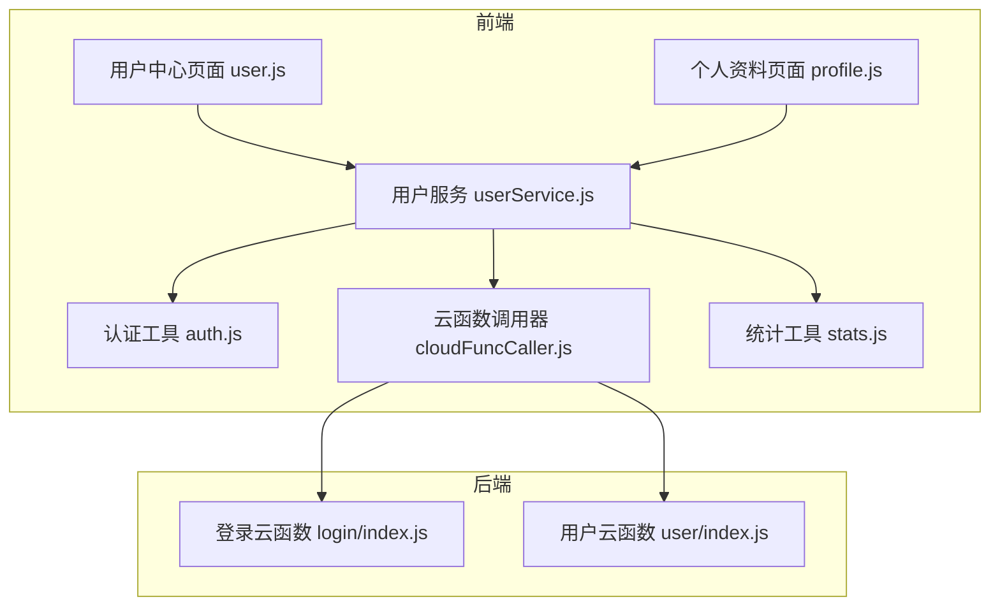
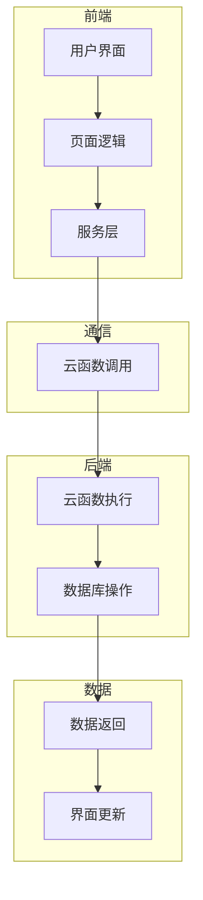
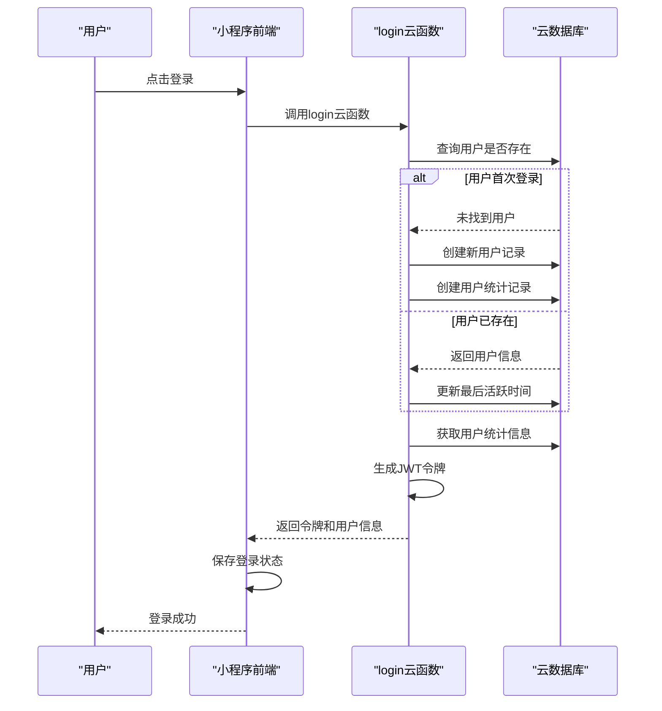
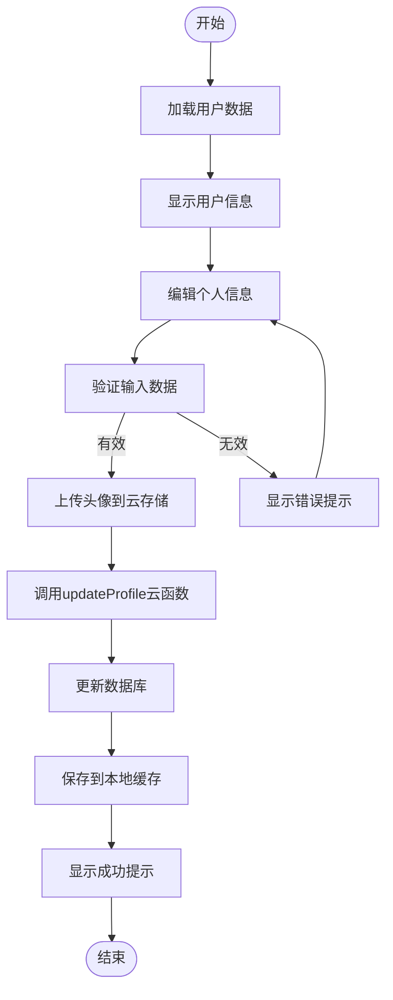
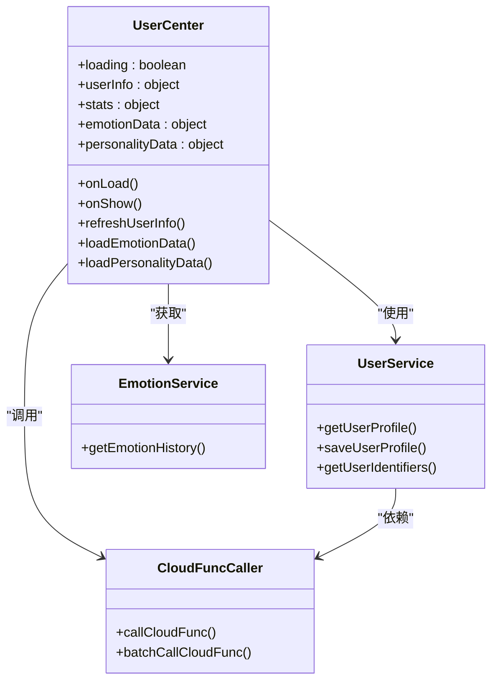
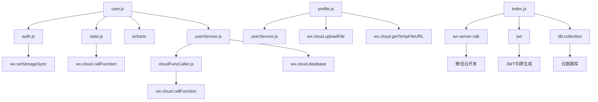

# 用户系统

<cite>
**本文档引用的文件**
- [user.js](file://miniprogram/pages/user/user.js)
- [profile.js](file://miniprogram/pages/user/profile/profile.js)
- [index.js](file://cloudfunctions/login/index.js)
- [index.js](file://cloudfunctions/user/index.js)
- [userService.js](file://miniprogram/services/userService.js)
- [auth.js](file://miniprogram/utils/auth.js)
- [cloudFuncCaller.js](file://miniprogram/services/cloudFuncCaller.js)
- [stats.js](file://miniprogram/utils/stats.js)
</cite>

## 目录
1. [简介](#简介)
2. [项目结构](#项目结构)
3. [核心组件](#核心组件)
4. [架构概述](#架构概述)
5. [详细组件分析](#详细组件分析)
6. [依赖分析](#依赖分析)
7. [性能考虑](#性能考虑)
8. [故障排除指南](#故障排除指南)
9. [结论](#结论)

## 简介
HeartChat用户系统为用户提供完整的生命周期管理，涵盖微信授权登录、用户资料管理及用户中心三大核心功能。系统通过云函数实现安全的用户认证与数据同步，结合小程序前端页面提供直观的用户交互体验。本系统设计注重数据安全与隐私保护，采用JWT令牌进行身份验证，并通过本地缓存优化用户体验。用户中心页面整合了用户统计、情绪分析、个性特征等多维度数据展示，为用户提供全面的自我认知服务。

## 项目结构
HeartChat用户系统采用前后端分离架构，前端页面位于`miniprogram/pages/user/`目录下，后端云函数位于`cloudfunctions/user/`和`cloudfunctions/login/`目录中。系统通过`miniprogram/services/`目录下的服务模块实现前后端通信，`miniprogram/utils/`目录提供通用工具函数。

**图表来源**
- [user.js](file://miniprogram/pages/user/user.js)
- [profile.js](file://miniprogram/pages/user/profile/profile.js)
- [index.js](file://cloudfunctions/login/index.js)
- [index.js](file://cloudfunctions/user/index.js)

**本节来源**
- [user.js](file://miniprogram/pages/user/user.js)
- [profile.js](file://miniprogram/pages/user/profile/profile.js)
- [index.js](file://cloudfunctions/login/index.js)
- [index.js](file://cloudfunctions/user/index.js)

## 核心组件
HeartChat用户系统的核心组件包括微信授权登录流程、用户资料管理机制和用户中心数据展示逻辑。登录组件通过`login`云函数实现微信授权登录，生成JWT令牌进行身份验证。用户资料管理组件支持头像上传、昵称修改等个人信息编辑功能，并通过`user`云函数实现数据的云端同步。用户中心组件整合了用户统计、情绪分析、个性特征等多维度数据，通过图表形式直观展示用户行为模式。

**本节来源**
- [user.js](file://miniprogram/pages/user/user.js)
- [profile.js](file://miniprogram/pages/user/profile/profile.js)
- [index.js](file://cloudfunctions/login/index.js)
- [index.js](file://cloudfunctions/user/index.js)

## 架构概述
HeartChat用户系统采用分层架构设计，从前端页面到后端云函数再到数据库，形成清晰的数据流和控制流。系统通过微信小程序框架提供的API实现用户界面交互，利用云开发能力实现后端逻辑处理，最终将数据持久化存储在云数据库中。

**图表来源**
- [user.js](file://miniprogram/pages/user/user.js)
- [profile.js](file://miniprogram/pages/user/profile/profile.js)
- [index.js](file://cloudfunctions/login/index.js)
- [index.js](file://cloudfunctions/user/index.js)

## 详细组件分析

### 登录与授权分析
HeartChat的微信授权登录流程通过`login`云函数实现，采用标准的微信小程序登录机制。系统首先获取用户的微信授权信息，然后在云函数中查询或创建用户基础信息，最后生成JWT令牌返回给客户端。

**图表来源**
- [index.js](file://cloudfunctions/login/index.js)
- [auth.js](file://miniprogram/utils/auth.js)

**本节来源**
- [index.js](file://cloudfunctions/login/index.js)
- [auth.js](file://miniprogram/utils/auth.js)

### 用户资料管理分析
用户资料管理功能允许用户编辑个人信息，包括头像、昵称、性别、年龄和个人简介等。系统通过`profile.js`页面实现用户界面，`userService.js`服务模块处理业务逻辑，`user`云函数负责数据的云端同步。

**图表来源**
- [profile.js](file://miniprogram/pages/user/profile/profile.js)
- [index.js](file://cloudfunctions/user/index.js)
- [userService.js](file://miniprogram/services/userService.js)

**本节来源**
- [profile.js](file://miniprogram/pages/user/profile/profile.js)
- [index.js](file://cloudfunctions/user/index.js)
- [userService.js](file://miniprogram/services/userService.js)

### 用户中心分析
用户中心页面整合了用户统计、情绪分析、个性特征等多维度数据，为用户提供全面的自我认知服务。系统通过多个云函数获取不同维度的数据，并在前端页面中通过图表形式直观展示。

**图表来源**
- [user.js](file://miniprogram/pages/user/user.js)
- [userService.js](file://miniprogram/services/userService.js)
- [cloudFuncCaller.js](file://miniprogram/services/cloudFuncCaller.js)

**本节来源**
- [user.js](file://miniprogram/pages/user/user.js)
- [userService.js](file://miniprogram/services/userService.js)
- [cloudFuncCaller.js](file://miniprogram/services/cloudFuncCaller.js)

## 依赖分析
HeartChat用户系统各组件之间存在明确的依赖关系。前端页面依赖服务模块提供的业务逻辑，服务模块依赖云函数调用器实现与后端的通信，后端云函数依赖数据库实现数据持久化。

**图表来源**
- [user.js](file://miniprogram/pages/user/user.js)
- [profile.js](file://miniprogram/pages/user/profile/profile.js)
- [index.js](file://cloudfunctions/login/index.js)
- [index.js](file://cloudfunctions/user/index.js)
- [userService.js](file://miniprogram/services/userService.js)
- [cloudFuncCaller.js](file://miniprogram/services/cloudFuncCaller.js)

**本节来源**
- [user.js](file://miniprogram/pages/user/user.js)
- [profile.js](file://miniprogram/pages/user/profile/profile.js)
- [index.js](file://cloudfunctions/login/index.js)
- [index.js](file://cloudfunctions/user/index.js)
- [userService.js](file://miniprogram/services/userService.js)
- [cloudFuncCaller.js](file://miniprogram/services/cloudFuncCaller.js)

## 性能考虑
HeartChat用户系统在性能方面采取了多项优化措施。系统通过本地缓存减少重复的云函数调用，提高响应速度。在用户中心页面，采用延迟初始化图表的方式，确保页面渲染流畅。对于大量数据的处理，系统使用数据库聚合查询而非客户端计算，减轻前端负担。此外，系统还实现了数据缓存机制，对于不经常变化的数据如用户资料，优先从本地缓存读取，减少网络请求。

## 故障排除指南
HeartChat用户系统可能遇到的常见问题包括登录失败、数据同步异常和图表显示错误等。对于登录失败问题，应检查网络连接、微信授权状态和云函数日志。数据同步异常通常由网络问题或数据库权限配置错误引起，可通过检查云函数返回结果和数据库规则来定位问题。图表显示错误可能是由于数据格式不匹配或图表初始化时机不当造成，应确保数据结构正确并在页面渲染完成后初始化图表。

**本节来源**
- [user.js](file://miniprogram/pages/user/user.js)
- [profile.js](file://miniprogram/pages/user/profile/profile.js)
- [index.js](file://cloudfunctions/login/index.js)
- [index.js](file://cloudfunctions/user/index.js)
- [userService.js](file://miniprogram/services/userService.js)

## 结论
HeartChat用户系统通过前后端协同工作，为用户提供安全、便捷的用户管理服务。系统采用现代化的架构设计，实现了微信授权登录、用户资料管理、数据同步和多维度数据展示等功能。通过JWT令牌进行身份验证，确保了用户数据的安全性。本地缓存和云函数的结合使用，既保证了数据的一致性，又提升了用户体验。未来可进一步优化的方向包括增加更多的用户数据分析维度、提供个性化建议和增强数据隐私保护措施。