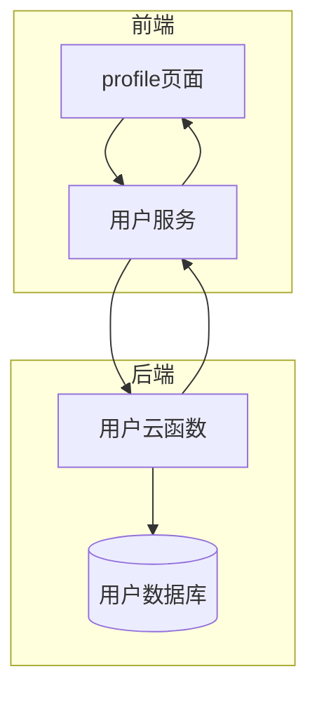
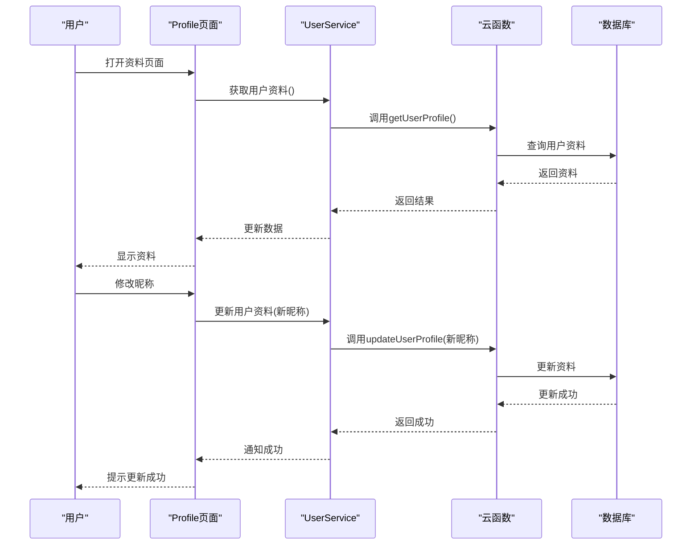
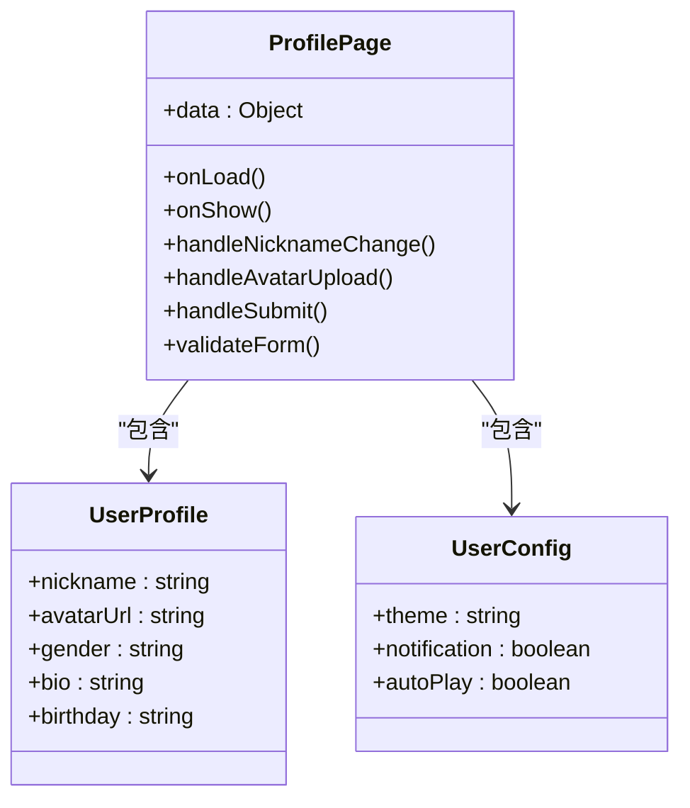
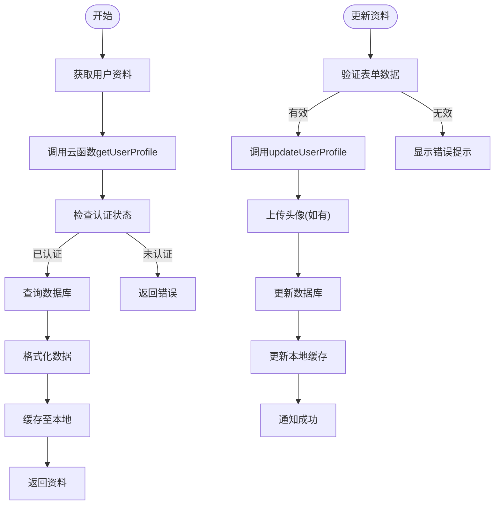
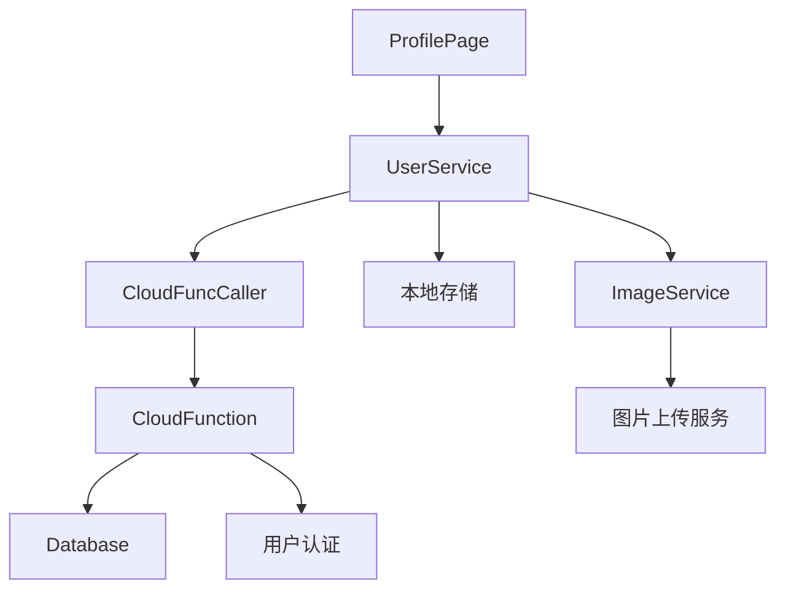

# 用户资料管理

<cite>
**本文档引用文件**  
- [profile.js](file://miniprogram/pages/user/profile/profile.js)
- [profile.json](file://miniprogram/pages/user/profile/profile.json)
- [userService.js](file://miniprogram/services/userService.js)
- [cloudFuncCaller.js](file://miniprogram/services/cloudFuncCaller.js)
- [index.js](file://cloudfunctions/user/index.js)
- [user_profile.md](file://doc/开发文档/database/user_profile.md)
- [user_config.md](file://doc/开发文档/database/user_config.md)
- [用户资料页面更新说明.md](file://doc/使用文档/用户资料页面更新说明.md)
</cite>

## 目录
1. [简介](#简介)
2. [项目结构](#项目结构)
3. [核心组件](#核心组件)
4. [架构概览](#架构概览)
5. [详细组件分析](#详细组件分析)
6. [依赖分析](#依赖分析)
7. [性能考虑](#性能考虑)
8. [故障排除指南](#故障排除指南)
9. [结论](#结论)

## 简介
本文档深入阐述HeartChat小程序中用户资料管理功能的实现机制，涵盖个人资料查看、编辑与同步流程。重点描述前端profile页面的UI结构与数据绑定方式，解析前端如何通过userService调用云函数实现用户数据的获取与更新。详细说明用户昵称、头像、性别等基本信息的更新流程，以及本地缓存与云端数据库的同步策略。同时，文档化用户配置项（如主题偏好、通知设置）的存储结构与读写逻辑，并提供表单验证、图片上传、错误提示等交互细节的实现方案，最后列举常见更新失败的原因及调试方法。

## 项目结构
用户资料管理功能涉及前端页面、服务层、云函数及数据库四个主要层级。前端页面位于`miniprogram/pages/user/profile`目录下，包含视图文件与逻辑脚本；服务层封装在`miniprogram/services`中，负责业务逻辑与网络通信；云函数位于`cloudfunctions/user`，处理数据库操作；数据库设计文档位于`doc/开发文档/database`。



**图表来源**  
- [profile.js](file://miniprogram/pages/user/profile/profile.js#L1-L10)
- [userService.js](file://miniprogram/services/userService.js#L5-L15)
- [index.js](file://cloudfunctions/user/index.js#L1-L10)

**本节来源**  
- [profile.js](file://miniprogram/pages/user/profile/profile.js#L1-L50)
- [index.js](file://cloudfunctions/user/index.js#L1-L20)

## 核心组件
核心组件包括profile页面、userService服务、云函数接口及数据库表结构。profile页面负责UI渲染与用户交互；userService封装数据获取与提交逻辑；云函数提供安全的数据库访问接口；数据库存储用户资料与配置信息。

**本节来源**  
- [profile.js](file://miniprogram/pages/user/profile/profile.js#L20-L100)
- [userService.js](file://miniprogram/services/userService.js#L10-L60)
- [user_profile.md](file://doc/开发文档/database/user_profile.md#L1-L30)

## 架构概览
系统采用分层架构，前端通过事件驱动模型响应用户操作，调用userService服务层方法，服务层通过cloudFuncCaller统一调用云函数，云函数在安全鉴权后操作数据库。



**图表来源**  
- [profile.js](file://miniprogram/pages/user/profile/profile.js#L30-L80)
- [userService.js](file://miniprogram/services/userService.js#L20-L50)
- [index.js](file://cloudfunctions/user/index.js#L15-L40)

## 详细组件分析

### Profile页面分析
Profile页面采用微信小程序原生框架实现，通过数据绑定机制将用户资料动态渲染至UI。页面初始化时触发数据加载，表单提交时进行验证并调用更新接口。

#### UI结构与数据绑定


**图表来源**  
- [profile.js](file://miniprogram/pages/user/profile/profile.js#L15-L60)
- [profile.json](file://miniprogram/pages/user/profile/profile.json#L1-L10)

### UserService服务分析
UserService封装了与用户资料相关的所有业务逻辑，提供统一的API供前端调用，隐藏底层云函数调用细节。

#### 数据获取与更新流程


**图表来源**  
- [userService.js](file://miniprogram/services/userService.js#L25-L100)
- [cloudFuncCaller.js](file://miniprogram/services/cloudFuncCaller.js#L10-L30)

**本节来源**  
- [userService.js](file://miniprogram/services/userService.js#L1-L120)
- [cloudFuncCaller.js](file://miniprogram/services/cloudFuncCaller.js#L1-L40)

### 云函数与数据库分析
云函数提供安全的数据库访问接口，遵循最小权限原则。数据库设计规范化，用户资料与配置分离存储。

#### 数据存储结构
```mermaid
erDiagram
USER_PROFILE {
string openid PK
string nickname
string avatarUrl
string gender
string bio
date birthday
timestamp updated_at
}
USER_CONFIG {
string openid PK FK
string theme
boolean notification
boolean autoPlay
string language
timestamp updated_at
}
USER_PROFILE ||--|| USER_CONFIG : "一对一"
```

**图表来源**  
- [index.js](file://cloudfunctions/user/index.js#L20-L50)
- [user_profile.md](file://doc/开发文档/database/user_profile.md#L5-L25)
- [user_config.md](file://doc/开发文档/database/user_config.md#L5-L25)

**本节来源**  
- [index.js](file://cloudfunctions/user/index.js#L1-L60)
- [user_profile.md](file://doc/开发文档/database/user_profile.md#L1-L50)
- [user_config.md](file://doc/开发文档/database/user_config.md#L1-L50)

## 依赖分析
用户资料管理功能依赖多个内部组件与外部服务。前端依赖微信小程序基础库与ECharts组件；服务层依赖云函数调用器与本地存储；云函数依赖数据库访问权限与用户认证系统。



**图表来源**  
- [profile.js](file://miniprogram/pages/user/profile/profile.js#L1-L20)
- [userService.js](file://miniprogram/services/userService.js#L1-L20)
- [cloudFuncCaller.js](file://miniprogram/services/cloudFuncCaller.js#L1-L10)

**本节来源**  
- [profile.js](file://miniprogram/pages/user/profile/profile.js#L1-L100)
- [userService.js](file://miniprogram/services/userService.js#L1-L100)
- [cloudFuncCaller.js](file://miniprogram/services/cloudFuncCaller.js#L1-L50)

## 性能考虑
为提升用户体验，系统采用多项性能优化策略：资料数据本地缓存减少重复请求；图片上传采用压缩与CDN加速；表单验证前置减少无效请求；批量更新减少云函数调用次数。

## 故障排除指南
常见问题包括资料更新失败、头像上传错误、配置不同步等。调试时应首先检查网络连接，其次查看云函数日志，验证参数格式，并确认用户权限。

**本节来源**  
- [userService.js](file://miniprogram/services/userService.js#L80-L120)
- [index.js](file://cloudfunctions/user/index.js#L40-L80)
- [用户资料页面更新说明.md](file://doc/使用文档/用户资料页面更新说明.md#L1-L30)

## 结论
用户资料管理功能实现了完整的CRUD操作，通过分层架构确保代码可维护性，采用本地缓存提升性能，严格的表单验证保障数据质量。未来可扩展资料版本控制与多设备同步功能。