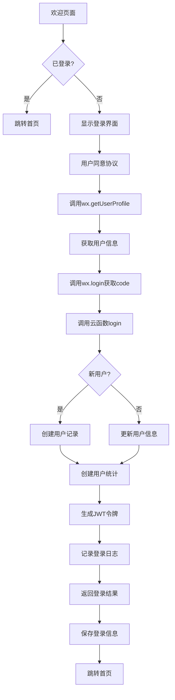
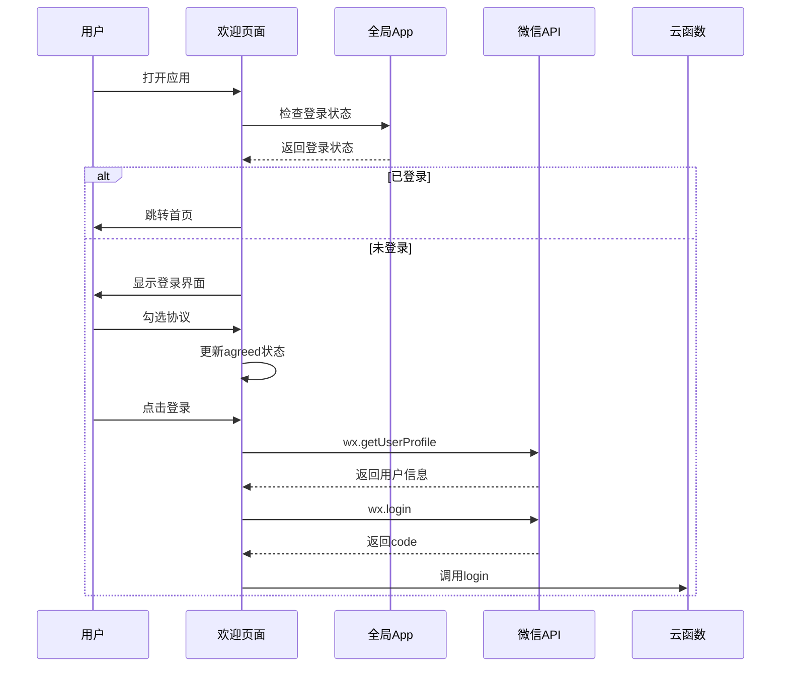
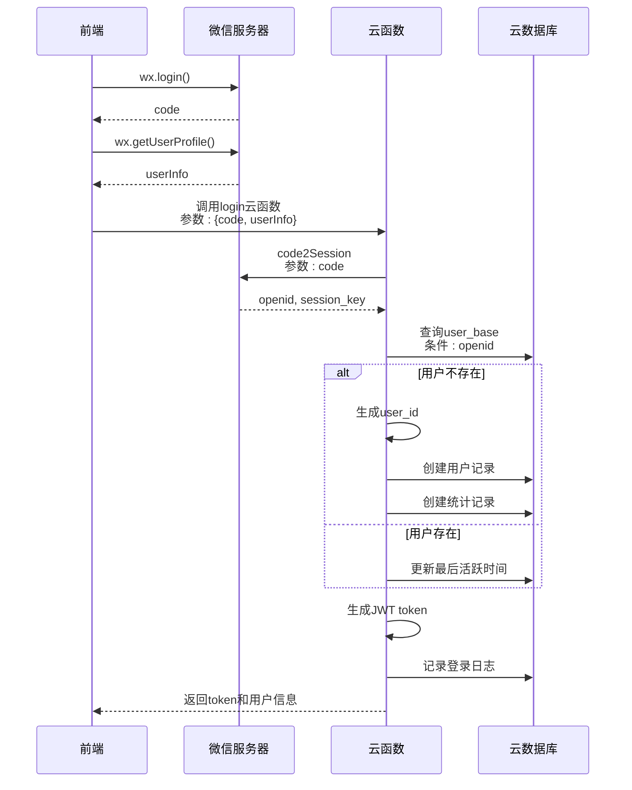
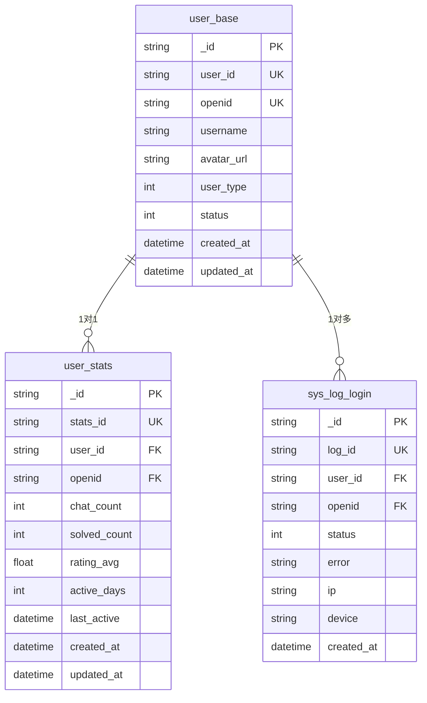
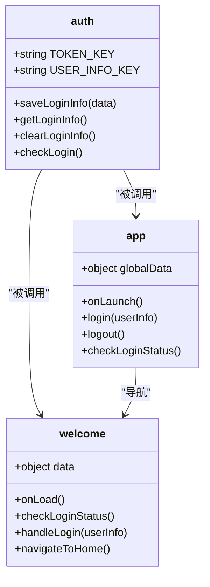
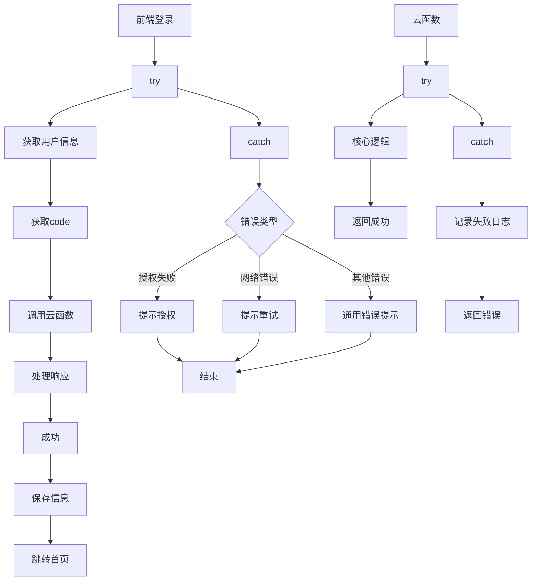

# 登录与授权

<cite>
**本文档引用文件**   
- [welcome.js](file://miniprogram/pages/welcome/welcome.js)
- [login/index.js](file://cloudfunctions/login/index.js)
- [auth.js](file://miniprogram/utils/auth.js)
- [userService.js](file://miniprogram/services/userService.js)
- [app.js](file://miniprogram/app.js)
- [login.md](file://doc/开发文档/cloudfunctions/login.md)
</cite>

## 目录
1. [简介](#简介)
2. [登录流程概述](#登录流程概述)
3. [欢迎页面登录触发机制](#欢迎页面登录触发机制)
4. [微信授权登录流程](#微信授权登录流程)
5. [云函数身份验证](#云函数身份验证)
6. [用户注册与信息存储](#用户注册与信息存储)
7. [登录状态持久化](#登录状态持久化)
8. [权限校验中间件](#权限校验中间件)
9. [异常处理机制](#异常处理机制)
10. [安全建议](#安全建议)

## 简介
HeartChat应用采用基于微信授权的登录与授权机制，为用户提供安全便捷的身份验证体验。本系统通过微信小程序的授权体系，结合云开发能力，实现了完整的用户身份管理流程。系统在用户首次登录时自动完成注册，将用户信息存储在云数据库中，并通过JWT令牌实现会话管理。登录状态通过本地缓存持久化，确保用户体验的连续性。整个流程注重安全性，包含详细的日志记录和异常处理机制。

## 登录流程概述
HeartChat的登录与授权流程遵循标准的微信小程序认证模式，结合云函数实现后端验证。流程从欢迎页面开始，用户同意服务协议后触发微信授权，获取用户信息和登录凭证(code)。系统调用云函数`login`，将code和用户信息传递给后端进行验证。云函数通过微信开放接口验证code的有效性，创建或更新用户信息，生成JWT令牌并返回给客户端。客户端保存令牌和用户信息，完成登录状态的建立。



**Diagram sources**
- [welcome.js](file://miniprogram/pages/welcome/welcome.js#L1-L152)
- [login/index.js](file://cloudfunctions/login/index.js#L1-L267)

## 欢迎页面登录触发机制
欢迎页面作为应用的入口，负责检查用户的登录状态并引导登录流程。页面加载时，通过检查全局状态`app.globalData.isLoggedIn`确定用户是否已登录。如果已登录，则直接跳转到首页；否则，显示登录界面，等待用户交互。

用户需要先同意服务协议才能进行登录操作。协议勾选状态通过`handleAgreementChange`方法监听，确保用户明确知晓并同意相关条款。当用户点击登录按钮并授权个人信息后，`handleGetUserInfo`方法被触发，开始登录流程。



**Diagram sources**
- [welcome.js](file://miniprogram/pages/welcome/welcome.js#L1-L152)
- [app.js](file://miniprogram/app.js#L1-L340)

**Section sources**
- [welcome.js](file://miniprogram/pages/welcome/welcome.js#L1-L152)

## 微信授权登录流程
HeartChat采用微信小程序的标准授权流程实现用户登录。当用户在欢迎页面点击登录时，系统调用`wx.getUserProfile`接口请求用户公开信息（昵称、头像等）。用户授权后，系统立即调用`wx.login()`获取临时登录凭证(code)。这个code是连接小程序前端和后端服务的关键，具有短暂的有效期。

获取code后，系统通过`wx.cloud.callFunction`调用名为`login`的云函数，将code和用户信息作为参数传递。这种设计将敏感的验证逻辑放在服务端执行，避免了在客户端暴露敏感信息，提高了系统的安全性。云函数使用code向微信服务器发起请求，验证用户身份并获取用户的openid等信息。



**Diagram sources**
- [welcome.js](file://miniprogram/pages/welcome/welcome.js#L1-L152)
- [login/index.js](file://cloudfunctions/login/index.js#L1-L267)

## 云函数身份验证
`login`云函数是身份验证的核心组件，负责处理登录请求、验证用户身份、管理用户数据和生成访问令牌。云函数首先验证输入参数的完整性，确保`userInfo`对象存在。然后，通过`cloud.getWXContext()`获取微信上下文，包括用户的`openid`和`appid`。

云函数的核心逻辑是查询`user_base`集合，根据`openid`查找用户记录。如果用户不存在（新用户），系统生成唯一的7位数字`user_id`，创建用户基础信息记录，并在`user_stats`集合中创建对应的统计记录。如果用户已存在，系统根据策略更新用户信息：仅当用户名为默认值"微信用户"时更新昵称和头像，其他情况下只更新最后活跃时间。

```mermaid
flowchart TD
A[云函数入口] --> B[验证参数]
B --> C[获取微信上下文]
C --> D[查询user_base]
D --> E{用户存在?}
E --> |否| F[生成user_id]
F --> G[创建用户记录]
G --> H[创建统计记录]
E --> |是| I[检查用户名]
I --> J{用户名为"微信用户"?}
J --> |是| K[更新昵称和头像]
J --> |否| L[更新最后活跃时间]
K --> M[检查活跃天数]
L --> M
M --> N[生成JWT令牌]
N --> O[记录登录日志]
O --> P[返回结果]
```

**Diagram sources**
- [login/index.js](file://cloudfunctions/login/index.js#L1-L267)
- [login.md](file://doc/开发文档/cloudfunctions/login.md#L1-L222)

**Section sources**
- [login/index.js](file://cloudfunctions/login/index.js#L1-L267)

## 用户注册与信息存储
HeartChat在用户首次登录时自动完成注册，无需额外的注册步骤。系统为每个用户分配一个唯一的7位数字`user_id`，该ID通过`generateRandomUserId`函数生成，并经过唯一性检查确保不重复。用户的微信`openid`作为主要标识符存储在`user_base`集合中。

用户信息主要存储在两个集合中：`user_base`存储基础信息（用户ID、openid、用户名、头像URL、用户类型、状态等），`user_stats`存储统计信息（聊天次数、解决问题数、活跃天数等）。这种分离设计有利于数据管理和性能优化。当用户首次登录时，系统同时创建这两个记录；后续登录则根据策略更新相应字段。



**Diagram sources**
- [login/index.js](file://cloudfunctions/login/index.js#L1-L267)
- [login.md](file://doc/开发文档/cloudfunctions/login.md#L43-L109)

## 登录状态持久化
HeartChat使用微信小程序的本地存储机制实现登录状态的持久化。成功登录后，系统调用`saveLoginInfo`工具函数，将JWT令牌和用户信息分别存储在`token`和`userInfo`两个键下。这种分离存储方式便于管理和更新。

系统通过`getLoginInfo`函数从本地存储读取登录信息，并通过`checkLogin`函数验证登录状态的有效性。应用启动时，在`app.js`的`onLaunch`生命周期中调用`checkLoginStatus`方法，检查本地存储中的登录信息，恢复全局登录状态。登出时，`clearLoginInfo`函数清除相关存储项，确保安全。



**Diagram sources**
- [auth.js](file://miniprogram/utils/auth.js#L1-L68)
- [app.js](file://miniprogram/app.js#L1-L340)

**Section sources**
- [auth.js](file://miniprogram/utils/auth.js#L1-L68)

## 权限校验中间件
HeartChat的权限校验主要通过JWT令牌实现。云函数在处理敏感操作时，首先验证JWT令牌的有效性，确保请求来自已认证的用户。令牌中包含`user_id`、`user_type`和`status`等信息，可用于实现基于角色的访问控制（RBAC）。

虽然当前文档未直接展示权限校验中间件的代码，但从系统设计可以看出，`user_type`字段（1-普通用户，2-VIP用户，3-管理员）为权限分级提供了基础。未来的扩展可以基于此字段实现更精细的权限控制，例如限制某些功能仅对VIP用户开放，或为管理员提供额外的管理功能。

## 异常处理机制
系统实现了全面的异常处理机制，确保登录流程的健壮性。在前端，`handleLogin`方法使用try-catch捕获所有异常，根据错误类型显示相应的提示信息。例如，当用户拒绝授权时，系统捕获`getUserProfile:fail`错误，提示"需要您的授权才能继续使用"。

在后端，`login`云函数同样使用try-catch包裹核心逻辑。任何异常都会被捕获，系统记录详细的登录失败日志到`sys_log_login`集合，包括错误信息、客户端IP和设备信息。然后返回标准化的错误响应，确保前端能够正确处理。这种设计既保证了用户体验，又为问题排查提供了充分的日志支持。



**Section sources**
- [welcome.js](file://miniprogram/pages/welcome/welcome.js#L1-L152)
- [login/index.js](file://cloudfunctions/login/index.js#L1-L267)

## 安全建议
为了确保HeartChat登录系统的安全性，建议采取以下措施：

1. **防止伪造登录态**：当前JWT密钥硬编码在云函数代码中，虽然云函数代码对客户端不可见，但仍建议使用环境变量或密钥管理系统存储密钥，避免硬编码。

2. **敏感操作二次验证**：对于修改密码、删除账户等敏感操作，应实施二次验证机制，如短信验证码或生物识别验证，增加安全性。

3. **令牌刷新机制**：当前JWT令牌有效期为7天，建议实现令牌刷新机制，使用短期访问令牌和长期刷新令牌的组合，降低令牌泄露的风险。

4. **多设备登录管理**：实现设备管理功能，允许用户查看和管理其登录设备，对可疑设备进行强制下线。

5. **登录安全审计**：增强登录安全性检查，如检测异常登录地点、频繁失败尝试等，及时发现潜在的安全威胁。

6. **隐私保护**：登录日志中包含客户端IP和设备信息，需注意隐私保护，遵守相关法律法规，对敏感信息进行适当处理。