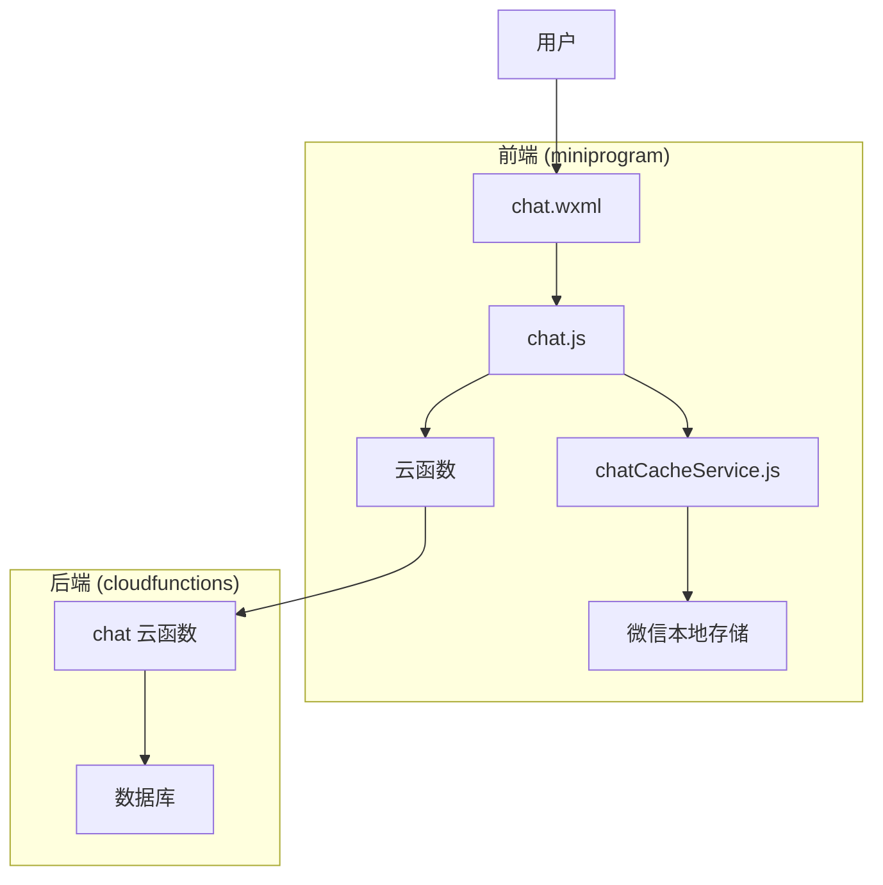
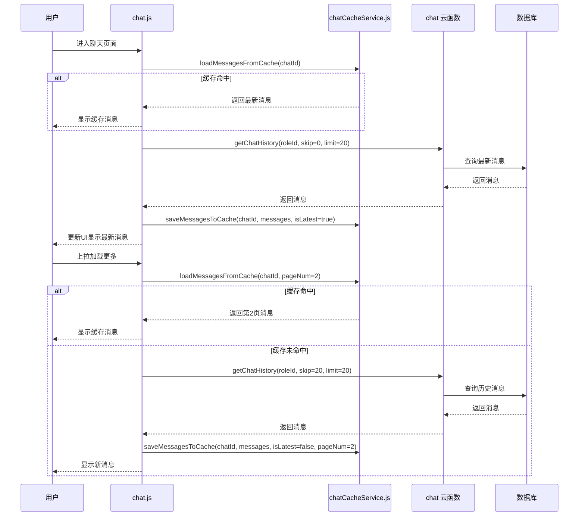
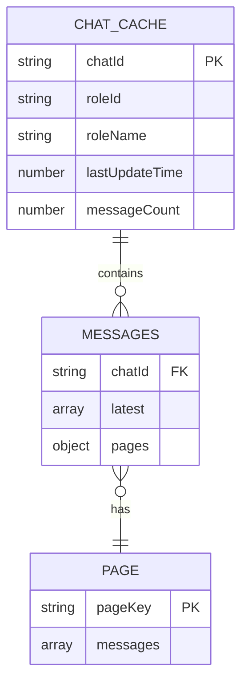
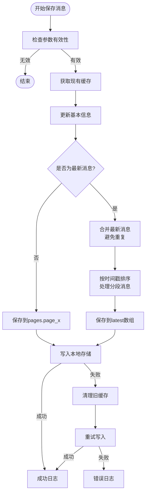
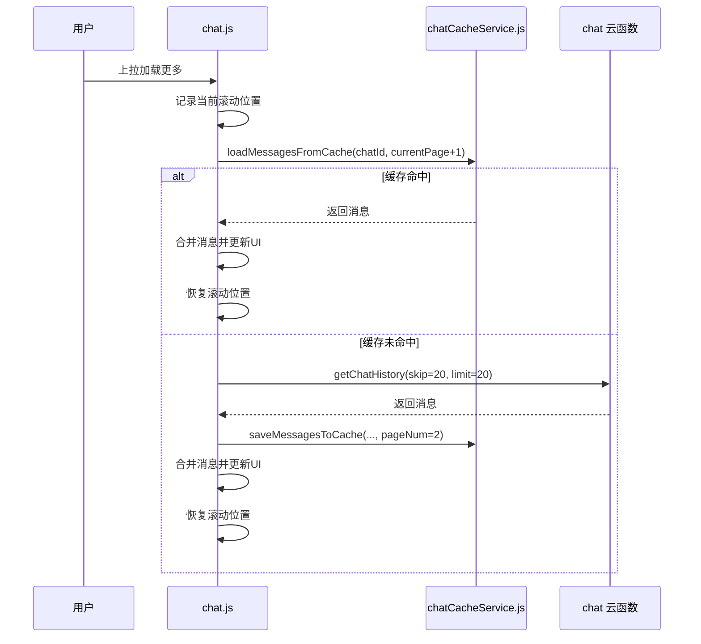
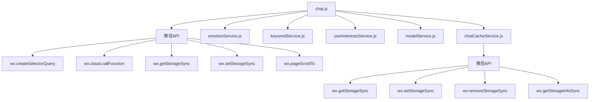

# 历史消息加载

<cite>
**本文档引用的文件**  
- [chatCacheService.js](file://miniprogram/services/chatCacheService.js)
- [chat.js](file://miniprogram/packageChat/pages/chat/chat.js)
- [chat.wxml](file://miniprogram/packageChat/pages/chat/chat.wxml)
- [聊天记录本地缓存与下拉加载功能说明.md](file://doc/使用文档/聊天记录本地缓存与下拉加载功能说明.md)
</cite>

## 目录
1. [简介](#简介)
2. [项目结构](#项目结构)
3. [核心组件](#核心组件)
4. [架构概述](#架构概述)
5. [详细组件分析](#详细组件分析)
6. [依赖分析](#依赖分析)
7. [性能考虑](#性能考虑)
8. [故障排除指南](#故障排除指南)
9. [结论](#结论)

## 简介
本文档深入分析 HeartChat 小程序中聊天历史消息的加载机制，重点探讨首次进入聊天页面时的本地缓存读取与云端同步策略。文档详细说明了分页加载（pagination）的实现方式、通过时间戳或消息ID进行增量拉取的逻辑、前端 scroll-view 的滚动监听与触底事件处理机制。同时，文档描述了本地缓存的数据结构设计（如按会话存储、LRU淘汰策略）、缓存更新时机与一致性保障措施。结合实际代码，展示如何处理历史消息的去重、排序与UI渲染衔接，并讨论离线场景下的用户体验优化方案。

## 项目结构
HeartChat 项目采用模块化设计，聊天历史消息相关的功能主要分布在 `miniprogram` 目录下的 `services` 和 `packageChat/pages/chat` 子目录中。`services` 目录包含核心的 `chatCacheService.js` 服务，负责本地缓存管理。`packageChat/pages/chat` 目录则包含聊天页面的逻辑文件 `chat.js` 和视图文件 `chat.wxml`，它们共同实现了消息的加载、渲染和用户交互。

**图示来源**  
- [chat.wxml](file://miniprogram/packageChat/pages/chat/chat.wxml)
- [chat.js](file://miniprogram/packageChat/pages/chat/chat.js)
- [chatCacheService.js](file://miniprogram/services/chatCacheService.js)

## 核心组件
聊天历史消息加载的核心组件包括 `chatCacheService.js` 服务和 `chat.js` 页面逻辑。`chatCacheService.js` 提供了缓存的读写、更新和清理功能，是本地数据管理的基石。`chat.js` 则负责协调缓存与云端的数据交互，处理用户触发的加载事件，并将数据渲染到UI上。

**核心组件来源**  
- [chatCacheService.js](file://miniprogram/services/chatCacheService.js)
- [chat.js](file://miniprogram/packageChat/pages/chat/chat.js)

## 架构概述
系统采用“本地优先，云端同步”的架构。当用户首次进入聊天页面时，应用会立即尝试从本地缓存读取最新消息，实现快速展示。与此同时，应用会向云端发起请求，获取最新的聊天历史，确保数据的实时性。对于历史消息的加载，系统采用分页策略，通过滚动监听触发加载更多操作。

**图示来源**  
- [chat.js](file://miniprogram/packageChat/pages/chat/chat.js#L1806-L2100)
- [chatCacheService.js](file://miniprogram/services/chatCacheService.js#L122-L128)

## 详细组件分析

### 本地缓存服务分析
`chatCacheService.js` 是整个历史消息加载机制的核心。它定义了清晰的缓存结构和操作接口。

#### 缓存数据结构设计
缓存服务采用分层结构，以 `chat_` 为前缀，按聊天ID进行隔离存储。每个聊天记录包含 `basic` 基本信息和 `messages` 消息体。`messages` 又分为 `latest` 最新消息和 `pages` 分页历史消息。这种设计支持了最新的快速访问和历史的分页加载。

**图示来源**  
- [chatCacheService.js](file://miniprogram/services/chatCacheService.js#L4-L20)
- [聊天记录本地缓存与下拉加载功能说明.md](file://doc/使用文档/聊天记录本地缓存与下拉加载功能说明.md#L15-L35)

#### 缓存更新与一致性
缓存服务通过 `saveMessagesToCache` 函数更新数据。该函数智能地处理消息去重，通过 `Set` 结构检查消息ID，避免重复存储。当保存最新消息时，会合并现有缓存并按时间戳排序；当保存历史分页时，则直接存储到对应的 `page_x` 键下。缓存更新后，会立即写入微信本地存储，保证数据持久化。

**图示来源**  
- [chatCacheService.js](file://miniprogram/services/chatCacheService.js#L48-L81)
- [chatCacheService.js](file://miniprogram/services/chatCacheService.js#L80-L128)

#### LRU淘汰策略
为了防止本地存储溢出，缓存服务实现了基于LRU（最近最少使用）算法的淘汰策略。通过 `cleanupOldCache` 函数，系统会获取所有以 `chat_` 开头的缓存键，根据每个聊天记录的 `lastUpdateTime` 进行排序，然后删除最旧的记录，直到缓存数量低于 `MAX_CACHED_CHATS`（默认为10个）的限制。

**缓存淘汰来源**  
- [chatCacheService.js](file://miniprogram/services/chatCacheService.js#L219-L264)

### 聊天页面逻辑分析
`chat.js` 文件是聊天页面的控制器，负责协调缓存、云端和UI之间的交互。

#### 首次加载与同步策略
在 `onLoad` 生命周期函数中，页面首先尝试从缓存加载消息。如果缓存存在且有数据，则立即显示，实现“秒开”体验。随后，页面会调用 `loadChatHistory` 函数从云端获取最新数据，完成数据的最终同步。这种策略确保了用户体验和数据一致性的平衡。

**首次加载来源**  
- [chat.js](file://miniprogram/packageChat/pages/chat/chat.js#L1806-L1900)

#### 分页加载与增量拉取
分页加载通过 `loadMoreHistory` 函数实现。该函数首先记录当前滚动位置，然后调用 `loadChatHistory` 加载下一页数据。`loadChatHistory` 函数会先尝试从缓存加载指定页码的数据，如果缓存未命中，则向云端发起请求。云端请求通过 `skip` 和 `limit` 参数实现基于页码的增量拉取。

**分页加载来源**  
- [chat.js](file://miniprogram/packageChat/pages/chat/chat.js#L677-L773)
- [chat.js](file://miniprogram/packageChat/pages/chat/chat.js#L367-L405)

#### 滚动监听与触底处理
页面通过 `scroll-view` 组件的 `bindscroll` 事件监听滚动。`onScroll` 函数会检测用户的滚动方向。当用户向上滚动时，标记为手动滚动模式。当检测到滚动位置接近底部时，会自动切换回自动滚动模式，确保新消息到来时能自动滚动到底部。`scrollToBottom` 函数负责执行滚动操作，它使用 `setTimeout` 和 `wx.nextTick` 确保在页面渲染完成后执行，避免滚动失效。

**滚动处理来源**  
- [chat.wxml](file://miniprogram/packageChat/pages/chat/chat.wxml#L30-L32)
- [chat.js](file://miniprogram/packageChat/pages/chat/chat.js#L2737-L2821)
- [chat.js](file://miniprogram/packageChat/pages/chat/chat.js#L2818-L2890)

#### 消息去重与排序
在 `processMessages` 函数中，系统会对从云端获取的消息进行预处理。首先，它会按时间戳对消息进行排序，确保顺序正确。其次，它会处理分段消息，将属于同一原始消息的分段按 `segmentIndex` 排序。最后，通过 `Set` 结构检查消息ID，与现有消息列表进行去重，确保UI不会显示重复消息。

**消息处理来源**  
- [chat.js](file://miniprogram/packageChat/pages/chat/chat.js#L514-L565)

## 依赖分析
历史消息加载功能依赖于微信小程序的多个API和项目内部的其他服务。

**图示来源**  
- [chat.js](file://miniprogram/packageChat/pages/chat/chat.js#L1-L20)
- [chatCacheService.js](file://miniprogram/services/chatCacheService.js#L1-L20)

## 性能考虑
系统在性能方面做了多项优化。本地缓存显著减少了网络请求，提升了加载速度。分页加载避免了一次性加载大量数据。缓存淘汰策略防止了存储空间耗尽。在UI渲染方面，通过 `scroll-anchoring` 和 `enhanced` 属性优化了 `scroll-view` 的性能。`scrollToBottom` 函数的多次延时调用，确保了在键盘弹出/收起等复杂场景下的滚动可靠性。

## 故障排除指南
当历史消息加载出现问题时，可参考以下步骤进行排查：
1.  **检查缓存**：确认 `chatCacheService.js` 中的 `CACHE_PREFIX` 是否正确，检查微信开发者工具的存储面板，查看缓存数据是否存在。
2.  **检查网络请求**：在 `chat.js` 的 `loadChatHistory` 函数中添加日志，确认 `wx.cloud.callFunction` 是否成功调用，检查云函数返回结果。
3.  **检查滚动问题**：如果 `scrollToBottom` 失效，检查 `#chat-container` 的ID是否正确，确认 `scroll-view` 组件的 `scroll-y` 属性已开启。
4.  **检查数据一致性**：如果出现消息重复，检查 `processMessages` 和 `saveMessagesToCache` 中的去重逻辑，确保 `Set` 结构正确使用了消息ID。

**故障排除来源**  
- [chatCacheService.js](file://miniprogram/services/chatCacheService.js#L122-L171)
- [chat.js](file://miniprogram/packageChat/pages/chat/chat.js#L514-L565)

## 结论
HeartChat 的历史消息加载机制设计精良，通过“本地缓存+云端同步+分页加载”的策略，在保证数据实时性的同时，极大地提升了用户体验。其模块化的代码结构和清晰的职责划分，使得功能易于维护和扩展。LRU缓存淘汰和消息去重排序等细节处理，体现了对性能和数据一致性的高度重视。该实现为类似的小程序应用提供了优秀的参考范例。