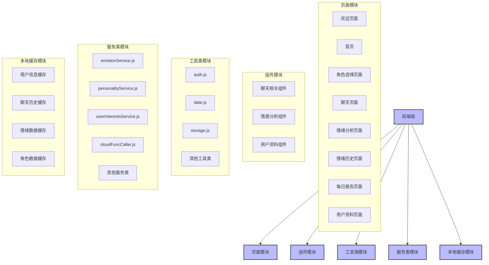
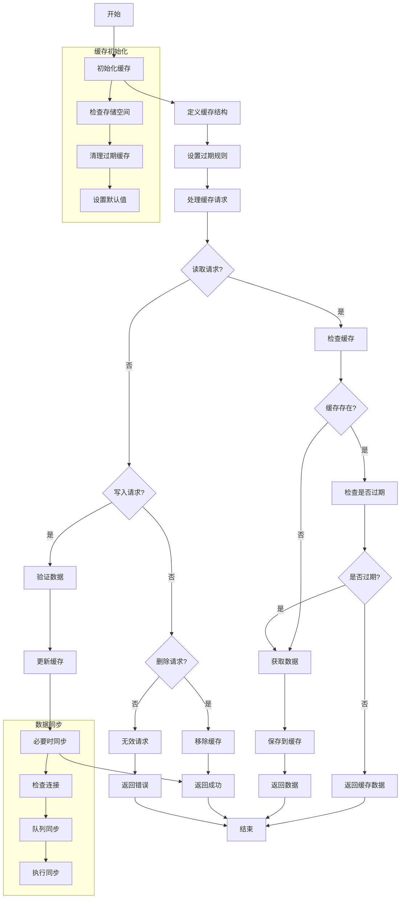
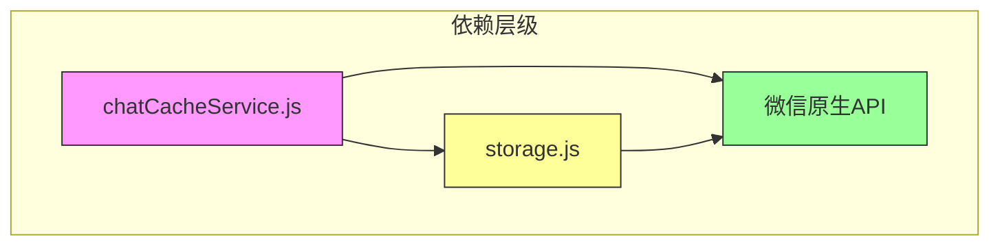

# 本地缓存策略

<cite>
**本文档引用文件**  
- [chatCacheService.js](file://miniprogram/services/chatCacheService.js)
- [storage.js](file://miniprogram/utils/storage.js)
- [聊天记录本地缓存与下拉加载功能说明.md](file://doc/使用文档/聊天记录本地缓存与下拉加载功能说明.md)
- [HeartChat技术实现流程图.md](file://doc/设计文档/流程图/HeartChat技术实现流程图.md)
- [HeartChat系统架构图.md](file://doc/设计文档/流程图/HeartChat系统架构图.md)
</cite>

## 目录
1. [简介](#简介)
2. [项目结构](#项目结构)
3. [核心组件](#核心组件)
4. [架构概览](#架构概览)
5. [详细组件分析](#详细组件分析)
6. [依赖分析](#依赖分析)
7. [性能考量](#性能考量)
8. [故障排除指南](#故障排除指南)
9. [结论](#结论)

## 简介
本文件全面解析 HeartChat 微信小程序中 `chatCacheService.js` 实现的本地消息缓存机制。该机制通过微信小程序的 Storage API 实现持久化存储，支持离线访问、快速恢复会话状态和高效的历史消息加载。文档详细说明了缓存键设计原则、数据序列化处理、读写流程、容量管理及性能优化策略。

## 项目结构



**图示来源**  
- [HeartChat系统架构图.md](file://doc/设计文档/流程图/HeartChat系统架构图.md#L17-L69)

**本节来源**  
- [HeartChat系统架构图.md](file://doc/设计文档/流程图/HeartChat系统架构图.md#L17-L69)

## 核心组件

`chatCacheService.js` 是 HeartChat 小程序中负责聊天记录本地缓存管理的核心服务模块。它封装了对微信小程序 Storage API 的操作，提供统一的接口用于保存、加载、更新和清理聊天缓存。该服务支持分页存储、最新消息缓存、基础信息维护和自动清理机制，确保在有限的本地存储空间内高效管理用户聊天数据。

**本节来源**  
- [chatCacheService.js](file://miniprogram/services/chatCacheService.js#L1-L20)
- [聊天记录本地缓存与下拉加载功能说明.md](file://doc/使用文档/聊天记录本地缓存与下拉加载功能说明.md#L0-L50)

## 架构概览



**图示来源**  
- [HeartChat技术实现流程图.md](file://doc/设计文档/流程图/HeartChat技术实现流程图.md#L255-L306)

**本节来源**  
- [HeartChat技术实现流程图.md](file://doc/设计文档/流程图/HeartChat技术实现流程图.md#L255-L306)

## 详细组件分析

### 聊天缓存服务分析

`chatCacheService.js` 实现了一套完整的本地消息缓存机制，利用微信小程序提供的同步 Storage API 进行持久化存储。其核心功能包括消息的保存、加载、更新和清理，支持分页存储和最新消息缓存，确保用户在不同网络环境下都能获得流畅的聊天体验。

#### 缓存键设计原则

缓存键采用前缀加唯一标识的组合方式，确保不同聊天会话的数据隔离。具体设计如下：
- **前缀定义**：使用 `chat_` 作为所有聊天缓存的统一前缀（`CACHE_PREFIX`）
- **键格式**：`chat_<chatId>`，其中 `chatId` 通常由用户ID与角色ID组合生成
- **优势**：便于批量操作（如通过 `startsWith` 过滤）、避免命名冲突、提高可读性和可维护性

```javascript
const CACHE_PREFIX = 'chat_';
const cacheKey = `${CACHE_PREFIX}${chatId}`;
```

**本节来源**  
- [chatCacheService.js](file://miniprogram/services/chatCacheService.js#L4-L5)

#### 数据结构与序列化处理

缓存数据结构设计合理，包含基本信息和消息体两大部分，支持复杂场景下的数据管理。

```javascript
{
  "basic": {
    "roleId": "角色ID",
    "roleName": "角色名称",
    "lastUpdateTime": 1650000000000,
    "messageCount": 120
  },
  "messages": {
    "latest": [/* 最新的20条消息 */],
    "pages": {
      "page_1": [/* 第1页消息，按时间倒序 */],
      "page_2": [/* 第2页消息 */]
    }
  }
}
```

微信小程序的 Storage API 自动处理 JavaScript 对象的序列化与反序列化，开发者无需手动调用 `JSON.stringify` 或 `JSON.parse`。所有数据以同步方式存取，保证操作的原子性和一致性。

**本节来源**  
- [聊天记录本地缓存与下拉加载功能说明.md](file://doc/使用文档/聊天记录本地缓存与下拉加载功能说明.md#L0-L50)
- [chatCacheService.js](file://miniprogram/services/chatCacheService.js#L20-L45)

#### 缓存读写流程

##### 消息写入流程

当用户发送或接收新消息后，系统调用 `saveMessagesToCache` 方法将消息写入本地缓存：

1. **参数校验**：检查 `chatId` 和 `messages` 是否有效
2. **获取现有缓存**：通过 `wx.getStorageSync` 读取当前聊天的缓存对象
3. **初始化结构**：若无缓存则创建默认结构，包含 `basic` 和 `messages` 两个子对象
4. **更新基本信息**：更新角色信息、最后更新时间及消息计数
5. **合并最新消息**：对最新消息进行去重和排序（按时间戳或分段索引）
6. **分页存储**：历史消息按页码存储于 `pages` 对象中
7. **持久化保存**：调用 `wx.setStorageSync` 将更新后的缓存写回

异常处理机制会在写入失败时尝试清理旧缓存并重试，增强系统鲁棒性。

##### 会话状态恢复流程

页面加载时，通过 `loadMessagesFromCache` 快速恢复会话状态：

1. **构建缓存键**：根据当前 `chatId` 生成对应的缓存键
2. **读取缓存**：调用 `wx.getStorageSync` 获取缓存数据
3. **返回结果**：
   - 若请求特定页码，返回 `pages` 中对应页面的消息数组
   - 否则返回 `latest` 中的最新消息列表
4. **数据绑定**：将缓存消息直接赋值给页面数据模型，实现快速渲染

此机制显著减少了首次加载时的网络请求，提升了用户体验。

##### 缓存清理逻辑

提供两种级别的清理机制：

- **清除指定会话**：调用 `clearChatCache(chatId)` 删除特定聊天的所有缓存数据
- **清理旧会话**：`cleanupOldCache()` 方法监控缓存数量，当超过 `MAX_CACHED_CHATS`（默认10个）时，按 `lastUpdateTime` 排序并删除最旧的会话

此外，还支持单条消息的更新操作（`updateMessageInCache`），可用于修改消息状态（如发送成功、已读等）。

**本节来源**  
- [chatCacheService.js](file://miniprogram/services/chatCacheService.js#L50-L297)
- [聊天记录本地缓存与下拉加载功能说明.md](file://doc/使用文档/聊天记录本地缓存与下拉加载功能说明.md#L109-L179)

## 依赖分析



**图示来源**  
- [chatCacheService.js](file://miniprogram/services/chatCacheService.js#L50-L297)
- [storage.js](file://miniprogram/utils/storage.js#L0-L111)

**本节来源**  
- [chatCacheService.js](file://miniprogram/services/chatCacheService.js#L50-L297)
- [storage.js](file://miniprogram/utils/storage.js#L0-L111)

## 性能考量

`chatCacheService.js` 在性能优化方面采取了多项措施：

- **异步非阻塞**：虽然使用同步 API，但操作轻量，不影响主线程响应
- **批量操作**：消息以数组形式批量存取，减少 API 调用次数
- **内存优化**：仅保留最新20条消息在 `latest` 区域，历史消息按需分页加载
- **自动清理**：通过 `cleanupOldCache` 防止缓存无限增长，维持系统稳定性
- **错误恢复**：写入失败时自动触发清理并重试，提升容错能力

缓存容量受微信小程序限制（通常为10MB），因此合理控制单个聊天的缓存量至关重要。建议结合服务器分页策略，避免本地缓存过多历史数据。

## 故障排除指南

常见问题及解决方案：

- **缓存写入失败**：可能是存储空间不足，系统会自动调用 `cleanupOldCache` 清理旧数据后重试
- **消息未更新**：检查 `chatId` 是否正确，确保缓存键一致
- **分段消息乱序**：服务已内置按 `segmentIndex` 排序逻辑，确保分段消息正确关联
- **开发日志过多**：可通过设置 `isDev = false` 关闭详细日志输出

建议在生产环境中关闭开发日志，并定期监控缓存使用情况，防止达到存储上限。

**本节来源**  
- [chatCacheService.js](file://miniprogram/services/chatCacheService.js#L10-L15)
- [chatCacheService.js](file://miniprogram/services/chatCacheService.js#L100-L115)

## 结论

`chatCacheService.js` 构建了一个高效、可靠的本地消息缓存系统，充分利用微信小程序的 Storage API 实现数据持久化。其基于用户ID+角色ID的缓存键设计确保了数据隔离，分页存储与最新消息缓存结合满足了快速加载和历史浏览的需求。通过自动清理机制有效管理缓存容量，保障系统长期稳定运行。该实现为小程序提供了优秀的离线体验和快速响应能力，是 HeartChat 应用性能优化的关键组成部分。