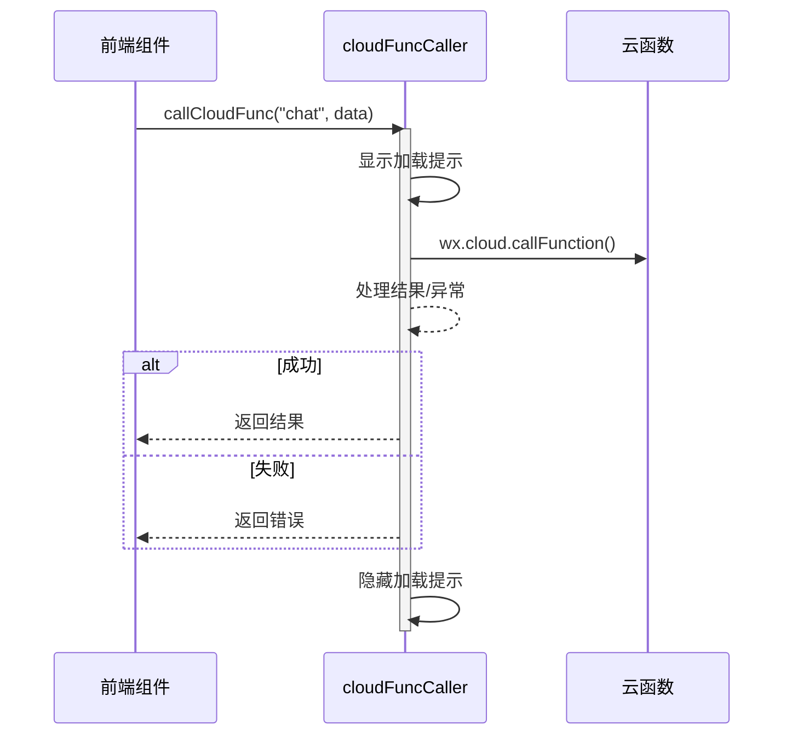
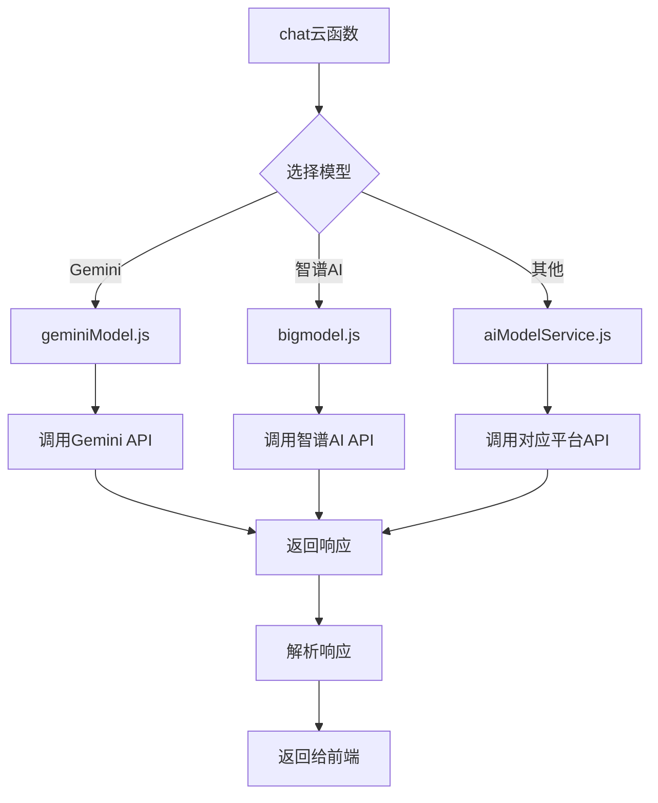
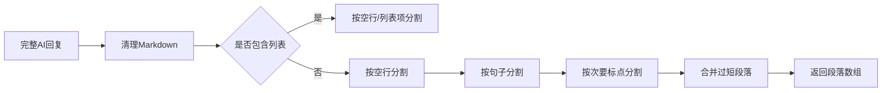

# 消息收发流程

<cite>
**本文档引用的文件**
- [cloudFuncCaller.js](file://miniprogram/services/cloudFuncCaller.js)
- [chat-input](file://miniprogram/packageChat/components/chat-input/index.js)
- [chat-bubble](file://miniprogram/packageChat/components/chat-bubble/index.js)
- [index.js](file://cloudfunctions/chat/index.js)
- [aiModelService.js](file://cloudfunctions/chat/aiModelService.js)
- [geminiModel.js](file://cloudfunctions/chat/geminiModel.js)
- [bigmodel.js](file://cloudfunctions/chat/bigmodel.js)
</cite>

## 目录
1. [简介](#简介)
2. [前端消息输入与触发机制](#前端消息输入与触发机制)
3. [云函数调用封装与可靠性保障](#云函数调用封装与可靠性保障)
4. [AI云函数协调与多模型服务调用](#ai云函数协调与多模型服务调用)
5. [响应数据的异步返回与渲染](#响应数据的异步返回与渲染)
6. [流式输出实现机制](#流式输出实现机制)
7. [消息状态管理与错误处理](#消息状态管理与错误处理)
8. [超时控制方案](#超时控制方案)
9. [总结](#总结)

## 简介
HeartChat 是一个基于微信小程序的智能对话系统，其核心功能是实现用户输入到AI响应的完整闭环。本系统从前端组件捕获用户输入开始，通过封装的云函数调用机制，协调调用智谱AI、Gemini等多模型服务，并将响应数据以流式方式渐进渲染在聊天界面中。整个流程涉及前端交互、网络通信、后端协调、AI模型调用等多个环节，具备完善的消息状态管理、错误处理和超时控制机制。

## 前端消息输入与触发机制

用户在聊天界面通过 `chat-input` 组件输入消息，该组件负责捕获用户的文本输入并触发后续的云函数调用流程。当用户点击发送按钮或按下回车键时，组件会收集输入内容、当前角色ID、对话上下文等信息，并调用 `cloudFuncCaller.callCloudFunc` 方法发起云函数请求。

`chat-input` 组件在发送消息前会对输入内容进行基本验证，确保消息非空且符合长度要求。同时，组件会更新自身的状态为“发送中”，以提供即时的用户反馈。整个过程通过事件绑定和方法调用实现，确保了用户操作与系统响应之间的紧密耦合。

**Section sources**
- [chat-input](file://miniprogram/packageChat/components/chat-input/index.js)

## 云函数调用封装与可靠性保障

`cloudFuncCaller.js` 服务模块提供了统一的云函数调用接口，封装了 `wx.cloud.callFunction` 的底层调用逻辑，实现了错误处理、日志记录和加载状态管理等可靠性保障机制。

该模块提供了 `callCloudFunc` 和 `batchCallCloudFunc` 两个核心方法，分别用于单次和批量调用云函数。调用过程中，模块会自动处理加载提示的显示与隐藏，记录详细的调用日志（在开发环境下），并对返回结果进行有效性验证。当调用失败时，模块会捕获异常，记录错误信息，并根据配置决定是否向用户显示错误提示。

通过这种封装，业务代码无需关心底层的网络通信细节，只需关注业务逻辑本身，大大提高了代码的可维护性和健壮性。

**Diagram sources**
- [cloudFuncCaller.js](file://miniprogram/services/cloudFuncCaller.js)

**Section sources**
- [cloudFuncCaller.js](file://miniprogram/services/cloudFuncCaller.js)

## AI云函数协调与多模型服务调用

`chat` 云函数是整个消息处理流程的核心协调者。当接收到前端的请求后，`index.js` 中的 `generateAIReply` 函数会被触发。该函数首先验证输入参数，然后根据请求中指定的 `modelType`（如 gemini、zhipu 等）来决定使用哪个AI模型。

云函数通过导入 `aiModelService.js` 模块来实现对多模型的统一调用。`aiModelService` 模块定义了 `MODEL_PLATFORMS` 配置对象，包含了智谱AI、Gemini、OpenAI等多个平台的API地址、认证方式和默认模型等信息。`generateChatReply` 方法会根据目标平台，将消息历史和用户输入格式化为对应API所需的格式，然后通过 `callModelApi` 方法发起HTTP请求。

对于Gemini等特殊平台，`formatMessages` 函数会将标准的聊天消息数组转换为Gemini API所需的 `contents` 格式；`parseResponse` 函数则负责将不同平台返回的JSON响应解析为统一的 `{ content, usage }` 结构，实现了对多模型服务的透明协调。

**Diagram sources**
- [index.js](file://cloudfunctions/chat/index.js)
- [aiModelService.js](file://cloudfunctions/chat/aiModelService.js)

**Section sources**
- [index.js](file://cloudfunctions/chat/index.js)
- [aiModelService.js](file://cloudfunctions/chat/aiModelService.js)
- [geminiModel.js](file://cloudfunctions/chat/geminiModel.js)
- [bigmodel.js](file://cloudfunctions/chat/bigmodel.js)

## 响应数据的异步返回与渲染

云函数处理完成后，会将AI生成的回复以JSON格式返回给前端。前端接收到响应后，会通过 `chat-bubble` 组件将消息渲染到聊天界面中。

`chat-bubble` 组件负责展示消息内容、发送状态、时间戳等信息。它会根据消息的 `role` 字段（user 或 assistant）来决定消息气泡的样式和位置。对于AI的回复，组件会将其内容安全地插入到页面结构中，并触发界面更新。

整个过程是异步的：前端发起请求后不会阻塞UI，而是继续响应用户的其他操作。当云函数返回结果时，通过Promise的回调机制通知前端，前端再更新界面。这种异步机制保证了应用的流畅性和响应性。

**Section sources**
- [chat-bubble](file://miniprogram/packageChat/components/chat-bubble/index.js)

## 流式输出实现机制

为了模拟真实对话的渐进式回复效果，系统实现了消息分段返回与渐进渲染机制。`index.js` 中的 `splitMessage` 函数负责将AI返回的完整回复分割成多个语义完整的段落。

该函数首先清理消息中的Markdown格式，然后根据预设的最大段落长度（150字符）和最小段落长度（20字符），结合中文和英文的标点符号（如句号、问号、感叹号、逗号、分号等）进行智能分割。它会优先按空行、换行符分割，然后按句子分割，最后按次要标点分割，确保分段的自然性和可读性。

分割后的段落数组通过 `segments` 字段返回给前端。前端可以逐段渲染这些内容，实现类似“打字机”效果的流式输出，极大地提升了用户体验。

**Diagram sources**
- [index.js](file://cloudfunctions/chat/index.js)

**Section sources**
- [index.js](file://cloudfunctions/chat/index.js)

## 消息状态管理与错误处理

系统实现了完善的消息状态管理，包括“发送中”、“已送达”、“发送失败”等状态。`chat-input` 组件在发送消息时会立即更新状态，`chat-bubble` 组件则会根据消息的最终状态显示相应的图标或提示。

在错误处理方面，系统采用了多层次的策略：
1.  **前端捕获**：`cloudFuncCaller` 捕获网络异常和云函数返回的错误，通过 `wx.showToast` 向用户展示友好的错误信息。
2.  **云函数验证**：`chat` 云函数在执行前会验证所有输入参数，对无效请求直接返回错误，避免无效的AI调用。
3.  **AI服务重试**：`aiModelService` 在调用外部AI API时，对429（请求过多）等可恢复错误实现了指数退避重试机制，提高了调用的成功率。
4.  **降级处理**：当主要AI模型不可用时，系统可以配置备用模型，确保服务的可用性。

这种全面的错误处理策略确保了系统在各种异常情况下的稳定运行。

**Section sources**
- [cloudFuncCaller.js](file://miniprogram/services/cloudFuncCaller.js)
- [index.js](file://cloudfunctions/chat/index.js)
- [aiModelService.js](file://cloudfunctions/chat/aiModelService.js)

## 超时控制方案

系统在多个层面实现了超时控制，以防止请求无限期挂起：
1.  **HTTP请求超时**：`aiModelService.callModelApi` 方法在使用 `axios` 发起HTTP请求时设置了 `timeout` 参数。对于大多数模型，默认超时时间为20秒；对于响应较慢的Claude模型，则设置为30秒。
2.  **云函数执行超时**：微信云函数本身有执行时间限制（通常为60秒或更长），这为整个处理流程提供了兜底保护。
3.  **前端等待超时**：虽然前端代码未显式设置超时，但 `wx.cloud.callFunction` 的底层实现有默认的网络超时机制。

当发生超时错误时，`callModelApi` 会捕获 `ECONNABORTED` 异常，并将其转换为用户可理解的“连接超时”错误信息返回给前端，从而完成超时控制的闭环。

**Section sources**
- [aiModelService.js](file://cloudfunctions/chat/aiModelService.js)

## 总结
HeartChat的消息处理流程是一个设计精良、层次分明的系统。从前端组件的用户交互，到 `cloudFuncCaller` 的可靠调用封装，再到 `chat` 云函数对多模型服务的智能协调，最后通过流式输出和状态管理为用户提供流畅的对话体验，整个流程体现了高内聚、低耦合的设计思想。其完善的错误处理和超时控制机制，确保了系统在复杂网络环境下的稳定性和可靠性。