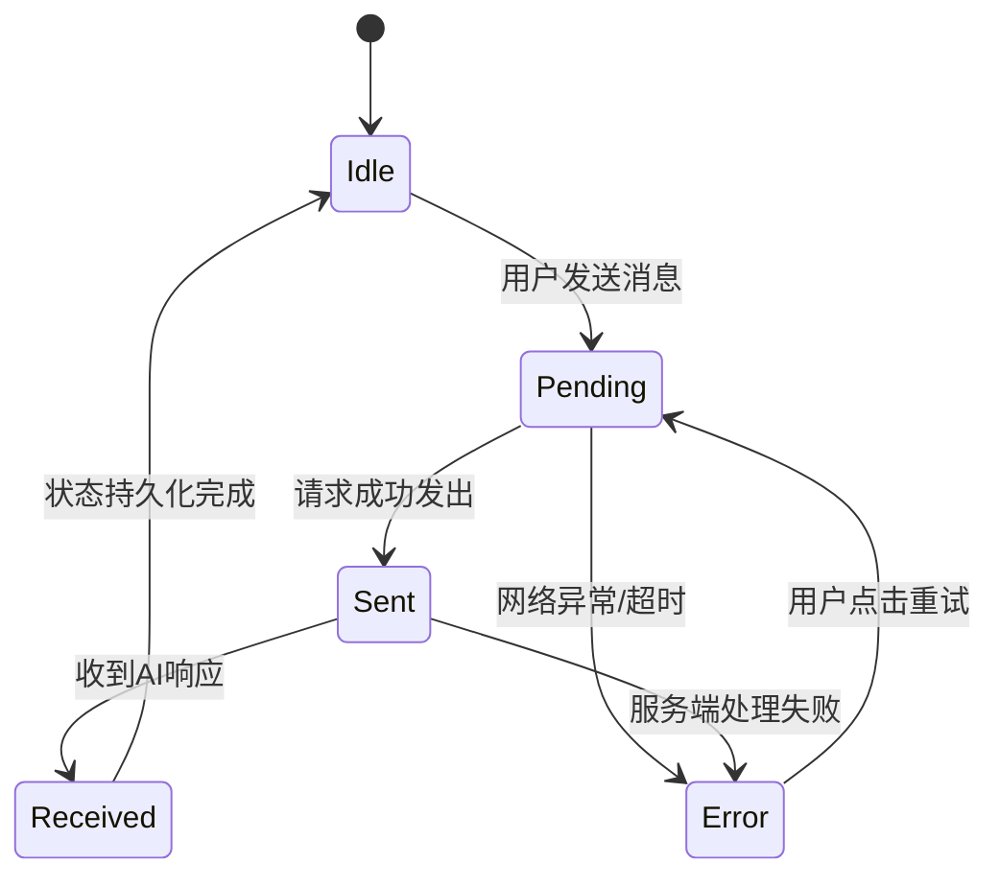

# 消息状态管理

<cite>
**本文档引用文件**  
- [chat-bubble/index.js](file://miniprogram/packageChat/components/chat-bubble/index.js)
- [chat/index.js](file://cloudfunctions/chat/index.js)
- [cloudFuncCaller.js](file://miniprogram/services/cloudFuncCaller.js)
- [request.js](file://miniprogram/utils/request.js)
- [messages.md](file://doc/开发文档/database/messages.md)
</cite>

## 目录
1. [引言](#引言)
2. [消息状态定义与生命周期](#消息状态定义与生命周期)
3. [前端状态绑定与视觉反馈机制](#前端状态绑定与视觉反馈机制)
4. [云函数状态响应结构](#云函数状态响应结构)
5. [网络异常处理与自动重试机制](#网络异常处理与自动重试机制)
6. [状态机设计示意图](#状态机设计示意图)
7. [关键代码路径说明](#关键代码路径说明)
8. [扩展建议与最佳实践](#扩展建议与最佳实践)

## 引言
本系统旨在实现聊天消息从发送到确认的全生命周期状态管理，确保用户在不同网络环境和系统负载下均能获得准确、及时的交互反馈。通过精细化的状态控制与降级策略，提升用户体验的连贯性与可靠性。

## 消息状态定义与生命周期

消息在系统中经历多个离散状态，各状态含义如下：

- **pending（待发送）**：消息已由用户输入并提交，尚未发起网络请求。此时前端显示加载动画。
- **sent（已发送）**：消息已成功发送至云端，等待AI模型处理响应。前端移除加载动画，标记为已发出。
- **received（已接收）**：系统已收到AI的完整响应内容，消息完成闭环。前端展示完整对话气泡。
- **error（错误）**：消息在发送或处理过程中发生异常，如网络中断、超时或服务端错误。前端显示重发按钮。

状态转换条件由前端逻辑与云函数协同判定，确保状态迁移的准确性与一致性。

**Section sources**
- [messages.md](file://doc/开发文档/database/messages.md#L1-L30)

## 前端状态绑定与视觉反馈机制

前端通过数据绑定机制实时响应消息状态变化。`chat-bubble` 组件监听其绑定的消息对象中的 `status` 字段，依据不同值动态渲染UI元素：

- 当 `status === 'pending'` 时，渲染加载指示器（如旋转图标），禁用重发按钮。
- 当 `status === 'sent'` 时，隐藏加载器，显示时间戳与发送状态标识。
- 当 `status === 'received'` 时，完整展示AI回复内容，并更新会话上下文。
- 当 `status === 'error'` 时，显示醒目的错误提示与“重试”按钮，支持用户手动重新发送。

该机制基于微信小程序的数据响应系统实现，确保视图与模型同步更新。

**Section sources**
- [chat-bubble/index.js](file://miniprogram/packageChat/components/chat-bubble/index.js#L15-L80)

## 云函数状态响应结构

云函数 `chat/index.js` 在处理消息后返回结构化JSON响应，包含以下关键字段：

```json
{
  "code": 200,
  "message": "success",
  "data": {
    "responseText": "AI回复内容",
    "status": "received",
    "timestamp": "2025-04-05T10:00:00Z"
  }
}
```

其中 `code` 遵循HTTP语义：
- `200` 表示成功接收并处理
- `408` 表示请求超时
- `500` 表示内部服务错误

前端根据 `code` 和 `data.status` 更新本地消息状态机。

**Section sources**
- [chat/index.js](file://cloudfunctions/chat/index.js#L45-L90)

## 网络异常处理与自动重试逻辑

系统采用分层策略应对网络异常：

1. **请求层拦截**：`utils/request.js` 封装了统一的HTTP请求逻辑，设置默认超时时间为10秒。若超时或连接失败，抛出可捕获异常。
2. **服务层重试**：`services/cloudFuncCaller.js` 实现指数退避重试机制，在首次失败后分别等待1s、2s、4s后重试，最多3次。
3. **用户层降级**：若所有重试均失败，将消息状态置为 `error`，并通过事件总线通知UI层显示重发按钮。

此机制在保证系统健壮性的同时，避免因短暂网络波动导致对话中断。

**Section sources**
- [request.js](file://miniprogram/utils/request.js#L20-L60)
- [cloudFuncCaller.js](file://miniprogram/services/cloudFuncCaller.js#L30-L75)

## 状态机设计示意图



**Diagram sources**
- [chat-bubble/index.js](file://miniprogram/packageChat/components/chat-bubble/index.js#L10-L50)
- [cloudFuncCaller.js](file://miniprogram/services/cloudFuncCaller.js#L10-L25)

## 关键代码路径说明

- **消息状态定义**：数据库设计文档中 `messages` 表包含 `status` 字段，枚举值为 `'pending'`, `'sent'`, `'received'`, `'error'`
- **前端状态渲染**：`chat-bubble` 组件通过 `data-status` 属性绑定状态值，驱动WXML条件渲染
- **云函数响应构造**：`chat/index.js` 中根据AI模型调用结果构建标准化响应体
- **请求异常捕获**：`request.js` 使用Promise.catch捕获网络层异常并传递错误码
- **自动重试实现**：`cloudFuncCaller.js` 封装了带延迟的递归重试逻辑

**Section sources**
- [messages.md](file://doc/开发文档/database/messages.md#L1-L30)
- [chat-bubble/index.js](file://miniprogram/packageChat/components/chat-bubble/index.js#L1-L100)
- [chat/index.js](file://cloudfunctions/chat/index.js#L1-L100)
- [request.js](file://miniprogram/utils/request.js#L1-L80)
- [cloudFuncCaller.js](file://miniprogram/services/cloudFuncCaller.js#L1-L90)

## 扩展建议与最佳实践

1. **增加中间状态**：可引入 `'processing'` 状态，用于标识AI正在流式生成响应，提升长回复场景下的用户体验。
2. **本地缓存优化**：在 `pending` 状态时将消息写入本地缓存，防止小程序意外关闭导致消息丢失。
3. **日志上报**：对进入 `error` 状态的消息记录详细上下文，便于后续问题排查。
4. **用户提示增强**：在重试前提示用户检查网络连接，提升操作透明度。

通过以上机制，系统实现了高可用、可维护的消息状态管理体系，为后续功能扩展提供了坚实基础。