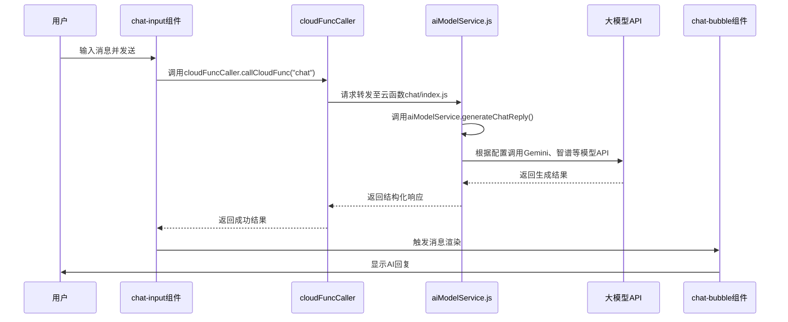

# 聊天系统

<cite>
**本文档引用文件**  
- [chatCacheService.js](file://miniprogram/services/chatCacheService.js)
- [cloudFuncCaller.js](file://miniprogram/services/cloudFuncCaller.js)
- [aiModelService.js](file://cloudfunctions/chat/aiModelService.js)
- [chat-input](file://miniprogram/packageChat/components/chat-input/index.js)
- [chat-bubble](file://miniprogram/packageChat/components/chat-bubble/index.js)
</cite>

## 目录
1. [引言](#引言)
2. [消息发送与接收链路](#消息发送与接收链路)
3. [聊天记录本地缓存策略](#聊天记录本地缓存策略)
4. [分页加载机制](#分页加载机制)
5. [消息流式输出实现方案](#消息流式输出实现方案)
6. [消息状态管理](#消息状态管理)
7. [多媒体消息扩展点](#多媒体消息扩展点)
8. [网络异常重试机制](#网络异常重试机制)
9. [总结](#总结)

## 引言
HeartChat 聊天系统采用前后端分离架构，结合云函数与本地缓存技术，实现高效、稳定、可扩展的对话体验。系统从前端组件触发消息发送，经由云函数调用大模型 API，最终将响应渲染至界面，并支持本地缓存、分页加载、流式输出等高级功能。

## 消息发送与接收链路

**图示来源**  
- [chat-input](file://miniprogram/packageChat/components/chat-input/index.js)
- [cloudFuncCaller.js](file://miniprogram/services/cloudFuncCaller.js)
- [aiModelService.js](file://cloudfunctions/chat/aiModelService.js)
- [chat-bubble](file://miniprogram/packageChat/components/chat-bubble/index.js)

**本节来源**  
- [chat-input](file://miniprogram/packageChat/components/chat-input/index.js#L1-L100)
- [cloudFuncCaller.js](file://miniprogram/services/cloudFuncCaller.js#L1-L180)
- [aiModelService.js](file://cloudfunctions/chat/aiModelService.js#L1-L587)

## 聊天记录本地缓存策略

HeartChat 使用 `chatCacheService.js` 实现本地缓存管理，基于微信小程序的 `wx.setStorageSync` 和 `wx.getStorageSync` 进行持久化存储。

缓存结构采用分层设计：
- `basic`：存储聊天会话基本信息（角色ID、名称、最后更新时间、消息总数）
- `messages`：包含 `latest` 最新消息列表与 `pages` 分页历史消息
- 缓存键名为 `chat_<chatId>`，确保多会话隔离

缓存写入时自动合并去重，并按时间戳排序，支持分段消息的索引排序。当缓存超出最大限制（默认10个聊天）时，自动清理最久未使用的会话。

**本节来源**  
- [chatCacheService.js](file://miniprogram/services/chatCacheService.js#L1-L299)

## 分页加载机制

系统通过 `loadMessagesFromCache(chatId, pageNum)` 方法实现分页加载，每页固定20条消息（`PAGE_SIZE = 20`）。

加载流程如下：
1. 用户下拉触发历史消息加载
2. 计算页码并调用 `loadMessagesFromCache(chatId, pageNum)`
3. 从 `messages.pages['page_X']` 中读取对应页数据
4. 若缓存中无数据，则通过云函数从数据库加载并缓存

历史消息分页存储，避免一次性加载过多数据影响性能。同时，最新消息缓存保留最近两页内容（`slice(-PAGE_SIZE * 2)`），确保上下文连贯性。

**本节来源**  
- [chatCacheService.js](file://miniprogram/services/chatCacheService.js#L1-L299)

## 消息流式输出实现方案

当前系统虽未在 `aiModelService.js` 中显式实现流式输出（如 SSE 或 WebSocket 流），但已具备扩展能力：

- `callModelApi` 方法支持异步调用，可通过监听 `onDownloadProgress` 实现流式接收（需平台支持）
- Gemini、OpenAI 等模型 API 支持 `stream: true` 参数，可在请求体中添加以启用流式响应
- 前端可通过 `chat-bubble` 组件逐步渲染增量内容，实现“打字机”效果

未来可通过修改 `callModelApi` 的 axios 配置，启用 `responseType: 'stream'` 并结合事件监听，实现真正的流式输出。

**本节来源**  
- [aiModelService.js](file://cloudfunctions/chat/aiModelService.js#L1-L587)

## 消息状态管理

系统通过消息对象中的状态字段管理消息生命周期，支持以下状态：
- **发送中**：UI 显示加载动画，消息 `status` 为 `sending`
- **已送达**：云函数返回成功，`status` 更新为 `sent`，并记录时间戳
- **错误**：调用失败或 API 异常，`status` 为 `error`，并显示重试按钮

状态更新通过 `updateMessageInCache(chatId, messageId, updates)` 方法实现，支持局部更新，无需重载整个消息列表。

**本节来源**  
- [chatCacheService.js](file://miniprogram/services/chatCacheService.js#L1-L299)
- [cloudFuncCaller.js](file://miniprogram/services/cloudFuncCaller.js#L1-L180)

## 多媒体消息扩展点

虽然当前代码未直接处理多媒体消息，但系统架构具备良好扩展性：
- 消息对象支持 `_id`、`timestamp`、`role`、`content` 字段，可扩展 `type` 字段标识消息类型（文本、图片、语音等）
- `chat-bubble` 组件可根据 `type` 动态渲染不同 UI 模板
- `imageService.js` 和 `voiceService.js` 已存在，可用于处理图片上传与语音识别
- 发送图片时，可先调用上传接口获取 URL，再作为 `content` 发送

**本节来源**  
- [chat-bubble](file://miniprogram/packageChat/components/chat-bubble/index.js)
- [chatCacheService.js](file://miniprogram/services/chatCacheService.js#L1-L299)
- [imageService.js](file://miniprogram/services/imageService.js)
- [voiceService.js](file://miniprogram/services/voiceService.js)

## 网络异常重试机制

系统在多个层级实现网络异常处理与重试：

1. **云函数调用层**（`cloudFuncCaller.js`）：
   - 捕获 `wx.cloud.callFunction` 异常
   - 自动显示错误提示（`wx.showToast`）
   - 支持配置是否显示错误提示

2. **AI模型调用层**（`aiModelService.js`）：
   - 对 429 错误（请求过多）自动重试，指数退避（`retryDelay * 2`）
   - 超时错误（`ECONNABORTED`）抛出可读提示
   - 认证失败（401/403）提示检查 API 密钥
   - 网络连接错误（`ENOTFOUND`）提示服务器不可达

3. **重试参数**：
   - 默认重试 3 次
   - 初始延迟 1000ms，每次翻倍
   - 不同模型设置不同超时时间（如 Claude 为 30s）

**本节来源**  
- [cloudFuncCaller.js](file://miniprogram/services/cloudFuncCaller.js#L1-L180)
- [aiModelService.js](file://cloudfunctions/chat/aiModelService.js#L1-L587)

## 总结

HeartChat 聊天系统通过模块化设计实现了高可用、可维护的对话功能。从前端组件到云函数再到大模型 API，链路清晰，职责分明。本地缓存与分页机制保障了用户体验，而完善的错误处理与重试机制提升了系统健壮性。未来可进一步扩展流式输出与多媒体消息支持，提升交互沉浸感。