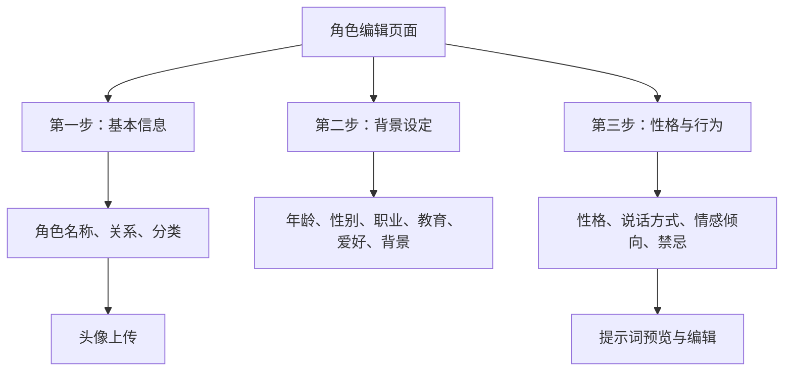
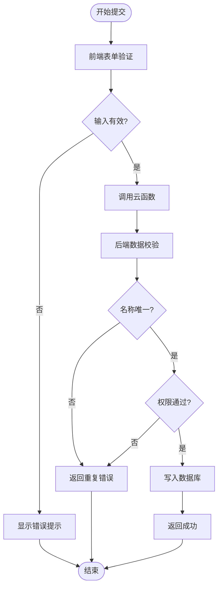
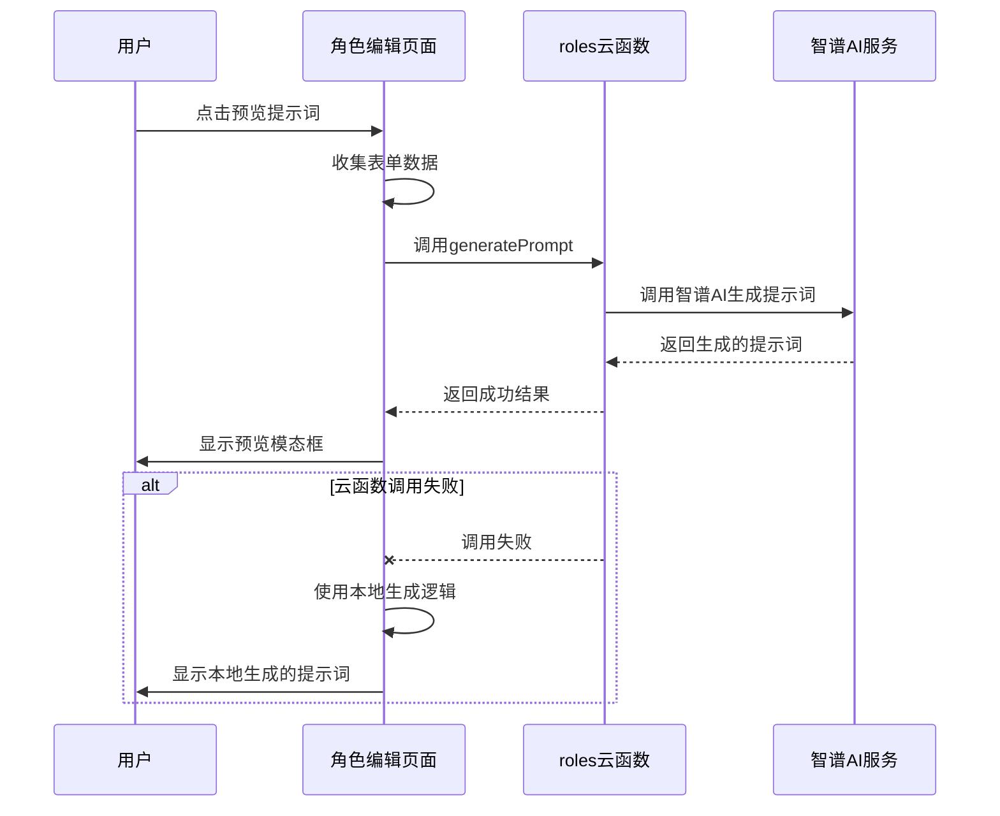
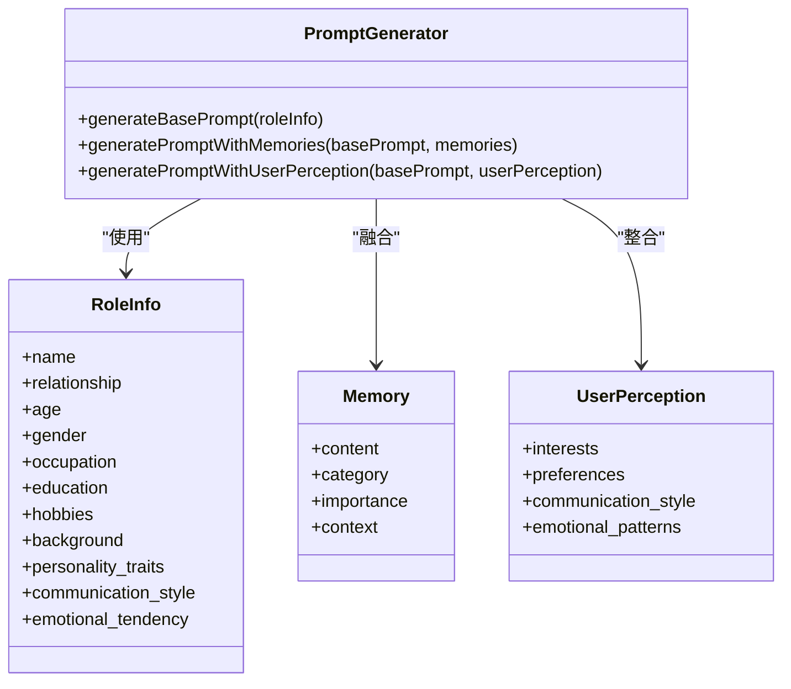
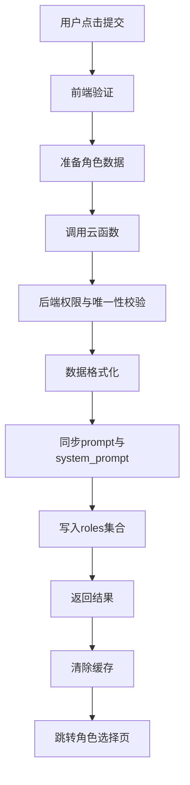
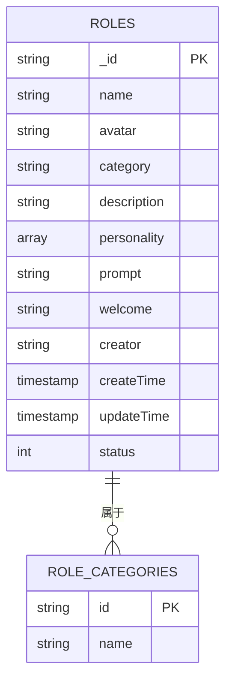

# 角色创建与编辑

<cite>
**本文档引用文件**  
- [role-editor/index.js](file://miniprogram/pages/role-editor/index.js)
- [promptGenerator.js](file://cloudfunctions/roles/promptGenerator.js)
- [index.js](file://cloudfunctions/roles/index.js)
- [init-roles.js](file://cloudfunctions/roles/init-roles.js)
</cite>

## 目录
1. [简介](#简介)
2. [角色编辑页面表单结构](#角色编辑页面表单结构)
3. [输入验证逻辑](#输入验证逻辑)
4. [实时预览功能](#实时预览功能)
5. [提示词模板生成机制](#提示词模板生成机制)
6. [角色数据提交与存储流程](#角色数据提交与存储流程)
7. [预设角色初始化](#预设角色初始化)
8. [安全性校验与异常处理](#安全性校验与异常处理)

## 简介
本文档深入解析HeartChat应用中角色创建与编辑功能的技术实现。重点涵盖角色编辑页面的表单设计、输入验证、提示词生成、数据提交与存储机制，以及预设角色的初始化流程。通过分析前端页面逻辑与后端云函数协作，全面揭示用户输入如何转化为AI角色行为定义的完整链路。

## 角色编辑页面表单结构
角色编辑页面采用分步式表单设计，共分为三个步骤，引导用户逐步完成角色创建或编辑。表单数据结构设计全面，涵盖角色基本信息、背景设定与行为规范。

表单字段包括：
- **基本信息**：角色名称、与用户关系（支持预设与自定义）、分类、年龄、性别
- **职业与背景**：职业、教育背景、爱好、背景故事
- **性格与行为**：性格特点、说话方式、情感倾向、禁忌话题
- **系统字段**：提示词（prompt）、头像

页面通过`data.form`对象统一管理所有表单字段，确保数据一致性。关系与分类之间存在映射逻辑，选择特定关系时会自动推荐相应分类。

**Diagram sources**
- [index.js](file://miniprogram/pages/role-editor/index.js#L20-L100)

**Section sources**
- [index.js](file://miniprogram/pages/role-editor/index.js#L20-L150)

## 输入验证逻辑
系统在多个层级实施输入验证，确保数据完整性与业务规则。

### 前端验证
在提交或跳转步骤时进行即时验证：
- **角色名称**：不能为空
- **与用户关系**：必须选择
- **自定义关系**：当选择“其他”时，必须填写具体关系名称
- **数组字段处理**：将逗号分隔的字符串（如爱好、性格特点）转换为数组格式

验证逻辑通过`handleSubmit`和`nextStep`函数实现，使用`wx.showToast`向用户反馈错误信息。

### 后端验证
云函数在数据写入前进行严格校验：
- **唯一性检查**：通过`creator`（openid）与`name`组合确保用户角色名称唯一
- **权限控制**：更新或删除角色时，验证操作者是否为创建者
- **字段过滤**：删除不可更新的系统字段（如`_id`、`createTime`）

**Diagram sources**
- [index.js](file://miniprogram/pages/role-editor/index.js#L600-L700)
- [index.js](file://cloudfunctions/roles/index.js#L200-L300)

**Section sources**
- [index.js](file://miniprogram/pages/role-editor/index.js#L500-L700)
- [index.js](file://cloudfunctions/roles/index.js#L200-L350)

## 实时预览功能
系统提供提示词实时预览功能，帮助用户理解角色行为定义。

### 预览流程
1. 用户点击“预览提示词”
2. 前端收集当前表单数据，调用`prepareRoleData`函数整理
3. 调用`roles`云函数的`generatePrompt`操作
4. 云函数调用`promptGenerator.generateBasePrompt`生成提示词
5. 返回结果并在模态框中展示

### 降级机制
当云函数调用失败时，系统自动降级使用本地生成逻辑`generateLocalPrompt`，确保功能可用性。

**Diagram sources**
- [index.js](file://miniprogram/pages/role-editor/index.js#L500-L550)
- [promptGenerator.js](file://cloudfunctions/roles/promptGenerator.js#L50-L150)

**Section sources**
- [index.js](file://miniprogram/pages/role-editor/index.js#L500-L580)
- [promptGenerator.js](file://cloudfunctions/roles/promptGenerator.js#L50-L150)

## 提示词模板生成机制
提示词生成是角色行为定义的核心，通过`promptGenerator.js`模块实现。

### 拼接规则
系统采用AI驱动的提示词生成策略：
1. **基础提示词生成**：将角色信息结构化为文本描述，通过智谱AI生成高质量提示词
2. **记忆融合**：将用户记忆按类别组织，自然融入提示词，避免生硬列举
3. **用户画像整合**：根据用户兴趣、偏好等画像信息调整角色互动方式

### 变量注入
角色信息作为变量注入到AI提示词中：
- **角色属性**：名称、关系、年龄、性别、职业等
- **性格特征**：性格特点、说话方式、情感倾向
- **背景信息**：教育背景、爱好、背景故事

AI模型根据这些变量生成符合角色设定的对话指导。

**Diagram sources**
- [promptGenerator.js](file://cloudfunctions/roles/promptGenerator.js#L50-L300)

**Section sources**
- [promptGenerator.js](file://cloudfunctions/roles/promptGenerator.js#L1-L325)

## 角色数据提交与存储流程
角色数据通过云函数提交至数据库，确保安全与一致性。

### 提交流程
1. 前端调用`handleSubmit`函数
2. 验证表单数据
3. 调用`roles`云函数的`createRole`或`updateRole`操作
4. 云函数执行数据校验与权限检查
5. 写入`roles`集合

### 存储结构
`roles`集合包含以下关键字段：
- **基础信息**：`name`, `avatar`, `category`, `description`
- **角色设定**：`personality`, `prompt`, `welcome`
- **元数据**：`creator`(openid), `createTime`, `updateTime`, `status`
- **兼容字段**：保留旧版字段如`role_name`, `role_type`确保向后兼容

### 数据一致性
系统确保`prompt`与`system_prompt`字段同步，避免因字段不一致导致的功能异常。

**Diagram sources**
- [index.js](file://miniprogram/pages/role-editor/index.js#L600-L750)
- [index.js](file://cloudfunctions/roles/index.js#L200-L350)

**Section sources**
- [index.js](file://miniprogram/pages/role-editor/index.js#L600-L750)
- [index.js](file://cloudfunctions/roles/index.js#L200-L350)

## 预设角色初始化
系统通过`init-roles.js`脚本部署预设角色，提供开箱即用的体验。

### 部署流程
1. 执行`initRoles`函数
2. 检查`roles`集合是否已有数据
3. 若无数据，则批量插入预设角色
4. 记录初始化日志

### 数据结构规范
预设角色遵循统一的数据结构：
- **系统标识**：`creator: "system"`，区别于用户自定义角色
- **状态管理**：`status: 1`表示启用
- **时间戳**：使用`db.serverDate()`确保服务器时间一致性
- **分类体系**：`category`字段定义角色类型（psychology, life, career, emotion）

预设角色包括心理咨询师、生活伴侣、职场导师、情感支持者等，覆盖主要使用场景。

**Diagram sources**
- [init-roles.js](file://cloudfunctions/roles/init-roles.js#L10-L100)

**Section sources**
- [init-roles.js](file://cloudfunctions/roles/init-roles.js#L1-L104)

## 安全性校验与异常处理
系统在前后端实施多层次安全校验与异常处理。

### 安全性校验
- **身份验证**：基于`openid`进行权限控制，防止越权操作
- **数据验证**：前后端双重验证，防止恶意数据注入
- **唯一性约束**：通过数据库索引确保角色名称唯一性

### 异常处理策略
- **前端降级**：云函数失败时使用本地逻辑生成提示词
- **错误分类**：区分网络错误、权限错误、数据错误等类型
- **用户友好提示**：将技术错误转化为用户可理解的提示信息
- **日志记录**：详细记录错误信息，便于问题排查

系统通过`try-catch`包裹关键操作，确保异常不会导致流程中断，并通过`console.error`记录详细错误堆栈。

**Section sources**
- [index.js](file://miniprogram/pages/role-editor/index.js#L600-L750)
- [index.js](file://cloudfunctions/roles/index.js#L200-L350)
- [promptGenerator.js](file://cloudfunctions/roles/promptGenerator.js#L1-L325)