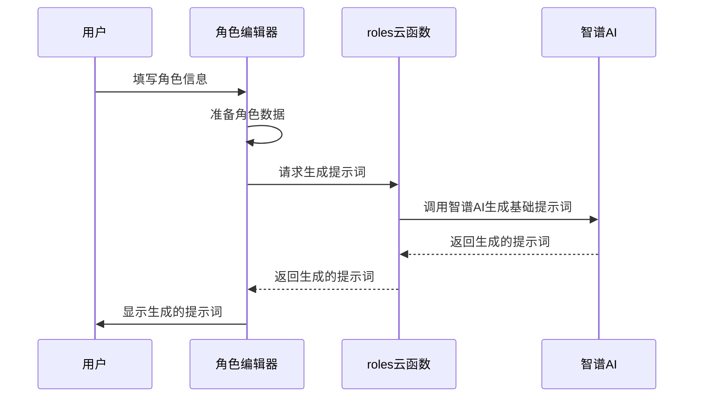
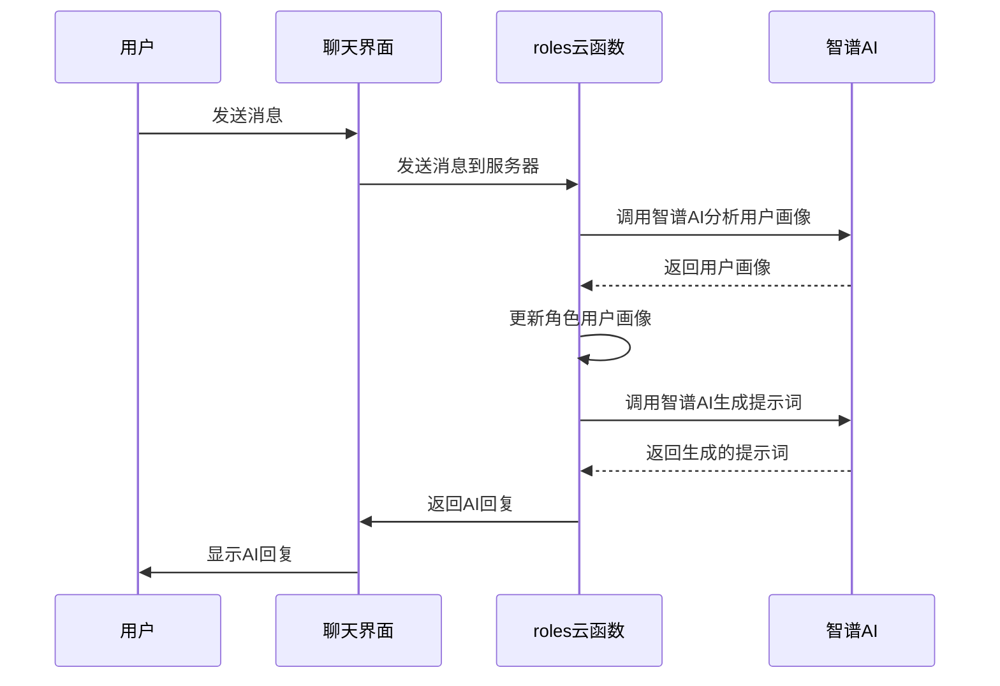
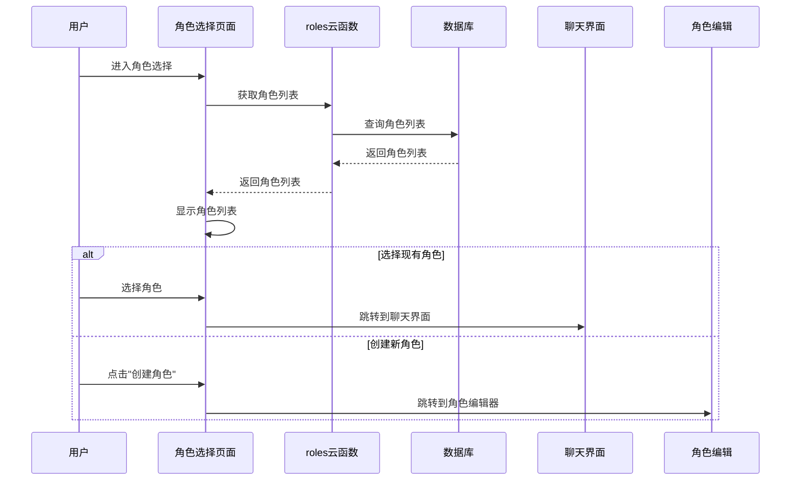
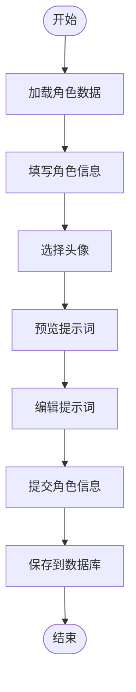

# 角色系统

<cite>
**本文档引用文件**  
- [index.js](file://cloudfunctions/roles/index.js)
- [promptGenerator.js](file://cloudfunctions/roles/promptGenerator.js)
- [memoryManager.js](file://cloudfunctions/roles/memoryManager.js)
- [userPerception.js](file://cloudfunctions/roles/userPerception.js)
- [init-roles.js](file://cloudfunctions/roles/init-roles.js)
- [role-select.js](file://miniprogram/pages/role-select/role-select.js)
- [index.js](file://miniprogram/pages/role-editor/index.js)
- [roles.md](file://doc/开发文档/cloudfunctions/roles.md)
- [roles.md](file://doc/开发文档/database/roles.md)
- [roleUsage.md](file://doc/开发文档/database/roleUsage.md)
</cite>

## 目录
1. [角色系统概述](#角色系统概述)
2. [角色数据结构设计](#角色数据结构设计)
3. [角色提示词生成逻辑](#角色提示词生成逻辑)
4. [长期记忆管理实现](#长期记忆管理实现)
5. [角色交互流程与状态管理](#角色交互流程与状态管理)
6. [用户感知模块](#用户感知模块)
7. [角色预设初始化](#角色预设初始化)
8. [角色系统与聊天系统集成](#角色系统与聊天系统集成)

## 角色系统概述

HeartChat的角色系统是一个基于AI驱动的智能角色管理系统，支持角色的创建、读取、更新、删除（CRUD）操作，并集成了AI分析、记忆管理、用户画像分析和个性化提示词生成等高级功能。该系统通过云函数实现，主要文件包括`index.js`（主入口）、`memoryManager.js`（记忆管理）、`userPerception.js`（用户画像）、`promptGenerator.js`（提示词生成）和`init-roles.js`（角色初始化）。

角色系统的核心功能包括：
- **角色管理**：提供角色的创建、读取、更新和删除功能。
- **记忆管理**：从对话中提取重要信息作为角色记忆，并智能管理记忆的存储和检索。
- **用户画像**：分析用户的兴趣、偏好、沟通风格和情感模式，形成用户画像。
- **提示词生成**：基于角色信息、记忆和用户画像生成个性化的AI对话提示词。
- **角色初始化**：在系统首次部署时，创建默认的系统角色。

**Section sources**
- [index.js](file://cloudfunctions/roles/index.js#L0-L758)
- [roles.md](file://doc/开发文档/cloudfunctions/roles.md#L0-L112)

## 角色数据结构设计

角色系统的核心数据存储在`roles`集合中，该集合包含角色的完整信息，包括基础信息、性格特点、提示词、记忆管理和用户画像等。此外，`roleUsage`集合用于记录用户对各个角色的使用情况，包括使用次数和最后使用时间等统计数据。

### roles集合结构

`roles`集合是角色系统的核心数据表，其字段结构如下：

```javascript
{
  _id: "角色ID",                    // string, 主键，自动生成
  name: "角色名称",                  // string, 角色显示名称
  avatar: "头像URL",                 // string, 角色头像图片地址
  category: "角色分类",              // string, psychology/life/career/emotion
  description: "角色描述",            // string, 角色功能描述
  personality: ["性格特点1", "性格特点2"], // array, 性格特点列表
  prompt: "角色提示词",              // string, AI对话提示词
  system_prompt: "系统提示词",       // string, 系统级提示词（与prompt同步）
  welcome: "欢迎语",                // string, 角色欢迎消息
  creator: "创建者",                // string, 'system' 或用户openid
  user_id: "用户ID",                 // string, 创建者用户ID（保留字段）
  createTime: "创建时间",            // date, 角色创建时间
  updateTime: "更新时间",            // date, 角色更新时间
  status: 1,                         // number, 状态：1启用/0禁用
  
  // 记忆管理
  memories: [                       // array, 角色记忆数组（最多50条）
    {
      content: "记忆内容",           // string, 记忆的具体内容
      importance: 0.8,               // number, 重要性评分 0-1
      category: "记忆分类",         // string, 记忆分类标签
      context: "记忆上下文",         // string, 记忆的上下文信息
      timestamp: "时间戳",           // date, 记录时间戳
      source: "chat"                  // string, 来源：chat/merged
    }
  ],
  
  // 用户画像
  user_perception: {                 // object, 用户画像信息
    interests: ["兴趣1", "兴趣2"],    // array, 用户兴趣列表
    preferences: ["偏好1", "偏好2"],  // array, 用户偏好列表
    communication_style: "沟通风格", // string, 沟通风格描述
    emotional_patterns: ["情感模式1", "情感模式2"], // array, 情感模式
    last_updated: "最后更新时间"      // date, 画像更新时间
  }
}
```

### roleUsage集合结构

`roleUsage`集合用于记录用户对各个角色的使用情况，其字段结构如下：

```javascript
{
  _id: "统计记录ID",                // string, 主键，自动生成
  roleId: "角色ID",                  // string, 关联roles表
  userId: "用户ID",                  // string, 关联user_base表
  usageCount: 0,                    // number, 使用次数
  lastUsedTime: "最后使用时间",       // date, 最后使用时间
  createTime: "创建时间",            // date, 统计记录创建时间
  updateTime: "更新时间"             // date, 统计记录更新时间
}
```

**Section sources**
- [roles.md](file://doc/开发文档/database/roles.md#L0-L45)
- [roleUsage.md](file://doc/开发文档/database/roleUsage.md#L0-L53)

## 角色提示词生成逻辑

角色提示词生成是角色系统的核心功能之一，它通过`promptGenerator.js`模块实现。该模块利用智谱AI接口，根据角色信息、记忆和用户画像生成个性化的AI对话提示词。

### 基础提示词生成

`generateBasePrompt`函数负责生成基础角色提示词。它首先构建角色描述，然后调用智谱AI生成提示词。提示词包含角色的自我认知、与用户的关系定位、说话风格、应避免的行为、情感需求回应方式、兴趣了解方式和对话风格指导等。



**Diagram sources**
- [promptGenerator.js](file://cloudfunctions/roles/promptGenerator.js#L0-L324)
- [index.js](file://miniprogram/pages/role-editor/index.js#L0-L843)

### 记忆融合提示词生成

`generatePromptWithMemories`函数负责将角色记忆融入到基础提示词中。它首先按类别和重要性组织记忆，然后调用智谱AI将记忆自然地融入到提示词中，使角色能够在对话中展现出对用户的了解。

### 用户画像融合提示词生成

`generatePromptWithUserPerception`函数负责将用户画像融入到提示词中。它构建用户画像描述，然后调用智谱AI将用户信息自然地融入到提示词中，使角色能够根据用户的兴趣、偏好和沟通风格进行互动。

**Section sources**
- [promptGenerator.js](file://cloudfunctions/roles/promptGenerator.js#L0-L324)

## 长期记忆管理实现

长期记忆管理是角色系统的重要组成部分，它通过`memoryManager.js`模块实现。该模块负责从对话中提取记忆、更新角色记忆和获取相关记忆。

### 记忆提取

`extractMemoriesFromChat`函数负责从对话中提取重要信息作为角色记忆。它首先获取最近的对话内容，然后调用智谱AI提取记忆。提取的记忆包括用户个人信息、兴趣爱好、重要经历、情感状态等。

### 记忆更新

`updateRoleMemories`函数负责更新角色记忆。它首先获取角色当前记忆，然后合并现有记忆和新记忆。如果记忆总数超过50条，它会按重要性排序并保留前30条重要记忆，然后对剩余记忆进行合并。

### 记忆检索

`getRelevantMemories`函数负责获取与当前上下文最相关的记忆。它首先获取角色所有记忆，然后根据重要性和时间因素计算记忆的相关性，返回最相关的记忆。



**Diagram sources**
- [memoryManager.js](file://cloudfunctions/roles/memoryManager.js#L0-L799)

**Section sources**
- [memoryManager.js](file://cloudfunctions/roles/memoryManager.js#L0-L799)

## 角色交互流程与状态管理

角色系统的前端交互主要通过`role-select`页面和`role-editor`页面实现。这两个页面负责角色的选择、创建、编辑和删除操作。

### 角色选择页面

`role-select`页面是用户选择角色的入口。它通过`loadRoles`函数从服务器获取角色列表，并根据分类和搜索关键词过滤角色。用户可以选择现有角色或创建新角色。



**Diagram sources**
- [role-select.js](file://miniprogram/pages/role-select/role-select.js#L0-L666)

### 角色编辑页面

`role-editor`页面是用户创建和编辑角色的入口。它通过`loadRole`函数加载角色数据（如果是编辑模式），并通过`handleSubmit`函数提交角色数据。用户可以填写角色信息、选择头像、预览和编辑提示词。



**Diagram sources**
- [index.js](file://miniprogram/pages/role-editor/index.js#L0-L843)

**Section sources**
- [role-select.js](file://miniprogram/pages/role-select/role-select.js#L0-L666)
- [index.js](file://miniprogram/pages/role-editor/index.js#L0-L843)

## 用户感知模块

用户感知模块通过`userPerception.js`实现，负责分析用户的兴趣、偏好、沟通风格和情感模式，并将这些信息融入到角色提示词中，使角色能够根据用户的特征进行个性化互动。

### 用户画像分析

`analyzeUserPerception`函数负责从用户的对话中提取用户的兴趣、偏好、沟通风格和情感模式。它调用智谱AI分析用户消息，然后以JSON格式返回用户画像。

### 用户画像更新

`updateRoleUserPerception`函数负责更新角色的用户画像。它首先获取角色当前的用户画像，然后合并新旧用户画像，最后更新角色的用户画像。

### 用户画像融合

`mergeUserPerception`函数负责合并新旧用户画像。它将现有和新的用户画像转换为文本，然后调用智谱AI合并用户画像，生成更完整的用户画像。

**Section sources**
- [userPerception.js](file://cloudfunctions/roles/userPerception.js#L0-L314)

## 角色预设初始化

角色预设初始化通过`init-roles.js`脚本实现。该脚本在系统首次部署时创建默认的系统角色，包括心理咨询师、生活伴侣、职场导师和情感支持者。

### 初始化流程

1. **检查角色数据**：首先检查数据库中是否已有角色数据，如果有则跳过初始化。
2. **批量添加角色**：如果数据库中没有角色数据，则批量添加预设的角色数据。
3. **返回结果**：返回初始化结果，包括添加的角色数量和角色ID列表。

```javascript
// 初始角色数据
const initialRoles = [
  {
    name: "心理咨询师",
    avatar: "cloud://cloud1-9gpfk3ie94d8630a.avatars/counselor.png",
    category: "psychology",
    description: "专业心理咨询师，可以帮助你解决心理问题。",
    personality: ["专业", "耐心", "善解人意"],
    prompt: "你是一名专业的心理咨询师，擅长倾听和提供心理支持。请以温和、专业的语气回应用户的问题，提供有建设性的建议，但不要做出医疗诊断。",
    welcome: "你好，我是你的心理咨询师。今天想聊些什么？",
    creator: "system",
    createTime: db.serverDate(),
    updateTime: db.serverDate(),
    status: 1
  },
  // 其他角色...
];
```

**Section sources**
- [init-roles.js](file://cloudfunctions/roles/init-roles.js#L0-L103)

## 角色系统与聊天系统集成

角色系统与聊天系统通过云函数和数据库紧密集成。当用户选择一个角色并开始聊天时，聊天系统会调用角色系统的云函数获取角色信息，包括提示词、记忆和用户画像，然后将这些信息用于生成AI回复。

### 集成流程

1. **获取角色信息**：聊天系统调用`getRoleDetail`云函数获取角色详情。
2. **生成提示词**：聊天系统调用`generatePrompt`云函数生成个性化的提示词。
3. **更新记忆**：聊天系统调用`extractMemories`云函数从对话中提取记忆，并更新角色记忆。
4. **更新用户画像**：聊天系统调用`updateUserPerception`云函数分析并更新用户画像。

```mermaid
graph TB
subgraph "前端"
RoleSelect[角色选择]
RoleEditor[角色编辑]
Chat[聊天界面]
end
subgraph "云函数"
Roles[roles云函数]
ChatFunc[chat云函数]
end
subgraph "数据库"
RolesDB[roles集合]
RoleUsageDB[roleUsage集合]
end
RoleSelect --> Roles: 获取角色列表
RoleEditor --> Roles: 创建/更新角色
Chat --> Roles: 获取角色详情
Chat --> Roles: 生成提示词
Chat --> Roles: 提取记忆
Chat --> Roles: 更新用户画像
Roles --> RolesDB: 读写角色数据
Roles --> RoleUsageDB: 读写使用统计
ChatFunc --> Roles: 调用角色功能
```

**Diagram sources**
- [index.js](file://cloudfunctions/roles/index.js#L0-L758)
- [role-select.js](file://miniprogram/pages/role-select/role-select.js#L0-L666)
- [index.js](file://miniprogram/pages/role-editor/index.js#L0-L843)

**Section sources**
- [index.js](file://cloudfunctions/roles/index.js#L0-L758)
- [role-select.js](file://miniprogram/pages/role-select/role-select.js#L0-L666)
- [index.js](file://miniprogram/pages/role-editor/index.js#L0-L843)