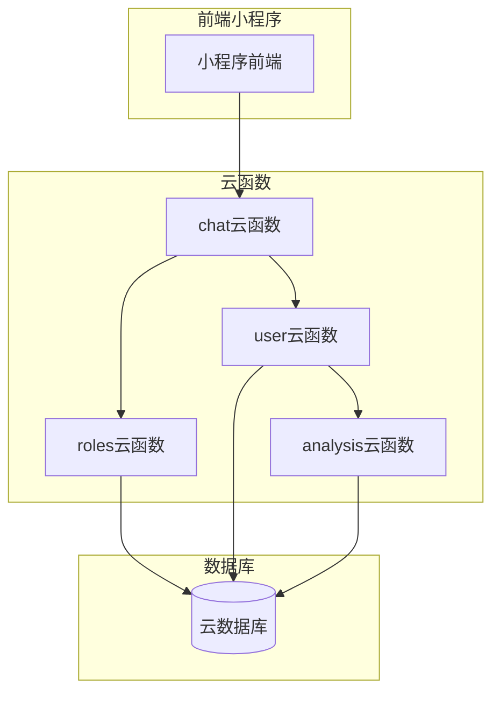
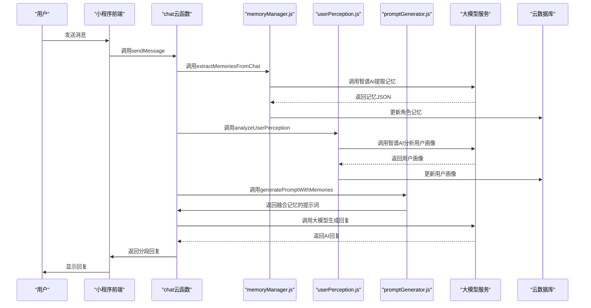
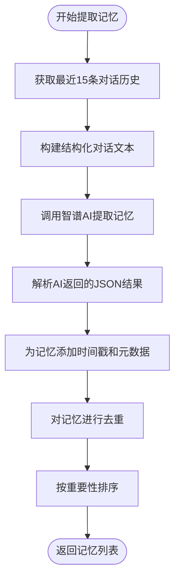
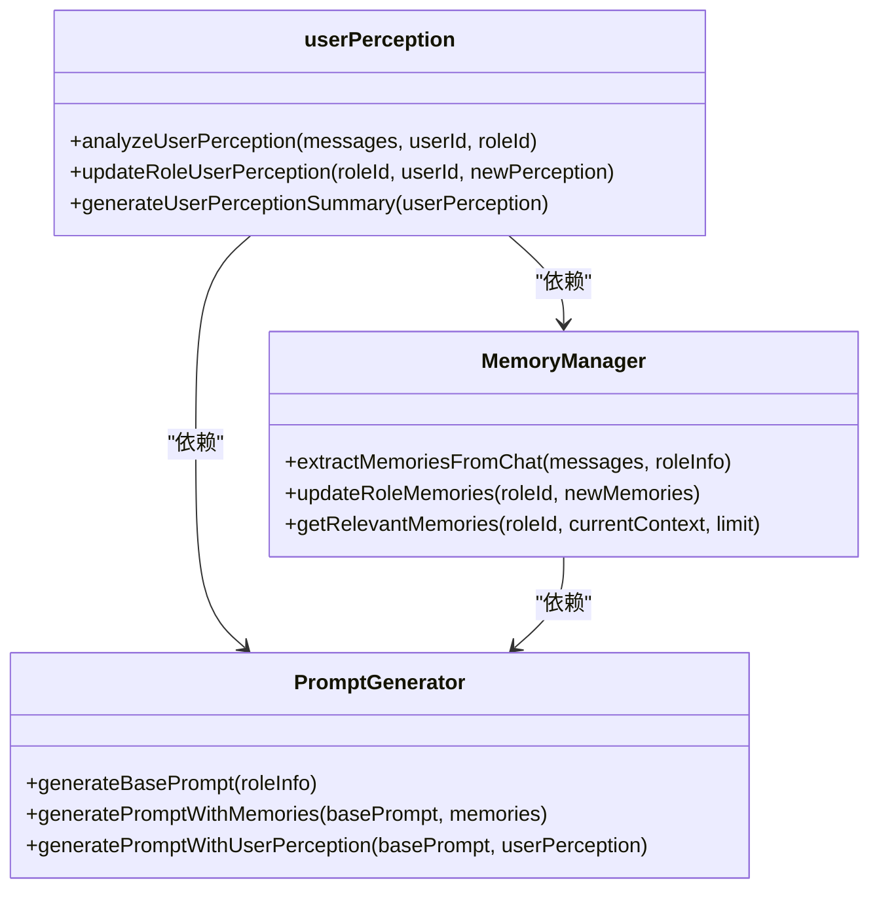
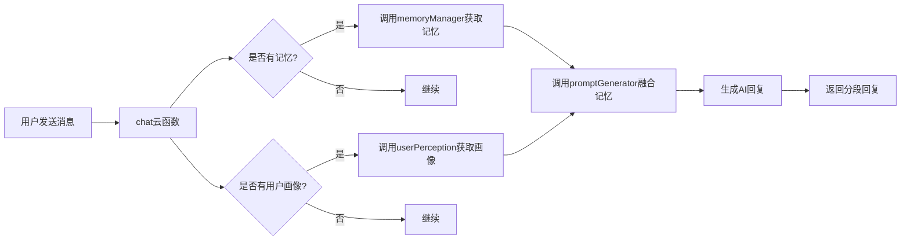
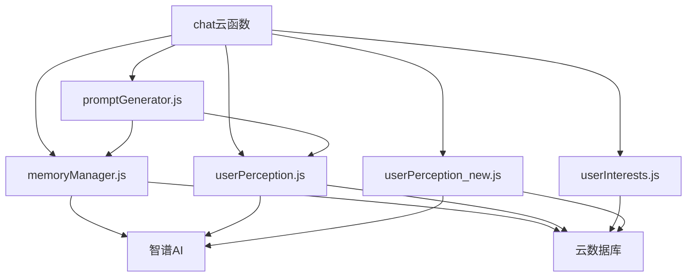

# 角色记忆管理

<cite>
**本文档引用文件**  
- [memoryManager.js](file://cloudfunctions/roles/memoryManager.js)
- [userPerception.js](file://cloudfunctions/roles/userPerception.js)
- [promptGenerator.js](file://cloudfunctions/roles/promptGenerator.js)
- [chat/index.js](file://cloudfunctions/chat/index.js)
- [userInterests.js](file://cloudfunctions/user/userInterests.js)
- [userPerception_new.js](file://cloudfunctions/user/userPerception_new.js)
</cite>

## 目录
1. [引言](#引言)
2. [项目结构](#项目结构)
3. [核心组件](#核心组件)
4. [架构概述](#架构概述)
5. [详细组件分析](#详细组件分析)
6. [依赖分析](#依赖分析)
7. [性能考虑](#性能考虑)
8. [故障排除指南](#故障排除指南)
9. [结论](#结论)

## 引言
本文档系统化地记录了HeartChat项目中角色记忆管理机制的实现方案。重点剖析了基于对话历史的记忆提取、摘要生成与长期存储机制，详细说明了用户感知模块如何分析对话内容以提取用户兴趣与性格特征，并反馈至角色行为调整。文档还阐述了记忆数据在聊天会话中的加载与上下文注入流程，以及与`chat`云函数的协同工作机制。同时，提供了记忆更新频率控制、数据压缩策略与隐私保护措施，并结合实际调用链路展示了关键数据结构与接口定义。

## 项目结构
角色记忆管理功能主要分布在`cloudfunctions`目录下的多个云函数模块中，通过数据库进行持久化存储，并与前端小程序进行交互。

**Diagram sources**
- [memoryManager.js](file://cloudfunctions/roles/memoryManager.js)
- [userPerception.js](file://cloudfunctions/roles/userPerception.js)
- [chat/index.js](file://cloudfunctions/chat/index.js)

**Section sources**
- [memoryManager.js](file://cloudfunctions/roles/memoryManager.js)
- [userPerception.js](file://cloudfunctions/roles/userPerception.js)
- [chat/index.js](file://cloudfunctions/chat/index.js)

## 核心组件
角色记忆管理的核心由`memoryManager.js`和`userPerception.js`两个模块构成。`memoryManager.js`负责从对话历史中提取、合并和检索记忆，实现长期记忆的存储与管理。`userPerception.js`则专注于分析用户对话内容，提取用户的兴趣、偏好、沟通风格和情感模式等画像信息。这两个模块通过`promptGenerator.js`与`chat`云函数协同工作，将记忆和用户画像动态注入到AI角色的提示词中，从而实现个性化的对话体验。

**Section sources**
- [memoryManager.js](file://cloudfunctions/roles/memoryManager.js)
- [userPerception.js](file://cloudfunctions/roles/userPerception.js)
- [promptGenerator.js](file://cloudfunctions/roles/promptGenerator.js)

## 架构概述
整个角色记忆管理系统的架构遵循事件驱动和微服务化的设计原则。当用户发起聊天时，`chat`云函数作为入口，负责协调整个流程。它首先调用`roles`云函数获取角色信息，然后根据需要调用`memoryManager.js`提取和更新记忆，调用`userPerception.js`分析用户画像。这些信息被整合到角色的提示词中，再通过`aiModelService`调用大模型生成回复。所有数据均通过云数据库进行持久化。

**Diagram sources**
- [memoryManager.js](file://cloudfunctions/roles/memoryManager.js)
- [userPerception.js](file://cloudfunctions/roles/userPerception.js)
- [promptGenerator.js](file://cloudfunctions/roles/promptGenerator.js)
- [chat/index.js](file://cloudfunctions/chat/index.js)

## 详细组件分析

### 记忆提取与管理分析
`memoryManager.js`模块实现了基于AI的记忆提取与管理。其核心流程是：当用户发送消息后，系统会截取最近的15条对话历史，通过`extractMemoriesFromChat`函数调用智谱AI（glm-4-flash模型）进行分析。AI根据预设的系统提示词，从对话中识别出重要的个人信息、兴趣爱好、情感状态等，并以JSON格式返回4-6条结构化记忆。每条记忆包含内容、重要性评分、类别和上下文。

**Diagram sources**
- [memoryManager.js](file://cloudfunctions/roles/memoryManager.js#L100-L300)

**Section sources**
- [memoryManager.js](file://cloudfunctions/roles/memoryManager.js)

### 用户感知模块分析
`userPerception.js`模块负责分析用户的长期特征。它通过`analyzeUserPerception`函数，将用户的历史消息合并成一段文本，然后调用智谱AI进行分析。AI会识别出用户的兴趣、偏好、沟通风格和情感模式。这些信息被存储在角色的`user_perception`字段中，并通过`mergeUserPerception`函数进行合并，确保新旧信息能够有效整合。该模块还提供`generateUserPerceptionSummary`函数，可将结构化的用户画像转化为自然、友好的描述性文本，用于在对话中自然提及。

**Diagram sources**
- [userPerception.js](file://cloudfunctions/roles/userPerception.js)
- [memoryManager.js](file://cloudfunctions/roles/memoryManager.js)
- [promptGenerator.js](file://cloudfunctions/roles/promptGenerator.js)

**Section sources**
- [userPerception.js](file://cloudfunctions/roles/userPerception.js)

### 记忆与用户画像的协同机制
记忆数据和用户画像在`chat`云函数中被协同使用。当`sendMessage`被调用时，系统首先获取角色信息，然后查询或创建聊天会话。接着，它会调用`memoryManager.js`获取相关记忆，并调用`userPerception.js`获取用户画像。这些信息通过`promptGenerator.js`的`generatePromptWithMemories`和`generatePromptWithUserPerception`函数，被无缝地融合到角色的基础提示词中。最终，这个融合了记忆和画像的提示词被传递给大模型，从而生成高度个性化和连贯的回复。

**Diagram sources**
- [chat/index.js](file://cloudfunctions/chat/index.js)
- [memoryManager.js](file://cloudfunctions/roles/memoryManager.js)
- [userPerception.js](file://cloudfunctions/roles/userPerception.js)
- [promptGenerator.js](file://cloudfunctions/roles/promptGenerator.js)

**Section sources**
- [chat/index.js](file://cloudfunctions/chat/index.js)

## 依赖分析
角色记忆管理模块依赖于多个外部服务和内部模块。其核心依赖是智谱AI的大模型服务，用于执行记忆提取和用户画像分析等NLP任务。它通过`httpRequest`云函数作为代理来调用外部API。在内部，`memoryManager.js`和`userPerception.js`都依赖于云数据库来存储和读取数据。`chat`云函数是主要的调用者，它依赖于`roles`云函数提供的所有模块。此外，`userInterests.js`和`userPerception_new.js`提供了用户兴趣数据的存储和更高级的画像分析功能，为`userPerception.js`提供了数据支持。

**Diagram sources**
- [memoryManager.js](file://cloudfunctions/roles/memoryManager.js)
- [userPerception.js](file://cloudfunctions/roles/userPerception.js)
- [chat/index.js](file://cloudfunctions/chat/index.js)
- [userInterests.js](file://cloudfunctions/user/userInterests.js)
- [userPerception_new.js](file://cloudfunctions/user/userPerception_new.js)

**Section sources**
- [memoryManager.js](file://cloudfunctions/roles/memoryManager.js)
- [userPerception.js](file://cloudfunctions/roles/userPerception.js)
- [userInterests.js](file://cloudfunctions/user/userInterests.js)

## 性能考虑
为了保证系统的性能，记忆管理机制采用了多项优化策略。首先，使用`glm-4-flash`等轻量级、响应速度快的模型来处理记忆提取和用户画像分析，以减少延迟。其次，记忆的提取和更新并非在每次消息后都执行，而是有一定的频率控制，避免对AI服务造成过大压力。对于记忆的检索，系统采用了两级策略：先进行本地预过滤，再对少量候选记忆调用AI进行相关性排序，这大大降低了计算成本。此外，`splitMessage`函数对AI回复进行分段处理，模拟真实聊天的节奏，提升了用户体验。

## 故障排除指南
在使用角色记忆管理功能时，可能遇到以下问题：
1.  **记忆未更新**：检查`ZHIPU_API_KEY`环境变量是否正确配置，确保云函数有调用`httpRequest`的权限。
2.  **用户画像为空**：确认`userPerception.js`被正确调用，并且用户有足够的历史消息供分析。
3.  **AI回复延迟高**：检查网络状况，确认智谱AI服务是否正常。可以尝试切换到其他模型。
4.  **提示词融合失败**：查看日志中是否有JSON解析错误，这通常意味着AI返回的格式不符合预期，`promptGenerator.js`会自动降级到本地融合策略。
5.  **数据库写入失败**：检查云数据库的读写权限设置，确保`roles`集合的`memories`和`user_perception`字段有正确的写入权限。

**Section sources**
- [memoryManager.js](file://cloudfunctions/roles/memoryManager.js)
- [userPerception.js](file://cloudfunctions/roles/userPerception.js)
- [promptGenerator.js](file://cloudfunctions/roles/promptGenerator.js)

## 结论
HeartChat的角色记忆管理机制是一个复杂而精巧的系统，它成功地将短期对话记忆与长期用户画像相结合，通过大模型的智能分析能力，实现了角色的个性化和人格化。该机制不仅提升了对话的连贯性和深度，也为用户创造了更真实、更贴心的交互体验。未来，可以通过引入更复杂的记忆衰减算法、优化数据压缩策略以及加强隐私保护措施，进一步提升系统的性能和安全性。