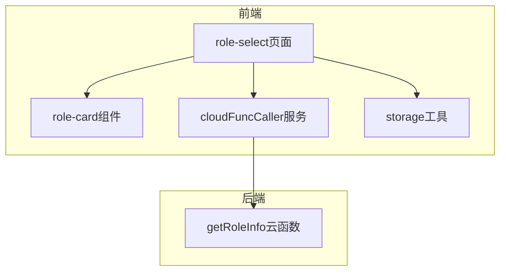
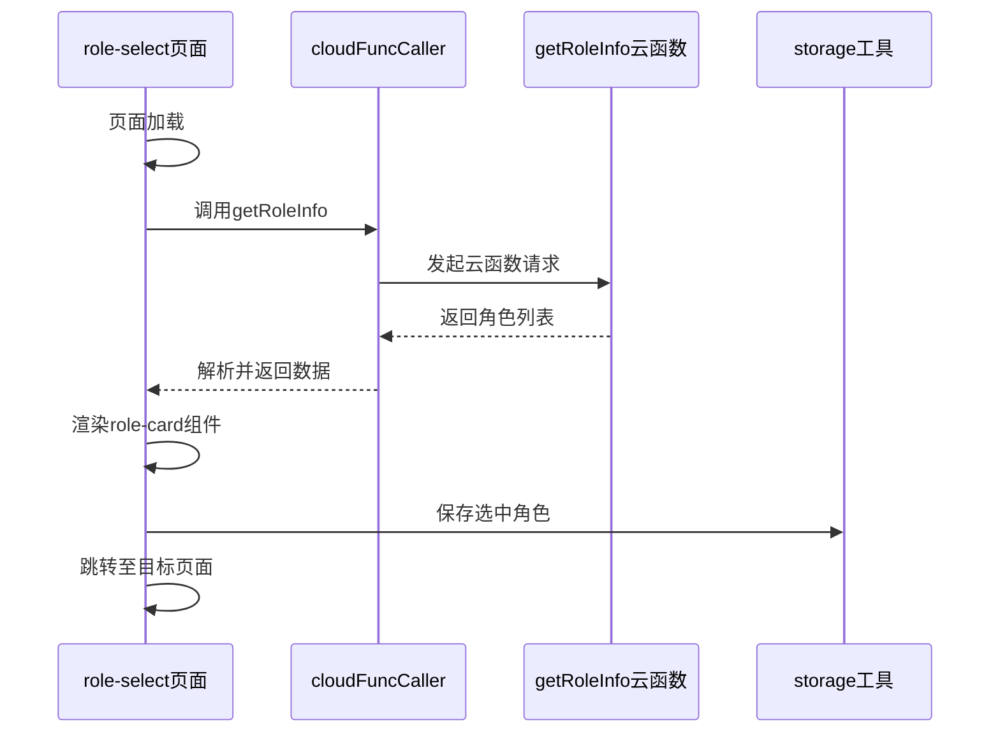
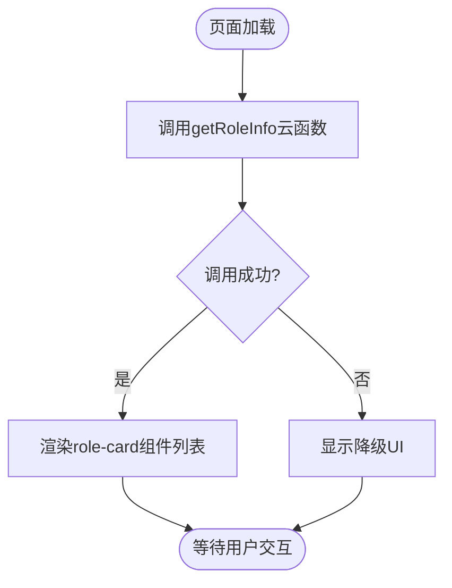
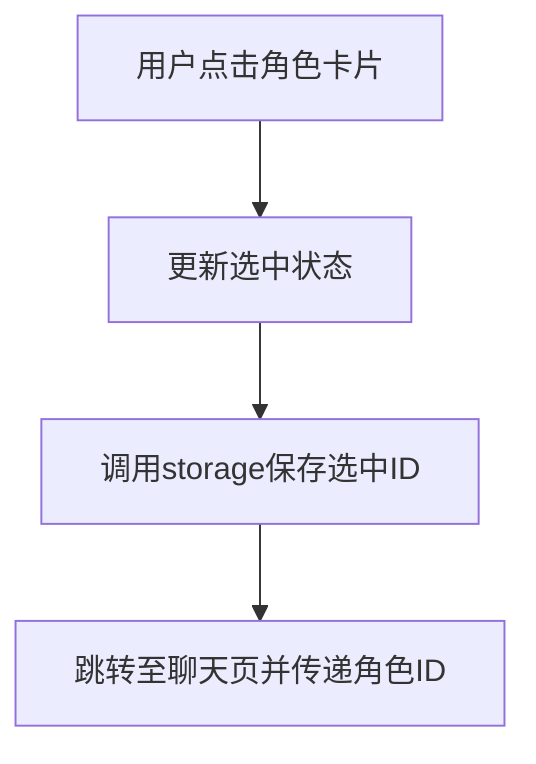
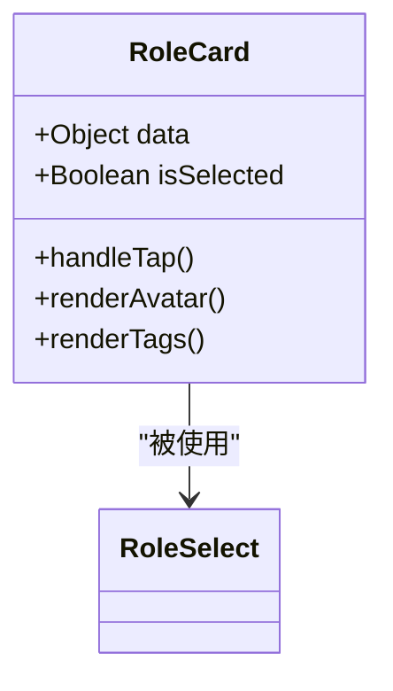
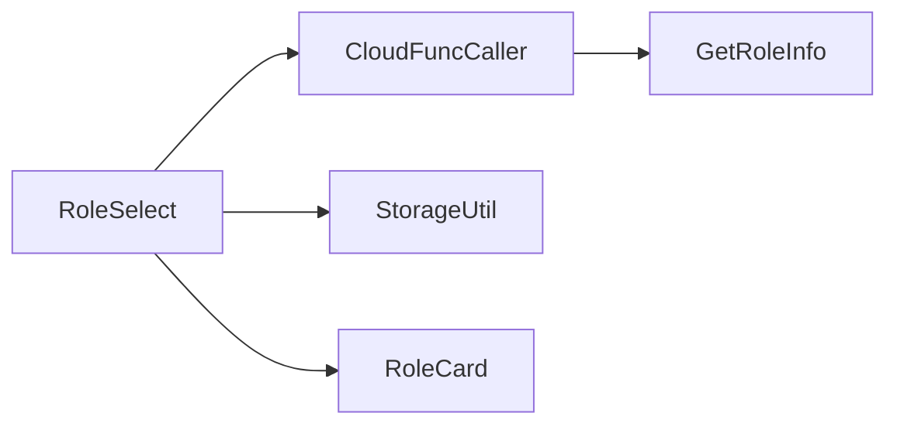

# 角色选择

<cite>
**本文档引用文件**  
- [role-select.js](file://miniprogram/pages/role-select/role-select.js)
- [role-card.js](file://miniprogram/components/role-card/role-card.js)
- [index.js](file://cloudfunctions/getRoleInfo/index.js)
- [cloudFuncCaller.js](file://miniprogram/services/cloudFuncCaller.js)
- [storage.js](file://miniprogram/utils/storage.js)
</cite>

## 目录
1. [简介](#简介)
2. [项目结构](#项目结构)
3. [核心组件](#核心组件)
4. [架构概览](#架构概览)
5. [详细组件分析](#详细组件分析)
6. [依赖分析](#依赖分析)
7. [性能考虑](#性能考虑)
8. [故障排除指南](#故障排除指南)
9. [结论](#结论)

## 简介
本文档详细描述了“角色选择”功能的技术实现，重点涵盖前端 `role-select` 页面的 UI 渲染逻辑与事件处理机制，以及 `role-card` 组件在角色卡片动态展示中的作用。文档还阐述了页面如何通过云函数 `getRoleInfo` 获取角色列表，并在本地进行状态管理与用户交互响应。同时说明了角色选择后的路由跳转、上下文传递机制及选中状态的持久化策略，并提供错误处理方案与性能优化措施。

## 项目结构
角色选择功能涉及前端页面、自定义组件、云函数调用服务与工具模块，整体结构清晰，职责分离明确。

**Diagram sources**
- [role-select.js](file://miniprogram/pages/role-select/role-select.js#L1-L10)
- [role-card.js](file://miniprogram/components/role-card/role-card.js#L1-L10)
- [index.js](file://cloudfunctions/getRoleInfo/index.js#L1-L10)

**Section sources**
- [role-select.js](file://miniprogram/pages/role-select/role-select.js#L1-L50)
- [role-card.js](file://miniprogram/components/role-card/role-card.js#L1-L30)

## 核心组件
核心组件包括 `role-select` 页面和 `role-card` 组件，分别负责角色列表的整体控制与单个角色卡片的展示与交互。

**Section sources**
- [role-select.js](file://miniprogram/pages/role-select/role-select.js#L25-L100)
- [role-card.js](file://miniprogram/components/role-card/role-card.js#L15-L80)

## 架构概览
系统采用前后端分离架构，前端通过云函数调用获取角色数据，结合本地状态管理实现高效渲染与交互。

**Diagram sources**
- [role-select.js](file://miniprogram/pages/role-select/role-select.js#L30-L70)
- [cloudFuncCaller.js](file://miniprogram/services/cloudFuncCaller.js#L20-L50)
- [index.js](file://cloudfunctions/getRoleInfo/index.js#L5-L25)

## 详细组件分析

### role-select 页面分析
该页面负责初始化角色列表加载、处理用户选择事件、管理本地状态并执行页面跳转。

#### 页面生命周期与数据加载

**Diagram sources**
- [role-select.js](file://miniprogram/pages/role-select/role-select.js#L15-L40)

#### 用户交互与状态管理

**Diagram sources**
- [role-select.js](file://miniprogram/pages/role-select/role-select.js#L60-L90)
- [storage.js](file://miniprogram/utils/storage.js#L10-L25)

**Section sources**
- [role-select.js](file://miniprogram/pages/role-select/role-select.js#L1-L100)

### role-card 组件分析
`role-card` 组件封装了角色卡片的展示逻辑，支持动态数据绑定与点击事件响应。

**Diagram sources**
- [role-card.js](file://miniprogram/components/role-card/role-card.js#L5-L40)

**Section sources**
- [role-card.js](file://miniprogram/components/role-card/role-card.js#L1-L100)

## 依赖分析
角色选择功能依赖多个服务与工具模块，形成清晰的调用链。

**Diagram sources**
- [cloudFuncCaller.js](file://miniprogram/services/cloudFuncCaller.js#L1-L20)
- [storage.js](file://miniprogram/utils/storage.js#L1-L15)

**Section sources**
- [cloudFuncCaller.js](file://miniprogram/services/cloudFuncCaller.js#L1-L30)
- [storage.js](file://miniprogram/utils/storage.js#L1-L25)

## 性能考虑
为提升用户体验，系统实现了数据缓存与懒加载机制。

- **缓存策略**：通过 `storage.js` 对角色列表进行本地缓存，减少重复请求。
- **懒加载**：在角色数量较多时，采用分页或虚拟滚动机制（未来优化方向）。
- **错误降级**：当云函数调用失败时，展示缓存数据或静态默认角色。

## 故障排除指南
常见问题及解决方案：

- **角色列表加载失败**：检查网络连接，确认云函数 `getRoleInfo` 是否正常部署。
- **选中状态未保存**：确认 `storage.js` 的写入权限与路径正确。
- **页面跳转无响应**：检查路由参数传递与目标页面的接收逻辑。

**Section sources**
- [role-select.js](file://miniprogram/pages/role-select/role-select.js#L80-L100)
- [storage.js](file://miniprogram/utils/storage.js#L15-L40)

## 结论
角色选择功能通过清晰的组件划分与服务调用，实现了高效、稳定的角色展示与选择流程。结合本地状态管理与云函数数据获取，保障了良好的用户体验与系统可维护性。未来可进一步优化加载性能与交互细节。