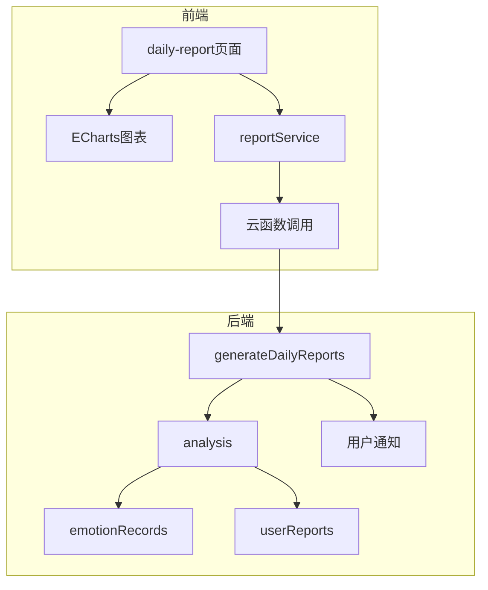
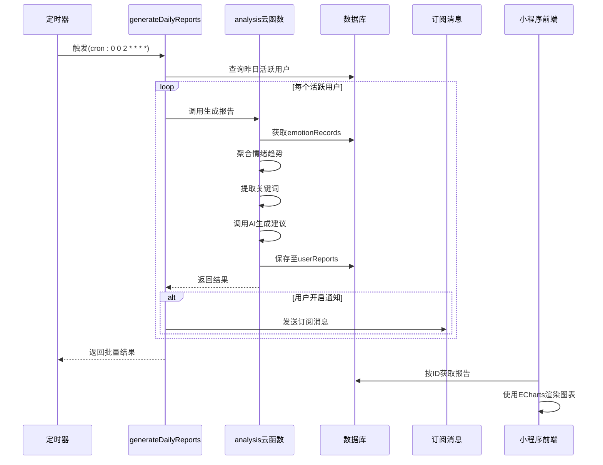
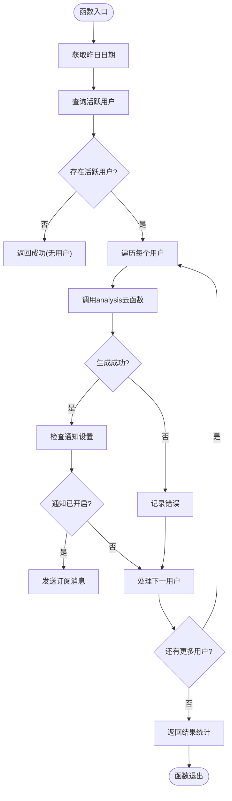
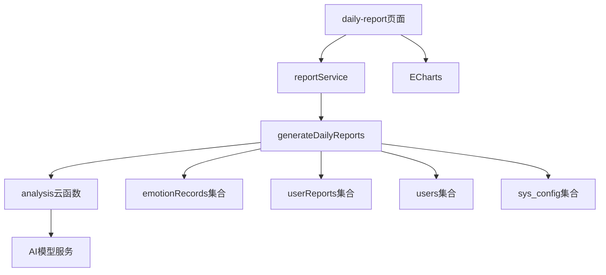

# 每日心情报告功能

<cite>
**本文档引用文件**  
- [index.js](file://cloudfunctions/generateDailyReports/index.js)
- [config.json](file://cloudfunctions/generateDailyReports/config.json)
- [analysis/index.js](file://cloudfunctions/analysis/index.js)
- [miniprogram/pages/daily-report/daily-report.js](file://miniprogram/pages/daily-report/daily-report.js)
- [miniprogram/services/reportService.js](file://miniprogram/services/reportService.js)
- [miniprogram/components/ec-canvas/echarts.js](file://miniprogram/components/ec-canvas/echarts.js)
</cite>

## 目录
1. [简介](#简介)
2. [项目结构](#项目结构)
3. [核心组件](#核心组件)
4. [架构概览](#架构概览)
5. [详细组件分析](#详细组件分析)
6. [依赖分析](#依赖分析)
7. [性能考量](#性能考量)
8. [故障排除指南](#故障排除指南)
9. [结论](#结论)

## 简介
本文档深入解析 HeartChat 应用中“每日心情报告”功能的实现原理。该功能通过自动化云函数定时聚合用户情绪数据，利用 AI 模型生成个性化报告，并通过前端页面可视化展示。文档涵盖从数据聚合、AI 分析、报告生成到前端展示的完整流程，重点说明 `generateDailyReports` 云函数的工作机制、配置策略及其与系统其他组件的集成方式。

## 项目结构
每日心情报告功能涉及后端云函数、数据库配置与小程序前端三大部分。核心逻辑位于 `cloudfunctions/generateDailyReports` 目录，前端展示则由 `miniprogram/pages/daily-report` 实现。



**图表来源**  
- [index.js](file://cloudfunctions/generateDailyReports/index.js#L1-L200)
- [daily-report.js](file://miniprogram/pages/daily-report/daily-report.js#L1-L150)

**本节来源**  
- [cloudfunctions/generateDailyReports](file://cloudfunctions/generateDailyReports)
- [miniprogram/pages/daily-report](file://miniprogram/pages/daily-report)

## 核心组件
该功能的核心组件包括：
- `generateDailyReports`：主控云函数，负责定时触发并协调报告生成流程
- `analysis` 云函数：执行情绪数据分析、关键词提取与AI建议生成
- `daily-report` 页面：前端展示入口，集成图表与报告内容
- `reportService`：前端服务层，封装报告获取与处理逻辑

**本节来源**  
- [index.js](file://cloudfunctions/generateDailyReports/index.js#L25-L100)
- [daily-report.js](file://miniprogram/pages/daily-report/daily-report.js#L10-L40)
- [reportService.js](file://miniprogram/services/reportService.js#L5-L30)

## 架构概览
系统采用“定时触发 → 数据聚合 → AI分析 → 报告生成 → 推送通知 → 前端展示”的流水线架构。



**图表来源**  
- [index.js](file://cloudfunctions/generateDailyReports/index.js#L1-L200)
- [config.json](file://cloudfunctions/generateDailyReports/config.json#L1-L8)

## 详细组件分析

### generateDailyReports 云函数分析
该云函数是每日报告系统的调度中心，负责按计划执行批量报告生成任务。

#### 执行逻辑流程


**图表来源**  
- [index.js](file://cloudfunctions/generateDailyReports/index.js#L30-L180)

#### 配置驱动的执行策略
`config.json` 文件中的定时器配置决定了函数的执行频率：

```json
{
    "triggers": [
        {
            "name": "dailyReportTrigger",
            "type": "timer",
            "config": "0 0 2 * * * *"
        }
    ]
}
```

该配置表示云函数将在每天凌晨2点准时触发，采用标准的 cron 表达式语法（秒 分 时 日 月 周 年），确保在用户活跃度较低的时段执行批量操作，减少系统负载。

**本节来源**  
- [index.js](file://cloudfunctions/generateDailyReports/index.js#L1-L200)
- [config.json](file://cloudfunctions/generateDailyReports/config.json#L1-L8)

### 报告生成与AI分析
实际的报告内容生成由 `analysis` 云函数完成，`generateDailyReports` 仅作为调度器调用它。

#### 情绪数据聚合逻辑
`analysis` 云函数从 `emotionRecords` 集合中提取指定用户在最近7天的情绪记录，按天聚合主要情绪类型（如快乐、悲伤、焦虑等）及其强度，计算情绪波动指数，并识别情绪变化趋势（上升、下降、平稳）。

#### 关键词总结机制
通过 `keywordClassifier.js` 和 `keywordEmotionLinker.js` 模块，系统从用户日记或聊天文本中提取高频关键词，并将其与情绪标签关联，形成“关键词-情绪”映射，用于总结用户近期关注焦点。

#### AI建议文案生成
利用 `aiModelService.js` 调用大模型（如 Gemini 或智谱AI），将聚合后的情绪数据、关键词总结作为上下文输入，通过预设提示词（prompt）引导模型生成个性化、富有同理心的建议文案，如“最近你提到了多次‘考试’，感到焦虑是正常的，不妨尝试深呼吸放松...”。

**本节来源**  
- [analysis/index.js](file://cloudfunctions/analysis/index.js#L1-L200)
- [keywordClassifier.js](file://cloudfunctions/analysis/keywordClassifier.js#L1-L50)
- [aiModelService.js](file://cloudfunctions/analysis/aiModelService.js#L1-L80)

### 前端可视化展示
`daily-report` 页面负责将生成的报告以直观方式呈现给用户。

#### ECharts 情绪曲线图
页面通过 `ec-canvas` 组件集成 ECharts，将用户过去一周的情绪强度数据绘制成折线图，不同颜色代表不同情绪类型，清晰展示情绪波动趋势。

#### 报告内容结构化展示
报告内容分为多个区块：情绪概览（主要情绪、波动指数）、关键词云、AI建议、改善小贴士等，采用卡片式布局提升可读性。

**本节来源**  
- [daily-report.js](file://miniprogram/pages/daily-report/daily-report.js#L1-L150)
- [ec-canvas.js](file://miniprogram/components/ec-canvas/ec-canvas.js#L1-L100)
- [reportService.js](file://miniprogram/services/reportService.js#L1-L60)

## 依赖分析
每日心情报告功能依赖多个系统组件协同工作。



**图表来源**  
- [index.js](file://cloudfunctions/generateDailyReports/index.js#L1-L200)
- [analysis/index.js](file://cloudfunctions/analysis/index.js#L1-L50)
- [daily-report.js](file://miniprogram/pages/daily-report/daily-report.js#L1-L30)

**本节来源**  
- [index.js](file://cloudfunctions/generateDailyReports/index.js#L1-L200)
- [go.mod](file://cloudfunctions/generateDailyReports/package.json#L1-L20)

## 性能考量
- **批量处理限制**：为避免超时，`generateDailyReports` 限制单次处理最多100名用户，可通过分片处理或异步队列扩展。
- **调用频率控制**：在用户循环中添加500ms延迟，防止对 `analysis` 云函数造成瞬时高并发压力。
- **数据库查询优化**：对 `emotionRecords.createTime` 和 `users._id` 字段建立索引，加速查询。
- **前端懒加载**：报告页面仅在用户访问时才请求数据，避免不必要的资源消耗。

## 故障排除指南
- **报告未生成**：检查 `config.json` 定时器配置是否正确，确认云函数部署成功。
- **通知未收到**：验证 `sys_config` 中 `report_template_id` 是否配置，用户是否已授权订阅消息。
- **图表不显示**：检查 `ec-canvas` 组件是否正确引入，ECharts 初始化逻辑是否有误。
- **AI建议为空**：确认 `analysis` 云函数中 AI 模型密钥配置正确，提示词模板有效。

**本节来源**  
- [index.js](file://cloudfunctions/generateDailyReports/index.js#L100-L150)
- [errors.js](file://cloudfunctions/generateDailyReports/index.js#L160-L180)

## 结论
每日心情报告功能通过精心设计的云函数调度机制与AI分析能力，实现了自动化、个性化的心理健康洞察服务。其模块化架构便于扩展，未来可集成睡眠、运动等更多健康数据维度，通过自定义报告模板满足不同用户群体的需求，为用户提供更全面的心理健康支持。