# 用户兴趣分析

<cite>
**本文档引用文件**  
- [userInterests.js](file://cloudfunctions/user/userInterests.js)
- [userInterestAnalyzer.js](file://cloudfunctions/analysis/userInterestAnalyzer.js)
- [interest-tag-cloud.js](file://miniprogram/components/interest-tag-cloud/interest-tag-cloud.js)
- [userInterestsService.js](file://miniprogram/services/userInterestsService.js)
- [keywordClassifier.js](file://cloudfunctions/analysis/keywordClassifier.js)
- [userInterests.md](file://doc/开发文档/database/userInterests.md)
- [用户兴趣分类功能说明.md](file://doc/使用文档/用户兴趣分类功能说明.md)
- [keywordService.js](file://miniprogram/services/keywordService.js)
- [index.js](file://cloudfunctions/analysis/index.js)
- [keywordEmotionLinker.js](file://cloudfunctions/analysis/keywordEmotionLinker.js)
</cite>

## 目录
1. [简介](#简介)
2. [项目结构](#项目结构)
3. [核心组件](#核心组件)
4. [架构概述](#架构概述)
5. [详细组件分析](#详细组件分析)
6. [依赖分析](#依赖分析)
7. [性能考虑](#性能考虑)
8. [故障排除指南](#故障排除指南)
9. [结论](#结论)
10. [附录](#附录)（如有必要）

## 简介
本文档深入解析HeartChat小程序中的用户兴趣分析系统，详细说明系统如何基于用户聊天内容提取关键词并生成兴趣标签。文档涵盖userInterests.js云函数的实现机制、userInterestAnalyzer在分析云函数中的协同作用，以及前端interest-tag-cloud组件的可视化展示。同时介绍兴趣权重计算算法、更新策略和性能优化措施，为开发者提供全面的技术参考。

## 项目结构
用户兴趣分析系统由云函数、前端组件和服务模块三大部分构成，通过微信小程序云开发平台实现数据存储和处理。系统采用分层架构，将数据提取、分析、存储和展示分离，确保各组件职责清晰。

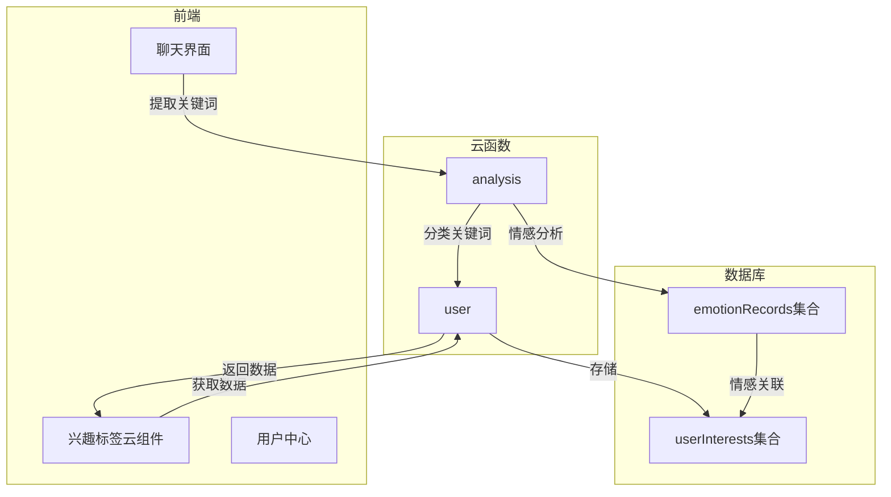

**图表来源**  
- [userInterests.js](file://cloudfunctions/user/userInterests.js#L1-L847)
- [userInterestAnalyzer.js](file://cloudfunctions/analysis/userInterestAnalyzer.js#L1-L289)
- [interest-tag-cloud.js](file://miniprogram/components/interest-tag-cloud/interest-tag-cloud.js#L1-L256)

**本节来源**  
- [userInterests.js](file://cloudfunctions/user/userInterests.js#L1-L847)
- [userInterestAnalyzer.js](file://cloudfunctions/analysis/userInterestAnalyzer.js#L1-L289)
- [interest-tag-cloud.js](file://miniprogram/components/interest-tag-cloud/interest-tag-cloud.js#L1-L256)

## 核心组件
用户兴趣分析系统的核心组件包括userInterests.js云函数、userInterestAnalyzer分析模块和interest-tag-cloud前端组件。这些组件协同工作，实现从聊天内容到兴趣标签的完整处理流程。

**本节来源**  
- [userInterests.js](file://cloudfunctions/user/userInterests.js#L1-L847)
- [userInterestAnalyzer.js](file://cloudfunctions/analysis/userInterestAnalyzer.js#L1-L289)
- [interest-tag-cloud.js](file://miniprogram/components/interest-tag-cloud/interest-tag-cloud.js#L1-L256)

## 架构概述
用户兴趣分析系统采用微服务架构，通过云函数实现功能解耦。系统主要由数据提取层、分析处理层、数据存储层和展示层构成，各层通过标准化接口通信。

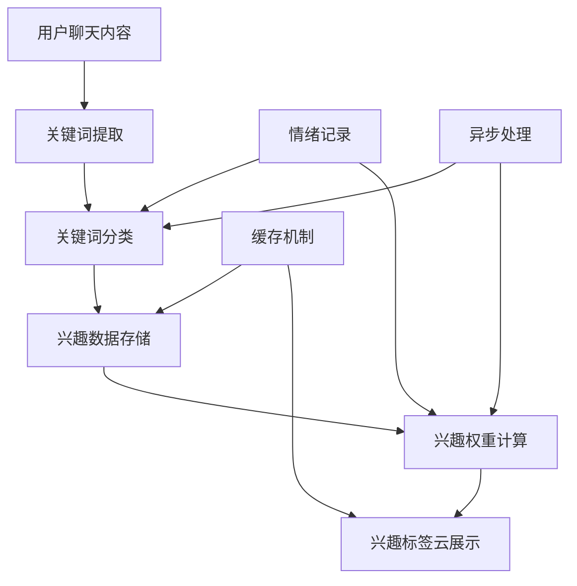

**图表来源**  
- [userInterests.js](file://cloudfunctions/user/userInterests.js#L1-L847)
- [userInterestAnalyzer.js](file://cloudfunctions/analysis/userInterestAnalyzer.js#L1-L289)
- [userInterestsService.js](file://miniprogram/services/userInterestsService.js#L1-L613)

## 详细组件分析
### userInterests.js云函数分析
userInterests.js是用户兴趣数据处理的核心云函数，提供用户兴趣数据的存储和检索功能。该函数实现了完整的CRUD操作，支持关键词的增删改查和批量更新。

#### 数据存储结构
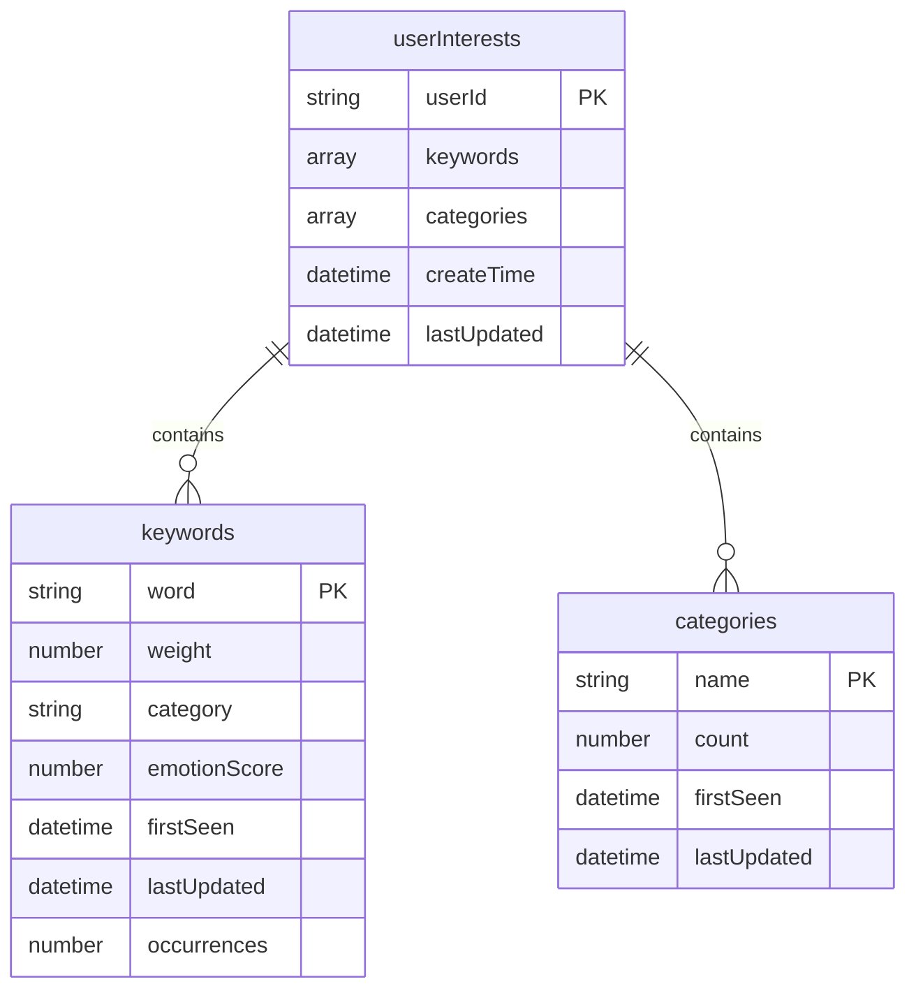

**图表来源**  
- [userInterests.js](file://cloudfunctions/user/userInterests.js#L1-L847)
- [userInterests.md](file://doc/开发文档/database/userInterests.md#L1-L122)

#### 关键词到兴趣类别的映射逻辑
userInterests.js通过调用analysis云函数实现关键词到兴趣类别的映射。当更新用户兴趣时，系统会自动调用关键词分类器进行分类。

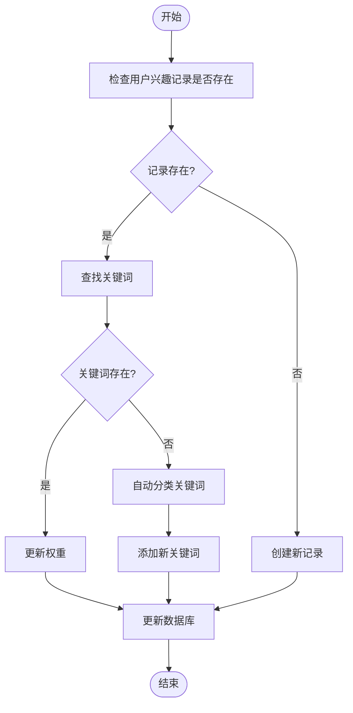

**图表来源**  
- [userInterests.js](file://cloudfunctions/user/userInterests.js#L1-L847)
- [keywordClassifier.js](file://cloudfunctions/analysis/keywordClassifier.js#L1-L299)

**本节来源**  
- [userInterests.js](file://cloudfunctions/user/userInterests.js#L1-L847)
- [keywordClassifier.js](file://cloudfunctions/analysis/keywordClassifier.js#L1-L299)

### userInterestAnalyzer分析模块
userInterestAnalyzer是用户兴趣分析的核心模块，负责对关键词进行分类、计算类别权重和提取用户关注点。

#### 分析流程
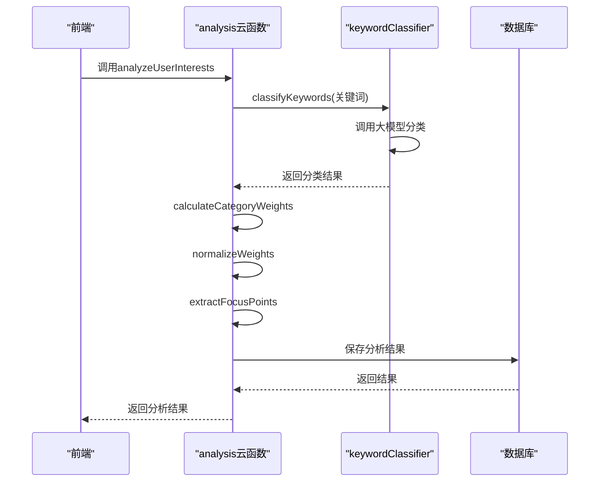

**图表来源**  
- [userInterestAnalyzer.js](file://cloudfunctions/analysis/userInterestAnalyzer.js#L1-L289)
- [index.js](file://cloudfunctions/analysis/index.js#L1-L1117)

#### 兴趣权重计算算法
userInterestAnalyzer模块实现了完整的兴趣权重计算算法，包括类别权重计算、标准化和关注点提取。

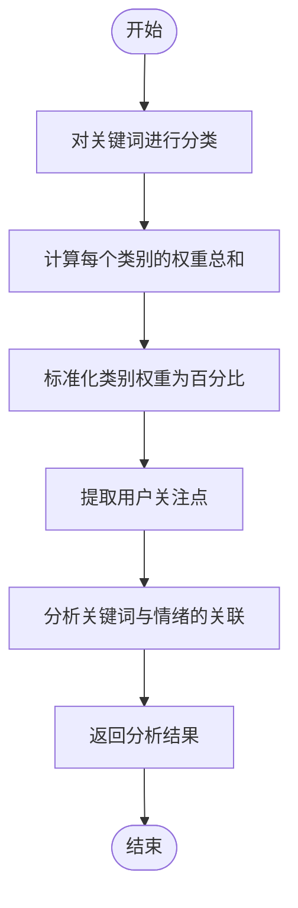

**图表来源**  
- [userInterestAnalyzer.js](file://cloudfunctions/analysis/userInterestAnalyzer.js#L1-L289)
- [keywordEmotionLinker.js](file://cloudfunctions/analysis/keywordEmotionLinker.js#L1-L207)

**本节来源**  
- [userInterestAnalyzer.js](file://cloudfunctions/analysis/userInterestAnalyzer.js#L1-L289)
- [keywordEmotionLinker.js](file://cloudfunctions/analysis/keywordEmotionLinker.js#L1-L207)

### interest-tag-cloud前端组件
interest-tag-cloud组件负责可视化展示用户兴趣标签云，通过字体大小反映兴趣权重。

#### 组件工作流程
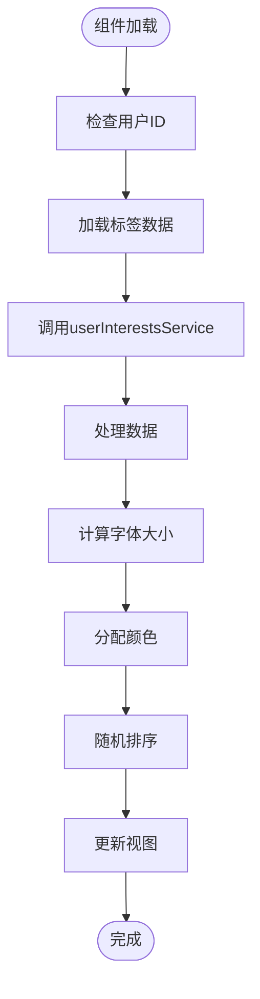

**图表来源**  
- [interest-tag-cloud.js](file://miniprogram/components/interest-tag-cloud/interest-tag-cloud.js#L1-L256)
- [userInterestsService.js](file://miniprogram/services/userInterestsService.js#L1-L613)

#### 颜色映射机制
组件根据暗夜模式状态选择不同的颜色映射，确保在不同主题下都有良好的视觉效果。

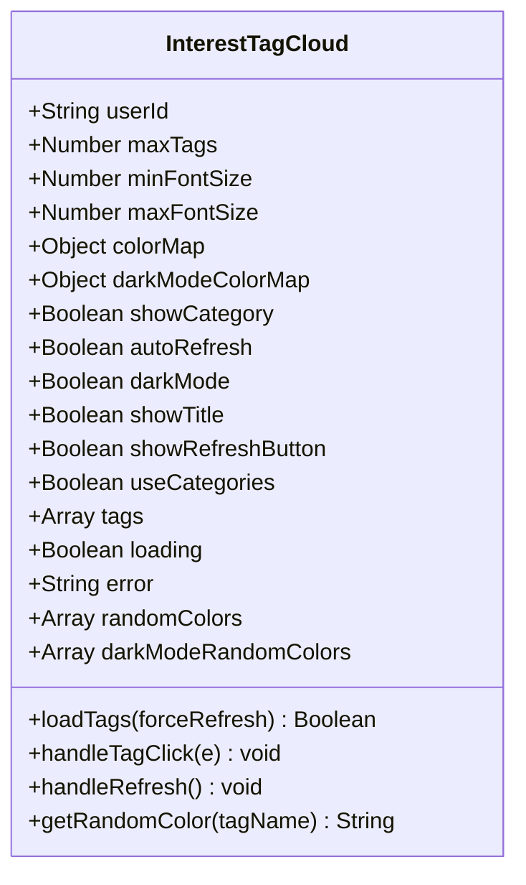

**图表来源**  
- [interest-tag-cloud.js](file://miniprogram/components/interest-tag-cloud/interest-tag-cloud.js#L1-L256)
- [userInterestsService.js](file://miniprogram/services/userInterestsService.js#L1-L613)

**本节来源**  
- [interest-tag-cloud.js](file://miniprogram/components/interest-tag-cloud/interest-tag-cloud.js#L1-L256)
- [userInterestsService.js](file://miniprogram/services/userInterestsService.js#L1-L613)

## 依赖分析
用户兴趣分析系统涉及多个模块的协同工作，各组件之间存在明确的依赖关系。

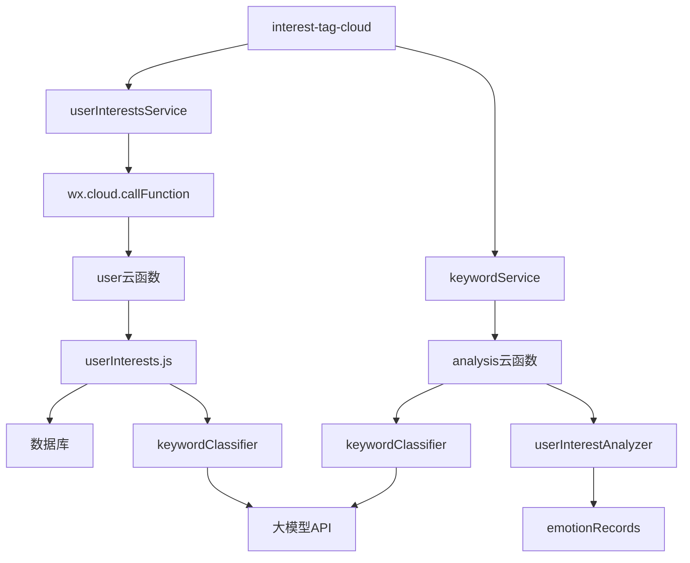

**图表来源**  
- [userInterests.js](file://cloudfunctions/user/userInterests.js#L1-L847)
- [userInterestAnalyzer.js](file://cloudfunctions/analysis/userInterestAnalyzer.js#L1-L289)
- [interest-tag-cloud.js](file://miniprogram/components/interest-tag-cloud/interest-tag-cloud.js#L1-L256)
- [userInterestsService.js](file://miniprogram/services/userInterestsService.js#L1-L613)
- [keywordService.js](file://miniprogram/services/keywordService.js#L1-L482)

**本节来源**  
- [userInterests.js](file://cloudfunctions/user/userInterests.js#L1-L847)
- [userInterestAnalyzer.js](file://cloudfunctions/analysis/userInterestAnalyzer.js#L1-L289)
- [interest-tag-cloud.js](file://miniprogram/components/interest-tag-cloud/interest-tag-cloud.js#L1-L256)
- [userInterestsService.js](file://miniprogram/services/userInterestsService.js#L1-L613)
- [keywordService.js](file://miniprogram/services/keywordService.js#L1-L482)

## 性能考虑
用户兴趣分析系统在设计时充分考虑了性能优化，通过缓存机制和异步处理提高系统响应速度。

### 缓存机制
系统在前端和后端均实现了缓存机制，减少对云函数和数据库的频繁调用。

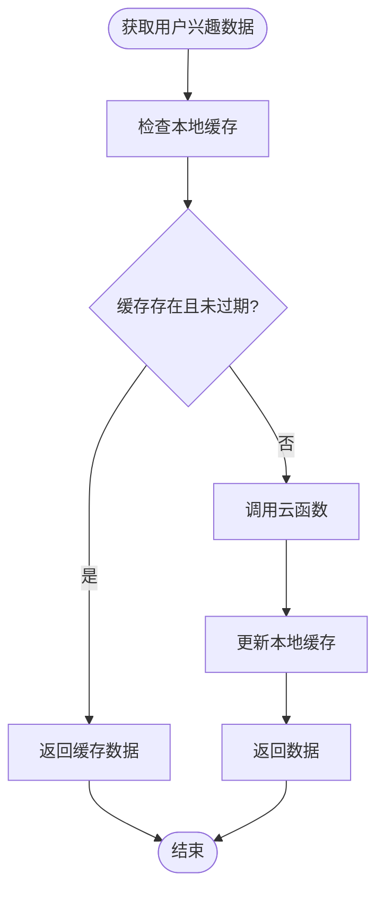

**图表来源**  
- [userInterestsService.js](file://miniprogram/services/userInterestsService.js#L1-L613)
- [keywordService.js](file://miniprogram/services/keywordService.js#L1-L482)

### 异步处理策略
系统采用异步处理策略，确保主要业务流程不受次要操作影响。

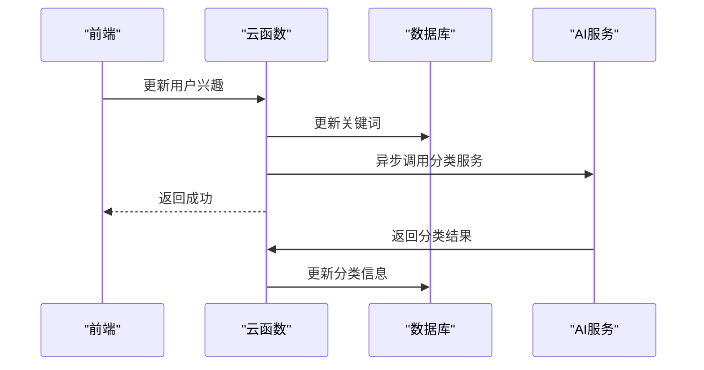

**图表来源**  
- [index.js](file://cloudfunctions/analysis/index.js#L1-L1117)
- [userInterests.js](file://cloudfunctions/user/userInterests.js#L1-L847)

**本节来源**  
- [userInterestsService.js](file://miniprogram/services/userInterestsService.js#L1-L613)
- [keywordService.js](file://miniprogram/services/keywordService.js#L1-L482)
- [index.js](file://cloudfunctions/analysis/index.js#L1-L1117)

## 故障排除指南
### 常见问题及解决方案
1. **兴趣标签云不显示数据**
   - 检查用户ID是否正确传递
   - 确认userInterests集合中是否存在对应用户的数据
   - 检查云函数调用权限

2. **关键词分类不准确**
   - 检查智谱AI API密钥是否配置正确
   - 确认分类提示词是否完整
   - 检查网络连接是否正常

3. **数据更新延迟**
   - 检查缓存机制是否正常工作
   - 确认forceRefresh参数是否正确设置
   - 检查数据库写入权限

**本节来源**  
- [用户兴趣分类功能说明.md](file://doc/使用文档/用户兴趣分类功能说明.md#L1-L237)
- [userInterestsService.js](file://miniprogram/services/userInterestsService.js#L1-L613)

## 结论
用户兴趣分析系统通过userInterests.js云函数、userInterestAnalyzer分析模块和interest-tag-cloud前端组件的协同工作，实现了从用户聊天内容到兴趣标签云的完整处理流程。系统采用分层架构，各组件职责清晰，通过缓存机制和异步处理确保了良好的性能表现。兴趣权重计算算法结合了关键词出现频率、情感关联和时间因素，能够准确反映用户的兴趣变化。该系统为个性化推荐和用户画像分析提供了可靠的数据基础。

## 附录
### 预定义兴趣类别
系统预定义了以下兴趣类别，用于关键词分类：
- 学习
- 工作
- 娱乐
- 社交
- 健康
- 生活
- 科技
- 艺术
- 体育
- 旅游
- 美食
- 时尚
- 金融
- 宠物
- 家庭
- 音乐
- 电影
- 阅读
- 游戏
- 心理
- 自我提升
- 时间管理
- 压力缓解
- 人际关系
- 休闲活动

### API接口说明
| 接口名称 | 参数 | 返回值 | 说明 |
|--------|------|-------|------|
| getUserInterests | userId | 用户兴趣数据 | 获取用户兴趣数据 |
| updateUserInterest | userId, keyword, weightDelta | 更新结果 | 更新用户兴趣关键词 |
| batchUpdateUserInterests | userId, keywords, autoClassify, categoryStats, categoriesArray | 批量更新结果 | 批量更新用户兴趣 |
| deleteUserInterest | userId, keyword | 删除结果 | 删除用户兴趣关键词 |
| updateKeywordCategory | userId, keyword, category | 更新结果 | 更新关键词分类 |
| getInterestTagCloudData | userId, forceRefresh, useCategories | 标签云数据数组 | 获取用户兴趣标签云数据 |

**本节来源**  
- [用户兴趣分类功能说明.md](file://doc/使用文档/用户兴趣分类功能说明.md#L1-L237)
- [userInterests.md](file://doc/开发文档/database/userInterests.md#L1-L122)