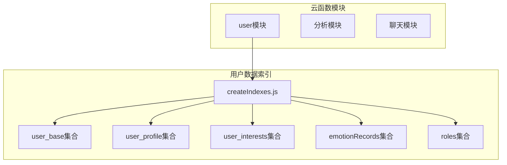
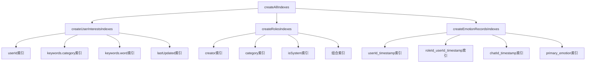
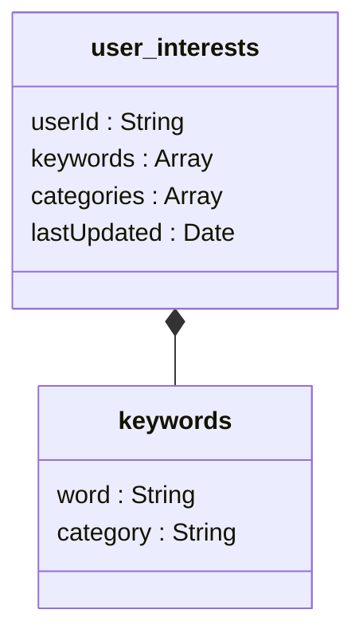
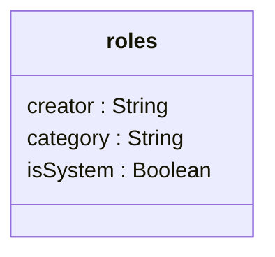
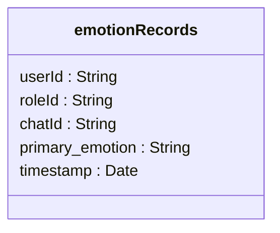
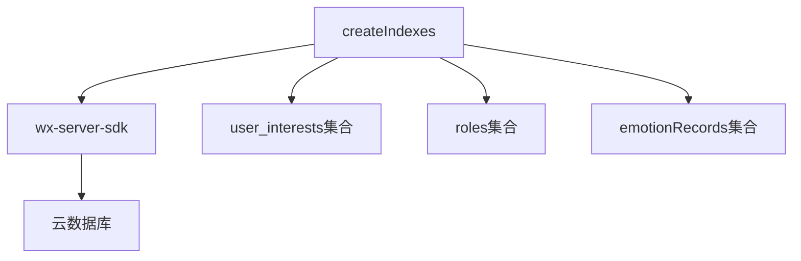

# 用户数据索引管理

<cite>
**本文档引用的文件**
- [createIndexes.js](file://cloudfunctions/user/createIndexes.js)
- [user_base.md](file://doc/开发文档/database/user_base.md)
- [user_profile.md](file://doc/开发文档/database/user_profile.md)
- [HeartChat数据库结构图.html](file://doc/设计文档/流程图/html/HeartChat数据库结构图.html)
- [HeartChat数据库ER图.html](file://doc/设计文档/流程图/html/HeartChat数据库ER图.html)
</cite>

## 目录
1. [引言](#引言)
2. [项目结构](#项目结构)
3. [核心组件](#核心组件)
4. [架构概述](#架构概述)
5. [详细组件分析](#详细组件分析)
6. [依赖分析](#依赖分析)
7. [性能考虑](#性能考虑)
8. [故障排除指南](#故障排除指南)
9. [结论](#结论)

## 引言
`createIndexes.js` 是 HeartChat 用户系统中的关键数据库管理脚本，负责为用户相关集合（如 `user_base`、`user_profile`、`user_interests` 等）创建高效查询索引。该脚本通过在关键字段上建立索引，显著提升数据库查询性能，特别是在用户认证、资料检索、兴趣分析等高频操作场景中。本文档详细说明该脚本的作用、索引配置、性能影响及维护策略。

## 项目结构
HeartChat 项目的用户数据索引管理功能主要位于云函数目录下的 `user` 模块中。`createIndexes.js` 脚本集中管理所有用户相关集合的索引创建逻辑，确保数据库查询的高效性。

**Diagram sources**
- [createIndexes.js](file://cloudfunctions/user/createIndexes.js#L1-L224)
- [HeartChat数据库结构图.html](file://doc/设计文档/流程图/html/HeartChat数据库结构图.html#L593-L637)

**Section sources**
- [createIndexes.js](file://cloudfunctions/user/createIndexes.js#L1-L224)
- [HeartChat数据库结构图.html](file://doc/设计文档/流程图/html/HeartChat数据库结构图.html#L593-L637)

## 核心组件
`createIndexes.js` 的核心功能是为多个用户相关集合创建索引，包括 `user_interests`、`roles` 和 `emotionRecords`。每个集合的索引设计都针对其特定的查询场景进行了优化。脚本通过 `createAllIndexes` 函数统一调度所有索引创建任务，确保操作的原子性和完整性。

**Section sources**
- [createIndexes.js](file://cloudfunctions/user/createIndexes.js#L1-L224)

## 架构概述
`createIndexes.js` 采用模块化设计，将不同集合的索引创建逻辑封装在独立的异步函数中。这种设计提高了代码的可维护性和可测试性。脚本通过微信云开发 SDK 与数据库交互，利用 `createIndex` 方法在指定字段上建立索引。

**Diagram sources**
- [createIndexes.js](file://cloudfunctions/user/createIndexes.js#L1-L224)

## 详细组件分析

### createUserInterestsIndexes 分析
该函数为 `user_interests` 集合创建多个索引，以支持用户兴趣数据的高效查询。

**Diagram sources**
- [createIndexes.js](file://cloudfunctions/user/createIndexes.js#L25-L65)
- [HeartChat数据库结构图.html](file://doc/设计文档/流程图/html/HeartChat数据库结构图.html#L381-L427)

### createRolesIndexes 分析
该函数为 `roles` 集合创建索引，支持角色的分类、创建者和系统属性查询。

**Diagram sources**
- [createIndexes.js](file://cloudfunctions/user/createIndexes.js#L75-L120)

### createEmotionRecordsIndexes 分析
该函数为 `emotionRecords` 集合创建索引，支持按用户、角色、会话和情感类型进行高效的时间序列查询。

**Diagram sources**
- [createIndexes.js](file://cloudfunctions/user/createIndexes.js#L130-L170)

**Section sources**
- [createIndexes.js](file://cloudfunctions/user/createIndexes.js#L25-L170)

## 依赖分析
`createIndexes.js` 依赖于微信云开发环境和数据库服务。它通过 `wx-server-sdk` 初始化云环境并获取数据库引用。脚本的执行需要相应的数据库写入权限。

**Diagram sources**
- [createIndexes.js](file://cloudfunctions/user/createIndexes.js#L3-L7)

**Section sources**
- [createIndexes.js](file://cloudfunctions/user/createIndexes.js#L3-L7)

## 性能考虑
索引的创建对数据库读写性能有显著影响。合理的索引可以将查询时间从 O(n) 降低到 O(log n)，但会增加写入操作的开销，因为每次数据插入或更新时都需要维护索引结构。`createIndexes.js` 中的索引设计遵循以下原则：
- **选择性原则**：优先在高选择性的字段上创建索引（如 `userId`）。
- **查询频率原则**：优先为高频查询字段创建索引（如 `timestamp`）。
- **复合索引原则**：对于多条件查询，使用复合索引以提高效率。
- **避免过度索引**：仅创建必要的索引，避免对写入性能造成过大影响。

## 故障排除指南
索引失效的常见原因包括：
- 数据库统计信息未更新
- 查询条件与索引字段不匹配
- 索引被意外删除
- 数据库版本升级导致兼容性问题

监控方法包括：
- 定期检查慢查询日志
- 使用数据库性能分析工具
- 监控索引使用率
- 定期执行索引健康检查

优化建议：
- 避免在低选择性字段上创建索引
- 定期评估索引的有效性，删除未使用的索引
- 对于大型集合，考虑使用后台索引创建以减少对服务的影响
- 根据实际查询模式调整索引策略

**Section sources**
- [createIndexes.js](file://cloudfunctions/user/createIndexes.js#L1-L224)
- [HeartChat数据库结构图.html](file://doc/设计文档/流程图/html/HeartChat数据库结构图.html#L593-L637)

## 结论
`createIndexes.js` 是 HeartChat 用户系统中不可或缺的数据库优化工具。通过为关键集合创建精心设计的索引，它显著提升了系统的查询性能和响应速度。合理的索引策略需要在读取性能和写入开销之间找到平衡，并根据实际使用情况进行持续优化和调整。