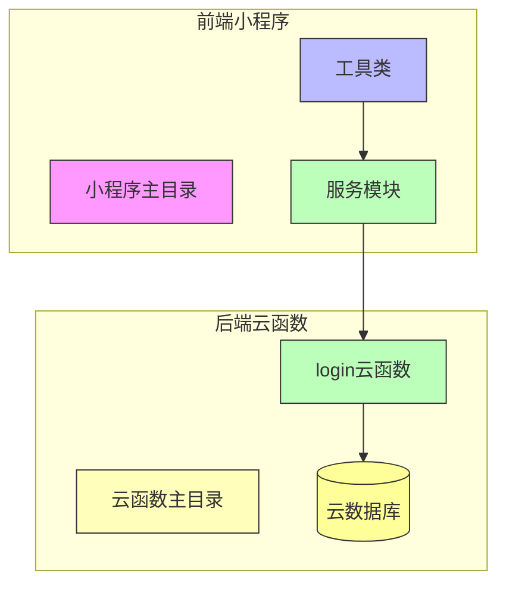
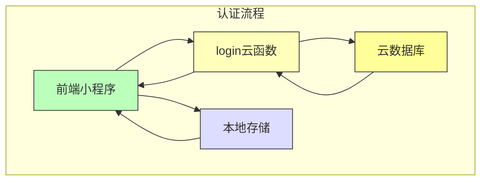
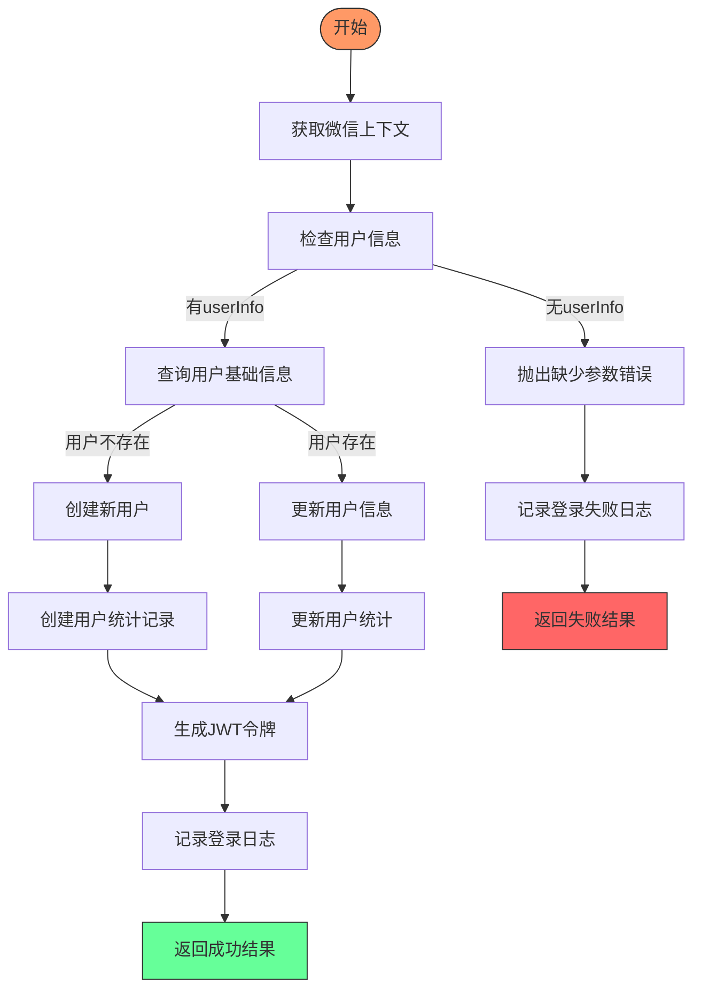
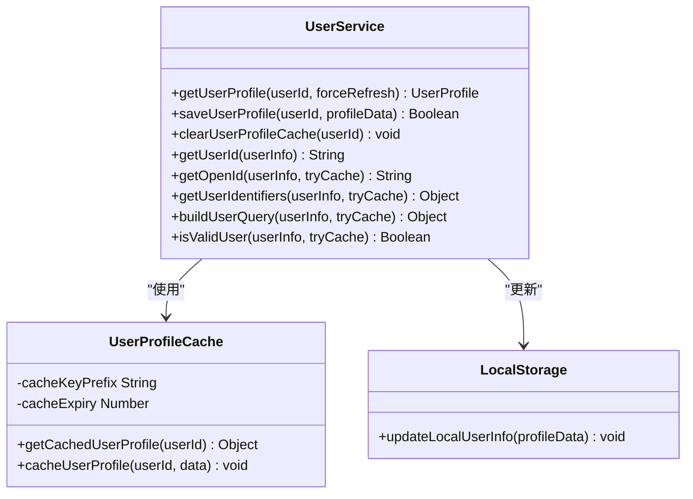
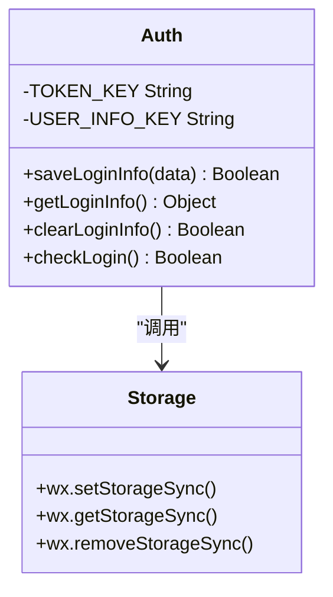
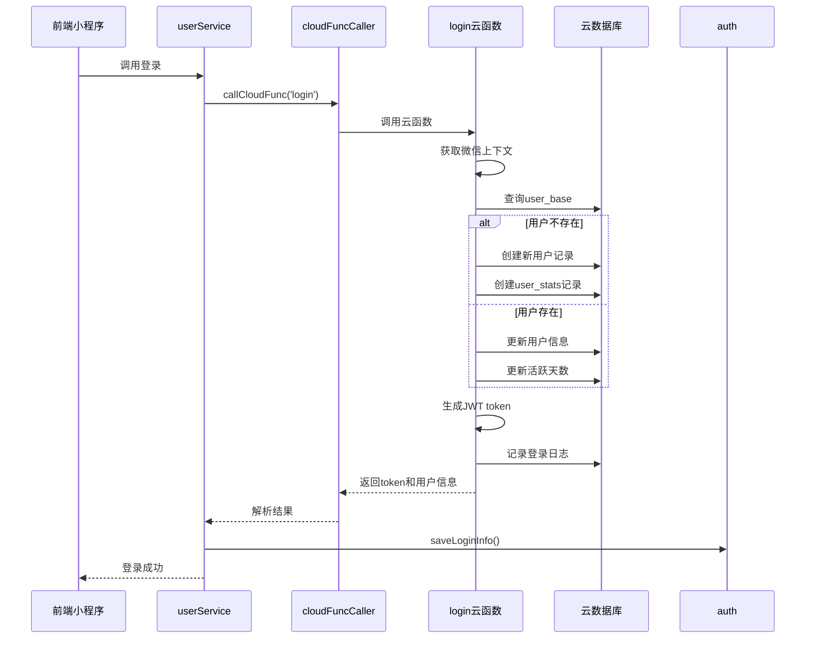
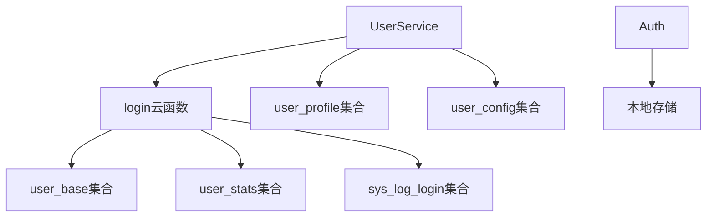

# 用户认证与登录

<cite>
**本文档引用文件**  
- [login/index.js](file://cloudfunctions/login/index.js)
- [userService.js](file://miniprogram/services/userService.js)
- [auth.js](file://miniprogram/utils/auth.js)
- [cloudFuncCaller.js](file://miniprogram/services/cloudFuncCaller.js)
- [user_base.md](file://doc/开发文档/database/user_base.md)
- [user_stats.md](file://doc/开发文档/database/user_stats.md)
- [HeartChat数据流向图.md](file://doc/设计文档/流程图/HeartChat数据流向图.md)
</cite>

## 目录
1. [简介](#简介)
2. [项目结构](#项目结构)
3. [核心组件](#核心组件)
4. [架构概览](#架构概览)
5. [详细组件分析](#详细组件分析)
6. [依赖分析](#依赖分析)
7. [性能考虑](#性能考虑)
8. [故障排除指南](#故障排除指南)
9. [结论](#结论)

## 简介
本文档详细说明了 HeartChat 项目的用户认证与登录流程，重点描述了 `login` 云函数如何处理微信授权登录，获取用户 openid 并建立本地会话。同时解释了前端通过 `userService` 调用登录接口的实现方式，以及 `auth` 工具类在权限校验中的作用。提供了完整的登录流程时序图，涵盖前端触发、云函数处理、数据库用户记录创建或更新的全过程。包含错误处理机制，如网络异常、授权拒绝等场景的应对策略，并给出实际代码示例，展示登录接口调用和用户状态管理的最佳实践。

## 项目结构
HeartChat 项目采用云开发架构，主要分为前端小程序和后端云函数两大部分。用户认证与登录功能的核心逻辑分布在 `cloudfunctions/login` 云函数和 `miniprogram/services/userService.js` 服务模块中。

**Diagram sources**
- [login/index.js](file://cloudfunctions/login/index.js)
- [userService.js](file://miniprogram/services/userService.js)

**Section sources**
- [login/index.js](file://cloudfunctions/login/index.js)
- [userService.js](file://miniprogram/services/userService.js)

## 核心组件
用户认证与登录系统由三个核心组件构成：`login` 云函数负责后端认证逻辑，`userService` 服务模块封装前端调用，`auth` 工具类管理本地会话状态。

**Section sources**
- [login/index.js](file://cloudfunctions/login/index.js#L1-L267)
- [userService.js](file://miniprogram/services/userService.js#L1-L368)
- [auth.js](file://miniprogram/utils/auth.js#L1-L68)

## 架构概览
系统采用前后端分离架构，前端通过云函数接口与后端交互，使用 JWT 实现无状态会话管理。

**Diagram sources**
- [login/index.js](file://cloudfunctions/login/index.js#L1-L267)
- [auth.js](file://miniprogram/utils/auth.js#L1-L68)

## 详细组件分析

### 登录云函数分析
`login` 云函数是用户认证的核心，处理微信授权登录，获取用户 openid，并在数据库中创建或更新用户记录。

**Diagram sources**
- [login/index.js](file://cloudfunctions/login/index.js#L1-L267)

**Section sources**
- [login/index.js](file://cloudfunctions/login/index.js#L1-L267)

### 用户服务模块分析
`userService` 模块封装了用户资料的获取和保存逻辑，提供缓存机制以提升性能。

**Diagram sources**
- [userService.js](file://miniprogram/services/userService.js#L1-L368)

**Section sources**
- [userService.js](file://miniprogram/services/userService.js#L1-L368)

### 认证工具类分析
`auth` 工具类负责管理本地登录状态，包括 token 和用户信息的存储与读取。

**Diagram sources**
- [auth.js](file://miniprogram/utils/auth.js#L1-L68)

**Section sources**
- [auth.js](file://miniprogram/utils/auth.js#L1-L68)

### 登录流程时序图
完整展示从用户点击登录到会话建立的全过程。

**Diagram sources**
- [login/index.js](file://cloudfunctions/login/index.js#L1-L267)
- [userService.js](file://miniprogram/services/userService.js#L1-L368)
- [auth.js](file://miniprogram/utils/auth.js#L1-L68)

## 依赖分析
用户认证系统依赖多个云函数和数据库集合，形成完整的认证生态。

**Diagram sources**
- [login/index.js](file://cloudfunctions/login/index.js#L1-L267)
- [userService.js](file://miniprogram/services/userService.js#L1-L368)

**Section sources**
- [user_base.md](file://doc/开发文档/database/user_base.md)
- [user_stats.md](file://doc/开发文档/database/user_stats.md)

## 性能考虑
系统在用户认证方面进行了多项性能优化，包括本地缓存、数据库索引和批量操作。

- **本地缓存**：用户资料在本地缓存1小时，减少云函数调用
- **数据库索引**：user_base 集合对 user_id 和 openid 建立唯一索引
- **批量调用**：cloudFuncCaller 支持并行调用多个云函数
- **连接复用**：云函数自动管理数据库连接

## 故障排除指南
### 常见问题及解决方案

| 问题现象 | 可能原因 | 解决方案 |
|---------|--------|---------|
| 登录失败 | 网络异常 | 检查网络连接，重试登录 |
| 登录失败 | 微信授权拒绝 | 引导用户重新授权 |
| 用户信息不更新 | 缓存未清除 | 调用 clearUserProfileCache |
| token失效 | 过期时间7天 | 重新登录获取新token |
| 用户ID生成失败 | 重复ID冲突 | 系统自动重试10次 |

**Section sources**
- [login/index.js](file://cloudfunctions/login/index.js#L1-L267)
- [auth.js](file://miniprogram/utils/auth.js#L1-L68)

## 结论
HeartChat 的用户认证与登录系统采用云开发架构，通过 `login` 云函数实现微信授权登录，使用 JWT 进行会话管理。系统具有良好的扩展性和安全性，通过本地缓存提升性能，完善的错误处理机制保障用户体验。建议定期清理过期的登录日志，监控用户活跃度指标，持续优化认证流程。