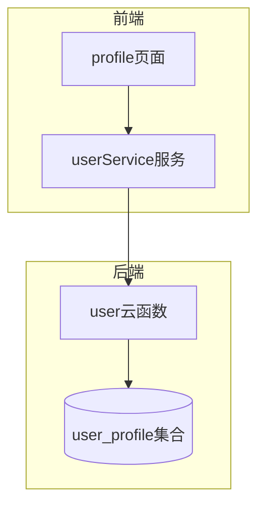
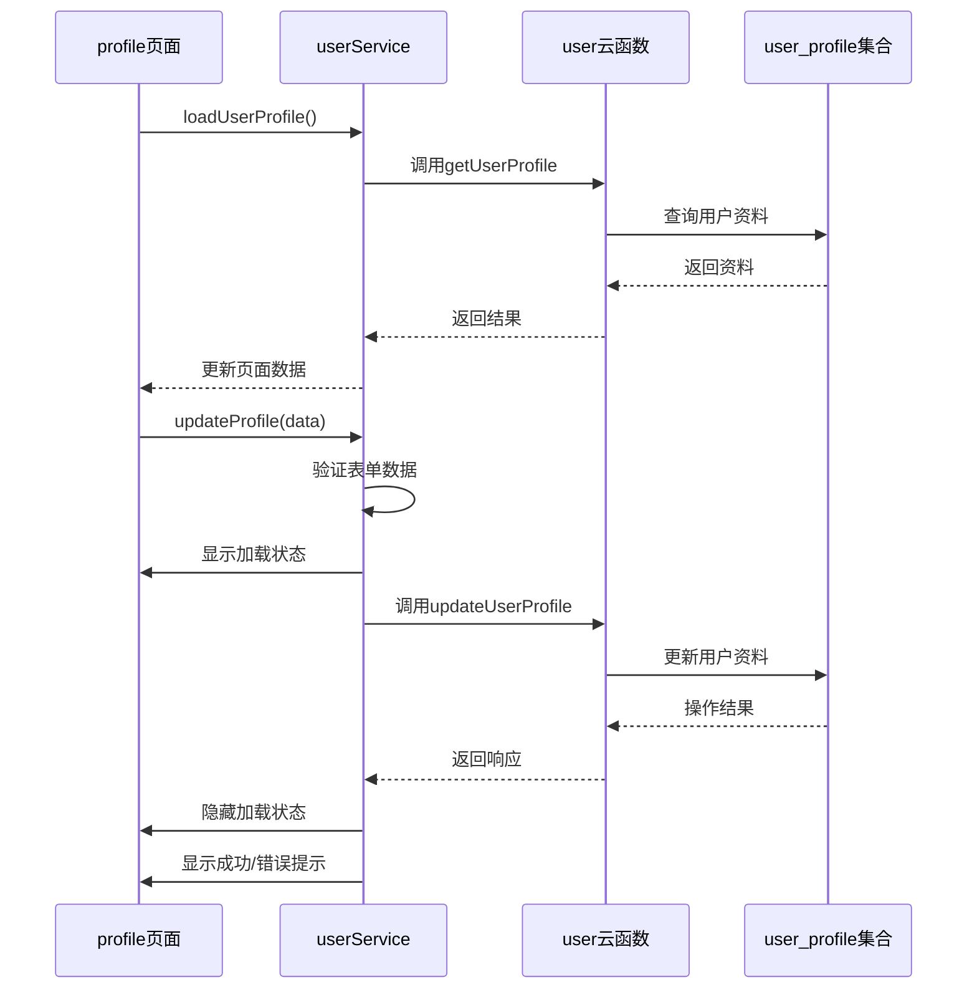
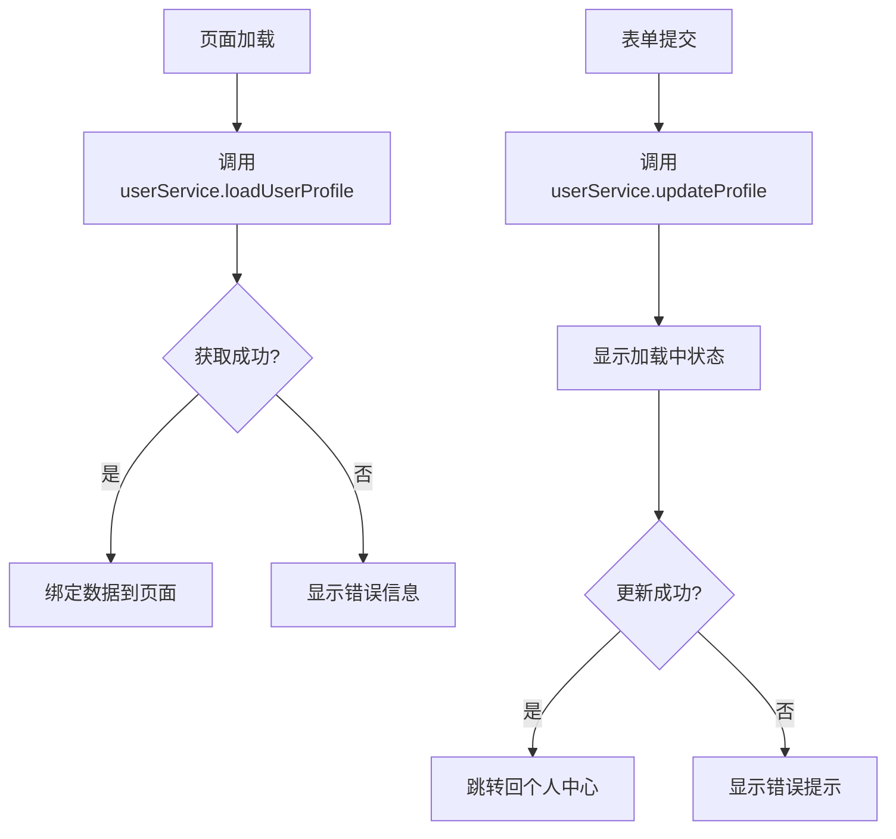
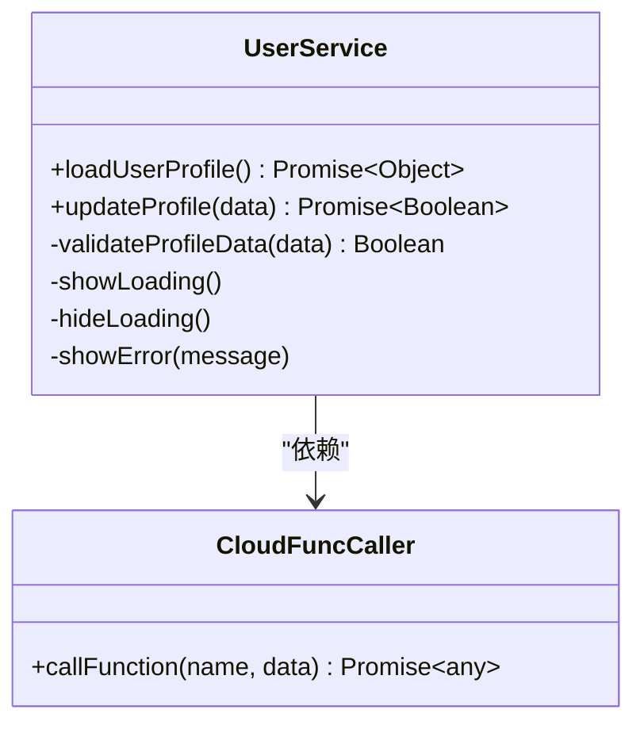
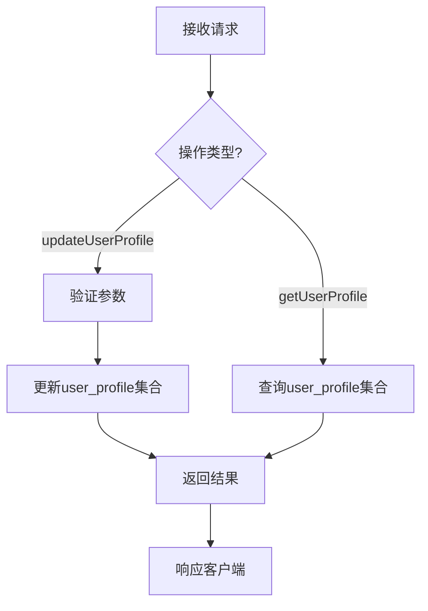
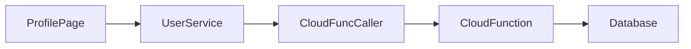

# 用户资料管理

<cite>
**本文档引用文件**  
- [profile.js](file://miniprogram/pages/user/profile/profile.js)
- [userService.js](file://miniprogram/services/userService.js)
- [index.js](file://cloudfunctions/user/index.js)
- [user_profile.md](file://doc/开发文档/database/user_profile.md)
- [user_base.md](file://doc/开发文档/database/user_base.md)
- [imageService.js](file://miniprogram/utils/imageService.js)
- [cloudFuncCaller.js](file://miniprogram/services/cloudFuncCaller.js)
</cite>

## 目录
1. [简介](#简介)
2. [项目结构](#项目结构)
3. [核心组件](#核心组件)
4. [架构概览](#架构概览)
5. [详细组件分析](#详细组件分析)
6. [依赖分析](#依赖分析)
7. [性能考虑](#性能考虑)
8. [故障排除指南](#故障排除指南)
9. [结论](#结论)

## 简介
本文档系统化阐述HeartChat小程序中用户资料管理功能的实现机制。涵盖用户基本信息（昵称、头像、性别等）的读取、编辑与持久化流程，说明前端页面、服务层与云函数之间的协作方式，并详细描述数据一致性保障措施与字段验证规则。

## 项目结构
用户资料管理功能涉及前端页面、服务层封装与云函数后端处理三个主要层级。前端位于`miniprogram/pages/user/profile`目录，服务层逻辑封装在`services/userService.js`中，云函数处理逻辑位于`cloudfunctions/user/index.js`。

**图示来源**  
- [profile.js](file://miniprogram/pages/user/profile/profile.js)
- [userService.js](file://miniprogram/services/userService.js)
- [index.js](file://cloudfunctions/user/index.js)
- [user_profile.md](file://doc/开发文档/database/user_profile.md)

**本节来源**  
- [profile.js](file://miniprogram/pages/user/profile/profile.js)
- [userService.js](file://miniprogram/services/userService.js)
- [index.js](file://cloudfunctions/user/index.js)

## 核心组件
核心组件包括前端profile页面、userService服务类以及user云函数。profile页面负责UI展示与用户交互，userService封装资料操作的业务逻辑，user云函数处理数据库读写请求并与云数据库user_profile集合交互。

**本节来源**  
- [profile.js](file://miniprogram/pages/user/profile/profile.js#L1-L50)
- [userService.js](file://miniprogram/services/userService.js#L1-L30)
- [index.js](file://cloudfunctions/user/index.js#L1-L20)

## 架构概览
系统采用分层架构设计，前端通过userService调用云函数实现资料管理。profile页面初始化时加载用户资料，表单提交时触发更新流程，包含加载状态显示与错误提示机制。

**图示来源**  
- [profile.js](file://miniprogram/pages/user/profile/profile.js#L20-L80)
- [userService.js](file://miniprogram/services/userService.js#L15-L60)
- [index.js](file://cloudfunctions/user/index.js#L25-L45)

## 详细组件分析

### 前端页面分析
profile页面实现用户资料的展示与编辑功能，采用数据绑定机制自动更新界面。

#### 页面结构设计

**图示来源**  
- [profile.js](file://miniprogram/pages/user/profile/profile.js#L10-L100)

**本节来源**  
- [profile.js](file://miniprogram/pages/user/profile/profile.js#L1-L120)

### 服务层分析
userService封装了用户资料操作的统一接口，提供资料读取与更新方法。

#### 资料操作方法

**图示来源**  
- [userService.js](file://miniprogram/services/userService.js#L5-L50)
- [cloudFuncCaller.js](file://miniprogram/services/cloudFuncCaller.js#L1-L10)

**本节来源**  
- [userService.js](file://miniprogram/services/userService.js#L1-L80)

### 云函数分析
user云函数处理前端发来的资料更新请求，与云数据库user_profile集合进行交互。

#### 资料更新处理流程

**图示来源**  
- [index.js](file://cloudfunctions/user/index.js#L15-L60)

**本节来源**  
- [index.js](file://cloudfunctions/user/index.js#L10-L70)

## 依赖分析
系统各组件间存在明确的依赖关系，前端页面依赖userService，userService依赖云函数调用服务，云函数依赖数据库服务。

**图示来源**  
- [profile.js](file://miniprogram/pages/user/profile/profile.js)
- [userService.js](file://miniprogram/services/userService.js)
- [cloudFuncCaller.js](file://miniprogram/services/cloudFuncCaller.js)
- [index.js](file://cloudfunctions/user/index.js)

**本节来源**  
- [profile.js](file://miniprogram/pages/user/profile/profile.js)
- [userService.js](file://miniprogram/services/userService.js)
- [cloudFuncCaller.js](file://miniprogram/services/cloudFuncCaller.js)
- [index.js](file://cloudfunctions/user/index.js)

## 性能考虑
资料读取采用异步加载避免界面卡顿，更新操作显示加载状态提升用户体验。云函数端对频繁访问的用户资料可考虑添加缓存机制。

## 故障排除指南
常见问题包括资料更新失败、头像上传异常等。需检查网络连接、云函数日志及数据库权限配置。前端应妥善处理各种错误情况并给出明确提示。

**本节来源**  
- [profile.js](file://miniprogram/pages/user/profile/profile.js#L80-L120)
- [userService.js](file://miniprogram/services/userService.js#L60-L80)
- [index.js](file://cloudfunctions/user/index.js#L50-L70)

## 结论
HeartChat的用户资料管理功能实现了完整的读取、编辑与持久化流程，通过分层架构确保了代码的可维护性。系统具备完善的错误处理机制和用户体验优化，为用户提供稳定可靠的资料管理服务。