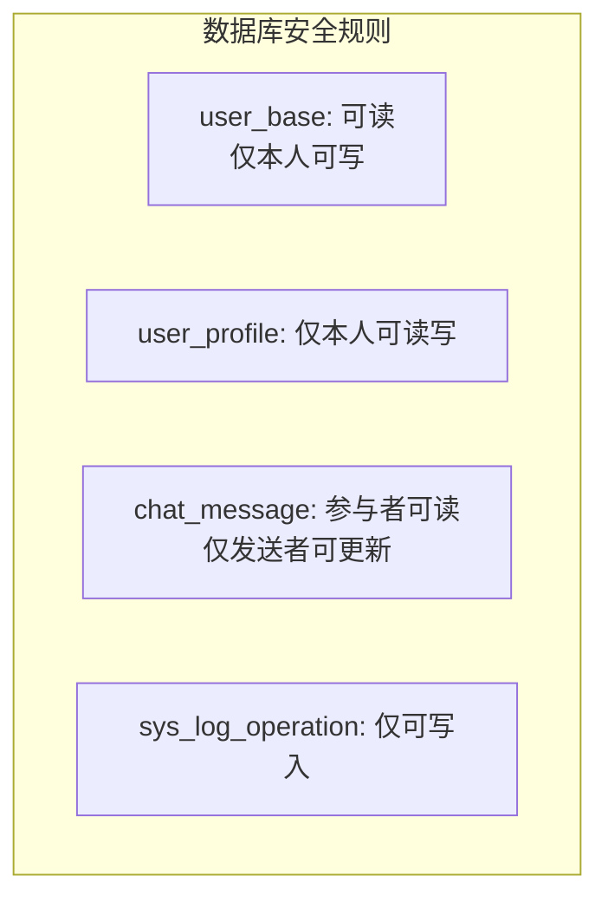
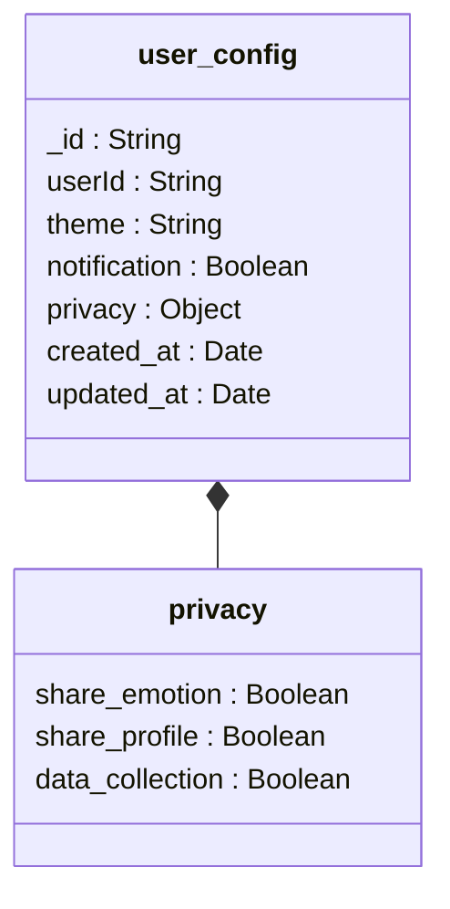
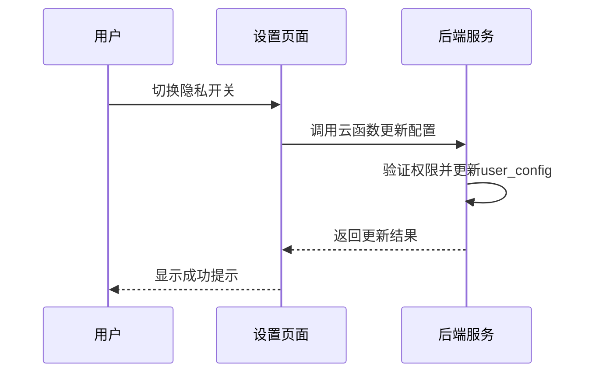
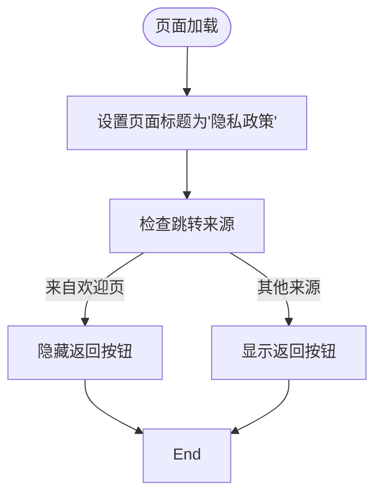
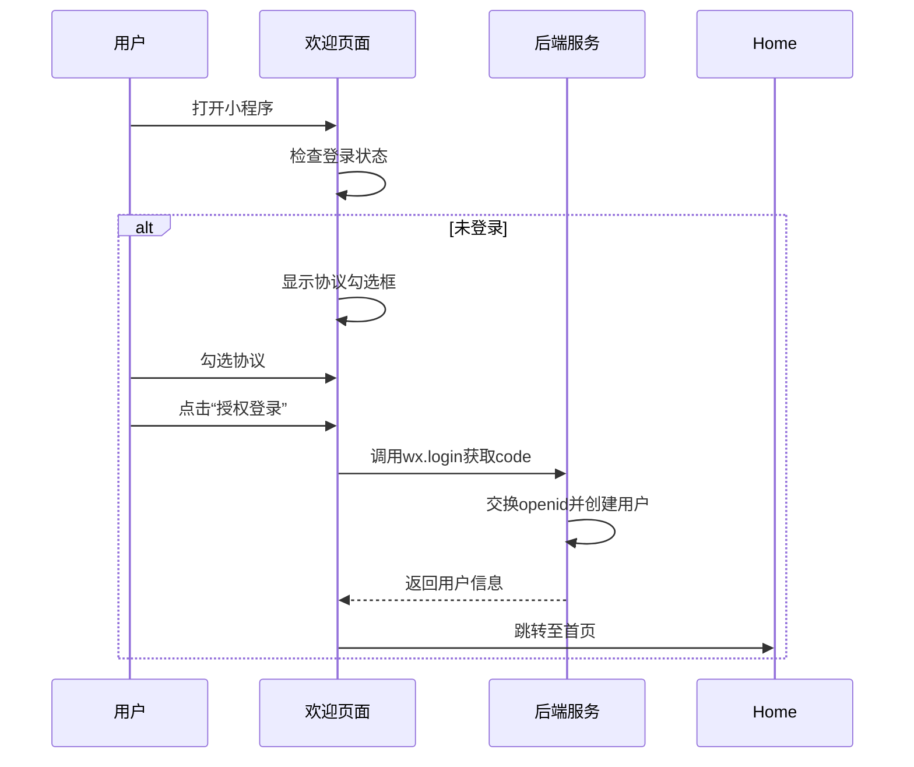
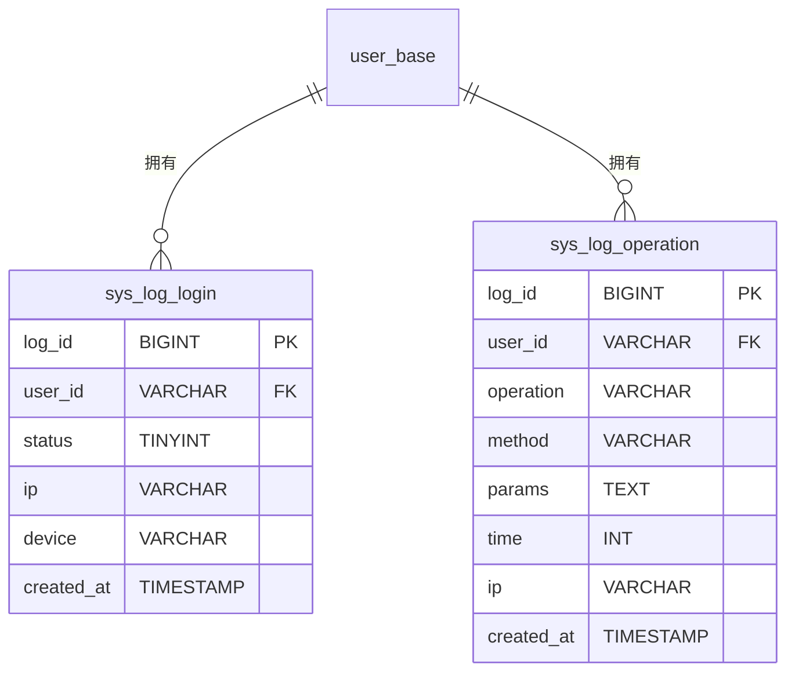

# 用户隐私与安全

<cite>
**本文档引用文件**  
- [privacy.js](file://miniprogram/pages/agreement/privacy.js)
- [user_config.md](file://doc/开发文档/database/user_config.md)
- [database_design.md](file://doc/设计文档/后端/database_design.md)
- [settings.html](file://doc/设计文档/原型设计图/settings.html)
- [HeartChat用户界面流程图.html](file://doc/设计文档/流程图/html/HeartChat用户界面流程图.html)
- [HeartChat数据库结构图.html](file://doc/设计文档/流程图/html/HeartChat数据库结构图.html)
</cite>

## 目录
1. [引言](#引言)
2. [数据存储与传输安全](#数据存储与传输安全)
3. [用户隐私配置实现](#用户隐私配置实现)
4. [隐私政策与用户授权流程](#隐私政策与用户授权流程)
5. [数据匿名化与访问日志](#数据匿名化与访问日志)
6. [合规性说明](#合规性说明)

## 引言
本系统在设计上高度重视用户隐私保护与数据安全，特别是在处理敏感信息如用户资料、聊天记录和情绪分析数据时，采取了多层次的安全策略。系统基于微信小程序生态构建，利用云开发能力实现数据的加密存储、权限控制和安全传输，确保用户数据的机密性、完整性和可用性。

## 数据存储与传输安全

### 数据库安全规则
系统为所有数据库集合配置了精细化的访问控制规则，确保用户只能访问与自身 `openid` 关联的数据。例如，`user_profile` 和 `user_stats` 集合的读写权限均要求 `auth.openid != null && doc.user_id == auth.openid`，有效防止了越权访问。

**Diagram sources**
- [database_design.md](file://doc/设计文档/后端/database_design.md#L0-L51)
- [database_design.md](file://doc/设计文档/后端/database_design.md#L52-L97)

**Section sources**
- [database_design.md](file://doc/设计文档/后端/database_design.md#L0-L97)

### 敏感数据加密
系统对敏感数据实施加密存储策略。用户聊天记录（`chat_message` 集合）和情绪分析记录（`emotion_records` 集合）均通过云数据库的加密功能进行保护。所有数据在传输过程中均使用 HTTPS 协议进行加密，确保通信链路的安全。

## 用户隐私配置实现

### 隐私设置数据结构
用户隐私配置存储在 `user_config` 集合中，其结构包含一个嵌套的 `privacy` 对象，用于管理数据共享和收集权限。

**Diagram sources**
- [HeartChat数据库结构图.html](file://doc/设计文档/流程图/html/HeartChat数据库结构图.html#L381-L427)

### 隐私选项前端实现
在设置页面中，用户可通过开关控件管理隐私选项，如“数据收集”和“匿名使用统计”。这些选项与 `user_config` 集合中的字段直接绑定，变更后实时同步至云端。

**Diagram sources**
- [settings.html](file://doc/设计文档/原型设计图/settings.html#L65-L97)
- [HeartChat用户界面流程图.html](file://doc/设计文档/流程图/html/HeartChat用户界面流程图.html#L500-L533)

**Section sources**
- [settings.html](file://doc/设计文档/原型设计图/settings.html#L65-L97)

## 隐私政策与用户授权流程

### 隐私政策页面
隐私政策页面由 `privacy.js` 文件驱动，通过小程序原生组件展示政策内容。页面标题为“隐私政策”，并根据跳转来源决定是否显示返回按钮。

**Diagram sources**
- [privacy.js](file://miniprogram/pages/agreement/privacy.js#L0-L49)

**Section sources**
- [privacy.js](file://miniprogram/pages/agreement/privacy.js#L0-L49)

### 用户授权流程
新用户首次打开小程序时，需在欢迎页同意服务协议和隐私政策后，方可进行微信授权登录。该流程确保了用户知情权和选择权。

**Diagram sources**
- [welcome.js](file://miniprogram/pages/welcome/welcome.js#L0-L66)
- [HeartChat用户界面流程图.html](file://doc/设计文档/流程图/html/HeartChat用户界面流程图.html#L321-L358)

## 数据匿名化与访问日志

### 数据匿名化处理
系统在进行数据分析和统计时，对用户数据进行匿名化处理。例如，`user_stats` 集合中的数据仅用于生成聚合报表，不包含可识别个人身份的信息。用户可选择关闭“数据收集”选项，系统将停止收集其行为数据。

### 安全审计机制
系统记录两类操作日志：登录日志（`sys_log_login`）和操作日志（`sys_log_operation`）。日志记录包含用户ID、IP地址、设备信息和操作时间，且日志一旦写入即不可修改或删除，确保审计追踪的完整性。

**Diagram sources**
- [database_design.md](file://doc/设计文档/后端/database_design.md#L311-L358)

## 合规性说明
本系统的设计遵循数据最小化和权限最小化原则。所有数据访问均需经过身份验证，且仅限于完成特定功能所必需的数据。系统通过严格的云数据库安全规则和云函数权限校验，确保符合GDPR等数据保护法规的核心要求。用户拥有对其数据的完全控制权，包括查看、修改和删除（在允许范围内）的权利。