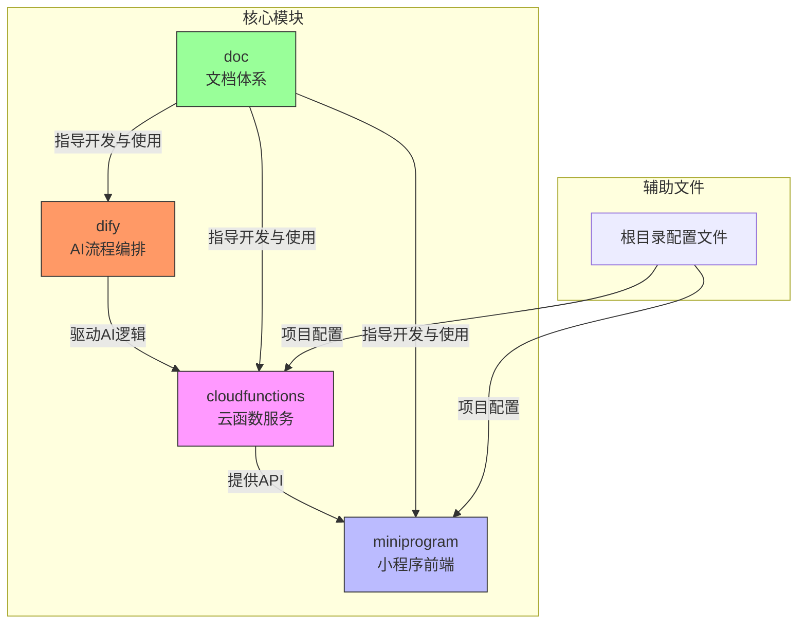
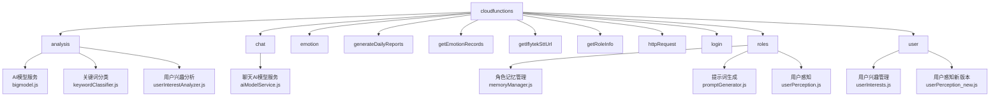
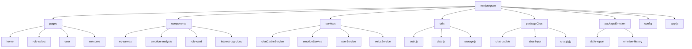
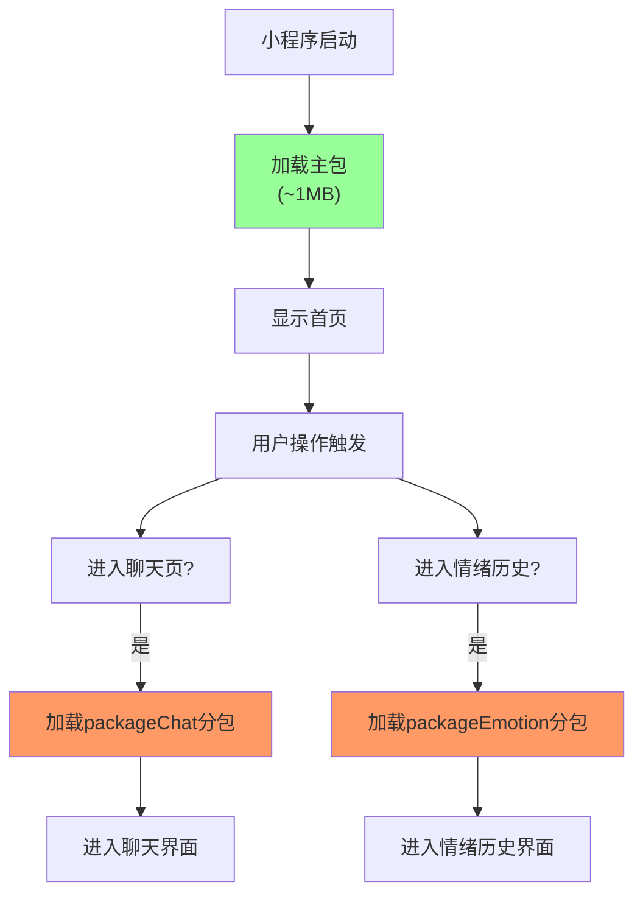
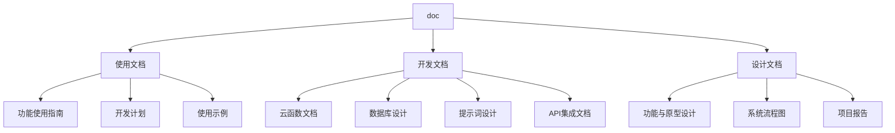
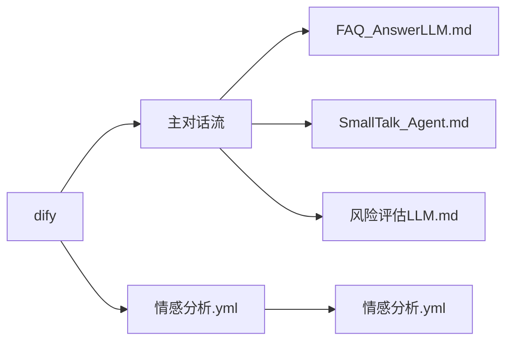

# 目录结构详解

<cite>
**本文档引用文件**  
- [README.md](file://README.md)
- [cloudfunctions/README.md](file://cloudfunctions/README.md)
- [miniprogram/app.json](file://miniprogram/app.json)
- [miniprogram/config/index.js](file://miniprogram/config/index.js)
- [doc/使用文档/聊天功能使用指南.md](file://doc/使用文档/聊天功能使用指南.md)
- [doc/开发文档/cloudfunctions/chat.md](file://doc/开发文档/cloudfunctions/chat.md)
- [doc/设计文档/流程图/HeartChat系统架构图.md](file://doc/设计文档/流程图/HeartChat系统架构图.md)
- [doc/开发文档/数据库设计方案.md](file://doc/开发文档/数据库设计方案.md)
- [dify/情感分析.yml](file://dify/情感分析.yml)
- [dify/主对话流/风险评估LLM.md](file://dify/主对话流/风险评估LLM.md)
</cite>

## 目录概览

HeartChat项目采用模块化、分层化的设计思想，整体结构清晰，职责分明。项目根目录下主要包含`cloudfunctions`（云函数）、`miniprogram`（小程序前端）、`dify`（AI流程编排）和`doc`（文档体系）四大核心模块，辅以配置文件与说明文档，形成完整的开发与维护体系。

**Diagram sources**  
- [README.md](file://README.md)
- [miniprogram/app.json](file://miniprogram/app.json)

## 云函数目录（cloudfunctions）分析

`cloudfunctions`目录存放所有后端云函数，按功能领域进行分类，实现高内聚、低耦合的微服务架构设计。

### 云函数分类逻辑

云函数按业务功能划分为多个子目录，每个子目录对应一个独立功能模块：

**Diagram sources**  
- [cloudfunctions/README.md](file://cloudfunctions/README.md)
- [cloudfunctions/analysis/index.js](file://cloudfunctions/analysis/index.js)
- [cloudfunctions/chat/index.js](file://cloudfunctions/chat/index.js)
- [cloudfunctions/roles/index.js](file://cloudfunctions/roles/index.js)
- [cloudfunctions/user/index.js](file://cloudfunctions/user/index.js)

#### analysis 模块
该模块专注于AI模型的统一调用与数据分析，包含`aiModelService.js`系列文件，实现对Gemini、BigModel等AI接口的封装。`keywordClassifier.js`用于关键词分类，`userInterestAnalyzer.js`分析用户兴趣标签，支撑个性化推荐。

**Section sources**  
- [cloudfunctions/analysis/aiModelService.js](file://cloudfunctions/analysis/aiModelService.js)
- [cloudfunctions/analysis/keywordClassifier.js](file://cloudfunctions/analysis/keywordClassifier.js)
- [cloudfunctions/analysis/userInterestAnalyzer.js](file://cloudfunctions/analysis/userInterestAnalyzer.js)

#### chat 模块
处理核心聊天逻辑，调用AI模型生成回复。`aiModelService.js`在此模块中为聊天场景定制化封装，与analysis模块形成复用与特化的关系。

**Section sources**  
- [cloudfunctions/chat/aiModelService.js](file://cloudfunctions/chat/aiModelService.js)
- [cloudfunctions/chat/index.js](file://cloudfunctions/chat/index.js)

#### roles 模块
管理角色系统，包含角色初始化`init-roles.js`、记忆管理`memoryManager.js`、提示词生成`promptGenerator.js`和用户感知`userPerception.js`，实现角色个性化与上下文记忆。

**Section sources**  
- [cloudfunctions/roles/init-roles.js](file://cloudfunctions/roles/init-roles.js)
- [cloudfunctions/roles/memoryManager.js](file://cloudfunctions/roles/memoryManager.js)
- [cloudfunctions/roles/promptGenerator.js](file://cloudfunctions/roles/promptGenerator.js)

#### 其他工具类云函数
- `httpRequest`：封装HTTP请求工具
- `login`：用户登录认证
- `getIflytekSttUrl`：获取讯飞语音听写URL
- `generateDailyReports`：生成每日心情报告
- `getEmotionRecords`：获取情绪记录

**Section sources**  
- [cloudfunctions/httpRequest/index.js](file://cloudfunctions/httpRequest/index.js)
- [cloudfunctions/login/index.js](file://cloudfunctions/login/index.js)
- [cloudfunctions/generateDailyReports/index.js](file://cloudfunctions/generateDailyReports/index.js)

## 小程序前端目录（miniprogram）组织

`miniprogram`目录为微信小程序前端代码，采用组件化与分包加载相结合的架构。

### 前端页面与组件组织

**Diagram sources**  
- [miniprogram/app.json](file://miniprogram/app.json)
- [miniprogram/pages/home/home.js](file://miniprogram/pages/home/home.js)
- [miniprogram/components/role-card/role-card.js](file://miniprogram/components/role-card/role-card.js)
- [miniprogram/services/userService.js](file://miniprogram/services/userService.js)

#### pages 目录
存放主包页面，如`home`（首页）、`role-select`（角色选择）、`user`（用户中心）、`welcome`（欢迎页）等，为用户主要访问入口。

**Section sources**  
- [miniprogram/pages/home/home.js](file://miniprogram/pages/home/home.js)
- [miniprogram/pages/role-select/role-select.js](file://miniprogram/pages/role-select/role-select.js)

#### components 目录
存放可复用UI组件，如`emotion-analysis`（情绪分析面板）、`role-card`（角色卡片）、`interest-tag-cloud`（兴趣标签云）等，提升开发效率与一致性。

**Section sources**  
- [miniprogram/components/emotion-analysis/emotion-analysis.js](file://miniprogram/components/emotion-analysis/emotion-analysis.js)
- [miniprogram/components/interest-tag-cloud/interest-tag-cloud.js](file://miniprogram/components/interest-tag-cloud/interest-tag-cloud.js)

#### services 目录
封装业务服务逻辑，如`chatCacheService.js`管理聊天缓存，`emotionService.js`处理情绪数据，`userService.js`管理用户信息，`voiceService.js`处理语音功能。

**Section sources**  
- [miniprogram/services/chatCacheService.js](file://miniprogram/services/chatCacheService.js)
- [miniprogram/services/emotionService.js](file://miniprogram/services/emotionService.js)
- [miniprogram/services/voiceService.js](file://miniprogram/services/voiceService.js)

#### utils 目录
存放工具函数，如`auth.js`处理认证逻辑，`date.js`处理日期格式化，`storage.js`封装本地存储操作。

**Section sources**  
- [miniprogram/utils/auth.js](file://miniprogram/utils/auth.js)
- [miniprogram/utils/date.js](file://miniprogram/utils/date.js)

## 分包机制与性能优化

项目采用微信小程序分包加载机制，通过`packageChat`和`packageEmotion`实现按需加载，显著提升启动性能。

### 分包结构与加载策略

**Diagram sources**  
- [miniprogram/app.json](file://miniprogram/app.json#L10-L25)
- [miniprogram/packageChat/pages/chat/chat.js](file://miniprogram/packageChat/pages/chat/chat.js)
- [miniprogram/packageEmotion\pages/daily-report/daily-report.js](file://miniprogram/packageEmotion\pages/daily-report/daily-report.js)

#### packageChat 分包
包含聊天核心功能，如`chat-bubble`（聊天气泡）、`chat-input`（输入框）及`chat`页面本身，将高内存占用的聊天界面独立打包。

**Section sources**  
- [miniprogram/packageChat/pages/chat/chat.js](file://miniprogram/packageChat/pages/chat/chat.js)
- [miniprogram/packageChat/components/chat-bubble/index.js](file://miniprogram/packageChat/components/chat-bubble/index.js)

#### packageEmotion 分包
包含情绪分析相关页面，如`daily-report`（每日报告）和`emotion-history`（情绪历史），避免用户未使用时加载冗余资源。

**Section sources**  
- [miniprogram/packageEmotion\pages/daily-report/daily-report.js](file://miniprogram/packageEmotion\pages/daily-report/daily-report.js)
- [miniprogram/packageEmotion\pages/emotion-history/emotion-history.js](file://miniprogram/packageEmotion\pages/emotion-history/emotion-history.js)

## 文档体系（doc）分类意义

`doc`目录构建了完整的文档体系，分为使用、开发、设计三类，满足不同角色需求。

### 文档分类结构

**Diagram sources**  
- [doc/使用文档/聊天功能使用指南.md](file://doc/使用文档/聊天功能使用指南.md)
- [doc/开发文档/cloudfunctions/chat.md](file://doc/开发文档/cloudfunctions/chat.md)
- [doc/设计文档/流程图/HeartChat系统架构图.md](file://doc/设计文档/流程图/HeartChat系统架构图.md)

#### 使用文档
面向最终用户和初级开发者，提供`聊天功能使用指南`、`情绪分析功能使用指南`等，降低使用门槛。

**Section sources**  
- [doc/使用文档/聊天功能使用指南.md](file://doc/使用文档/聊天功能使用指南.md)
- [doc/使用文档/情绪分析功能使用指南.md](file://doc/使用文档/情绪分析功能使用指南.md)

#### 开发文档
面向核心开发者，详细说明云函数接口、数据库设计、提示词逻辑等，如`analysis.md`说明AI模型服务设计，`数据库设计方案.md`定义数据结构。

**Section sources**  
- [doc/开发文档/cloudfunctions/analysis.md](file://doc/开发文档/cloudfunctions/analysis.md)
- [doc/开发文档/数据库设计方案.md](file://doc/开发文档/数据库设计方案.md)

#### 设计文档
包含原型图、流程图、项目报告等，记录系统设计决策，如`HeartChat系统架构图`可视化整体技术栈。

**Section sources**  
- [doc/设计文档/流程图/HeartChat系统架构图.md](file://doc/设计文档/流程图/HeartChat系统架构图.md)
- [doc/设计文档/原型设计图/home.html](file://doc/设计文档/原型设计图/home.html)

## Dify流程编排（dify）

`dify`目录存放Dify平台的可视化AI流程配置，通过YAML和MD文件定义AI工作流。

### Dify文件作用解析

**Diagram sources**  
- [dify/主对话流/风险评估LLM.md](file://dify/主对话流/风险评估LLM.md)
- [dify/情感分析.yml](file://dify/情感分析.yml)

#### YAML文件
`情感分析.yml`定义Dify平台中的工作流节点、连接关系与执行逻辑，是AI流程的配置核心。

**Section sources**  
- [dify/情感分析.yml](file://dify/情感分析.yml)

#### MD文件
存放在`主对话流`目录下的MD文件，如`风险评估LLM.md`，实际存储Dify中各节点的提示词（Prompt）内容，实现提示词与代码分离。

**Section sources**  
- [dify/主对话流/风险评估LLM.md](file://dify/主对话流/风险评估LLM.md)
- [dify/主对话流/SmallTalk_Agent.md](file://dify/主对话流/SmallTalk_Agent.md)

## 新开发者导航指南

为帮助新开发者快速上手，以下是关键代码位置指引：

| 功能领域 | 关键文件路径 | 说明 |
|--------|------------|------|
| 用户登录 | `cloudfunctions/login/index.js` | 处理用户登录逻辑 |
| 聊天AI响应 | `cloudfunctions/chat/aiModelService.js` | 聊天场景AI模型调用 |
| 角色记忆 | `cloudfunctions/roles/memoryManager.js` | 管理角色上下文记忆 |
| 情绪分析 | `cloudfunctions/analysis/keywordEmotionLinker.js` | 关键词与情绪关联分析 |
| 聊天界面 | `miniprogram/packageChat/pages/chat/chat.js` | 聊天主页面逻辑 |
| 情绪历史 | `miniprogram/packageEmotion\pages/emotion-history/emotion-history.js` | 情绪历史数据展示 |
| 分包配置 | `miniprogram/app.json` | 查看分包定义与页面路由 |
| 提示词管理 | `dify/主对话流/*.md` | 查看各AI节点提示词 |

**Section sources**  
- [miniprogram/app.json](file://miniprogram/app.json)
- [dify/主对话流/](file://dify/主对话流/)

## 总结

HeartChat项目通过清晰的目录划分、合理的分包策略和完善的文档体系，实现了高可维护性与可扩展性。`cloudfunctions`按功能垂直划分，`miniprogram`采用组件化与分包加载，`dify`实现AI逻辑可视化编排，`doc`提供多层次文档支持。新开发者可依据本指南快速定位核心模块，理解项目架构设计思想，高效投入开发工作。