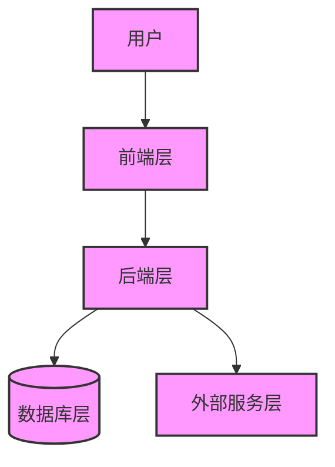
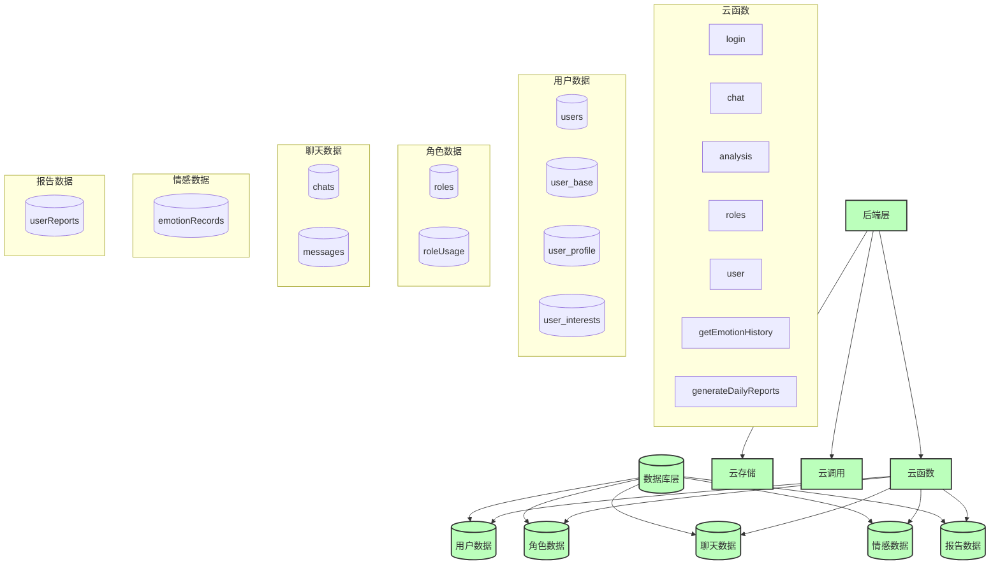
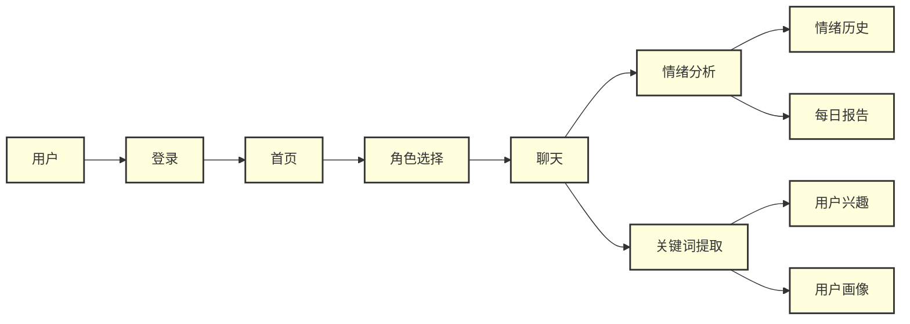

# 系统概述

<cite>
**本文档引用文件**  
- [README.md](file://README.md)
- [doc/设计文档/流程图/HeartChat系统架构图.md](file://doc/设计文档/流程图/HeartChat系统架构图.md)
- [doc/开发文档/数据库设计方案.md](file://doc/开发文档/数据库设计方案.md)
- [doc/开发文档/cloudfunctions/analysis.md](file://doc/开发文档/cloudfunctions/analysis.md)
- [doc/开发文档/cloudfunctions/chat.md](file://doc/开发文档/cloudfunctions/chat.md)
- [doc/开发文档/cloudfunctions/roles.md](file://doc/开发文档/cloudfunctions/roles.md)
- [doc/开发文档/cloudfunctions/user.md](file://doc/开发文档/cloudfunctions/user.md)
- [doc/开发文档/cloudfunctions/generateDailyReports.md](file://doc/开发文档/cloudfunctions/generateDailyReports.md)
- [doc/开发文档/prompt/01-情感分析提示词.md](file://doc/开发文档/prompt/01-情感分析提示词.md)
- [cloudfunctions/analysis/index.js](file://cloudfunctions/analysis/index.js)
- [cloudfunctions/chat/index.js](file://cloudfunctions/chat/index.js)
- [cloudfunctions/roles/index.js](file://cloudfunctions/roles/index.js)
- [cloudfunctions/user/index.js](file://cloudfunctions/user/index.js)
- [cloudfunctions/generateDailyReports/index.js](file://cloudfunctions/generateDailyReports/index.js)
</cite>

## 目录
1. [项目简介](#项目简介)
2. [核心功能模块](#核心功能模块)
3. [系统架构与工作流程](#系统架构与工作流程)
4. [AI模型集成](#ai模型集成)
5. [关键术语与概念](#关键术语与概念)
6. [实际应用场景示例](#实际应用场景示例)

## 项目简介

心语精灵是一款基于微信小程序云开发的AI情感陪伴与情商提升应用。其核心目标是为用户提供一个安全、私密的情感表达空间，通过与可定制的AI角色进行对话，帮助用户整理思绪、获得情感反馈，并逐步提升自我认知和人际交往能力。该应用特别关注心理健康支持，旨在通过技术手段为用户提供持续的情感陪伴和成长指导。

**系统来源**
- [README.md](file://README.md#L1-L10)

## 核心功能模块

### 情感分析
情感分析模块是系统的核心功能之一，能够实时分析用户在聊天过程中的情绪状态。该模块不仅识别基本的情感类型（如开心、难过、焦虑等），还深入分析情感的强度、变化趋势和潜在触发因素。分析结果以多维度雷达图、情感分布饼图等形式直观展示，并提供具体的情商提升建议，帮助用户更好地理解和管理自己的情绪。

### 智能聊天
智能聊天模块支持用户与多种AI角色进行实时对话。系统集成了多个先进的AI模型，用户可以在聊天界面实时切换不同的AI模型，以获得多样化的对话体验。聊天界面设计符合iOS规范，支持文本和语音输入，并具备智能欢迎语系统，能够根据角色关系类型生成个性化欢迎语。

### 角色系统
角色系统允许用户创建、管理和使用个性化的AI角色。每个角色都有独特的名称、头像、性格特点和提示词，用户可以浏览预设角色或创建自定义角色。系统还支持角色记忆机制，使AI角色能够记住与用户的过往对话，从而提供更加连贯和个性化的互动体验。

### 用户兴趣建模
用户兴趣建模模块通过分析用户的对话内容，自动提取关键词并进行分类，从而构建用户的兴趣画像。系统采用聚类算法将关键词归类到不同的兴趣领域（如职业、生活、情感等），并计算每个兴趣领域的权重。这些信息不仅用于生成每日心情报告，也为用户提供了一个了解自己关注点和兴趣变化的窗口。

### 每日心情报告生成
每日心情报告模块基于用户当天的对话记录和情感分析数据，自动生成个性化的总结报告。报告内容包括当日主要情绪总结、关注点分析、兴趣领域分布、今日运势建议和励志语等。该功能帮助用户回顾和反思一天的情绪变化，促进自我认知和情绪管理。

**系统来源**
- [README.md](file://README.md#L342-L406)
- [doc/开发文档/cloudfunctions/analysis.md](file://doc/开发文档/cloudfunctions/analysis.md#L1-L230)
- [doc/开发文档/cloudfunctions/chat.md](file://doc/开发文档/cloudfunctions/chat.md#L1-L208)
- [doc/开发文档/cloudfunctions/roles.md](file://doc/开发文档/cloudfunctions/roles.md#L1-L341)
- [doc/开发文档/cloudfunctions/user.md](file://doc/开发文档/cloudfunctions/user.md#L1-L386)

## 系统架构与工作流程

### 整体系统架构

**图表来源**  
- [doc/设计文档/流程图/HeartChat系统架构图.md](file://doc/设计文档/流程图/HeartChat系统架构图.md#L1-L16)

### 后端和数据库架构

**图表来源**  
- [doc/设计文档/流程图/HeartChat系统架构图.md](file://doc/设计文档/流程图/HeartChat系统架构图.md#L70-L129)

### 核心功能流程

**图表来源**  
- [doc/设计文档/流程图/HeartChat系统架构图.md](file://doc/设计文档/流程图/HeartChat系统架构图.md#L198-L220)

## AI模型集成

系统集成了多种先进的AI模型，包括智谱AI (GLM-4-Flash)、Google Gemini、OpenAI (GPT-3.5-Turbo, GPT-4)、CloseAI (DeepSeek-V3) 和 Crond API 等。这些模型在系统中扮演着不同的角色：

- **智谱AI**：主要用于中文场景下的情感分析、关键词提取和用户画像生成，其强大的中文理解能力确保了对中文用户情感表达的精准捕捉。
- **Google Gemini**：凭借其多模态能力和强大的理解力，在复杂对话和创造性内容生成方面表现出色。
- **OpenAI**：作为通用能力强的AI模型，在英文对话和跨语言交流中表现尤为突出。
- **CloseAI (DeepSeek)**：提供出色的中文理解能力，是日常对话的可靠选择。

所有AI模型的API密钥都安全地存储在云函数的环境变量中，通过统一的接口设计，确保不同模型之间的一致使用体验。模块化的设计使得每个模型平台都有独立的处理模块，便于维护和扩展。

**系统来源**
- [README.md](file://README.md#L432-L446)
- [doc/开发文档/cloudfunctions/analysis.md](file://doc/开发文档/cloudfunctions/analysis.md#L1-L230)
- [doc/开发文档/cloudfunctions/chat.md](file://doc/开发文档/cloudfunctions/chat.md#L1-L208)

## 关键术语与概念

### 云函数
云函数是微信云开发提供的一种无服务器计算服务。开发者无需管理服务器，只需编写代码并上传，云函数即可在云端运行。在HeartChat系统中，云函数负责处理所有后端逻辑，如用户登录、聊天消息处理、情感分析等。

### 情绪识别
情绪识别是指通过分析用户的文本输入，自动判断其情绪状态的技术。HeartChat系统采用8大类32子类的情感体系，结合AI模型的深度学习能力，实现对用户情绪的精准识别和多维度分析。

### 提示词工程
提示词工程（Prompt Engineering）是指设计和优化与AI模型交互的提示词，以引导模型产生期望的输出。在HeartChat系统中，提示词工程至关重要，它决定了AI角色的性格、行为和对话风格。通过精心设计的提示词，系统能够生成更加个性化和符合预期的回复。

**系统来源**
- [README.md](file://README.md#L1-L1243)
- [doc/开发文档/prompt/01-情感分析提示词.md](file://doc/开发文档/prompt/01-情感分析提示词.md#L1-L480)

## 实际应用场景示例

当用户在聊天界面倾诉“最近工作压力很大，感觉快要崩溃了”时，系统会立即触发情感分析流程。云函数`analysis`调用智谱AI模型，识别出用户的主要情绪为“压力”和“焦虑”，强度较高，并标记为中风险状态。系统在用户消息下方自动显示情绪分析标签，并在情感面板中更新情绪分布图。

同时，系统提取关键词“工作压力”，并将其归类到“职业”兴趣领域。这些数据被实时记录到`emotionRecords`和`userInterests`数据库集合中。次日，`generateDailyReports`云函数被定时触发，为用户生成一份详细的每日心情报告，其中包含“今日情绪整体较为积极，但工作压力较大”的总结，以及“宜：适当休息；忌：过度加班”的运势建议。整个流程无缝衔接，为用户提供了一站式的情感支持和成长指导。

**系统来源**
- [doc/开发文档/cloudfunctions/analysis.md](file://doc/开发文档/cloudfunctions/analysis.md#L1-L230)
- [doc/开发文档/cloudfunctions/generateDailyReports.md](file://doc/开发文档/cloudfunctions/generateDailyReports.md#L1-L198)
- [doc/开发文档/数据库设计方案.md](file://doc/开发文档/数据库设计方案.md#L1-L234)