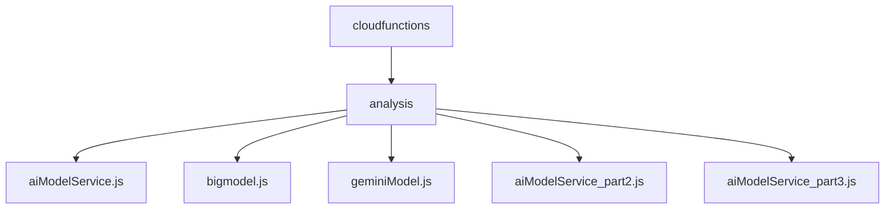
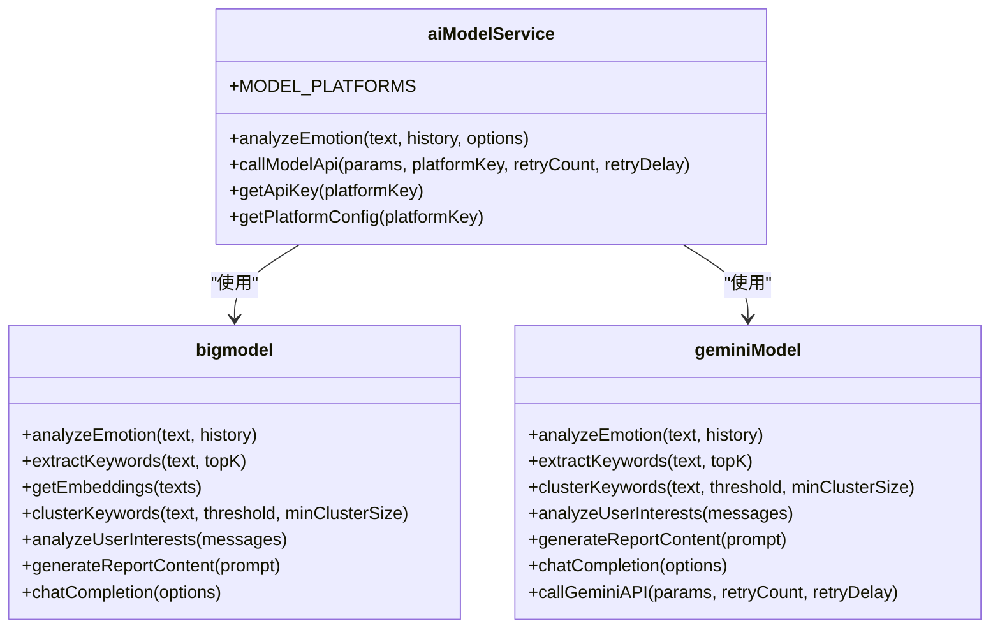
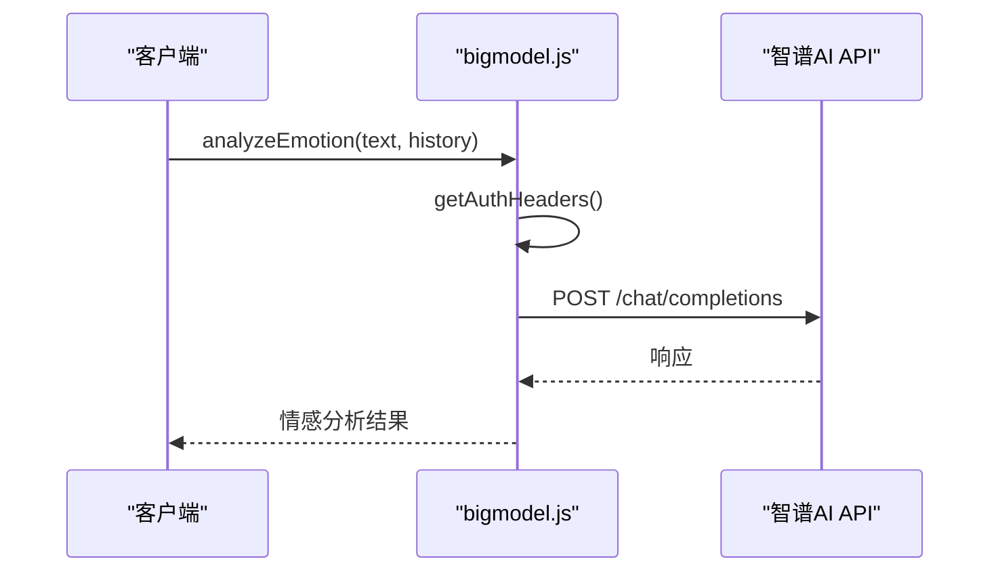
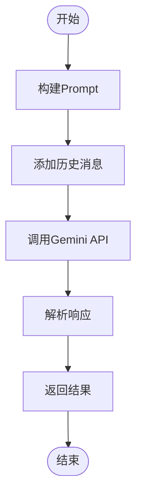
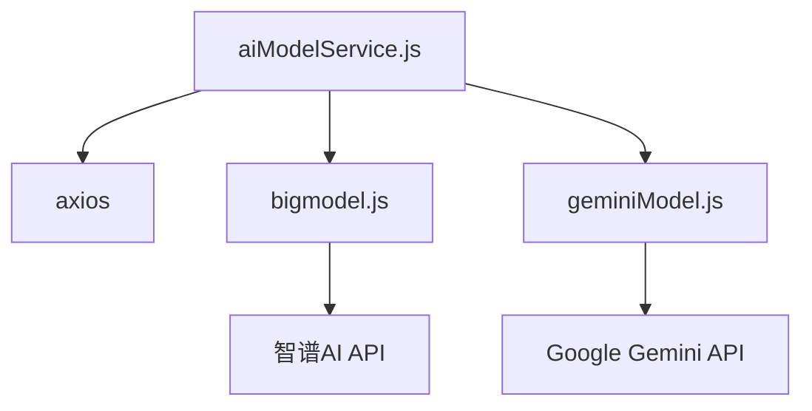

# AI模型集成与响应生成

<cite>
**本文档引用文件**  
- [aiModelService.js](file://cloudfunctions/analysis/aiModelService.js)
- [bigmodel.js](file://cloudfunctions/analysis/bigmodel.js)
- [geminiModel.js](file://cloudfunctions/analysis/geminiModel.js)
</cite>

## 目录
1. [简介](#简介)
2. [项目结构](#项目结构)
3. [核心组件](#核心组件)
4. [架构概述](#架构概述)
5. [详细组件分析](#详细组件分析)
6. [依赖分析](#依赖分析)
7. [性能考虑](#性能考虑)
8. [故障排除指南](#故障排除指南)
9. [结论](#结论)

## 简介
本文档深入分析了`aiModelService.js`作为模型抽象层的设计与实现。说明其如何根据配置动态加载并调用不同AI后端（如bigmodel、geminiModel），实现统一的响应生成接口。分别解析`bigmodel.js`对智谱AI等国产大模型API的集成细节，包括认证头构造、请求体序列化、流式响应处理；以及`geminiModel.js`对Google Gemini API的适配逻辑，涵盖API密钥管理、多轮对话上下文封装、响应解析与错误码映射。讨论模型降级策略与超时重试机制。提供实际请求/响应示例，对比不同模型的输出差异。阐述AI生成内容的后处理流程，如去除敏感信息、格式美化与Markdown支持。

## 项目结构
项目结构中，AI模型服务主要位于`cloudfunctions/analysis`目录下，包含核心服务文件`aiModelService.js`、`bigmodel.js`和`geminiModel.js`。这些文件共同构成了统一的AI模型调用接口，支持多种AI模型平台。

**图源**  
- [aiModelService.js](file://cloudfunctions/analysis/aiModelService.js)
- [bigmodel.js](file://cloudfunctions/analysis/bigmodel.js)
- [geminiModel.js](file://cloudfunctions/analysis/geminiModel.js)

## 核心组件
核心组件包括`aiModelService.js`作为统一的AI模型调用接口，支持智谱AI、Google Gemini等多种模型平台。`bigmodel.js`和`geminiModel.js`分别实现了对智谱AI和Google Gemini API的集成。

**组件源**  
- [aiModelService.js](file://cloudfunctions/analysis/aiModelService.js)
- [bigmodel.js](file://cloudfunctions/analysis/bigmodel.js)
- [geminiModel.js](file://cloudfunctions/analysis/geminiModel.js)

## 架构概述
`aiModelService.js`通过`MODEL_PLATFORMS`配置对象管理不同AI模型平台的参数，包括基础URL、API密钥环境变量名、默认模型、支持的模型列表、认证类型和接口路径。`callModelApi`函数处理请求发送和响应解析，`analyzeEmotion`函数生成情感分析结果。

**图源**  
- [aiModelService.js](file://cloudfunctions/analysis/aiModelService.js)
- [bigmodel.js](file://cloudfunctions/analysis/bigmodel.js)
- [geminiModel.js](file://cloudfunctions/analysis/geminiModel.js)

## 详细组件分析
### bigmodel.js 分析
`bigmodel.js`实现了对智谱AI的集成，包括认证头构造、请求体序列化、流式响应处理。通过`getAuthHeaders`函数生成认证头，`analyzeEmotion`函数构建Prompt并调用API，`extractKeywords`函数提取关键词。

#### 认证头构造

**图源**  
- [bigmodel.js](file://cloudfunctions/analysis/bigmodel.js)

### geminiModel.js 分析
`geminiModel.js`实现了对Google Gemini API的适配，包括API密钥管理、多轮对话上下文封装、响应解析与错误码映射。通过`callGeminiAPI`函数处理请求和重试，`analyzeEmotion`函数构建Prompt并调用API。

#### 多轮对话上下文封装

**图源**  
- [geminiModel.js](file://cloudfunctions/analysis/geminiModel.js)

## 依赖分析
`aiModelService.js`依赖`axios`库进行HTTP请求，`bigmodel.js`和`geminiModel.js`分别依赖智谱AI和Google Gemini API。`aiModelService.js`通过`require`导入`bigmodel.js`和`geminiModel.js`。

**图源**  
- [aiModelService.js](file://cloudfunctions/analysis/aiModelService.js)
- [bigmodel.js](file://cloudfunctions/analysis/bigmodel.js)
- [geminiModel.js](file://cloudfunctions/analysis/geminiModel.js)

## 性能考虑
`aiModelService.js`实现了超时重试机制，当遇到429错误（请求过多）时，等待一段时间后重试，减少重试次数，增加延迟时间。`bigmodel.js`和`geminiModel.js`通过`temperature`参数控制生成内容的创造性。

## 故障排除指南
- **API密钥未配置**：确保环境变量中设置了正确的API密钥。
- **请求过多**：实现超时重试机制，减少重试次数，增加延迟时间。
- **响应格式错误**：检查API返回的响应格式，确保符合预期。

**组件源**  
- [aiModelService.js](file://cloudfunctions/analysis/aiModelService.js)
- [bigmodel.js](file://cloudfunctions/analysis/bigmodel.js)
- [geminiModel.js](file://cloudfunctions/analysis/geminiModel.js)

## 结论
`aiModelService.js`作为模型抽象层，成功实现了对多种AI模型平台的统一调用接口。通过`bigmodel.js`和`geminiModel.js`分别集成智谱AI和Google Gemini API，提供了灵活的AI服务选择。文档详细分析了各组件的设计与实现，为后续开发和维护提供了重要参考。