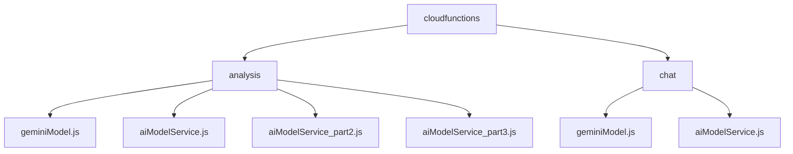
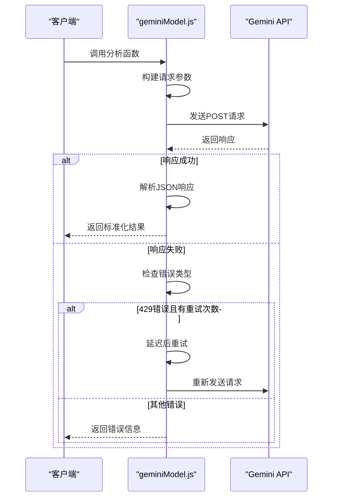
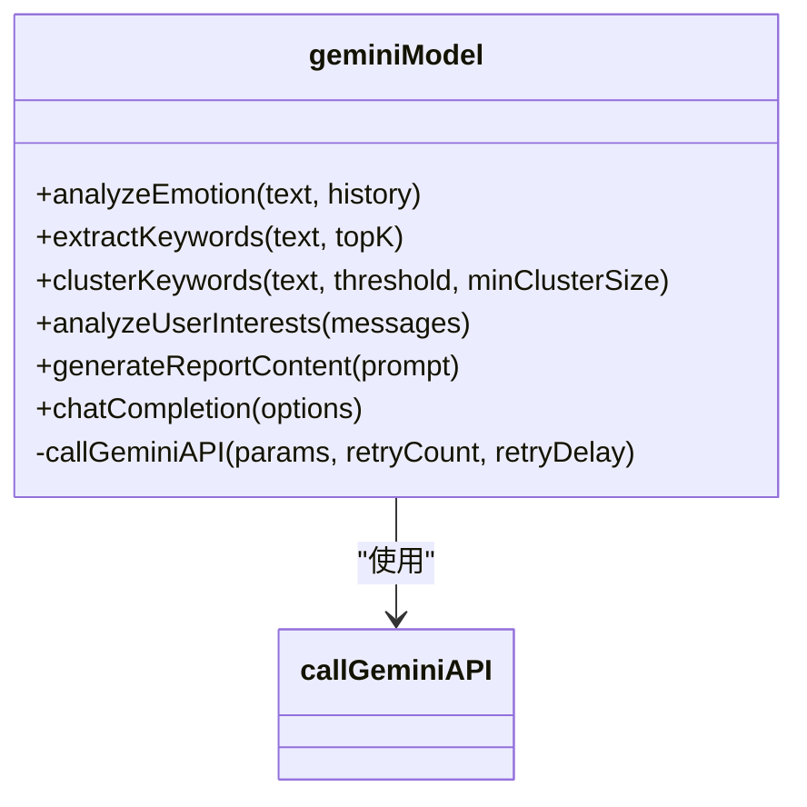
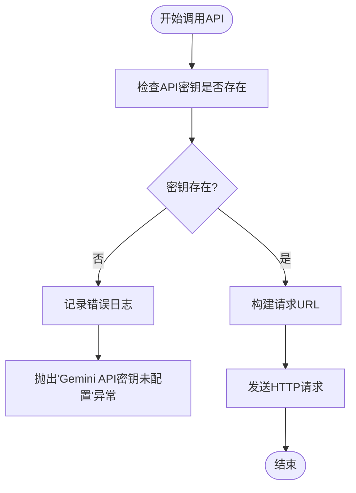
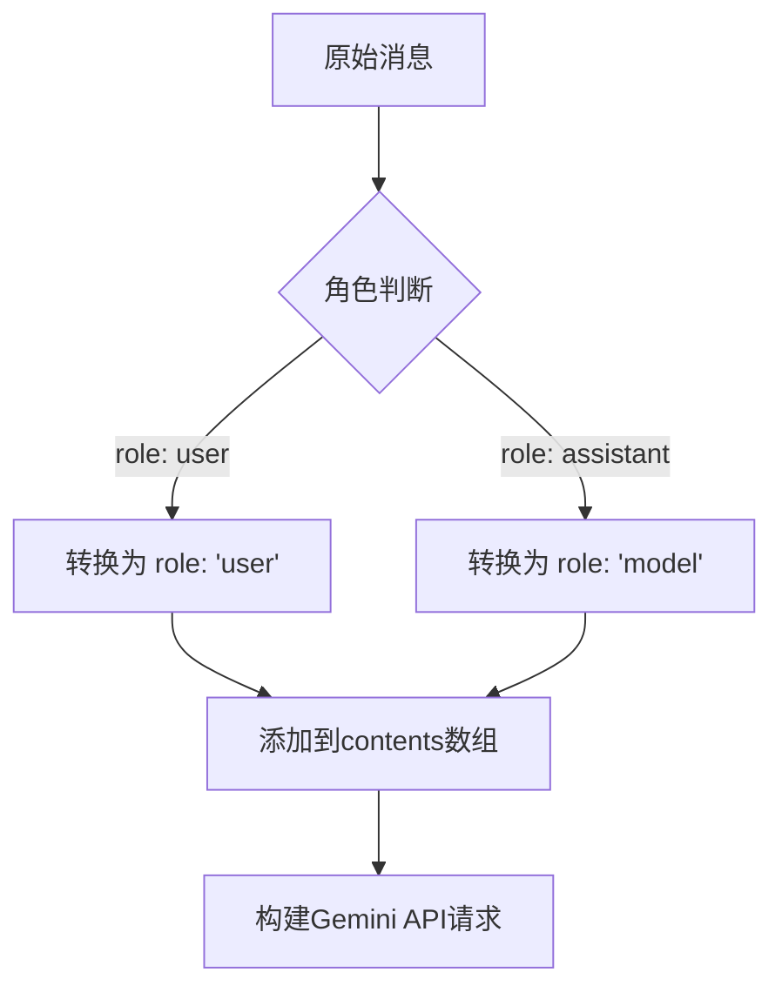
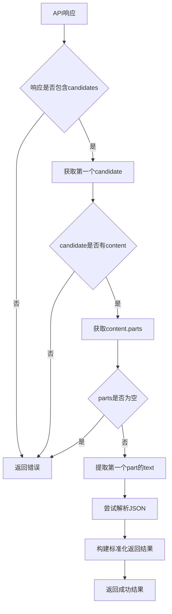
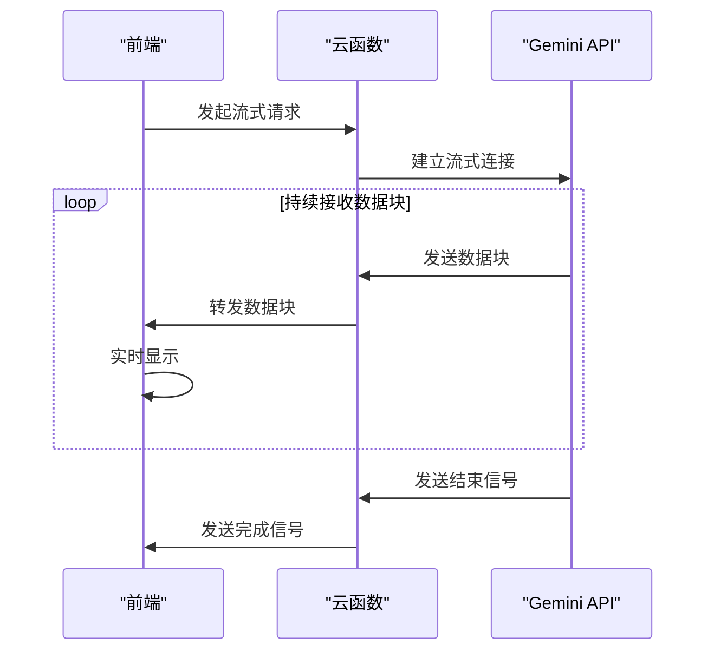
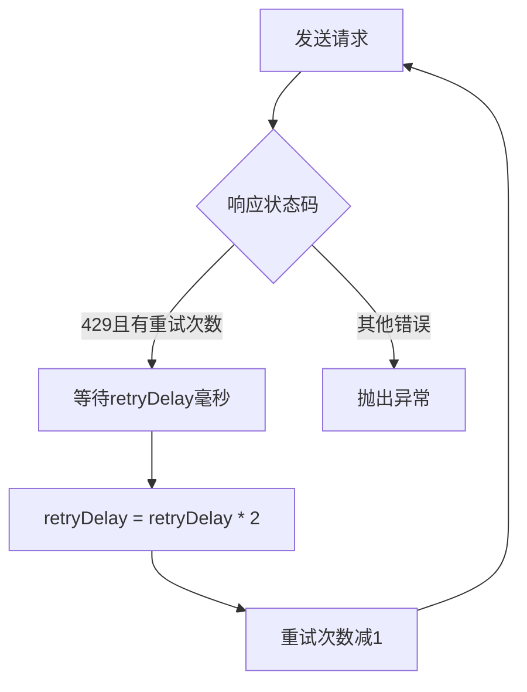
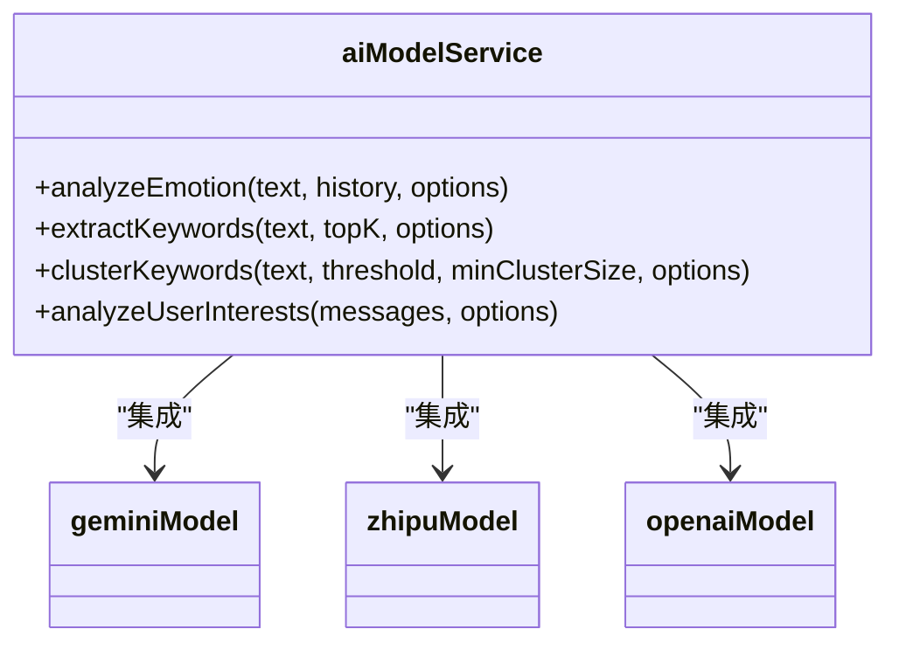
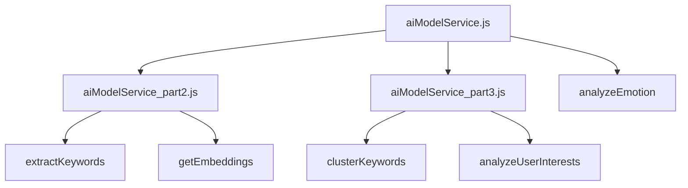

# Gemini模型集成

<cite>
**本文档引用文件**  
- [geminiModel.js](file://cloudfunctions/analysis/geminiModel.js)
- [aiModelService.js](file://cloudfunctions/analysis/aiModelService.js)
- [aiModelService_part2.js](file://cloudfunctions/analysis/aiModelService_part2.js)
- [aiModelService_part3.js](file://cloudfunctions/analysis/aiModelService_part3.js)
</cite>

## 目录
1. [项目结构](#项目结构)
2. [核心组件](#核心组件)
3. [Gemini API适配逻辑](#gemini-api适配逻辑)
4. [身份验证与密钥管理](#身份验证与密钥管理)
5. [多轮对话上下文封装](#多轮对话上下文封装)
6. [响应解析机制](#响应解析机制)
7. [流式响应支持](#流式响应支持)
8. [HTTP请求示例](#http请求示例)
9. [错误码映射策略](#错误码映射策略)
10. [与aiModelService集成](#与aimodelservice集成)
11. [性能瓶颈分析](#性能瓶颈分析)

## 项目结构



**图示来源**  
- [geminiModel.js](file://cloudfunctions/analysis/geminiModel.js)
- [aiModelService.js](file://cloudfunctions/analysis/aiModelService.js)

**本节来源**  
- [geminiModel.js](file://cloudfunctions/analysis/geminiModel.js)
- [aiModelService.js](file://cloudfunctions/analysis/aiModelService.js)

## 核心组件

该系统的核心组件包括geminiModel.js、aiModelService.js及其分片模块aiModelService_part2.js和aiModelService_part3.js。这些文件共同实现了对Google Gemini API的完整适配，提供了情感分析、关键词提取、聚类分析和用户兴趣分析等高级功能。

**本节来源**  
- [geminiModel.js](file://cloudfunctions/analysis/geminiModel.js)
- [aiModelService.js](file://cloudfunctions/analysis/aiModelService.js)
- [aiModelService_part2.js](file://cloudfunctions/analysis/aiModelService_part2.js)
- [aiModelService_part3.js](file://cloudfunctions/analysis/aiModelService_part3.js)

## Gemini API适配逻辑

### API调用封装

geminiModel.js模块通过`callGeminiAPI`函数封装了对Google Gemini API的调用。该函数接受参数对象、重试次数和重试延迟作为参数，实现了完整的API调用流程。



**图示来源**  
- [geminiModel.js](file://cloudfunctions/analysis/geminiModel.js#L36-L80)

**本节来源**  
- [geminiModel.js](file://cloudfunctions/analysis/geminiModel.js#L36-L80)

### 功能函数实现

geminiModel.js导出了多个功能函数，包括`analyzeEmotion`、`extractKeywords`、`clusterKeywords`、`analyzeUserInterests`和`chatCompletion`。这些函数都基于`callGeminiAPI`实现，为上层应用提供了统一的接口。



**图示来源**  
- [geminiModel.js](file://cloudfunctions/analysis/geminiModel.js#L100-L655)

**本节来源**  
- [geminiModel.js](file://cloudfunctions/analysis/geminiModel.js#L100-L655)

## 身份验证与密钥管理

### API密钥配置

系统通过环境变量安全地管理Gemini API密钥。在geminiModel.js中，API密钥通过`process.env.GEMINI_API_KEY`获取，如果未设置则使用空字符串作为默认值。

```javascript
const API_KEY = process.env.GEMINI_API_KEY || ''; // 从环境变量获取API密钥
```

**本节来源**  
- [geminiModel.js](file://cloudfunctions/analysis/geminiModel.js#L15-L16)

### 密钥验证机制

在调用API之前，系统会验证API密钥是否存在。如果密钥未配置，函数会记录错误日志并抛出异常。



**图示来源**  
- [geminiModel.js](file://cloudfunctions/analysis/geminiModel.js#L40-L44)

**本节来源**  
- [geminiModel.js](file://cloudfunctions/analysis/geminiModel.js#L40-L44)

### 统一的密钥管理

aiModelService.js实现了统一的密钥管理机制，通过`getApiKey`函数从环境变量中获取指定平台的API密钥。

```javascript
function getApiKey(platformKey) {
  const platform = MODEL_PLATFORMS[platformKey];
  if (!platform) {
    throw new Error(`未知的平台: ${platformKey}`);
  }

  const apiKey = process.env[platform.apiKeyEnv];
  if (!apiKey) {
    throw new Error(`未设置${platform.apiKeyEnv}环境变量`);
  }

  return apiKey;
}
```

**本节来源**  
- [aiModelService.js](file://cloudfunctions/analysis/aiModelService.js#L145-L157)

## 多轮对话上下文封装

### 消息格式转换

Gemini API要求消息格式为`{role: 'user'|'model', parts: [{text: '...'}]}`。系统在调用API前会将标准的消息格式转换为Gemini所需的格式。



**本节来源**  
- [geminiModel.js](file://cloudfunctions/analysis/geminiModel.js#L300-L303)

### 历史消息处理

系统支持多轮对话，通过`history`参数传递历史消息。在生成提示词时，会将最多5条最近的历史消息作为上下文添加到提示词中。

```javascript
// 如果有历史消息，添加到prompt中
if (Array.isArray(history) && history.length > 0) {
  // 最多添加5条历史消息作为上下文
  const contextMessages = history.slice(-5);
  let contextText = "\n\n对话历史上下文:\n";

  contextMessages.forEach(msg => {
    if (msg.role && msg.content) {
      contextText += `${msg.role === 'user' ? '用户' : 'AI'}: ${msg.content}\n`;
    }
  });

  prompt += contextText;
}
```

**本节来源**  
- [geminiModel.js](file://cloudfunctions/analysis/geminiModel.js#L170-L182)

### 内容数组构建

Gemini API的请求体需要包含`contents`数组，每个元素代表一次对话交互。系统会将系统提示词、历史消息和当前用户消息按顺序构建到`contents`数组中。

```javascript
const contents = [
  {
    role: 'user',
    parts: [{ text: prompt }]
  }
];
```

**本节来源**  
- [geminiModel.js](file://cloudfunctions/analysis/geminiModel.js#L200-L205)

## 响应解析机制

### 多部分内容处理

Gemini API的响应可能包含多个部分（parts），系统会遍历所有部分并提取文本内容。



**图示来源**  
- [geminiModel.js](file://cloudfunctions/analysis/geminiModel.js#L220-L275)

**本节来源**  
- [geminiModel.js](file://cloudfunctions/analysis/geminiModel.js#L220-L275)

### JSON响应解析

系统会尝试从API响应中提取JSON格式的结果。由于Gemini可能在响应中包含额外的文本，系统使用正则表达式提取第一个完整的JSON对象。

```javascript
// 提取JSON部分
const jsonMatch = content.match(/\{[\s\S]*\}/);
const jsonStr = jsonMatch ? jsonMatch[0] : content;
const result = JSON.parse(jsonStr);
```

**本节来源**  
- [geminiModel.js](file://cloudfunctions/analysis/geminiModel.js#L238-L240)

### 纯文本提取

对于不需要JSON解析的场景，系统直接从响应中提取纯文本内容。

```javascript
const content = candidate.content.parts[0].text;
```

**本节来源**  
- [geminiModel.js](file://cloudfunctions/analysis/geminiModel.js#L237)

## 流式响应支持

### 流式功能现状

目前系统尚未完全实现Gemini流式响应的支持。在httpRequest云函数中，当请求包含`stream: true`时，系统会记录警告并暂时按非流式处理。

```javascript
if (geminiPayload.stream && (action === 'chat' || action === 'generateContent')) {
  console.warn('Gemini streaming is requested but not yet fully implemented in httpRequest for direct cloud function response.');
  // 暂时按非流式处理
}
```

**本节来源**  
- [gemini_api_integration.md](file://doc/开发文档/gemini_api_integration.md#L132-L270)

### 流式响应挑战

实现流式响应面临的主要挑战包括：
1. 云函数的响应机制限制
2. 前端实时显示的复杂性
3. 错误处理和连接中断的恢复

### 流式响应实现方案

虽然当前未完全实现，但文档中提供了流式响应的实现思路：



**本节来源**  
- [gemini_api_integration.md](file://doc/开发文档/gemini_api_integration.md#L132-L270)

## HTTP请求示例

### 完整请求结构

以下是调用Gemini API的完整HTTP请求示例：

```json
{
  "method": "POST",
  "url": "https://apiv2.aliyahzombie.top/v1beta/models/gemini-2.5-flash-preview-04-17:generateContent?key=YOUR_API_KEY",
  "headers": {
    "Content-Type": "application/json"
  },
  "data": {
    "contents": [
      {
        "role": "user",
        "parts": [
          {
            "text": "你是一个专业且富有同理心的情感分析助手..."
          }
        ]
      }
    ],
    "generationConfig": {
      "temperature": 0.3,
      "topP": 0.8,
      "topK": 40,
      "maxOutputTokens": 2048
    }
  }
}
```

**本节来源**  
- [geminiModel.js](file://cloudfunctions/analysis/geminiModel.js#L60-L75)

### 请求URL构建

系统通过以下方式构建请求URL：

```javascript
const url = `${API_BASE_URL}/v1beta/models/${params.model || GEMINI_PRO}:generateContent?key=${API_KEY}`;
```

**本节来源**  
- [geminiModel.js](file://cloudfunctions/analysis/geminiModel.js#L55-L57)

### 请求头设置

请求头中设置了必要的Content-Type：

```javascript
headers: {
  'Content-Type': 'application/json'
}
```

**本节来源**  
- [geminiModel.js](file://cloudfunctions/analysis/geminiModel.js#L70-L72)

### 请求体构建

请求体包含了对话内容和生成配置：

```javascript
const body = JSON.stringify({
  contents: params.contents,
  generationConfig: {
    temperature: params.temperature || 0.3,
    topP: params.topP || 0.8,
    topK: params.topK || 40,
    maxOutputTokens: params.maxOutputTokens || 2048
  }
});
```

**本节来源**  
- [geminiModel.js](file://cloudfunctions/analysis/geminiModel.js#L62-L75)

## 错误码映射策略

### 429错误处理

系统对429错误（请求过多）实现了自动重试机制。当遇到429错误时，系统会等待指定时间后重试，且每次重试的延迟时间会加倍。



**本节来源**  
- [geminiModel.js](file://cloudfunctions/analysis/geminiModel.js#L88-L98)

### 客户端错误映射

系统将Gemini API的各种错误映射为更易理解的客户端错误信息：

```javascript
// 400错误处理
if (error.response && error.response.status === 400) {
  return { success: false, error: '请求参数无效，请检查输入内容' };
}

// 429错误处理
if (error.response && error.response.status === 429) {
  return { success: false, error: '请求过于频繁，请稍后重试' };
}

// 500错误处理
if (error.response && error.response.status >= 500) {
  return { success: false, error: 'AI服务暂时不可用，请稍后重试' };
}
```

**本节来源**  
- [geminiModel.js](file://cloudfunctions/analysis/geminiModel.js#L88-L98)

### 错误日志记录

系统详细记录各种错误信息，便于问题诊断：

```javascript
console.error('调用Gemini API失败:', error);
```

**本节来源**  
- [geminiModel.js](file://cloudfunctions/analysis/geminiModel.js#L102-L104)

## 与aiModelService集成

### 统一接口设计

aiModelService.js作为统一的AI模型服务层，为geminiModel.js提供了标准化的调用接口。



**本节来源**  
- [aiModelService.js](file://cloudfunctions/analysis/aiModelService.js)

### 平台配置管理

系统通过MODEL_PLATFORMS常量管理所有支持的AI平台配置：

```javascript
const MODEL_PLATFORMS = {
  GEMINI: {
    name: 'Gemini',
    baseUrl: 'https://apiv2.aliyahzombie.top',
    apiKeyEnv: 'GEMINI_API_KEY',
    defaultModel: 'gemini-2.5-flash-preview-04-17',
    models: ['gemini-2.5-flash-preview-04-17'],
    authType: 'Bearer',
    endpoints: {
      chat: '/v1beta/models/gemini-2.5-flash-preview-04-17:generateContent'
    }
  }
};
```

**本节来源**  
- [aiModelService.js](file://cloudfunctions/analysis/aiModelService.js#L48-L60)

### 统一API调用

aiModelService.js通过`callModelApi`函数实现了统一的API调用逻辑，支持多种平台：

```javascript
async function callModelApi(params, platformKey, retryCount = 3, retryDelay = 1000) {
  // 获取平台配置和API密钥
  const platform = getPlatformConfig(platformKey);
  const apiKey = getApiKey(platformKey);
  
  // 根据平台类型构建不同的请求
  if (platformKey === 'GEMINI') {
    // Gemini特殊处理
  } else if (platformKey === 'OPENAI' || platformKey === 'CROND' || platformKey === 'CLOSEAI') {
    // OpenAI等标准处理
  } else {
    // 智谱AI等其他处理
  }
}
```

**本节来源**  
- [aiModelService.js](file://cloudfunctions/analysis/aiModelService.js#L165-L220)

### 模块化架构

系统采用模块化设计，将不同功能分散到多个文件中：



**图示来源**  
- [aiModelService.js](file://cloudfunctions/analysis/aiModelService.js#L646-L661)

**本节来源**  
- [aiModelService.js](file://cloudfunctions/analysis/aiModelService.js#L646-L661)

## 性能瓶颈分析

### 高延迟场景

在高延迟场景下，系统可能面临超时问题。目前系统设置了20秒的默认超时时间，对于Claude模型则设置为30秒。

```javascript
let timeoutMs = 20000; // 默认20秒超时
if (platformKey === 'CLAUDE') {
  timeoutMs = 30000; // Claude模型设置30秒超时
}
```

**本节来源**  
- [cloudfunctions/chat/index.js](file://cloudfunctions/chat/index.js#L1227-L1230)

### 重试机制优化

系统实现了智能重试机制，重试延迟时间会逐次加倍，避免对API服务器造成过大压力。

```javascript
// 递归调用自身，减少重试次数，增加延迟时间
return callGeminiAPI(params, retryCount - 1, retryDelay * 2);
```

**本节来源**  
- [geminiModel.js](file://cloudfunctions/analysis/geminiModel.js#L96-L97)

### 并发请求限制

由于Gemini API有请求频率限制，系统需要控制并发请求数量，避免触发429错误。

### 响应时间监控

建议添加响应时间监控，统计接口响应时间，优化性能瓶颈。

```javascript
const startTime = Date.now();
// ... API调用 ...
const responseTime = Date.now() - startTime;
console.log(`API响应时间: ${responseTime}ms`);
```

**本节来源**  
- [deployment/model-config-deployment.md](file://doc/开发文档/deployment/model-config-deployment.md#L224-L246)